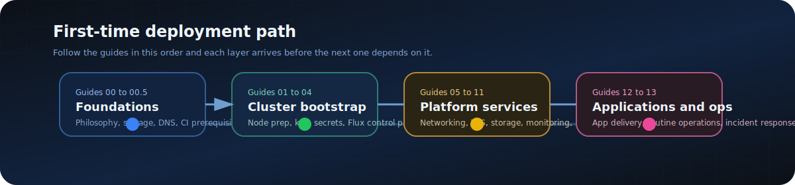

<div align="center">


# kagiso.me &nbsp;·&nbsp; homelab-infrastructure

_Infrastructure-as-code for a fully self-hosted homelab — GitOps-reconciled by FluxCD, secrets encrypted with SOPS + age, and observable end-to-end._

</div>

---

<div align="center">

<!-- Stack badges -->
[](https://k3s.io)&nbsp;
[](https://fluxcd.io)&nbsp;
[](docs/guides/03-Secrets-Management.md)&nbsp;
[](truenas/README.md)&nbsp;
[](docs/guides/09-Monitoring-Observability.md)

</div>

<div align="center">

[](https://github.com/Kagiso-me/homelab-infrastructure/actions/workflows/validate.yml)

</div>

<div align="center">

[](#infrastructure)&nbsp;
[](#kubernetes-platform)&nbsp;
[](#backup-strategy)&nbsp;
[](docs/guides/09-Monitoring-Observability.md)

</div>

---

<div align="center">


</div>

---

## Why Self-Host?

Because the cloud is great — until it isn't.

- **Full control** over data, routing, and uptime
- **No surprise billing** — fixed hardware cost, zero per-GB egress
- **Treat home like a mini-enterprise** — proper GitOps, monitoring, alerting, DR procedures
- **Sharpen real skills** — Kubernetes, Ansible, observability, secrets management, ZFS
- **Everything in Git** — every service, every config, every secret (encrypted), fully reproducible

---

## Infrastructure

```
                            Internet
                                │
                         kagiso.me (DNS)
                                │
                        ┌───────▼──────────┐
                        │  Home Network     │
                        │  10.0.10.0/24     │
                        └────────┬──────────┘
                                 │
              ┌──────────────────┼──────────────────┐
              │                  │                  │
   ┌──────────▼──────┐  ┌────────▼────────┐  ┌─────▼───────────┐
   │  k3s Prod        │  │  Docker (bare)  │  │  TrueNAS        │
   │  3 nodes         │  │  Intel NUC      │  │  HP MicroServer │
   │  10.0.10.11–13   │  │  10.0.10.20     │  │  10.0.10.80     │
   └──────────────────┘  └─────────────────┘  └─────────────────┘
              â–²
              │ kubectl / flux / ansible
   ┌──────────┴──────┐
   │   varys NUC     │
   │  Control hub    │
   │  10.0.10.10     │
   └─────────────────┘
              â–²
              │ SSH
         Your Laptop
```

| Component | Host | IP | Description |
|-----------|------|----|-------------|
| **k3s API VIP** | kube-vip | `10.0.10.100` | Stable Kubernetes API endpoint for kubeconfig, Flux, and automation |
| **k3s server** | tywin | `10.0.10.11` | Control-plane + workload node; embedded etcd member |
| **k3s server** | tyrion | `10.0.10.12` | Control-plane + workload node; embedded etcd member |
| **k3s server** | jaime | `10.0.10.13` | Control-plane + workload node; embedded etcd member |
| **Docker host** | docked | `10.0.10.20` | Intel NUC i3-7100U — bare metal Docker, media stack |
| **Control hub** | varys | `10.0.10.10` | Intel NUC i3-5010U — kubectl, flux, ansible, GitHub runner, Pi-hole, Grafana, Alertmanager |
| **Secondary node** | bran | `n/a` | RPi 3B+ — secondary Pi-hole, Tailscale exit node, WOL proxy (legacy / non-primary) |
| **TrueNAS** | truenas | `10.0.10.80` | HP MicroServer Gen8 — NFS, MinIO S3, Backblaze B2 sync |

---

## Kubernetes Platform

All cluster state is declared as YAML and continuously reconciled by FluxCD v2. A merged PR is the only way anything changes.

```
git push branch → open PR → CI validates + cluster diff → merge → Flux reconciles → health check
```

| Layer | Technology | Detail |
|-------|-----------|--------|
| Orchestration | k3s | Lightweight Kubernetes, embedded etcd |
| GitOps | FluxCD v2 | Kustomization + HelmRelease controllers |
| Ingress | Traefik v3 | HTTP/HTTPS routing — `10.0.10.110` |
| Load Balancer | MetalLB | Bare-metal ARP mode — pool `10.0.10.110–10.0.10.115` |
| TLS | cert-manager + Let's Encrypt | Wildcard `*.kagiso.me` via DNS-01 Cloudflare |
| Identity | Authentik | SSO for all cluster applications |
| Security | CrowdSec | Community threat intelligence + Traefik bouncer |
| Metrics | kube-prometheus-stack | Prometheus (in-cluster) + Grafana + Alertmanager (on varys) |
| Logs | Loki + Promtail | Log aggregation + alerting on log patterns |
| Backups | Velero + MinIO | PVC snapshot and restore via S3 API |
| Secrets | SOPS + age | Encrypted secrets committed to Git |
| Storage | NFS subdir provisioner | Dynamic PV provisioning via TrueNAS NFS |
| Databases | PostgreSQL + Redis | Shared central instances, currently single-instance on local-path storage |
| Upgrades | system-upgrade-controller | Automated k3s node upgrades via Plans |

---

## Getting Started

The homelab has four independent components. Build them in this order — each layer depends on the one before it.

### 1. TrueNAS — Storage foundation

TrueNAS provides NFS shares and the MinIO S3 endpoint that all other components depend on.

> Full guide: [truenas/README.md](truenas/README.md)

| Step | Guide |
|------|-------|
| Dataset layout and ZFS pool setup | [Dataset Layout](truenas/docs/dataset-layout.md) |
| NFS share configuration | [NFS Configuration](truenas/docs/nfs-configuration.md) |
| MinIO S3 API (Velero backend) | [MinIO Configuration](truenas/docs/minio-configuration.md) |
| Backblaze B2 offsite sync | [Backblaze Sync](truenas/docs/backblaze-sync.md) |

---

### 2. varys — Control hub

`varys` is the single machine from which cluster management, secret handling, and automation runs. Set this up before touching k3s.

> Full guide: [Guide 01](docs/guides/01-Node-Preparation-Hardening.md)

```bash
# From your laptop or existing admin workstation
# prepare varys as the automation host first
ansible-playbook -i ansible/inventory/homelab.yml \
  ansible/playbooks/security/ssh-hardening.yml --limit varys
```

---

### 3. k3s Cluster — Kubernetes

Install k3s across all three nodes with a single Ansible playbook, then bootstrap FluxCD to hand control to Git.

> Full guides: [Guide 01](docs/guides/01-Node-Preparation-Hardening.md) → [Guide 02](docs/guides/02-Kubernetes-Installation.md) → [Guide 04](docs/guides/04-Flux-GitOps.md)

```bash
# From varys

# 1. Prepare all nodes (SSH hardening, firewall, swap)
ansible-playbook -i ansible/inventory/homelab.yml \
  ansible/playbooks/security/ssh-hardening.yml \
  ansible/playbooks/security/firewall.yml \
  ansible/playbooks/security/disable-swap.yml

# 2. Install k3s
ansible-playbook -i ansible/inventory/homelab.yml \
  ansible/playbooks/lifecycle/install-cluster.yml

# 3. Bootstrap Flux — watches main branch directly
flux bootstrap github \
  --owner=Kagiso-me \
  --repository=homelab-infrastructure \
  --branch=main \
  --path=clusters/prod \
  --personal
```

---

### 4. Docker Media Server — Self-hosted streaming

The Docker host runs the full media acquisition and streaming stack on bare metal.

> Full guide: [docker/README.md](docker/README.md)

```bash
# SSH to the Docker host
ssh kagiso@10.0.10.20

# Deploy stacks in order
cd /srv/docker
docker compose -f compose/media-stack.yml up -d
docker compose -f compose/monitoring-stack.yml up -d
docker compose -f compose/proxy-stack.yml up -d
```

---

## Backup Strategy

Four independent backup layers ensure no single failure causes data loss.

```
Layer 1 — Git          Kubernetes manifests + configs    Always current (every commit)
Layer 2 — etcd         k3s snapshots → MinIO             Every 6 hours (7 retained)
Layer 3 — Velero       PVC data via MinIO S3             Daily 03:00 → TrueNAS (7d)
Layer 4 — Offsite      TrueNAS → Backblaze B2            Nightly cloud sync (30d)
```

Control-hub key material (age key, SSH keys, kubeconfig) is separately backed up encrypted to TrueNAS with GPG AES-256.

> Full strategy: [Guide 10 — Backups & Disaster Recovery](docs/guides/10-Backups-Disaster-Recovery.md)

---

## Projects

Custom applications, operational tooling, and platform initiatives built on top of this infrastructure.

→ **[View project board](projects/README.md)**

| Project | Type | Description |
|---------|------|-------------|
| [Beesly](projects/DEV-beesly/) | `DEV` | Personal AI assistant — voice, alerts, calendar, reminders |
| [Pulse](projects/DEV-pulse/) | `DEV` | Self-hosted uptime & incident monitoring platform |
| [kagiso.me](projects/OPS-kagiso-me.github.io/) | `OPS` | Personal website and portfolio |

---

## Deployment Guides

A 13-guide series that walks through building and operating the full platform from bare metal. Guides follow the exact Flux deployment order — what gets deployed first is documented first.



| Phase | Guide | Topic |
|-------|-------|-------|
| **Foundations** | [00 — Platform Philosophy](docs/guides/00-Platform-Philosophy.md) | Design principles and architectural decisions |
| | [00.5 — Infrastructure Prerequisites](docs/guides/00.5-Infrastructure-Prerequisites.md) | TrueNAS datasets, NFS exports, MinIO, Cloudflare API token |
| **Cluster Build** | [01 — Node Preparation & Hardening](docs/guides/01-Node-Preparation-Hardening.md) | OS prep, SSH hardening, firewall, nfs-common |
| | [02 — Kubernetes Installation](docs/guides/02-Kubernetes-Installation.md) | k3s install via Ansible across 3 nodes |
| **GitOps Bootstrap** | [03 — Secrets Management](docs/guides/03-Secrets-Management.md) | SOPS + age — encrypt secrets for Git |
| | [04 — Flux GitOps Bootstrap](docs/guides/04-Flux-GitOps.md) | FluxCD v2, PR validation pipeline, self-hosted runner |
| **Platform Services** | [05 — Networking: MetalLB & Traefik](docs/guides/05-Networking-MetalLB-Traefik.md) | Layer-2 load balancing and ingress routing |
| | [06 — Security: cert-manager & TLS](docs/guides/06-Security-CertManager-TLS.md) | Automated wildcard certificates via Let's Encrypt |
| | [07 — Namespaces & Cluster Identity](docs/guides/07-Namespaces-Cluster-Identity.md) | Namespace layout, node labels, scheduling rules |
| | [08 — Storage Architecture](docs/guides/08-Storage-Architecture.md) | NFS provisioner, PVC lifecycle, TrueNAS datasets |
| | [09 — Monitoring & Observability](docs/guides/09-Monitoring-Observability.md) | Prometheus + Grafana + Loki + external targets |
| | [10 — Backups & Disaster Recovery](docs/guides/10-Backups-Disaster-Recovery.md) | etcd snapshots + Velero + MinIO |
| | [11 — Platform Upgrade Controller](docs/guides/11-Platform-Upgrade-Controller.md) | Automated k3s upgrades via system-upgrade-controller |
| **Applications & Ops** | [12 — Applications via GitOps](docs/guides/12-Applications-GitOps.md) | Deploying apps with Flux HelmReleases |
| | [13 — Platform Operations & Lifecycle](docs/guides/13-Platform-Operations-Lifecycle.md) | Node maintenance, incident response, disaster recovery |

---

## Repository Structure

```
homelab-infrastructure/
│
├── clusters/
│   └── prod/            # Flux entry points — watches main branch
├── platform/            # Cluster-wide platform components (HelmReleases)
│   ├── networking/      # MetalLB, Traefik
│   ├── security/        # cert-manager, Authentik, CrowdSec, ClusterIssuers
│   ├── observability/   # kube-prometheus-stack, Loki, Alertmanager, daily-digest
│   ├── storage/         # NFS provisioner, StorageClasses
│   ├── backup/          # Velero + MinIO credentials
│   ├── databases/       # PostgreSQL + Redis (shared, control-plane pinned)
│   ├── upgrade/         # system-upgrade-controller + Plans
│   └── namespaces/      # Namespace declarations
├── apps/                # Application workloads
│   ├── base/            # Per-app manifests (HelmRelease, IngressRoute, Secret)
│   └── prod/            # Production kustomization — lists active apps
├── ansible/             # Ansible — node provisioning and maintenance
│   ├── inventory/       # homelab.yml — all nodes
│   ├── playbooks/
│   │   ├── lifecycle/   # install-cluster.yml, install-platform.yml, purge-k3s.yml
│   │   ├── security/    # ssh-hardening, firewall, fail2ban, time-sync
│   │   └── maintenance/ # upgrade-nodes.yml, reboot-nodes.yml
│   └── roles/k3s_install/
│
├── raspberry-pi/        # Raspberry Pi secondary-node docs and services
├── docker/              # Docker media server (10.0.10.20)
├── truenas/             # TrueNAS HP MicroServer Gen8 (10.0.10.80)
│
└── docs/                # Cross-cutting documentation
    ├── guides/          # 13-guide deployment series (00–13)
    ├── adr/             # Architecture Decision Records
    ├── architecture/    # Platform overview diagrams
    ├── compliance/      # Backup policy, DR plan, security policy
    └── operations/
        └── runbooks/    # Cluster rebuild, node replacement, alert responses
```

---

## CI/CD

| Workflow | Trigger | Purpose |
|---------|---------|---------|
| [validate.yml](.github/workflows/validate.yml) | PR (infra paths) | kubeconform + kustomize build + pluto validation |
| [validate.yml](.github/workflows/validate.yml) | PR (infra paths) | `flux diff` posted as collapsible PR comment (self-hosted runner) |
| [validate.yml](.github/workflows/validate.yml) | Push to `main` | Flux reconcile + kustomization health + Traefik smoke test |

All cluster-touching jobs run on a **self-hosted runner on `varys` (10.0.10.10)**, giving the pipeline direct LAN access to the prod cluster. See [ADR-007](docs/adr/ADR-007-self-hosted-runners.md).

---

## Architecture Documentation

| Document | Description |
|----------|-------------|
| [Platform Overview](docs/architecture/platform-overview.md) | Component map and interaction model |
| [Cluster Architecture](docs/architecture/cluster-architecture.md) | Node layout, networking, storage |
| [Networking](docs/architecture/networking.md) | MetalLB, Traefik, DNS, TLS |
| [Monitoring](docs/architecture/monitoring.md) | Observability stack design |
| [ADR Index](docs/adr/) | Architecture Decision Records |

---

## Operations

| Document | Description |
|----------|-------------|
| [Cluster Rebuild](docs/operations/runbooks/cluster-rebuild.md) | Full recovery procedure — RTO 90–120 min |
| [Node Replacement](docs/operations/runbooks/node-replacement.md) | Replace a failed cluster node |
| [Backup Restoration](docs/operations/runbooks/backup-restoration.md) | Velero restore procedures |
| [Certificate Failure](docs/operations/runbooks/certificate-failure.md) | TLS cert troubleshooting |
| [Alert Runbooks](docs/operations/runbooks/alerts/) | Per-alert response procedures |

---

## License

MIT

