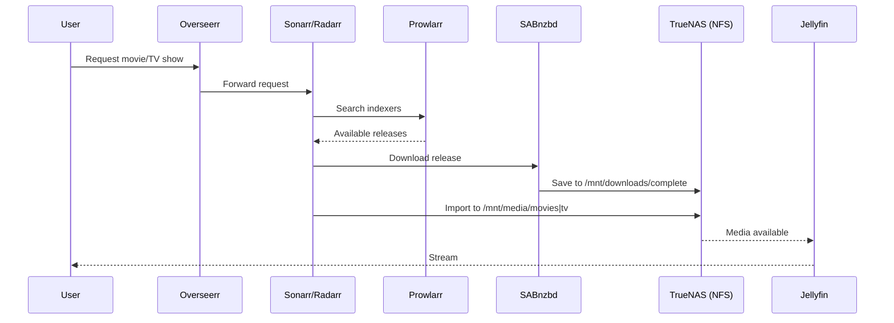

# Docker Media Server — Homelab Handbook

**Author:** Kagiso Tjeane
**Version:** 2.0
**Last updated:** 2026-03-14

> Infrastructure that cannot be rebuilt easily is broken infrastructure.
>
> This handbook documents every decision, every component, and every recovery procedure for the Docker-based media server. A fresh host can be fully restored using only this repository and access to TrueNAS.

---

## Core Philosophy

The homelab media server is built on five non-negotiable principles:

| Principle | Implementation |
|-----------|---------------|
| **1 — The host is disposable** | No application state lives on the Docker host disk. All persistent data lives on TrueNAS. |
| **2 — Storage outlives compute** | Media library and downloads live on TrueNAS NFS mounts. The host can be wiped and rebuilt without data loss. |
| **3 — Configuration lives in Git** | Every compose file, every config template, every script lives in this repository. |
| **4 — Observability is not optional** | Prometheus + Grafana + Loki + Node Exporter run from day one. You cannot manage what you cannot observe. |
| **5 — Recovery must be predictable** | The rebuild procedure is documented, tested, and achieves a running stack in under 90 minutes. |

These principles exist because homelab systems tend to accumulate undocumented complexity. A past incident — an `rm -rf` accident that corrupted the running system — exposed what happens when infrastructure is organic rather than designed. This system was rebuilt from scratch with reproducibility as the primary goal.

---

## System Architecture

```mermaid
graph TD
    Internet["Internet"] --> Router["Home Router\n10.0.0.1"]
    Router --> NPM["Nginx Proxy Manager\n10.0.10.20:80/443\nReverse proxy + TLS"]
    NPM --> Jellyfin["Jellyfin\n:8096\nMedia streaming"]
    NPM --> Overseerr["Overseerr\n:5055\nMedia requests"]
    NPM --> Grafana["Grafana\n:3000\nMonitoring"]
    NPM --> Other["Other services\nSonarr, Radarr,\nNavidrome..."]

    subgraph DockerHost["Docker Host — 10.0.10.20"]
        NPM
        Jellyfin
        Overseerr
        Grafana
        Other
        subgraph MediaPipeline["Media Automation"]
            Sonarr["Sonarr (TV)"]
            Radarr["Radarr (Movies)"]
            Prowlarr["Prowlarr (Indexers)"]
            SABnzbd["SABnzbd (Downloads)"]
        end
        subgraph Observability["Observability"]
            Prometheus["Prometheus"]
            Loki["Loki"]
            Promtail["Promtail"]
        end
    end

    DockerHost --> TrueNAS["TrueNAS — 10.0.10.80\nNFS: /mnt/media\nNFS: /mnt/downloads\nBackup target"]
```



---

## Media Pipeline



---

## Node Map

```
Your Laptop
    │
    â–¼ SSH
bran — 10.0.10.10 (control hub)
    │
    â–¼ SSH
Docker Host — 10.0.10.20
    │
    ├── /mnt/media         ← NFS from TrueNAS /mnt/tera
    ├── /mnt/downloads     ← NFS from TrueNAS /mnt/tera
    └── /mnt/archive          ← NFS from TrueNAS (backup destination)

TrueNAS — 10.0.10.80
    └── ZFS pools: core, archive, tera
        ├── media/
        ├── downloads/
        └── backups/docker/     ← Docker appdata backups land here
```

---

## Stacks and Services

### Media Stack (`compose/media-stack.yml`)

| Service | Port | Purpose |
|---------|------|---------|
| Jellyfin | 8096 | Media server — streams movies, TV, music |
| Sonarr | 8989 | TV show automation — monitor, download, rename |
| Radarr | 7878 | Movie automation — monitor, download, rename |
| Lidarr | 8686 | Music automation |
| Prowlarr | 9696 | Indexer manager — feeds Sonarr/Radarr/Lidarr |
| Overseerr | 5055 | User-facing request portal |
| SABnzbd | 8080 | Usenet download client |
| Bazarr | 6767 | Subtitle management |
| Navidrome | 4533 | Music streaming server |

### Monitoring Stack (`compose/monitoring-stack.yml`)

| Service | Port | Purpose |
|---------|------|---------|
| Prometheus | 9090 | Metrics collection (15d retention) |
| Grafana | 3000 | Dashboards and alerting |
| Node Exporter | — | Host metrics (CPU, RAM, disk, network) |
| cAdvisor | 8081 | Container-level metrics |
| Loki | 3100 | Log aggregation |
| Promtail | — | Log collection agent |

### Proxy Stack (`compose/proxy-stack.yml`)

| Service | Ports | Purpose |
|---------|-------|---------|
| Nginx Proxy Manager | 80, 81, 443 | Reverse proxy, SSL termination, Let's Encrypt |

---

## Directory Structure

```
/srv/
├── docker/
│   ├── appdata/           ← ALL application state — this is what gets backed up
│   │   ├── jellyfin/
│   │   ├── sonarr/
│   │   ├── radarr/
│   │   ├── prowlarr/
│   │   ├── sabnzbd/
│   │   ├── overseerr/
│   │   ├── grafana/
│   │   ├── prometheus/
│   │   ├── loki/
│   │   ├── promtail/
│   │   └── npm/
│   └── stacks/            ← compose files (symlinks or copies from this repo)
├── downloads/
│   ├── incomplete/        ← SABnzbd active downloads (safe to delete)
│   └── complete/          ← completed downloads pending import (safe to delete)
└── scripts/
    └── backup_docker.sh

/mnt/
├── media/                 ← NFS from TrueNAS — media library (DO NOT delete)
│   ├── movies/
│   ├── tv/
│   └── music/
├── downloads/             ← NFS from TrueNAS — imported downloads
└── archive/              ← NFS from TrueNAS (archive pool) — backup destination
```

---

## Backup Strategy

```
Layer 1 — Git             Compose files, scripts, config templates   Always current (automatic)
Layer 2 — appdata         /srv/docker/appdata → TrueNAS              Daily 02:00, 7-day retention
Layer 3 — Media library   TrueNAS ZFS snapshots                      Hourly/daily/weekly
Layer 4 — Offsite         TrueNAS → Backblaze B2                     Nightly (30-day retention)
```

The most critical backup is **Layer 2** — the appdata directory. This contains:
- Jellyfin metadata, watched status, user preferences
- Sonarr/Radarr databases (series/movie lists, history)
- SABnzbd configuration and history
- Grafana dashboards and alert configurations
- Nginx Proxy Manager proxy host configs and certificates

Media files themselves (movies, TV, music) live on TrueNAS and are protected by ZFS snapshots — they are never touched by the Docker backup.

See [docs/05_backups_and_disaster_recovery.md](docs/05_backups_and_disaster_recovery.md) for the complete backup and DR procedure.

---

## Disaster Recovery

**Target RTO: 45–90 minutes** from bare metal to full stack running.

```
Step 1 — Reinstall Ubuntu Server                    ~15 min
Step 2 — SSH hardening, UFW, Fail2Ban               ~10 min (Guide 02)
Step 3 — Install Docker, mount NFS shares           ~10 min (Guide 03)
Step 4 — Restore appdata from TrueNAS backup        ~5 min
Step 5 — Deploy stacks (proxy → media → monitoring) ~10 min
Step 6 — Verify all services healthy                ~10 min
────────────────────────────────────────────────────────────
Total                                               ~60 min
```

Full procedure: [docs/05_backups_and_disaster_recovery.md](docs/05_backups_and_disaster_recovery.md)

---

## Guide Series

| Guide | Topic |
|-------|-------|
| [01 — Platform Philosophy](docs/00_plan.md) | Design principles and architecture |
| [02 — Host Installation & Hardening](docs/01_host_installation_and_hardening.md) | Ubuntu, SSH, UFW, Fail2Ban |
| [03 — Docker & Filesystem](docs/02_docker_installation_and_filesystem.md) | Docker install, NFS mounts, directory layout |
| [04 — Media Stack & Reverse Proxy](docs/03_media_stack_and_reverse_proxy.md) | Jellyfin, Sonarr, Radarr, NPM |
| [05 — Monitoring & Logging](docs/04_monitoring_and_logging.md) | Prometheus, Grafana, Loki |
| [06 — Backups & Disaster Recovery](docs/05_backups_and_disaster_recovery.md) | Backup strategy, DR procedure |

---

## Relationship to Kubernetes Platform

This Docker host is intentionally **separate** from the k3s Kubernetes cluster. The decision to keep the media stack on Docker rather than Kubernetes is documented in [docs/00_plan.md](docs/00_plan.md#why-docker-not-kubernetes).

The two systems share TrueNAS as a common storage backend but are otherwise fully independent. A failure in the Kubernetes cluster has no effect on media services, and vice versa.

The bran at `10.0.10.10` serves as the management plane for both — see [bran/README.md](../bran/README.md).
