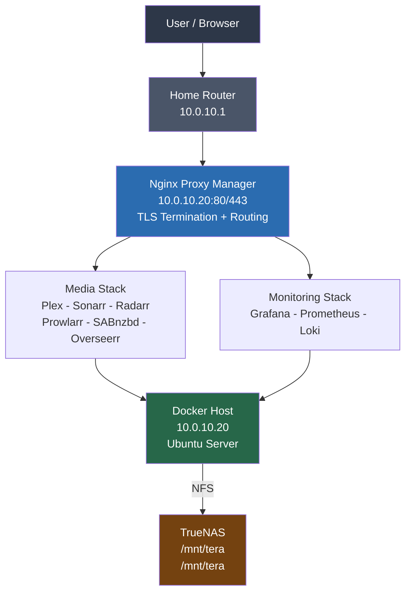
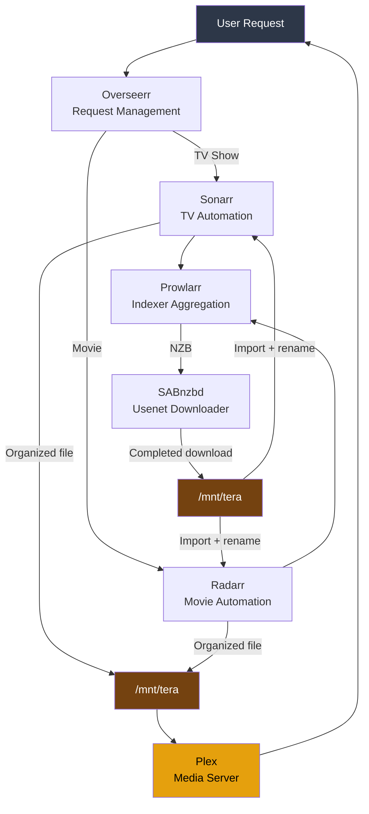

# 01 — Platform Philosophy
## Building a Reliable Docker Homelab

**Author:** Kagiso Tjeane
**Difficulty:** ⭐⭐☆☆☆☆☆☆☆☆ (2/10)
**Guide:** 01 of 06

> This series documents the design, deployment, and operation of a production‑grade Docker homelab platform.
>
> The objective is not experimentation. The objective is **operational excellence** — a system that can be fully rebuilt from this repository alone, without relying on memory or undocumented tribal knowledge.

---

# Why This Platform Exists

Most homelab environments begin the same way:

1. A server is provisioned. Docker is installed. Plex runs.
2. Applications are added manually as needs grow.
3. Configuration accumulates without documentation.
4. Storage is reorganised several times without a plan.
5. Eventually the system becomes fragile in ways that are difficult to diagnose.

When that moment arrives, the cost becomes visible.

A single command executed in the wrong directory can cause significant damage:

```bash
rm -rf /*
```

Nothing malicious. Nothing dramatic. A misplaced flag in the wrong shell session.

The damage was recoverable. But it exposed a deeper problem: the platform was working, but it was not **designed**.

Important questions became difficult to answer:

- Where exactly is container configuration stored?
- Which directories are safe to delete?
- Which ones absolutely must not be touched?
- How quickly could the entire platform be rebuilt if the server died tonight?

**If rebuilding the system requires memory instead of documentation, the infrastructure is not properly designed.**

This series is the result of rebuilding the platform — correctly.

---

# The Core Rule

The most important rule of this platform is:

> **If the server dies tomorrow, the entire platform can be rebuilt using only this repository.**

No guesswork.
No remembering configuration paths.
No hidden state.

Everything is documented. Everything is version-controlled. Everything is reproducible.

---

# Core Infrastructure Principles

The platform is built on five non-negotiable principles.

| # | Principle | Implementation |
|---|-----------|----------------|
| 1 | **Compute is disposable** | The Docker host can be wiped and rebuilt. No critical data lives on it. |
| 2 | **Storage survives compute failure** | Media and persistent data live on TrueNAS, mounted over NFS. |
| 3 | **Configuration lives in Git** | Compose stacks, monitoring config, and scripts are version-controlled. |
| 4 | **Monitoring exists from day one** | Monitoring exporters run on this host and ship data to the centralised k3s observability stack. |
| 5 | **Recovery is predictable** | Disaster recovery is documented and tested, not improvised. |

---

## Principle 1 — Compute is Disposable

Servers fail. Drives fail. Operating systems get reinstalled.

The system must assume that the Docker host will disappear at some point. Rebuilding it must be a routine operation, not a crisis.

This means: nothing critical lives on the Docker host. All persistent data lives on TrueNAS.

---

## Principle 2 — Storage Must Survive Compute Failure

The media library and persistent application data must never depend on the lifecycle of the host machine.

Storage lives on **TrueNAS**, exposed to the Docker host via NFS. If the host is wiped, the media library, download history, and application databases remain intact.

---

## Principle 3 — Configuration Lives in Git

Infrastructure configuration must be version-controlled.

This repository contains:

- Docker Compose stacks for every service
- monitoring and alerting configuration
- automation scripts
- complete infrastructure documentation

If configuration changes, Git records it. Rollback is a `git revert` away.

---

## Principle 4 — Monitoring Exists From Day One

Many homelabs add monitoring only after something breaks. By then, diagnosis is difficult because there is no historical data.

Monitoring exporters are deployed on this host (node-exporter, cAdvisor, Promtail) and scraped by the k3s cluster's kube-prometheus-stack. Observability is centralised in the k3s platform — no duplicate monitoring stack on Docker.

```
node-exporter  → host metrics (scraped by k3s Prometheus)
cAdvisor       → container metrics (scraped by k3s Prometheus)
Promtail       → log shipping to k3s Loki
```

Operational visibility is built-in, not bolted on.

---

## Principle 5 — Recovery Must Be Predictable

Disaster recovery must not be improvisation.

This platform defines clear recovery objectives:

```
Full platform rebuild     < 2 hours
Individual service restore < 15 minutes
Media library (NAS data)  → never lost (ZFS + backups)
```

Recovery procedures are documented in Guide 05 and tested against real failure scenarios.

---

# Platform Architecture

The platform is structured as layered infrastructure. Traffic enters at the network edge, passes through the reverse proxy, and reaches services running in Docker containers on the host. Persistent storage is decoupled from compute and lives on TrueNAS.



Each layer has a distinct responsibility:

| Layer | Responsibility |
|-------|----------------|
| Network | routing, firewall, DHCP |
| Reverse Proxy | TLS termination, hostname routing, port management |
| Docker Host | container orchestration, application lifecycle |
| Media Stack | automated media acquisition and streaming |
| Monitoring Stack | metrics, logs, dashboards, alerting |
| TrueNAS | persistent storage, ZFS snapshots, NFS exports |

---

# Media Pipeline

The automated media pipeline handles the full lifecycle from user request to playback. Each component performs exactly one job. This separation makes the system easier to understand and debug in isolation.



---

# Filesystem Design

One of the most important improvements in this rebuild is a predictable, documented filesystem layout.

```
/srv/
├── docker/
│   ├── stacks/          ← Docker Compose files (version-controlled)
│   └── appdata/         ← Container configuration and databases
│       ├── plex/
│       ├── sonarr/
│       ├── radarr/
│       ├── lidarr/
│       ├── prowlarr/
│       ├── bazarr/
│       ├── overseerr/
│       ├── sabnzbd/
│       ├── navidrome/
│       ├── node-exporter/
│       └── npm/
└── scripts/             ← Automation and maintenance scripts

/mnt/
├── archive/         (NFS from TrueNAS — backup destination)
│   ├── media/           ← TrueNAS NFS: organized media library
│   └── downloads/       ← TrueNAS NFS: completed downloads
```

This layout separates three distinct concerns:

| Directory | Purpose | Backed up? |
|-----------|---------|------------|
| `/srv/docker/stacks` | Compose files (in Git) | Git is the backup |
| `/srv/docker/appdata` | Container config + databases | Yes — Restic |
| `/mnt/tera` | Organized media library | ZFS snapshots |
| `/mnt/tera` | Completed downloads staging | ZFS snapshots |

---

# Protection Against Accidental Deletion

The storage layout is intentionally designed to reduce the blast radius of accidents.

## Physical Separation

Media and download storage is mounted from TrueNAS over NFS. An accidental `rm -rf /mnt/tera` can only delete the local mount point, not the underlying ZFS dataset. TrueNAS access controls and ZFS snapshots provide an additional recovery layer.

## ZFS Snapshot Schedule (on TrueNAS)

| Frequency | Retention |
|-----------|-----------|
| Hourly | 24 hours |
| Daily | 30 days |
| Weekly | 12 weeks |
| Monthly | 6 months |

Even if files are deleted through the mount, they are recoverable from the most recent snapshot.

---

# Series Overview

This series is divided into six guides, each building on the previous.

| Guide | Title | Description |
|-------|-------|-------------|
| **01 of 06** | Platform Philosophy | Architecture, principles, and series overview (this document) |
| **02 of 06** | Host Installation & Hardening | Ubuntu Server install, static IP, SSH keys, UFW, Fail2Ban |
| **03 of 06** | Docker Installation & Filesystem | Docker setup, daemon config, directory layout, NFS mounts |
| **04 of 06** | Media Stack & Reverse Proxy | Plex, Sonarr, Radarr, SABnzbd, Overseerr, Nginx Proxy Manager |
| **05 of 06** | Monitoring & Logging | node-exporter, cAdvisor, Promtail — scraped by k3s Prometheus |
| **06 of 06** | Application Configuration | Per-app settings for every service; Intel iGPU passthrough for Plex hardware transcoding |

---

# Exit Criteria

This guide is complete when you can answer yes to every question:

- [ ] The platform architecture makes sense: why compute is separate from storage
- [ ] The five core principles are understood and accepted as constraints
- [ ] The media pipeline flow is clear from request to playback
- [ ] The filesystem layout is understood before any directories are created
- [ ] The series overview is clear and you know what each subsequent guide delivers

---

## Navigation

| | Guide |
|---|---|
| ← Previous | *Start of series* |
| Current | **01 — Platform Philosophy** |
| → Next | [02 — Host Installation & Hardening](./01_host_installation_and_hardening.md) |
