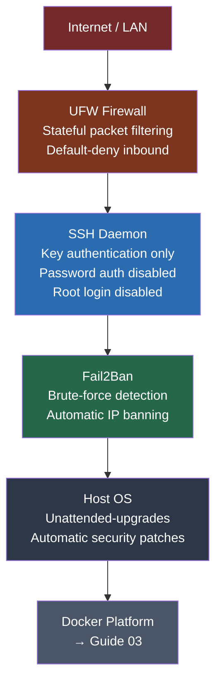

# 02 — Host Installation & Hardening
## Ubuntu Server Baseline, SSH Hardening, and Firewall Configuration

**Author:** Kagiso Tjeane
**Difficulty:** ⭐⭐⭐⭐☆☆☆☆☆☆ (4/10)
**Guide:** 02 of 06

> A container platform is only as secure as the host it runs on.
>
> This guide builds the hardened Linux foundation that every subsequent service depends on. Security is not bolted on at the end — it is established before a single container is deployed.

---

# Purpose of This Phase

Before Docker is installed, before any containers run, the host machine must be:

- reachable over SSH with key-based authentication only
- protected by a stateful firewall
- guarded against brute-force login attempts
- configured to receive automatic security patches

Many Docker guides skip straight to container deployment. That approach leaves the host itself as the weakest link in the platform.

This guide treats **host hardening as a prerequisite**, not an optional afterthought.

---

# Security Model

The host is protected by four independent layers. Each layer addresses a different threat surface.



---

# 1 — Hardware Requirements

The Docker host in this setup is an **Intel NUC**, but any x86-64 server or small form-factor machine will work.

| Component | Minimum | Recommended |
|-----------|---------|-------------|
| CPU | 2 cores | 4+ cores |
| RAM | 8 GB | 16 GB |
| Boot Drive | 120 GB SSD | 500 GB NVMe |
| Network | 1 GbE | 1 GbE |

**Media storage does not live on this machine.** It lives on TrueNAS, mounted over NFS. The local drive stores only:

- the operating system
- container configuration (`/srv/docker/appdata`)
- in-progress downloads (`/srv/downloads/incomplete`)

---

# 2 — Install Ubuntu Server

Download the latest Ubuntu Server LTS release:

```
https://ubuntu.com/download/server
```

Create a bootable USB drive using one of:

- **Rufus** (Windows)
- **Balena Etcher** (cross-platform)
- `dd` (Linux/macOS)

Boot from USB and run through the installer.

### Installer Options

When prompted, select:

```
Minimal installation     ← do not install optional snaps or extras
```

Enable during installation:

```
OpenSSH Server = yes     ← required for remote management
```

Do **not** select Docker from the snap installer. Docker will be installed via the official method in Guide 03.

Complete the installation and reboot into the new system.

---

# 3 — Networking: Assign a Static IP

The Docker host must have a **predictable IP address**. NFS mounts, monitoring targets, and reverse proxy configurations all depend on it.

**Target IP: `10.0.10.20`**

Ubuntu Server uses Netplan for network configuration. Locate the active config file:

```bash
ls /etc/netplan/
```

Edit the configuration (filename may vary):

```bash
sudo nano /etc/netplan/00-installer-config.yaml
```

Replace the contents with a static configuration:

```yaml
network:
  version: 2
  ethernets:
    enp3s0:                  # ← replace with your interface name (check: ip link show)
      dhcp4: no
      addresses:
        - 10.0.10.20/24
      routes:
        - to: default
          via: 10.0.10.1
      nameservers:
        addresses:
          - 10.0.10.1
          - 1.1.1.1
```

Apply the configuration:

```bash
sudo netplan apply
```

Verify the address is active:

```bash
ip addr show
```

Alternatively, configure a **DHCP reservation** in your router tied to the host's MAC address. Either approach is acceptable, but the IP must never change.

---

# 4 — Create the Primary User

Create the user account that will manage the platform:

```bash
sudo adduser kagiso
sudo usermod -aG sudo kagiso
```

Avoid performing day-to-day operations as root. The `kagiso` user will own all Docker operations and SSH sessions.

---

# 5 — System Update

Before hardening, ensure the system is fully up to date:

```bash
sudo apt update
sudo apt upgrade -y
```

If a kernel update was applied, reboot:

```bash
sudo reboot
```

Reconnect via SSH after the reboot completes.

---

# 6 — SSH Key Authentication

SSH keys provide significantly stronger authentication than passwords. This section configures key-based access and permanently disables password authentication.

### Step 1 — Generate a Key (on your workstation, not the server)

```bash
ssh-keygen -t ed25519 -C "homelab-docker"
```

Accept the default path:

```
~/.ssh/id_ed25519
~/.ssh/id_ed25519.pub
```

ED25519 is preferred over RSA. It produces shorter keys with stronger security properties.

### Step 2 — Copy the Public Key to the Server

```bash
ssh-copy-id kagiso@10.0.10.20
```

Enter the password **once**. The public key is appended to:

```
/home/kagiso/.ssh/authorized_keys
```

### Step 3 — Verify Key Login

Open a **new terminal window** and test:

```bash
ssh kagiso@10.0.10.20
```

You must log in **without being prompted for a password**.

Do not close the existing session until this is confirmed.

---

# 7 — SSH Hardening

With key authentication confirmed, disable all password-based login methods.

Edit the SSH daemon configuration:

```bash
sudo nano /etc/ssh/sshd_config
```

Set the following directives (add if missing, update if present):

```
# Authentication
PermitRootLogin no
PasswordAuthentication no
PubkeyAuthentication yes
ChallengeResponseAuthentication no
KbdInteractiveAuthentication no

# Restrict access
AllowUsers kagiso

# Reduce attack surface
X11Forwarding no
MaxAuthTries 3
LoginGraceTime 20
```

Apply the changes:

```bash
sudo systemctl restart ssh
```

Verify from a **new terminal window** that SSH still works before closing the existing session:

```bash
ssh kagiso@10.0.10.20
```

---

# 8 — Firewall Configuration (UFW)

UFW (Uncomplicated Firewall) is configured with a **default-deny inbound** policy. Only explicitly listed ports are permitted.

### Baseline Policy

```bash
sudo ufw default deny incoming
sudo ufw default allow outgoing
```

### Permitted Ports

Apply the rules for the full platform stack:

```bash
# Remote management
sudo ufw allow 22/tcp comment 'SSH'

# Reverse proxy (Nginx Proxy Manager)
sudo ufw allow 80/tcp comment 'HTTP'
sudo ufw allow 443/tcp comment 'HTTPS'
sudo ufw allow 81/tcp comment 'NPM admin interface'

# Media stack (direct access fallback)
sudo ufw allow 8096/tcp comment 'Jellyfin'
sudo ufw allow 8989/tcp comment 'Sonarr'
sudo ufw allow 7878/tcp comment 'Radarr'
sudo ufw allow 8686/tcp comment 'Lidarr'
sudo ufw allow 9696/tcp comment 'Prowlarr'
sudo ufw allow 8787/tcp comment 'Radarr alt / Readarr'
sudo ufw allow 6767/tcp comment 'Bazarr'
sudo ufw allow 5055/tcp comment 'Overseerr'
sudo ufw allow 8080/tcp comment 'SABnzbd'

# Monitoring stack
sudo ufw allow 3000/tcp comment 'Grafana'
sudo ufw allow 9090/tcp comment 'Prometheus'
```

### Enable the Firewall

```bash
sudo ufw enable
```

Verify the active ruleset:

```bash
sudo ufw status verbose
```

### UFW Rules Summary Table

| Port | Protocol | Service | Notes |
|------|----------|---------|-------|
| 22 | TCP | SSH | Key-auth only |
| 80 | TCP | HTTP | NPM redirect |
| 443 | TCP | HTTPS | NPM TLS termination |
| 81 | TCP | NPM Admin | Restrict to LAN if possible |
| 8096 | TCP | Jellyfin | Direct access fallback |
| 8989 | TCP | Sonarr | Direct access fallback |
| 7878 | TCP | Radarr | Direct access fallback |
| 8686 | TCP | Lidarr | Direct access fallback |
| 9696 | TCP | Prowlarr | Direct access fallback |
| 6767 | TCP | Bazarr | Direct access fallback |
| 5055 | TCP | Overseerr | Direct access fallback |
| 8080 | TCP | SABnzbd | Direct access fallback |
| 3000 | TCP | Grafana | Monitoring dashboard |
| 9090 | TCP | Prometheus | Metrics endpoint |

---

# 9 — Fail2Ban

Fail2Ban monitors authentication logs and automatically bans IP addresses that exceed a threshold of failed attempts.

### Install

```bash
sudo apt install fail2ban -y
```

### Configure

Create a local override file. Never edit `jail.conf` directly — it is overwritten on package upgrades.

```bash
sudo cp /etc/fail2ban/jail.conf /etc/fail2ban/jail.local
sudo nano /etc/fail2ban/jail.local
```

Locate the `[DEFAULT]` section and set:

```ini
[DEFAULT]
bantime  = 1h
findtime = 10m
maxretry = 5
```

Locate or create the `[sshd]` section:

```ini
[sshd]
enabled  = true
port     = 22
logpath  = %(sshd_log)s
backend  = %(sshd_backend)s
maxretry = 3
bantime  = 24h
```

### Enable and Start

```bash
sudo systemctl enable fail2ban
sudo systemctl start fail2ban
```

### Verify Operation

```bash
sudo fail2ban-client status
sudo fail2ban-client status sshd
```

Expected output shows the sshd jail as active with zero banned IPs on a fresh install.

---

# 10 — Automatic Security Updates

Security patches must be applied automatically. The host runs unattended, and manual update cycles create exposure windows.

### Install

```bash
sudo apt install unattended-upgrades -y
```

### Configure

```bash
sudo dpkg-reconfigure unattended-upgrades
```

Select **Yes** to enable automatic updates.

### Verify the Configuration

```bash
cat /etc/apt/apt.conf.d/20auto-upgrades
```

Expected output:

```
APT::Periodic::Update-Package-Lists "1";
APT::Periodic::Unattended-Upgrade "1";
```

---

# 11 — Verification Checklist

Run the following to confirm all hardening steps are in place:

```bash
# Firewall status
sudo ufw status verbose

# SSH daemon status
sudo systemctl status ssh

# Fail2Ban status
sudo fail2ban-client status sshd

# Automatic updates configuration
cat /etc/apt/apt.conf.d/20auto-upgrades

# Confirm SSH password authentication is disabled
sudo sshd -T | grep -i passwordauthentication
```

The `passwordauthentication` line must read `no`.

---

# Exit Criteria

This guide is complete when all of the following are true:

- [ ] Ubuntu Server is installed and booted
- [ ] Static IP `10.0.10.20` is assigned and persistent across reboots
- [ ] SSH key login works for user `kagiso` from your workstation
- [ ] Password authentication is disabled — `PasswordAuthentication no` is confirmed
- [ ] Root login is disabled — `PermitRootLogin no` is confirmed
- [ ] UFW is active with `default deny incoming` and all required ports open
- [ ] Fail2Ban is running with the `sshd` jail active
- [ ] Unattended-upgrades is enabled and configured
- [ ] All verification commands pass without errors

---

## Navigation

| | Guide |
|---|---|
| ← Previous | [01 — Platform Philosophy](./00_plan.md) |
| Current | **02 — Host Installation & Hardening** |
| → Next | [03 — Docker Installation & Filesystem](./02_docker_installation_and_filesystem.md) |
