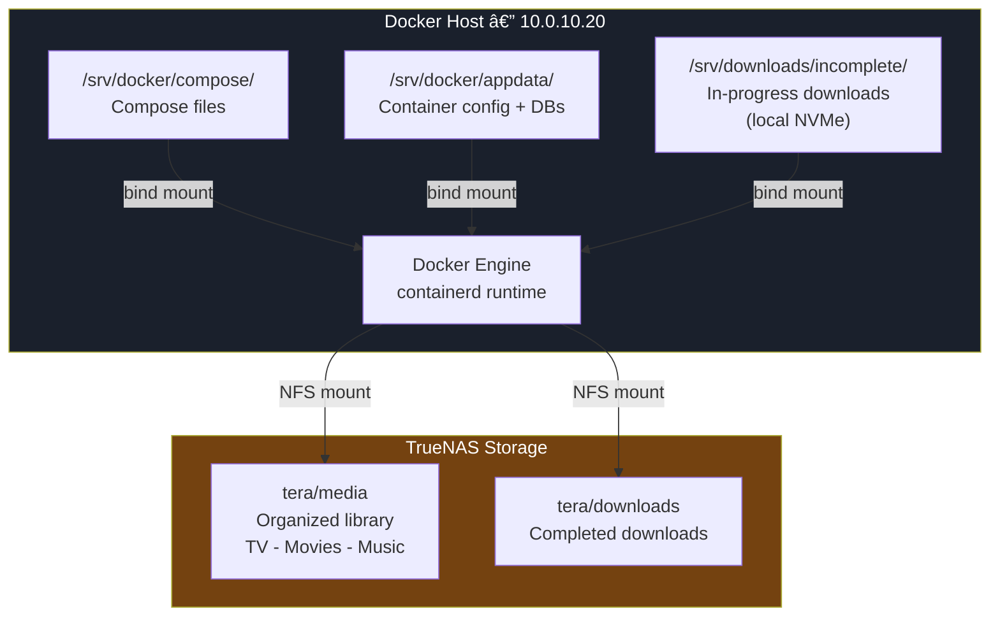
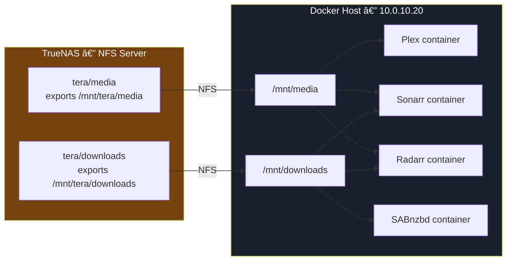
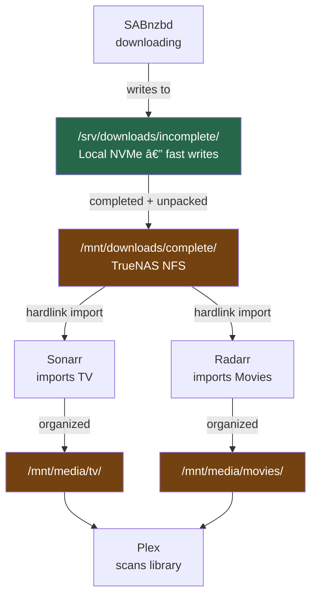

# 02 — Docker Installation & Filesystem Setup
## Container Runtime, Daemon Configuration, Directory Layout, and NFS Mounts

**Author:** Kagiso Tjeane
**Difficulty:** ⭐⭐⭐⭐☆☆☆☆☆☆ (4/10)
**Guide:** 02 of 06

> A clean filesystem structure is not an aesthetic preference — it is an operational requirement.
>
> Many broken media stacks trace their failures to poor directory planning: symlinks pointing to wrong paths, ARR apps unable to perform atomic moves, containers unable to write to their own config directories. This guide establishes a filesystem layout that eliminates those failure modes before any application is deployed.

---

# Purpose of This Phase

At this point the host is:

- running Ubuntu Server at `10.0.10.20`
- hardened with SSH keys, UFW, and Fail2Ban
- receiving automatic security patches

This guide adds the container platform and the filesystem structure that all subsequent services depend on.

By the end of this guide the host will have:

- Docker installed using the official upstream method
- a hardened daemon configuration with log rotation
- a predictable directory layout for stacks and container configuration
- NFS mounts connected to TrueNAS for media and downloads storage
- a Docker bridge network shared by all service stacks

---

# Architecture: Storage and Container Relationships



---

# 1 — Why Docker

Docker allows applications to run in **isolated containers**: self-contained units with their own filesystem, process space, and network interface.

Instead of installing Sonarr, Radarr, and Plex directly onto the host — creating a tangle of conflicting dependencies — each service runs in its own container, managed independently.

| Without Docker | With Docker |
|----------------|-------------|
| Application conflicts on shared OS | Each service is fully isolated |
| Manual install of every dependency | Image contains all dependencies |
| Upgrade one app risks breaking others | Update containers independently |
| Recovery requires reinstalling everything | Container recreated in seconds |
| Config scattered across the filesystem | Config bound from a single directory |

If a container fails, it is recreated. If a container image has a bug, it is rolled back. The host OS is not involved.

---

# 2 — Install Docker (Official Method)

Ubuntu's default repositories contain outdated Docker packages. The official installation script installs the current release directly from Docker's repository.

```bash
curl -fsSL https://get.docker.com | sudo sh
```

This script:
1. adds Docker's official apt repository and GPG key
2. installs `docker-ce`, `docker-ce-cli`, `containerd.io`, and `docker-compose-plugin`

Verify installation:

```bash
docker --version
docker compose version
```

Expected output:

```
Docker version 27.x.x, build ...
Docker Compose version v2.x.x
```

---

# 3 — Enable Docker at Boot

Docker must start automatically when the host boots. Without this, every reboot requires manual intervention.

```bash
sudo systemctl enable docker
sudo systemctl start docker
```

Verify:

```bash
sudo systemctl status docker
```

Expected: `Active: active (running)`

---

# 4 — Allow Docker Without Root

Add the `kagiso` user to the `docker` group. This allows running Docker commands without `sudo`.

```bash
sudo usermod -aG docker kagiso
```

**Important:** This change requires a full logout and login to take effect. A new shell or `su` session is not sufficient.

```bash
# Log out completely, then log back in via SSH
exit
ssh kagiso@10.0.10.20
```

After logging back in, verify the group membership and Docker access:

```bash
groups
docker run --rm hello-world
```

The `hello-world` container must run successfully without `sudo`.

---

# 5 — Configure the Docker Daemon

The Docker daemon configuration controls logging behaviour, storage drivers, and other system-level settings. Default Docker settings allow container logs to grow without bound, which can fill the root filesystem over time.

Create the daemon configuration file:

```bash
sudo mkdir -p /etc/docker
sudo nano /etc/docker/daemon.json
```

Write the following configuration:

```json
{
  "log-driver": "json-file",
  "log-opts": {
    "max-size": "10m",
    "max-file": "3"
  },
  "storage-driver": "overlay2"
}
```

| Setting | Value | Purpose |
|---------|-------|---------|
| `log-driver` | `json-file` | Standard Docker log format, readable by Loki/Promtail |
| `max-size` | `10m` | Maximum size per log file per container |
| `max-file` | `3` | Maximum number of rotated log files per container |
| `storage-driver` | `overlay2` | Recommended storage driver for Ubuntu (usually the default) |

With this configuration, each container is limited to approximately **30 MB of logs** before the oldest entries are discarded. Across a full media stack of 15+ containers, total log storage remains well under 500 MB.

Restart Docker to apply the configuration:

```bash
sudo systemctl restart docker
```

Verify the daemon is running with the new config:

```bash
docker info | grep -A 3 "Logging Driver"
```

Expected output includes `json-file`.

---

# 6 — Filesystem Layout

The directory structure is the backbone of the platform. Predictable paths prevent accidents, simplify backups, and make every compose file self-documenting.

### Create the Base Directories

```bash
sudo mkdir -p /srv/docker/compose
sudo mkdir -p /srv/docker/appdata
sudo mkdir -p /srv/scripts
sudo mkdir -p /srv/downloads/incomplete
```

### Assign Ownership

The `kagiso` user must own the Docker directories to allow compose operations without root:

```bash
sudo chown -R kagiso:kagiso /srv/docker
sudo chown -R kagiso:kagiso /srv/scripts
sudo chown -R kagiso:kagiso /srv/downloads
```

### Directory Purpose Reference

| Directory | Purpose |
|-----------|---------|
| `/srv/docker/compose/` | Docker Compose files — one subdirectory per stack |
| `/srv/docker/appdata/` | Container configuration, databases, and application state |
| `/srv/scripts/` | Automation and maintenance scripts |
| `/srv/downloads/incomplete/` | In-progress SABnzbd downloads on local NVMe |

### Deploy the Compose Files

The compose files and the `.env.example` template live in the `homelab-infrastructure` Git
repository. Clone the repo and copy them into place:

```bash
git clone https://github.com/Kagiso-me/homelab-infrastructure.git ~/homelab-infrastructure
cp ~/homelab-infrastructure/docker/compose/*.yml /srv/docker/compose/
cp ~/homelab-infrastructure/docker/compose/.env.example /srv/docker/compose/
```

Verify the files are in place:

```bash
ls /srv/docker/compose/
```

Expected output:

```
.env.example  media-stack.yml  monitoring-stack.yml  proxy-stack.yml
```

> The `.env.example` template is the source of truth for all configurable values. Guide 04
> will instruct you to copy it to `.env` and fill in secrets before deploying any stack.
> Never commit `.env` — it is gitignored by design.

---

# 7 — Application Data Directories (appdata)

Every container stores its persistent configuration and databases in `/srv/docker/appdata`. Each service gets its own subdirectory.

Create the full set of appdata directories:

```bash
mkdir -p /srv/docker/appdata/plex
mkdir -p /srv/docker/appdata/sonarr
mkdir -p /srv/docker/appdata/radarr
mkdir -p /srv/docker/appdata/lidarr
mkdir -p /srv/docker/appdata/prowlarr
mkdir -p /srv/docker/appdata/bazarr
mkdir -p /srv/docker/appdata/overseerr
mkdir -p /srv/docker/appdata/sabnzbd
mkdir -p /srv/docker/appdata/navidrome
mkdir -p /srv/docker/appdata/grafana
mkdir -p /srv/docker/appdata/prometheus
mkdir -p /srv/docker/appdata/loki
mkdir -p /srv/docker/appdata/npm
```

Verify the layout:

```bash
ls /srv/docker/appdata/
```

### Why appdata matters

Backing up `/srv/docker/appdata` is equivalent to backing up the entire application state of the platform:

- Sonarr's series database, history, and quality profiles
- Radarr's movie database and download history
- Plex's metadata cache and user accounts
- Prometheus's retention database
- NPM's proxy host configuration and TLS certificates

A complete platform restore requires only:
1. recreating this directory from backup
2. pulling Docker images
3. running `docker compose up -d`

---

# 8 — NFS Mounts: TrueNAS Storage

The media library and completed downloads live on **TrueNAS**, not on the Docker host. This decoupling means the host can be wiped and rebuilt without affecting any media.



### Install the NFS Client

```bash
sudo apt install nfs-common -y
```

### Create the Mount Points

```bash
sudo mkdir -p /mnt/media
sudo mkdir -p /mnt/downloads
```

### Configure Persistent Mounts via /etc/fstab

Mounts defined in `/etc/fstab` are automatically applied at boot.

```bash
sudo nano /etc/fstab
```

Add the following lines at the end of the file (replace `10.0.10.80` with your TrueNAS IP address):

```
# TrueNAS NFS mounts
# _netdev: wait for network before attempting mount
# hard:    retry indefinitely if NAS is temporarily unreachable
# noatime: suppress access time writes for performance
# rsize/wsize: optimise read/write block size for gigabit NFS
10.0.10.80:/mnt/tera/media      /mnt/media      nfs _netdev,hard,noatime,rsize=131072,wsize=131072,timeo=14,tcp 0 0
10.0.10.80:/mnt/tera/downloads  /mnt/downloads  nfs _netdev,hard,noatime,rsize=131072,wsize=131072,timeo=14,tcp 0 0
```

### NFS Mount Options Explained

| Option | Purpose |
|--------|---------|
| `_netdev` | Instructs systemd to wait for network availability before mounting |
| `hard` | NFS client retries indefinitely if the server is temporarily unreachable (vs `soft` which fails silently) |
| `noatime` | Suppresses filesystem access time updates, reducing unnecessary writes |
| `rsize=131072` | Read block size: 128 KB, optimal for gigabit NFS |
| `wsize=131072` | Write block size: 128 KB, optimal for gigabit NFS |
| `timeo=14` | Timeout in tenths of a second before retry (1.4 seconds) |
| `tcp` | Use TCP rather than UDP for reliability |

### Apply and Verify the Mounts

```bash
sudo mount -a
```

Verify both mounts are active:

```bash
df -h | grep -E "media|downloads"
```

Expected output shows both `/mnt/media` and `/mnt/downloads` mounted from the TrueNAS IP.

Test write access from the Docker host:

```bash
touch /mnt/media/.mounttest && echo "Write OK" && rm /mnt/media/.mounttest
touch /mnt/downloads/.mounttest && echo "Write OK" && rm /mnt/downloads/.mounttest
```

If TrueNAS NFS export permissions require it, ensure the `kagiso` UID matches the NFS export's allowed UID on TrueNAS.

---

# 9 — Download Pipeline Layout

SABnzbd downloads to local NVMe for speed. Once complete, Sonarr and Radarr import to TrueNAS via the NFS mount.



This two-stage design provides:

| Benefit | Mechanism |
|---------|-----------|
| Fast download speeds | Writes go to local NVMe, not over NFS |
| Atomic file moves | Sonarr/Radarr hardlink within the same NFS dataset |
| Minimal NAS write overhead | Only completed files are transferred to TrueNAS |
| Clean separation | In-progress downloads never appear in the media library |

---

# 10 — Docker Network

All service stacks share a single custom Docker bridge network. This allows containers in different compose stacks to resolve each other by name.

Create the shared network:

```bash
docker network create media-net
```

Verify the network exists:

```bash
docker network ls | grep media-net
```

This network will be referenced as `external: true` in every compose stack. Containers on this network can communicate using their service names as hostnames (e.g., Sonarr can reach SABnzbd at `http://sabnzbd:8080`).

---

# 11 — Verification Checklist

Run the following to confirm the environment is correctly configured:

```bash
# Docker version and compose plugin
docker --version
docker compose version

# Docker daemon config
docker info | grep -A 5 "Logging Driver"

# Filesystem layout
ls /srv/docker/appdata/
ls /srv/docker/compose/    # should show media-stack.yml, proxy-stack.yml, monitoring-stack.yml, .env.example

# NFS mounts
df -h | grep -E "media|downloads"
mount | grep nfs

# Docker network
docker network ls | grep media-net

# Docker runs without sudo
docker run --rm hello-world
```

All commands must complete without errors. Both NFS mounts must appear in `df -h` output.

---

# Exit Criteria

This guide is complete when all of the following are confirmed:

- [ ] Docker Engine is installed and the version reported is `27.x` or later
- [ ] `docker compose version` returns a v2 version string
- [ ] `docker run hello-world` succeeds without `sudo`
- [ ] `/etc/docker/daemon.json` exists with log rotation configured
- [ ] `docker info` confirms the `json-file` logging driver is active
- [ ] `/srv/docker/appdata/` contains all 13 service subdirectories
- [ ] `/srv/docker/compose/` contains `media-stack.yml`, `proxy-stack.yml`, `monitoring-stack.yml`, and `.env.example`
- [ ] `/mnt/media` is mounted from TrueNAS and writable
- [ ] `/mnt/downloads` is mounted from TrueNAS and writable
- [ ] Mounts persist across reboot (confirmed by rebooting and running `df -h`)
- [ ] `media-net` appears in `docker network ls`

---

## Navigation

| | Guide |
|---|---|
| ← Previous | [01 — Host Installation & Hardening](./01_host_installation_and_hardening.md) |
| Current | **02 — Docker Installation & Filesystem Setup** |
| → Next | [03 — Media Stack & Reverse Proxy](./03_media_stack_and_reverse_proxy.md) |
