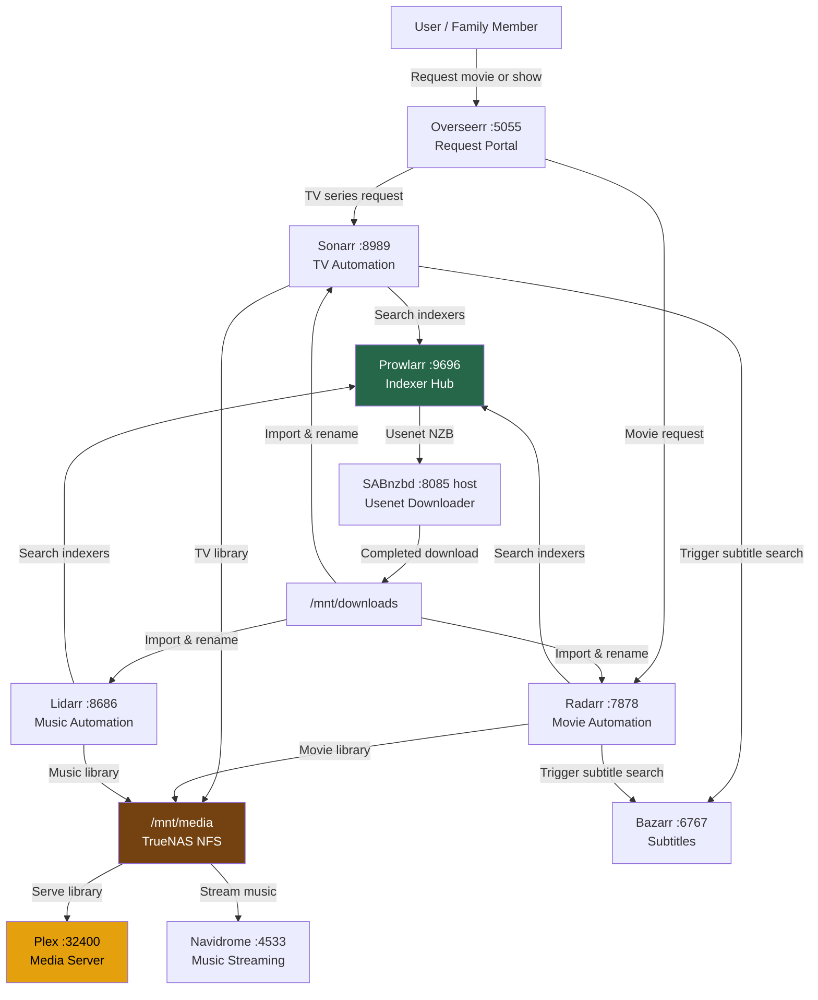
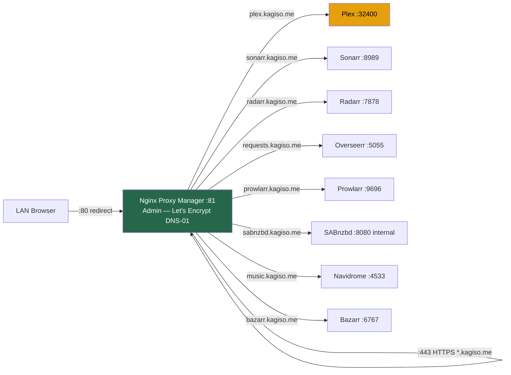

# 04 — Media Stack & Reverse Proxy
## Deploying the Full Media Automation Pipeline

**Author:** Kagiso Tjeane
**Difficulty:** ⭐⭐⭐⭐⭐⭐⭐☆☆☆ (7/10)
**Guide:** 04 of 07

> The media stack is the reason this Docker host exists.
>
> Ten containers work in concert to discover, download, organise, subtitle, and serve media
> without manual intervention. This guide deploys that pipeline in full — including the
> reverse proxy that terminates HTTPS using a wildcard Let's Encrypt certificate issued via
> Cloudflare DNS challenge, with no ports exposed to the internet.

---

# What We Are Building

At this point the platform has:

• a hardened Linux host
• Docker installed and configured
• a clean filesystem layout
• TrueNAS NFS shares mounted at `/mnt/media` and `/mnt/downloads`

This guide deploys the application layer on top of that foundation.

By the end of this guide we will have:

• **Plex** — media server with hardware-accelerated transcoding
• **Sonarr** — TV series automation
• **Radarr** — movie automation
• **Lidarr** — music automation
• **Prowlarr** — unified indexer management
• **Bazarr** — subtitle automation
• **SABnzbd** — Usenet downloader (host port 8085)
• **Overseerr** — media request portal
• **Navidrome** — self-hosted music streaming
• **Nginx Proxy Manager** — HTTPS reverse proxy with wildcard Let's Encrypt certificate

All services run as Docker containers under Docker Compose, on a dedicated bridge network,
accessible via browser-trusted HTTPS at `*.kagiso.me` subdomains.

---

# Service Architecture

## Media Pipeline Flow



## Reverse Proxy Routing



---

# Service Reference Table

| Service | Host Port | Purpose | Key Dependencies |
|---|---|---|---|
| Plex | 32400 | Media server — video, audio, photos | `/mnt/media`, `/dev/dri`, `PLEX_CLAIM` |
| Sonarr | 8989 | TV series lifecycle management | SABnzbd, Prowlarr, `/mnt/media`, `/mnt/downloads` |
| Radarr | 7878 | Movie lifecycle management | SABnzbd, Prowlarr, `/mnt/media`, `/mnt/downloads` |
| Lidarr | 8686 | Music lifecycle management | SABnzbd, Prowlarr, `/mnt/media`, `/mnt/downloads` |
| Prowlarr | 9696 | Indexer aggregation for all *Arrs | Indexer API keys |
| Bazarr | 6767 | Subtitle download automation | Sonarr, Radarr, subtitle provider credentials |
| SABnzbd | 8085 | Usenet NZB downloader | Usenet provider credentials, `/mnt/downloads` |
| Overseerr | 5055 | User-facing media request portal | Plex, Sonarr, Radarr |
| Navidrome | 4533 | Music web player / streaming server | `/mnt/media` music library |
| Nginx Proxy Manager | 80, 81, 443 | HTTPS reverse proxy + wildcard certificate | All services on `media-net`, Cloudflare API token |

> **SABnzbd port note:** Host port 8085 avoids a conflict with cAdvisor (deployed in
> `monitoring-stack.yml`) which also needs port 8080. The container itself still listens
> internally on 8080 — only the host binding differs.

---

# Environment Variable Standards

All linuxserver.io containers share a common set of environment variables. These ensure files
written by containers have the correct ownership on shared NFS storage, and that timestamps
are consistent.

| Variable | Value | Purpose |
|---|---|---|
| `PUID` | `1000` | UID of the `docker` Linux user — must match NFS mount ownership |
| `PGID` | `1000` | GID of the `docker` Linux group |
| `TZ` | `Africa/Johannesburg` | Ensures correct timestamps in logs and schedules |

> **Why PUID/PGID matter with NFS:** TrueNAS exports shares with a specific UID/GID.
> If the container writes files as root (UID 0), those files may be inaccessible or
> unmodifiable from TrueNAS. Setting PUID/PGID to match the Linux user avoids this.

In addition to the common variables, Plex requires:

| Variable | Value | Purpose |
|---|---|---|
| `PLEX_CLAIM` | Token from plex.tv/claim | Links Plex server to your account on first deploy |
| `VERSION` | `docker` | Tells the linuxserver.io image to use the bundled Plex version |

The `PLEX_CLAIM` token is valid for only four minutes from generation. It is consumed on
first startup — once the server has claimed itself, this variable can and should be removed
from `.env` to prevent stale token errors on container restarts.

---

# Step 0 — Prepare the Environment File

All sensitive values and version pins live in `.env`, which is gitignored and never committed.
Before deploying any stack, copy the example file and fill in your values.

```bash
cp /srv/docker/compose/.env.example /srv/docker/compose/.env
nano /srv/docker/compose/.env
```

Key values to set before deploying this guide:

```
PUID=1000
PGID=1000
TZ=Africa/Johannesburg

# Get this from https://plex.tv/claim — valid for 4 minutes
PLEX_CLAIM=claim-xxxxxxxxxxxxxxxxxxxx
```

Leave all `_VERSION` variables as `latest` for the initial deploy. After the stack is stable,
pin them to specific image digests using:

```bash
docker inspect --format='{{index .Config.Image}}' plex
```

---

# Step 1 — Deploy the Media Stack

The compose file lives in the repository at `/srv/docker/compose/media-stack.yml`. The
network (`media-net`) is defined by this stack — it must be deployed before `proxy-stack.yml`.

Deploy the media stack:

```bash
docker compose -f /srv/docker/compose/media-stack.yml --env-file /srv/docker/compose/.env up -d
```

The key services and their configuration in `media-stack.yml`:

**Plex** — hardware-accelerated media server:

```yaml
plex:
  image: lscr.io/linuxserver/plex:${PLEX_VERSION:-latest}
  container_name: plex
  ports:
    - "32400:32400"
  environment:
    - PUID=${PUID:-1000}
    - PGID=${PGID:-1000}
    - TZ=${TZ:-Africa/Johannesburg}
    - VERSION=docker
    - PLEX_CLAIM=${PLEX_CLAIM:-}
  volumes:
    - /srv/docker/appdata/plex:/config
    - /mnt/media:/media:ro
    - /srv/docker/appdata/plex/transcode:/transcode
  devices:
    - /dev/dri:/dev/dri
  group_add:
    - "render"
    - "video"
  healthcheck:
    test: ["CMD-SHELL", "curl -fs http://localhost:32400/identity || exit 1"]
```

**SABnzbd** — note the host port mapping (8085 on host, 8080 inside container):

```yaml
sabnzbd:
  image: lscr.io/linuxserver/sabnzbd:${SABNZBD_VERSION:-latest}
  container_name: sabnzbd
  ports:
    - "8085:8080"   # 8085 host avoids conflict with cAdvisor (monitoring-stack)
  healthcheck:
    test: ["CMD-SHELL", "curl -fs http://localhost:8080/api?mode=version || exit 1"]
```

The full compose file is at `/srv/docker/compose/media-stack.yml`. Do not edit the file
directly — all configuration is done via `.env` and the service UIs after deployment.

Verify all containers reach healthy state (allow 2–3 minutes):

```bash
docker ps --format "table {{.Names}}\t{{.Status}}\t{{.Ports}}"
```

Expected output — all rows should show `(healthy)`:

```
plex        Up 3 minutes (healthy)   0.0.0.0:32400->32400/tcp
sonarr      Up 3 minutes (healthy)   0.0.0.0:8989->8989/tcp
radarr      Up 3 minutes (healthy)   0.0.0.0:7878->7878/tcp
lidarr      Up 3 minutes (healthy)   0.0.0.0:8686->8686/tcp
prowlarr    Up 3 minutes (healthy)   0.0.0.0:9696->9696/tcp
bazarr      Up 3 minutes (healthy)   0.0.0.0:6767->6767/tcp
sabnzbd     Up 3 minutes (healthy)   0.0.0.0:8085->8080/tcp
overseerr   Up 3 minutes (healthy)   0.0.0.0:5055->5055/tcp
navidrome   Up 3 minutes (healthy)   0.0.0.0:4533->4533/tcp
```

---

# Step 2 — Deploy Nginx Proxy Manager

Nginx Proxy Manager provides HTTPS termination, Let's Encrypt certificate automation, and
a web UI for managing proxy hosts. It runs from its own compose file to allow independent
lifecycle management. NPM joins `media-net` as an external network, which is why the media
stack must be up first.

```bash
docker compose -f /srv/docker/compose/proxy-stack.yml --env-file /srv/docker/compose/.env up -d
```

Verify NPM is healthy:

```bash
docker ps --filter name=nginx-proxy-manager
```

Access the admin UI at `http://10.0.10.32:81`

Default credentials — change these immediately after first login:

```
Email:    admin@example.com
Password: changeme
```

After changing credentials, log out and back in before proceeding.

---

# Step 3 — Issue the Wildcard TLS Certificate

This step replaces browser security warnings with a proper, browser-trusted HTTPS
certificate — without exposing any ports to the internet.

## How It Works

NPM uses the Let's Encrypt **DNS-01 challenge** to prove ownership of `kagiso.me`.
Instead of serving a file on port 80, it creates a temporary DNS TXT record in Cloudflare.
Let's Encrypt verifies the record and issues a wildcard certificate for `*.kagiso.me`.

Because the certificate covers every subdomain (`plex.kagiso.me`, `sonarr.kagiso.me`, etc.),
you only ever need to request one certificate — not one per service.

## DNS Records in Cloudflare

Before issuing the certificate, each service needs an A record in Cloudflare pointing to
the Docker host's local IP. These records must be **DNS only** (grey cloud, not proxied)
because the IP is private and Cloudflare cannot proxy it.

Create the following A records in the Cloudflare dashboard (DNS → Records → Add Record):

| Name | Type | Content | Proxy Status |
|---|---|---|---|
| `plex` | A | `10.0.10.32` | DNS only |
| `sonarr` | A | `10.0.10.32` | DNS only |
| `radarr` | A | `10.0.10.32` | DNS only |
| `lidarr` | A | `10.0.10.32` | DNS only |
| `prowlarr` | A | `10.0.10.32` | DNS only |
| `sabnzbd` | A | `10.0.10.32` | DNS only |
| `requests` | A | `10.0.10.32` | DNS only |
| `music` | A | `10.0.10.32` | DNS only |
| `bazarr` | A | `10.0.10.32` | DNS only |

> **Security note:** Because `10.0.10.32` is a private RFC-1918 address, these services are
> accessible only from devices on the local network. The DNS records exist solely to satisfy
> Let's Encrypt's DNS-01 challenge and to allow LAN clients to resolve the hostnames to the
> correct IP. No traffic is exposed to the internet.

## Issue the Certificate in NPM

1. Open the NPM admin UI at `http://10.0.10.32:81`
2. Navigate to **SSL Certificates → Add SSL Certificate → Let's Encrypt**
3. In the **Domain Names** field, add both:
   - `*.kagiso.me`
   - `kagiso.me`
4. Enable **Use a DNS Challenge**
5. Select **Cloudflare** as the DNS provider
6. In the **Credentials File Content** field, enter:
   ```
   dns_cloudflare_api_token = <your Cloudflare API token>
   ```
   This is the same token used for cert-manager in the k3s cluster (Guide 00.5).
   The token requires `Zone:Read` and `DNS:Edit` permissions on the `kagiso.me` zone.
7. Check **I Agree to the Let's Encrypt Terms of Service**
8. Click **Save**

NPM will contact the Cloudflare API, create a `_acme-challenge` TXT record, wait for
Let's Encrypt to validate it, then delete the record and store the issued certificate.
This takes 10–30 seconds. The certificate will be valid for 90 days and auto-renewed.

Once issued, the certificate appears in the SSL Certificates list as `*.kagiso.me`.

---

# Step 4 — Configure NPM Proxy Hosts

For each service, create a proxy host in NPM. Navigate to **Proxy Hosts → Add Proxy Host**.

## Proxy Host Settings

For every host, apply these common settings:

- **Scheme:** `http`
- **Forward Hostname:** use the container name (Docker's internal DNS resolves it automatically)
- **Block Common Exploits:** enabled
- **SSL Tab → SSL Certificate:** select `*.kagiso.me` (the wildcard cert from Step 3)
- **SSL Tab → Force SSL:** enabled
- **SSL Tab → HTTP/2 Support:** enabled

| Domain Name | Forward Hostname | Forward Port |
|---|---|---|
| `plex.kagiso.me` | `plex` | `32400` |
| `sonarr.kagiso.me` | `sonarr` | `8989` |
| `radarr.kagiso.me` | `radarr` | `7878` |
| `lidarr.kagiso.me` | `lidarr` | `8686` |
| `prowlarr.kagiso.me` | `prowlarr` | `9696` |
| `sabnzbd.kagiso.me` | `sabnzbd` | `8080` |
| `requests.kagiso.me` | `overseerr` | `5055` |
| `music.kagiso.me` | `navidrome` | `4533` |
| `bazarr.kagiso.me` | `bazarr` | `6767` |

> **Note on SABnzbd:** The forward port is `8080` — the internal container port. NPM talks
> to the container directly over `media-net`, bypassing the host port binding entirely. The
> host port 8085 is only for direct access from the host machine.

> **Note on container name resolution:** Because NPM and all media stack containers share
> `media-net`, NPM can reach `plex`, `sonarr`, `sabnzbd`, etc. by container name. Docker's
> embedded DNS handles resolution. No IP addresses are needed in proxy host configuration.

---

# Step 5 — Configure Services

With all containers running and HTTPS in place, each service needs its initial configuration.
Open services via their HTTPS URLs or directly by IP during setup.

## Prowlarr — Configure First

Prowlarr is the indexer hub that feeds NZB sources to every *Arr application. Configure it
before the others.

1. Open `http://10.0.10.32:9696`
2. Add indexers: **Indexers → Add Indexer** — search for and configure your Usenet indexers
3. Under **Settings → Apps**, add each downstream application:

| Application | URL | API Key source |
|---|---|---|
| Sonarr | `http://sonarr:8989` | Sonarr → Settings → General |
| Radarr | `http://radarr:7878` | Radarr → Settings → General |
| Lidarr | `http://lidarr:8686` | Lidarr → Settings → General |

Prowlarr will automatically push indexer configurations to all connected applications.

## SABnzbd

1. Open `http://10.0.10.32:8085`
2. Complete the initial setup wizard — add your Usenet provider (server address, port, SSL, credentials)
3. Set download categories:

| Category | Folder |
|---|---|
| `tv` | `/downloads/tv` |
| `movies` | `/downloads/movies` |
| `music` | `/downloads/music` |

4. Note the API key from **Config → General → API Key** — needed for Sonarr, Radarr, and Lidarr.

## Sonarr / Radarr / Lidarr

Each *Arr application follows the same setup pattern:

1. Open the service UI
2. **Settings → Download Clients → Add → SABnzbd**
   - Host: `sabnzbd`
   - Port: `8080` (internal container port, not 8085)
   - API Key: (from SABnzbd above)
3. **Settings → Indexers** — Prowlarr will have already synced indexers automatically
4. **Settings → Media Management** — set root folders:
   - Sonarr: `/media/tv`
   - Radarr: `/media/movies`
   - Lidarr: `/media/music`

## Plex

Plex requires an account link on first run. The `PLEX_CLAIM` token in `.env` handles this
automatically if it was set before the container started. If the token expired before deploy,
remove the old token, generate a new one from `https://plex.tv/claim`, update `.env`, and
recreate the container.

1. Open `http://10.0.10.32:32400/web` — Plex will redirect to plex.tv to complete account linkage
2. Sign in with your Plex account
3. Name your server (e.g. `homelab`)
4. Add media libraries:

| Library Type | Library Path |
|---|---|
| Movies | `/media/movies` |
| TV Shows | `/media/tv` |
| Music | `/media/music` |

5. Enable hardware transcoding (requires Plex Pass):
   - **Settings → Transcoder → Use hardware acceleration when available**: enabled
   - **Settings → Transcoder → Use Intel/AMD (VA-API) hardware-accelerated video encoding**: enabled
   - Plex will auto-detect `/dev/dri/renderD128`

6. Run a library scan — Plex will scan `/media` and populate all libraries.

7. **After initial setup:** remove the `PLEX_CLAIM` value from `.env` (leave the variable
   present but empty: `PLEX_CLAIM=`). This prevents stale token errors on future container
   restarts. The claim is a one-time-use token — the server stays linked to your account
   regardless.

```bash
# After Plex has claimed itself successfully:
nano /srv/docker/compose/.env
# Set: PLEX_CLAIM=
```

## Overseerr

Overseerr is the user-facing request portal. It connects to Plex for library awareness and
to Sonarr/Radarr to fulfil requests.

1. Open `http://10.0.10.32:5055`
2. On the setup wizard, sign in with your **Plex account** (OAuth)
3. Connect to your Plex server:
   - Server: select your homelab server from the detected list, or enter `http://plex:32400`
   - Authenticate using your **Plex token** (found in Plex account settings under **Authorized Devices**,
     or via `https://plex.tv/devices.xml`) — Overseerr uses Plex token auth, not an API key
4. Connect Sonarr and Radarr:
   - **Settings → Services → Add Radarr Server**: `http://radarr:7878`, API key from Radarr
   - **Settings → Services → Add Sonarr Server**: `http://sonarr:8989`, API key from Sonarr
5. Sync Plex users to allow family members to make requests

## Bazarr

1. Open `http://10.0.10.32:6767`
2. **Settings → Sonarr**: URL `http://sonarr:8989`, API key from Sonarr
3. **Settings → Radarr**: URL `http://radarr:7878`, API key from Radarr
4. **Settings → Providers**: add subtitle providers (OpenSubtitles, Subscene, etc.)
5. Bazarr will monitor Sonarr and Radarr for new content and fetch subtitles automatically.

---

# Accessing Services

All services are accessible over HTTPS from any device on the LAN using their subdomains.
Direct IP access still works for administrative tasks or if DNS is unavailable.

| Service | HTTPS URL | Direct IP |
|---|---|---|
| Plex | `https://plex.kagiso.me` | `http://10.0.10.32:32400/web` |
| Sonarr | `https://sonarr.kagiso.me` | `http://10.0.10.32:8989` |
| Radarr | `https://radarr.kagiso.me` | `http://10.0.10.32:7878` |
| SABnzbd | `https://sabnzbd.kagiso.me` | `http://10.0.10.32:8085` |
| Overseerr | `https://requests.kagiso.me` | `http://10.0.10.32:5055` |
| Navidrome | `https://music.kagiso.me` | `http://10.0.10.32:4533` |
| NPM Admin | `http://10.0.10.32:81` | (admin only, no HTTPS proxy) |

---

# Verification

## Check All Containers Are Healthy

```bash
docker ps --format "table {{.Names}}\t{{.Status}}"
```

All rows must show `Up X minutes (healthy)`.

## Check Inter-Container Connectivity

From a container, confirm Docker DNS resolution works across `media-net`:

```bash
docker exec sonarr curl -s http://sabnzbd:8080/api?mode=version
docker exec radarr curl -s http://prowlarr:9696/ping
docker exec plex curl -s http://localhost:32400/identity
```

## Check Hardware Transcoding (Plex)

Confirm the DRI device is present inside the Plex container:

```bash
docker exec plex ls /dev/dri/
```

Expected output: `card0  renderD128`

Confirm the container has the correct group memberships:

```bash
docker exec plex id
```

The output should include `render` and `video` group IDs. If not, confirm `group_add` is set
in `media-stack.yml` and recreate the container:

```bash
docker compose -f /srv/docker/compose/media-stack.yml up -d --force-recreate plex
```

Confirm the host user is also in the render group (required for device access):

```bash
getent group render
```

If `1000` is not listed:

```bash
sudo usermod -aG render,video $(whoami)
# Log out and back in, then recreate the plex container
```

In the Plex UI, hardware transcoding is confirmed via:
**Settings → Transcoder** — verify "Use hardware acceleration when available" is checked and
that Intel/AMD VA-API appears as an available encoder in the Plex Dashboard during an active
transcode session.

## Verify TLS Certificate

Open `https://plex.kagiso.me` in a browser. The connection should show a valid certificate
issued by Let's Encrypt with `*.kagiso.me` as the subject. There should be no browser
security warnings.

Repeat for at least one other subdomain to confirm the wildcard covers all proxy hosts.

---

# Troubleshooting

| Symptom | Likely cause | Resolution |
|---|---|---|
| Container stuck in `(health: starting)` | Slow startup or misconfiguration | `docker logs <name>` — check for errors |
| Sonarr cannot reach SABnzbd | Incorrect port in download client | Use container name `sabnzbd` and port `8080`, not `8085` |
| `/mnt/media` shows permission denied | PUID/PGID mismatch with NFS | Confirm NFS export UID matches `1000` |
| NPM shows 502 Bad Gateway | Container not running or name wrong | Check container status; confirm hostname matches container name |
| NPM cert issuance fails | Cloudflare token insufficient permissions | Token needs `Zone:Read` + `DNS:Edit` for kagiso.me zone |
| Plex can't claim server | `PLEX_CLAIM` token expired | Generate a new token at plex.tv/claim (valid 4 min), update `.env`, recreate container |
| Plex hardware transcoding not available | VA-API device not mounted or Plex Pass not active | Verify `/dev/dri` is present in container; confirm Plex Pass subscription is active |
| Overseerr can't find Plex server | Wrong auth method | Overseerr uses Plex token auth, not an API key — sign in via Plex OAuth in the wizard |
| SABnzbd UI not reachable on :8085 | Port conflict with cAdvisor | Confirm monitoring stack is not also binding 8085; check `docker ps` for conflicts |

---

# Exit Criteria

This phase is complete when:

```
✓ All ten media stack containers show (healthy)
✓ Nginx Proxy Manager running and admin UI accessible at :81
✓ Wildcard certificate *.kagiso.me issued by Let's Encrypt and visible in NPM SSL Certificates
✓ All nine proxy hosts configured in NPM with SSL using the wildcard cert
✓ Browser shows valid certificate (no warning) for plex.kagiso.me
✓ Prowlarr has at least one indexer configured and synced to Sonarr/Radarr
✓ SABnzbd connected to Usenet provider (test download successful)
✓ Sonarr and Radarr connected to SABnzbd (port 8080 internal) and Prowlarr
✓ Plex server claimed, libraries populated with at least one title from /mnt/media
✓ Plex hardware acceleration active (/dev/dri/renderD128 visible inside container)
✓ Overseerr connected to Plex (via Plex token), Sonarr, and Radarr
```

---

# Next Guide

➡ **[05 — Monitoring & Logging](./04_monitoring_and_logging.md)**

The next guide deploys a full observability stack:

• Prometheus — metrics collection from host and containers
• Grafana — dashboards and alerting
• cAdvisor — per-container resource metrics (binds port 8080 — reason SABnzbd uses 8085)
• Loki + Promtail — log aggregation

---

## Navigation

| | Guide |
|---|---|
| ← Previous | [03 — Docker Installation & Filesystem Setup](./02_docker_installation_and_filesystem.md) |
| Current | **04 — Media Stack & Reverse Proxy** |
| → Next | [05 — Monitoring & Logging](./04_monitoring_and_logging.md) |
