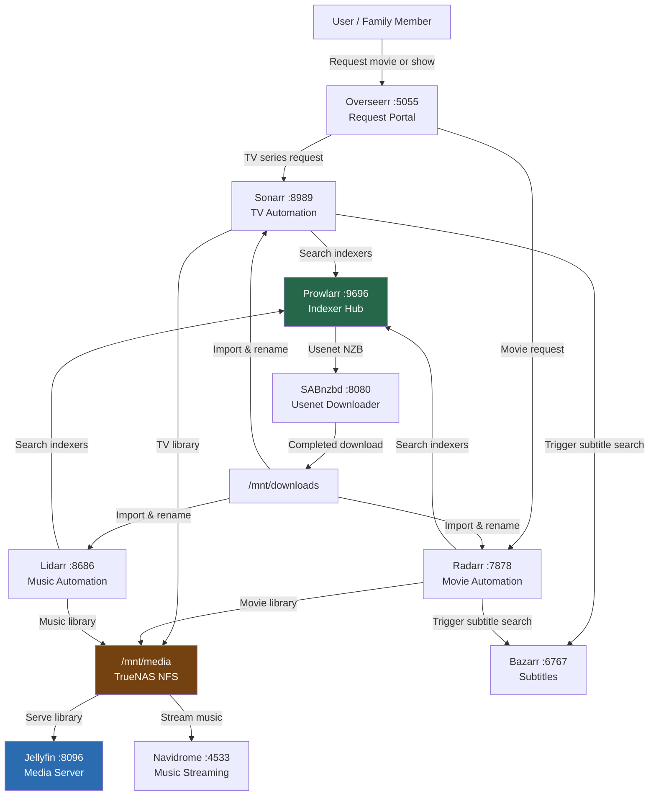
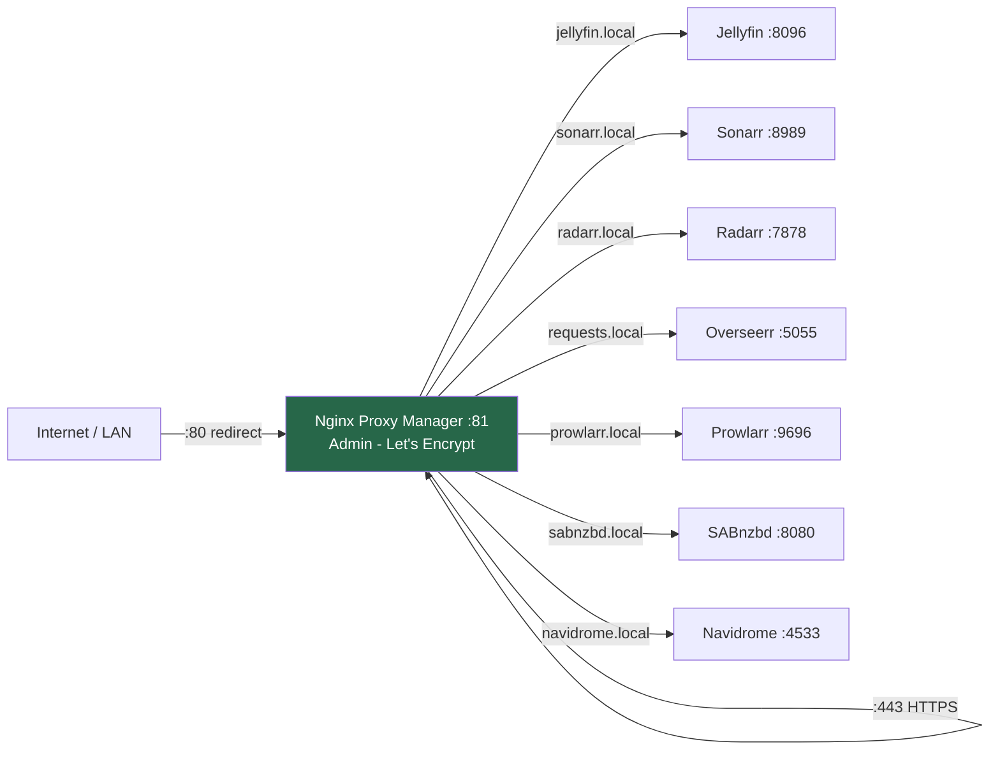

# 04 — Media Stack & Reverse Proxy
## Deploying the Full Media Automation Pipeline

**Author:** Kagiso Tjeane
**Difficulty:** ⭐⭐⭐⭐⭐⭐⭐☆☆☆ (7/10)
**Guide:** 04 of 06

> The media stack is the reason this Docker host exists.
>
> Nine containers work in concert to discover, download, organise, subtitle, and serve media
> without manual intervention. This guide deploys that pipeline in full — including the
> reverse proxy that makes it accessible over HTTPS.

---

# What We Are Building

At this point the platform has:

• a hardened Linux host
• Docker installed and configured
• a clean filesystem layout
• TrueNAS NFS shares mounted at `/mnt/media` and `/mnt/downloads`

This guide deploys the application layer on top of that foundation.

By the end of this guide we will have:

• **Jellyfin** — media server with hardware-accelerated transcoding
• **Sonarr** — TV series automation
• **Radarr** — movie automation
• **Lidarr** — music automation
• **Prowlarr** — unified indexer management
• **Bazarr** — subtitle automation
• **SABnzbd** — Usenet downloader
• **Overseerr** — media request portal
• **Navidrome** — self-hosted music streaming
• **Nginx Proxy Manager** — HTTPS reverse proxy with Let's Encrypt

All services run as Docker containers under Docker Compose, on a dedicated bridge network.

---

# Service Architecture

## Media Pipeline Flow



## Reverse Proxy Routing



---

# Service Reference Table

| Service | Port | Purpose | Key Dependencies |
|---|---|---|---|
| SABnzbd | 8080 | Usenet NZB downloader | Usenet provider credentials, `/mnt/downloads` |
| Sonarr | 8989 | TV series lifecycle management | SABnzbd, Prowlarr, `/mnt/media`, `/mnt/downloads` |
| Radarr | 7878 | Movie lifecycle management | SABnzbd, Prowlarr, `/mnt/media`, `/mnt/downloads` |
| Lidarr | 8686 | Music lifecycle management | SABnzbd, Prowlarr, `/mnt/media`, `/mnt/downloads` |
| Prowlarr | 9696 | Indexer aggregation for all *Arrs | Indexer API keys |
| Bazarr | 6767 | Subtitle download automation | Sonarr, Radarr, subtitle provider credentials |
| Overseerr | 5055 | User-facing media request portal | Jellyfin, Sonarr, Radarr |
| Navidrome | 4533 | Music web player / streaming server | `/mnt/media` music library |
| Jellyfin | 8096 | Media server — video, audio, photos | `/mnt/media`, `/dev/dri` for transcoding |
| Nginx Proxy Manager | 80, 81, 443 | HTTPS reverse proxy + certificate management | All services on `media-net` |

---

# Environment Variable Standards

All linuxserver.io containers share a common set of environment variables. These ensure files
written by containers have the correct ownership on shared NFS storage, and that timestamps
are consistent.

| Variable | Value | Purpose |
|---|---|---|
| `PUID` | `1000` | UID of the `docker` Linux user — must match NFS mount ownership |
| `PGID` | `1000` | GID of the `docker` Linux group |
| `TZ` | `Africa/Johannesburg` | Ensures correct timestamps in logs and schedules |

> **Why PUID/PGID matter with NFS:** TrueNAS exports shares with a specific UID/GID.
> If the container writes files as root (UID 0), those files may be inaccessible or
> unmodifiable from TrueNAS. Setting PUID/PGID to match the Linux user avoids this.

---

# Step 1 — Create the Docker Network

All media stack containers communicate on a dedicated bridge network. This isolates them
from other stacks and allows containers to reach each other by name.

```bash
docker network create media-net
```

Verify:

```bash
docker network ls | grep media-net
```

---

# Step 2 — Deploy the Media Stack

Create the compose file:

```bash
sudo nano /srv/docker/stacks/media-stack.yml
```

```yaml
networks:
  media-net:
    external: true

services:

  sabnzbd:
    image: lscr.io/linuxserver/sabnzbd:latest
    container_name: sabnzbd
    environment:
      - PUID=1000
      - PGID=1000
      - TZ=Africa/Johannesburg
    volumes:
      - /srv/docker/appdata/sabnzbd:/config
      - /mnt/downloads:/downloads
    ports:
      - "8080:8080"
    networks:
      - media-net
    restart: unless-stopped
    healthcheck:
      test: ["CMD", "curl", "-sf", "http://localhost:8080/sabnzbd/api?mode=version"]
      interval: 30s
      timeout: 10s
      retries: 5
      start_period: 30s

  sonarr:
    image: lscr.io/linuxserver/sonarr:latest
    container_name: sonarr
    environment:
      - PUID=1000
      - PGID=1000
      - TZ=Africa/Johannesburg
    volumes:
      - /srv/docker/appdata/sonarr:/config
      - /mnt/downloads:/downloads
      - /mnt/media:/media
    ports:
      - "8989:8989"
    networks:
      - media-net
    restart: unless-stopped
    healthcheck:
      test: ["CMD", "curl", "-sf", "http://localhost:8989/ping"]
      interval: 30s
      timeout: 10s
      retries: 5
      start_period: 30s

  radarr:
    image: lscr.io/linuxserver/radarr:latest
    container_name: radarr
    environment:
      - PUID=1000
      - PGID=1000
      - TZ=Africa/Johannesburg
    volumes:
      - /srv/docker/appdata/radarr:/config
      - /mnt/downloads:/downloads
      - /mnt/media:/media
    ports:
      - "7878:7878"
    networks:
      - media-net
    restart: unless-stopped
    healthcheck:
      test: ["CMD", "curl", "-sf", "http://localhost:7878/ping"]
      interval: 30s
      timeout: 10s
      retries: 5
      start_period: 30s

  lidarr:
    image: lscr.io/linuxserver/lidarr:latest
    container_name: lidarr
    environment:
      - PUID=1000
      - PGID=1000
      - TZ=Africa/Johannesburg
    volumes:
      - /srv/docker/appdata/lidarr:/config
      - /mnt/downloads:/downloads
      - /mnt/media:/media
    ports:
      - "8686:8686"
    networks:
      - media-net
    restart: unless-stopped
    healthcheck:
      test: ["CMD", "curl", "-sf", "http://localhost:8686/ping"]
      interval: 30s
      timeout: 10s
      retries: 5
      start_period: 30s

  prowlarr:
    image: lscr.io/linuxserver/prowlarr:latest
    container_name: prowlarr
    environment:
      - PUID=1000
      - PGID=1000
      - TZ=Africa/Johannesburg
    volumes:
      - /srv/docker/appdata/prowlarr:/config
    ports:
      - "9696:9696"
    networks:
      - media-net
    restart: unless-stopped
    healthcheck:
      test: ["CMD", "curl", "-sf", "http://localhost:9696/ping"]
      interval: 30s
      timeout: 10s
      retries: 5
      start_period: 30s

  bazarr:
    image: lscr.io/linuxserver/bazarr:latest
    container_name: bazarr
    environment:
      - PUID=1000
      - PGID=1000
      - TZ=Africa/Johannesburg
    volumes:
      - /srv/docker/appdata/bazarr:/config
      - /mnt/media:/media
    ports:
      - "6767:6767"
    networks:
      - media-net
    restart: unless-stopped
    healthcheck:
      test: ["CMD", "curl", "-sf", "http://localhost:6767/system/status"]
      interval: 30s
      timeout: 10s
      retries: 5
      start_period: 30s

  overseerr:
    image: lscr.io/linuxserver/overseerr:latest
    container_name: overseerr
    environment:
      - PUID=1000
      - PGID=1000
      - TZ=Africa/Johannesburg
    volumes:
      - /srv/docker/appdata/overseerr:/config
    ports:
      - "5055:5055"
    networks:
      - media-net
    restart: unless-stopped
    healthcheck:
      test: ["CMD", "curl", "-sf", "http://localhost:5055/api/v1/status"]
      interval: 30s
      timeout: 10s
      retries: 5
      start_period: 30s

  navidrome:
    image: deluan/navidrome:latest
    container_name: navidrome
    user: "1000:1000"
    environment:
      - TZ=Africa/Johannesburg
      - ND_SCANSCHEDULE=1h
      - ND_LOGLEVEL=info
      - ND_SESSIONTIMEOUT=24h
      - ND_BASEURL=
    volumes:
      - /srv/docker/appdata/navidrome:/data
      - /mnt/media/music:/music:ro
    ports:
      - "4533:4533"
    networks:
      - media-net
    restart: unless-stopped
    healthcheck:
      test: ["CMD", "curl", "-sf", "http://localhost:4533/ping"]
      interval: 30s
      timeout: 10s
      retries: 5
      start_period: 30s

  jellyfin:
    image: lscr.io/linuxserver/jellyfin:latest
    container_name: jellyfin
    environment:
      - PUID=1000
      - PGID=1000
      - TZ=Africa/Johannesburg
      - JELLYFIN_PublishedServerUrl=http://10.0.10.20:8096
    volumes:
      - /srv/docker/appdata/jellyfin:/config
      - /mnt/media:/media
    ports:
      - "8096:8096"
      - "8920:8920"    # HTTPS (optional)
      - "7359:7359/udp" # Local network discovery
      - "1900:1900/udp" # DLNA
    devices:
      - /dev/dri:/dev/dri   # Intel/AMD hardware transcoding (VA-API)
    networks:
      - media-net
    restart: unless-stopped
    healthcheck:
      test: ["CMD", "curl", "-sf", "http://localhost:8096/health"]
      interval: 30s
      timeout: 10s
      retries: 5
      start_period: 60s
```

Deploy:

```bash
docker compose -f /srv/docker/stacks/media-stack.yml up -d
```

Verify all containers reach healthy state:

```bash
docker ps --format "table {{.Names}}\t{{.Status}}\t{{.Ports}}"
```

Expected output — all containers should show `(healthy)` within 2–3 minutes:

```
sabnzbd     Up 2 minutes (healthy)
sonarr      Up 2 minutes (healthy)
radarr      Up 2 minutes (healthy)
lidarr      Up 2 minutes (healthy)
prowlarr    Up 2 minutes (healthy)
bazarr      Up 2 minutes (healthy)
overseerr   Up 2 minutes (healthy)
navidrome   Up 2 minutes (healthy)
jellyfin    Up 2 minutes (healthy)
```

---

# Step 3 — Deploy Nginx Proxy Manager

Nginx Proxy Manager provides HTTPS termination, Let's Encrypt certificate automation, and
a web UI for managing proxy hosts. It runs on its own compose file to allow independent
lifecycle management.

```bash
sudo nano /srv/docker/stacks/proxy.yml
```

```yaml
networks:
  media-net:
    external: true

services:

  npm:
    image: jc21/nginx-proxy-manager:latest
    container_name: npm
    ports:
      - "80:80"     # HTTP — redirected to HTTPS
      - "81:81"     # NPM admin web UI
      - "443:443"   # HTTPS — all proxied services
    volumes:
      - /srv/docker/appdata/npm/data:/data
      - /srv/docker/appdata/npm/letsencrypt:/etc/letsencrypt
    networks:
      - media-net
    restart: unless-stopped
    healthcheck:
      test: ["CMD", "curl", "-sf", "http://localhost:81"]
      interval: 30s
      timeout: 10s
      retries: 5
      start_period: 30s
```

Deploy:

```bash
docker compose -f /srv/docker/stacks/proxy.yml up -d
```

Access the admin UI at `http://10.0.10.20:81`

Default credentials (change immediately):

```
Email:    admin@example.com
Password: changeme
```

---

# Step 4 — Configure NPM Proxy Hosts

For each service, create a Proxy Host in the NPM admin UI.

Navigate to **Proxy Hosts → Add Proxy Host**.

| Domain | Forward Hostname | Forward Port | SSL |
|---|---|---|---|
| `jellyfin.home` | `jellyfin` | `8096` | Let's Encrypt or self-signed |
| `sonarr.home` | `sonarr` | `8989` | Let's Encrypt or self-signed |
| `radarr.home` | `radarr` | `7878` | Let's Encrypt or self-signed |
| `lidarr.home` | `lidarr` | `8686` | Let's Encrypt or self-signed |
| `prowlarr.home` | `prowlarr` | `9696` | Let's Encrypt or self-signed |
| `bazarr.home` | `bazarr` | `6767` | Let's Encrypt or self-signed |
| `requests.home` | `overseerr` | `5055` | Let's Encrypt or self-signed |
| `music.home` | `navidrome` | `4533` | Let's Encrypt or self-signed |
| `sabnzbd.home` | `sabnzbd` | `8080` | Let's Encrypt or self-signed |

> **Note:** Since NPM and all services share `media-net`, the Forward Hostname can be the
> container name directly. Docker's internal DNS resolves `jellyfin` to the container IP.
> No IP addresses needed in the proxy configuration.

---

# Step 5 — Configure Services

## Prowlarr (configure first)

Prowlarr is the hub that feeds indexers to all other *Arr applications.

1. Open `http://10.0.10.20:9696`
2. Add indexers under **Indexers → Add Indexer**
3. Under **Settings → Apps**, add each application:

| Application | URL | API Key source |
|---|---|---|
| Sonarr | `http://sonarr:8989` | Sonarr → Settings → General |
| Radarr | `http://radarr:7878` | Radarr → Settings → General |
| Lidarr | `http://lidarr:8686` | Lidarr → Settings → General |

Prowlarr will automatically sync indexers to all connected applications.

## SABnzbd

1. Open `http://10.0.10.20:8080`
2. Complete the initial wizard — add your Usenet provider (server, port, SSL, credentials)
3. Set **Categories**:

| Category | Folder |
|---|---|
| `tv` | `/downloads/tv` |
| `movies` | `/downloads/movies` |
| `music` | `/downloads/music` |

4. Note the API key from **Config → General** — needed for Sonarr/Radarr/Lidarr.

## Sonarr / Radarr / Lidarr

Each ARR application follows the same setup pattern:

1. Open the service UI
2. **Settings → Download Clients → Add → SABnzbd**
   - Host: `sabnzbd`
   - Port: `8080`
   - API Key: (from SABnzbd above)
3. **Settings → Indexers** — Prowlarr will have already synced indexers automatically
4. **Settings → Media Management** — configure root folder to `/media/tv`, `/media/movies`, `/media/music`

## Jellyfin

1. Open `http://10.0.10.20:8096` — the setup wizard launches on first visit
2. Create an admin account
3. Add libraries:

| Library | Path |
|---|---|
| Movies | `/media/movies` |
| TV Shows | `/media/tv` |
| Music | `/media/music` |

4. Enable hardware acceleration: **Dashboard → Playback → Hardware Acceleration → VA-API**
   - VA-API device: `/dev/dri/renderD128`
   - Enable all codec acceleration checkboxes

5. Run a library scan — Jellyfin will scan `/media` and populate the library.

## Overseerr

1. Open `http://10.0.10.20:5055`
2. Connect to Jellyfin:
   - URL: `http://jellyfin:8096`
   - API Key: from Jellyfin → Dashboard → API Keys
3. Sync users from Jellyfin
4. Connect Sonarr and Radarr:
   - Default Server: Sonarr at `http://sonarr:8989`, Radarr at `http://radarr:7878`
   - Use API keys from each application

## Bazarr

1. Open `http://10.0.10.20:6767`
2. **Settings → Sonarr**: connect with API key and `http://sonarr:8989`
3. **Settings → Radarr**: connect with API key and `http://radarr:7878`
4. **Settings → Providers**: add subtitle providers (OpenSubtitles, Subscene, etc.)

---

# Accessing Services from the Raspberry Pi

The Raspberry Pi on the network can access all services using SSH port forwarding if needed,
but for LAN access the services are directly reachable by IP.

From the RPi, services are at `http://10.0.10.20:<port>` — e.g. `http://10.0.10.20:8096` for Jellyfin.

If you are accessing from outside the LAN via SSH jump:

```bash
# Tunnel Jellyfin to your local machine via the RPi
ssh -L 8096:10.0.10.20:8096 pi@<rpi-ip>
# Then open http://localhost:8096 in your browser
```

---

# Verification

## Check All Containers Are Healthy

```bash
docker ps --format "table {{.Names}}\t{{.Status}}"
```

All rows should show `Up X minutes (healthy)`.

## Check Inter-Container Connectivity

From a container, confirm DNS resolution works:

```bash
docker exec sonarr curl -s http://sabnzbd:8080/sabnzbd/api?mode=version
docker exec radarr curl -s http://prowlarr:9696/ping
```

## Check Hardware Transcoding (Jellyfin)

Confirm the DRI device is present in the container:

```bash
docker exec jellyfin ls /dev/dri/
```

Expected: `card0  renderD128`

Confirm the group permission (Jellyfin user needs access):

```bash
getent group render
```

If `1000` is not in the `render` group:

```bash
sudo usermod -aG render,video $(whoami)
# Then recreate the jellyfin container: docker compose up -d --force-recreate jellyfin
```

---

# Troubleshooting

| Symptom | Likely cause | Resolution |
|---|---|---|
| Container stuck in `(health: starting)` | Slow startup or misconfiguration | `docker logs <name>` — check for errors |
| Sonarr cannot reach SABnzbd | Network name wrong | Use container name `sabnzbd`, not IP |
| `/mnt/media` shows permission denied | PUID/PGID mismatch with NFS | Confirm NFS export UID matches `1000` |
| Jellyfin transcoding fails | `/dev/dri` not available | Verify Intel drivers: `ls /dev/dri` on host |
| NPM shows 502 Bad Gateway | Container not running or name wrong | Check container status and hostname in NPM |
| Overseerr can't connect to Jellyfin | API key incorrect | Regenerate key in Jellyfin Dashboard → API Keys |

---

# Exit Criteria

This phase is complete when:

```
✓ All nine media stack containers show (healthy)
✓ Nginx Proxy Manager running and admin UI accessible at :81
✓ Prowlarr has at least one indexer configured and synced to Sonarr/Radarr
✓ SABnzbd connected to Usenet provider (test download successful)
✓ Sonarr and Radarr connected to SABnzbd and Prowlarr
✓ Jellyfin library populated with at least one title from /mnt/media
✓ Jellyfin hardware acceleration active (VA-API device visible in Dashboard)
✓ Overseerr connected to Jellyfin, Sonarr, and Radarr
✓ At least one NPM proxy host configured with SSL
```

---

# Next Guide

➡ **[05 — Monitoring & Logging](./04_monitoring_and_logging.md)**

The next guide deploys a full observability stack:

• Prometheus — metrics collection from host and containers
• Grafana — dashboards and alerting
• cAdvisor — per-container resource metrics
• Loki + Promtail — log aggregation

---

## Navigation

| | Guide |
|---|---|
| ← Previous | [03 — Docker Installation & Filesystem Setup](./02_docker_installation_and_filesystem.md) |
| Current | **04 — Media Stack & Reverse Proxy** |
| → Next | [05 — Monitoring & Logging](./04_monitoring_and_logging.md) |
