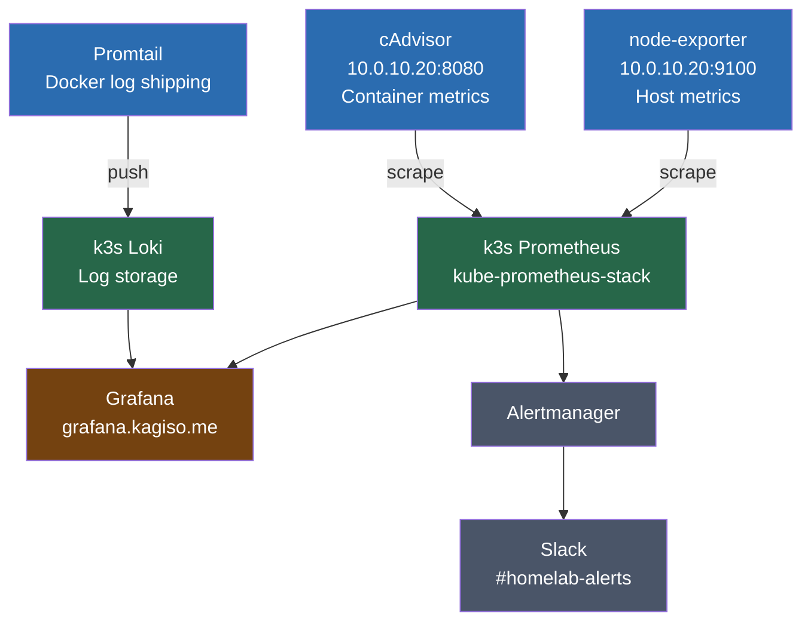

# 05 — Monitoring Integration
## Connecting the Docker Host to the k3s Observability Stack

**Author:** Kagiso Tjeane
**Difficulty:** ?????????? (3/10)
**Guide:** 05 of 06

> A platform that cannot be observed cannot be operated.
>
> The media stack is running. Traffic is flowing through Nginx Proxy Manager. But knowing
> containers are "up" is not the same as knowing the system is healthy. This guide connects
> the Docker host to the k3s cluster's existing observability stack — giving you host metrics,
> container telemetry, and log aggregation without duplicating infrastructure.

---

## Why Monitoring Matters for the Media Stack

The failure modes of a media server are rarely dramatic. Services degrade quietly.

Without observability you only find out something is wrong when it stops working entirely:

- SABnzbd fills `/srv` to 100% and silently stops downloading — you notice when nothing has appeared in Jellyfin for three days
- Sonarr's download queue stalls because the connection to SABnzbd timed out — nothing failed, it just stopped
- Nginx Proxy Manager's Let's Encrypt cert expired — users get browser security warnings with no logged error you can easily find
- The nightly backup script failed because the NFS mount dropped — you discover this during a disaster recovery event

With the observability stack connected, the same scenarios look different:

- An alert fires 4 hours before `/srv` fills, triggered by a `predict_linear()` query in Prometheus
- A Grafana panel in the k3s cluster shows the Sonarr job queue depth climbing while download count stays flat
- NPM certificate expiry is visible as a metric days before it becomes a user-facing problem
- A `backup_last_success_timestamp{job="docker-appdata"}` metric goes stale at 25h and fires a Slack alert before you go to bed

Observability turns reactive firefighting into proactive operations. The k3s cluster already has
Prometheus, Grafana, Loki, and Alertmanager fully deployed via kube-prometheus-stack. Rather than
running a duplicate monitoring stack on this host, we integrate into it: the Docker host runs
three lightweight exporters that the cluster scrapes and ingests. Single pane of glass; no
redundant infrastructure to maintain.

---

## Architecture

The Docker host (10.0.10.20) runs three exporters. The k3s cluster's Prometheus scrapes the
metrics endpoints directly over the LAN. Promtail pushes Docker container logs to the cluster's
Loki instance. Dashboards, alert rules, and log search all live in Grafana on the k3s cluster.

```
Docker Host (10.0.10.20)
+-- node-exporter  :9100  ---- scrape ------? k3s Prometheus (kube-prometheus-stack)
+-- cAdvisor       :8080  ---- scrape ------?         ¦
+-- Promtail              ---- push -------? k3s Loki ?
                                                Grafana (grafana.kagiso.me)
                                                   ¦
                                             Alertmanager
                                                   ¦
                                          Slack #homelab-alerts
```



### Component Roles

| Component | Role | Location | Port |
|-----------|------|----------|------|
| node-exporter | Exposes host-level metrics: CPU, memory, disk, network, NFS mounts | Docker host | 9100 (host network) |
| cAdvisor | Exposes per-container resource metrics | Docker host | 8080 |
| Promtail | Tails Docker container logs and pushes to Loki | Docker host | 9080 (readiness only) |
| Prometheus | Scrapes and stores all time-series metrics | k3s cluster | — |
| Loki | Stores and indexes log streams | k3s cluster | 3100 |
| Grafana | Dashboards, log explorer, alert rules | k3s cluster | 443 (grafana.kagiso.me) |
| Alertmanager | Routes alerts to Slack | k3s cluster | — |

---

## Why Exporters Only — Not a Local Prometheus

A natural question: why not just run Prometheus locally on the Docker host as before?

The k3s cluster already has a fully configured Prometheus with storage, retention, Alertmanager
integration, and Grafana dashboards. Adding a second Prometheus on the Docker host would mean:

- Two Prometheus instances to upgrade, maintain, and back up
- Alert rules defined in two places, potentially diverging
- Two Grafana instances — or complex cross-datasource federation
- Additional memory and CPU burden on the Docker host for no operational gain

The exporters-only model is the correct architectural choice once a cluster-grade observability
stack exists. The Docker host is a compute resource. Observability is a platform concern.

| Consideration | Local stack (decommissioned) | Exporters only (current) |
|---------------|------------------------------|--------------------------|
| Memory footprint | ~600 MB (Prometheus + Grafana + Loki + Alertmanager) | ~60 MB (three exporters) |
| Maintenance surface | 4+ containers to update, 4+ configs to manage | 3 containers, 1 config file |
| Alert rules | Duplicated from k3s | Single source of truth in k3s |
| Dashboards | Separate Grafana instance | Shared Grafana in k3s |
| Log search | Local Loki only | Unified across cluster + Docker host |
| Single pane of glass | No — two Grafanas | Yes — one Grafana for everything |

---

## Pre-requisites

Before working through this guide, the following must be true:

1. **k3s cluster is running** with kube-prometheus-stack deployed (see k3s Guide 09 — Observability).

2. **k3s Prometheus is configured to scrape the Docker host.** The scrape targets live in the
   HelmRelease at `platform/observability/kube-prometheus-stack/helmrelease.yaml` under
   `additionalScrapeConfigs`. Verify it contains entries for `10.0.10.20:9100` and `10.0.10.20:8080`.

   ```bash
   # From the repo root — confirm the scrape targets are present
   grep -A 5 "docker-vm" platform/observability/kube-prometheus-stack/helmrelease.yaml
   ```

3. **Network reachability.** The Docker host at `10.0.10.20` must be reachable from the k3s
   nodes on ports `9100` and `8080`. These are LAN-internal addresses; no external routing is
   required. If UFW is active on the Docker host, the firewall rule is in
   [Guide 02 — Host Installation & Hardening](./01_host_installation_and_hardening.md).

4. **k3s Loki endpoint is known.** You will need the Loki service address to configure Promtail.
   Retrieve it from the cluster:

   ```bash
   kubectl get svc -n monitoring loki
   # Note the CLUSTER-IP or LoadBalancer EXTERNAL-IP and port (typically 3100)
   ```

---

## Step 1 — Prepare the Textfile Collector Directory

Node Exporter's textfile collector allows any script on the host to export custom Prometheus
metrics by writing `.prom` format files into a watched directory. This is how the backup script
reports its success timestamp to Prometheus — without running a separate exporter.

```bash
sudo mkdir -p /var/lib/node_exporter/textfile_collector

# Attempt to chown to the node_exporter system user if it exists (created by the
# node_exporter deb package). The container reads the directory as root, so this
# is belt-and-suspenders — the || true prevents the command from failing if the
# user does not exist on this system.
sudo chown node_exporter:node_exporter /var/lib/node_exporter/textfile_collector 2>/dev/null || true
sudo chmod 755 /var/lib/node_exporter/textfile_collector
```

Verify the directory exists:

```bash
ls -ld /var/lib/node_exporter/textfile_collector
# Expected: drwxr-xr-x ... /var/lib/node_exporter/textfile_collector
```

The compose file mounts this directory into the node-exporter container as read-only. Node
Exporter reads any `.prom` file it finds there and exposes the metrics under the `node_`
namespace automatically. The backup script (Guide 06) writes here on every successful run.

---

## Step 2 — Configure Promtail

Promtail uses Docker service discovery to automatically detect and tail every container running
on the host. Its configuration must exist on disk before the monitoring stack is started.

### 2a — Create the Promtail config directory

```bash
sudo mkdir -p /srv/docker/appdata/promtail
```

### 2b — Get the Loki endpoint

Promtail pushes logs directly to Loki's HTTP API. You need the Loki service address from the
k3s cluster. Run this from any machine with `kubectl` access to the cluster:

```bash
kubectl get svc -n monitoring loki
```

Look for either:
- The `CLUSTER-IP` — use this if Promtail can reach the cluster's pod network (generally not
  the case from a Docker host outside the cluster)
- The `EXTERNAL-IP` or LoadBalancer IP — use this if Loki has a LoadBalancer service type
- A NodePort — use any k3s node IP + the NodePort

The most reliable option for a Docker host outside the cluster is a `LoadBalancer` IP or a
static `NodePort`. If you are using MetalLB in the k3s cluster, Loki will have a dedicated IP.

```bash
# Example: if Loki's LoadBalancer IP is 10.0.10.200:
# http://10.0.10.200:3100/loki/api/v1/push
```

### 2c — Write the Promtail configuration

```bash
sudo nano /srv/docker/appdata/promtail/promtail-config.yml
```

Paste the following, replacing `<loki-endpoint>` with the address obtained above:

```yaml
server:
  http_listen_port: 9080
  grpc_listen_port: 0

positions:
  filename: /tmp/positions.yaml

clients:
  - url: http://<loki-endpoint>:3100/loki/api/v1/push
    # Replace <loki-endpoint> with the k3s Loki service IP or hostname.
    # Example: http://10.0.10.200:3100/loki/api/v1/push
    # Get it: kubectl get svc -n monitoring loki

scrape_configs:

  # Docker container logs — auto-discovered via the Docker socket.
  # Each container gets labelled with its name, compose project, and compose service.
  - job_name: docker
    docker_sd_configs:
      - host: unix:///run/docker.sock
        refresh_interval: 5s
    relabel_configs:
      # Strip the leading slash from container names (/plex ? plex)
      - source_labels: [__meta_docker_container_name]
        regex: '/(.*)'
        target_label: container
      # Label by compose project (e.g. media-stack, monitoring-exporters)
      - source_labels: [__meta_docker_container_label_com_docker_compose_project]
        target_label: compose_project
      # Label by compose service name (e.g. jellyfin, sonarr)
      - source_labels: [__meta_docker_container_label_com_docker_compose_service]
        target_label: compose_service
      # Log stream (stdout / stderr)
      - source_labels: [__meta_docker_container_log_stream]
        target_label: stream
      # Stamp all Docker logs with a consistent job label for LogQL filtering
      - target_label: job
        replacement: docker
      # Stamp the host so logs from multiple hosts can be distinguished in Loki
      - target_label: host
        replacement: docker-vm
```

Save the file. The compose file bind-mounts this path at
`/etc/promtail/promtail-config.yml` inside the container.

> **Note on Docker socket path:** The compose file mounts `/run/docker.sock` (not
> `/var/run/docker.sock`). On modern Ubuntu, `/var/run` is a symlink to `/run`, so both
> paths are equivalent. The config above uses `/run/docker.sock` to match the compose
> mount exactly.

---

## Step 3 — Deploy the Monitoring Exporters Stack

The compose file is already present in the repository at `docker/compose/monitoring-stack.yml`.
Deploy it from the standard stacks location:

```bash
cd /srv/docker
docker compose -f compose/monitoring-stack.yml up -d
```

This starts three containers:
- `node-exporter` — runs on host network, exposes metrics on port 9100
- `cadvisor` — runs in privileged mode, exposes metrics on port 8080
- `promtail` — reads the Docker socket, pushes logs to k3s Loki

Expected output:

```
[+] Running 3/3
 ? Container node-exporter  Started
 ? Container cadvisor       Started
 ? Container promtail       Started
```

---

## Step 4 — Verify Exporters Are Running

### 4a — Confirm all three containers are up

```bash
docker ps --format "table {{.Names}}\t{{.Status}}\t{{.Ports}}"
```

Expected (all three should be `Up` or `Up (healthy)`):

```
NAMES            STATUS                    PORTS
node-exporter    Up 2 minutes (healthy)
cadvisor         Up 2 minutes (healthy)    0.0.0.0:8080->8080/tcp
promtail         Up 2 minutes (healthy)
```

`node-exporter` has no `PORTS` column entry because it runs on the host network — it binds
directly to `0.0.0.0:9100` on the host interface without a Docker port mapping.

### 4b — Test the node-exporter endpoint

```bash
curl -s http://localhost:9100/metrics | head -20
```

Expected: a stream of Prometheus metric lines beginning with `# HELP` and `# TYPE` followed
by `node_` prefixed metric names. The first few lines will look like:

```
# HELP go_gc_duration_seconds A summary of the pause duration of garbage collection cycles.
# TYPE go_gc_duration_seconds summary
go_gc_duration_seconds{quantile="0"} ...
...
# HELP node_boot_time_seconds Node boot time, in unixtime.
# TYPE node_boot_time_seconds gauge
node_boot_time_seconds 1718000000
```

### 4c — Test the cAdvisor endpoint

```bash
curl -s http://localhost:8080/metrics | head -20
```

Expected: metric lines prefixed with `container_` and `machine_`.

```bash
# Also verify the cAdvisor web UI loads
curl -s http://localhost:8080/healthz
# Expected: ok
```

### 4d — Test Promtail readiness

```bash
curl -s http://localhost:9080/ready
# Expected: ready
```

Check Promtail logs to confirm it connected to Loki and is discovering containers:

```bash
docker logs promtail --tail 30
```

Look for lines like:

```
level=info msg="Starting Promtail" version=...
level=info component=discovery.manager msg="Starting provider" provider=docker/0 ...
level=info component=client host=<loki-endpoint>:3100 msg="Sending batch" ...
```

If you see `level=error` lines with connection refused or timeout, the Loki endpoint in the
config file is wrong — revisit Step 2b.

---

## Step 5 — Verify Prometheus Is Scraping the Docker Host

This verification must be done from the k3s cluster side. The Prometheus UI shows whether
the Docker host scrape targets are reachable and returning metrics.

### 5a — Access the Prometheus UI via port-forward

From a machine with `kubectl` access to the k3s cluster (e.g. on `varys`):

```bash
kubectl -n monitoring port-forward svc/kube-prometheus-stack-prometheus 9090:9090
```

Then open `http://localhost:9090/targets` in a browser.

### 5b — Confirm Docker host targets are UP

In the Prometheus targets page, look for the jobs that scrape the Docker host. These are
defined in `additionalScrapeConfigs` in the HelmRelease and will be named something like
`docker-vm-node-exporter` and `docker-vm-cadvisor`.

Both targets must show **State: UP**.

If a target shows **State: DOWN**, the error message beneath it will indicate the cause:

| Error message | Cause | Fix |
|---------------|-------|-----|
| `dial tcp 10.0.10.20:9100: connect: connection refused` | node-exporter container not running | `docker ps \| grep node-exporter`; restart if missing |
| `dial tcp 10.0.10.20:9100: i/o timeout` | Firewall blocking the port | `sudo ufw allow from 10.0.10.0/24 to any port 9100,8080` on the Docker host |
| `dial tcp 10.0.10.20:8080: connect: connection refused` | cAdvisor container not running | `docker logs cadvisor` |

### 5c — Confirm metrics are flowing

In the Prometheus UI, navigate to **Graph** and run:

```promql
node_memory_MemTotal_bytes{instance="10.0.10.20:9100"}
```

This should return a single value equal to the Docker host's total RAM (e.g. `16977346560`
for 16 GB). If it returns no results, the scrape is not reaching node-exporter.

```promql
container_memory_usage_bytes{instance="10.0.10.20:8080", name="jellyfin"}
```

This should return the current memory usage for the jellyfin container. If it returns no
results, cAdvisor is not being scraped successfully.

---

## Step 6 — Verify Logs Are Arriving in Loki

Open Grafana at `https://grafana.kagiso.me` (k3s cluster).

### 6a — Navigate to Explore

In the left sidebar: **Explore** ? select **Loki** as the data source.

### 6b — Run a basic label filter query

In the log browser, set:
- Label filter: `job` = `docker`

Or switch to code mode and enter:

```logql
{job="docker"}
```

Log lines from all running Docker containers on the host should appear within a few seconds.
Set the time range to **Last 5 minutes** if you do not see results immediately.

### 6c — Query a specific container

```logql
{job="docker", container="jellyfin"}
```

```logql
{job="docker", container="sonarr"}
```

```logql
{job="docker", container="sabnzbd"}
```

### 6d — Useful LogQL queries for the media stack

```logql
# All error-level lines from any Docker container on this host
{job="docker"} |= "error"

# SABnzbd warnings and errors
{job="docker", container="sabnzbd"} |~ "(WARNING|ERROR)"

# Failed download events (Sonarr/Radarr)
{job="docker", container=~"sonarr|radarr"} |= "failed"

# Nginx Proxy Manager 4xx responses
{job="docker", container="nginx-proxy-manager"} |= " 40"

# Jellyfin transcoding activity
{job="docker", container="jellyfin"} |= "transcode"

# Any container that logged "OOMKilled" or "killed" (out of memory)
{job="docker"} |~ "(OOMKilled|killed)"

# Log volume rate by container — spot containers flooding logs (crash loop symptom)
sum by (container) (rate({job="docker"}[5m]))
```

If no results appear in step 6b:

1. Check Promtail is running and healthy: `curl -s http://localhost:9080/ready`
2. Check Promtail logs for connection errors: `docker logs promtail --tail 30`
3. Confirm the Loki URL in `/srv/docker/appdata/promtail/promtail-config.yml` is correct
4. Verify Promtail can reach Loki: `curl -s http://<loki-endpoint>:3100/ready`

---

## Step 7 — Verify Alerts Are Configured

The k3s kube-prometheus-stack Prometheus evaluates alert rules for the Docker host. These
rules reference the metrics scraped from `10.0.10.20:9100` (node-exporter) and
`10.0.10.20:8080` (cAdvisor).

Confirm the alert rules exist and are loaded:

```bash
# From a machine with kubectl access
kubectl -n monitoring port-forward svc/kube-prometheus-stack-prometheus 9090:9090
# Open http://localhost:9090/alerts in a browser
```

You should see alert rules covering disk usage on `/srv`, NFS mount availability, high CPU,
high memory, container restarts, and backup staleness. These are evaluated on every
`evaluation_interval` in the HelmRelease configuration.

If an alert rule is firing (shown in red), investigate immediately using the `description`
annotation — it includes the exact diagnostic command to run.

---

## Custom Metrics via the Textfile Collector

The textfile collector directory (`/var/lib/node_exporter/textfile_collector/`) is a
first-class integration point between host shell scripts and Prometheus.

Any script can write a `.prom` format file into this directory and node-exporter will expose
those metrics on the next scrape — no exporter process, no network port, no configuration
change required.

### How the backup script uses this

The backup script in [Guide 07 — Backups & Disaster Recovery](./05_backups_and_disaster_recovery.md)
writes a standard metric set on every run. This keeps alerting and dashboards generic across backup jobs.

```bash
# Snippet from backup_docker.sh
cat > /var/lib/node_exporter/textfile_collector/docker_backup.prom <<EOF
# HELP backup_job_status 1 = last run succeeded, 0 = failed.
# TYPE backup_job_status gauge
backup_job_status{job="docker-appdata"} 1
# HELP backup_last_success_timestamp Unix timestamp of last successful backup.
# TYPE backup_last_success_timestamp gauge
backup_last_success_timestamp{job="docker-appdata"} $(date +%s)
# HELP backup_size_bytes Size of last backup archive in bytes.
# TYPE backup_size_bytes gauge
backup_size_bytes{job="docker-appdata"} $(stat -c%s "$BACKUP_FILE")
# HELP backup_duration_seconds Duration of last backup run in seconds.
# TYPE backup_duration_seconds gauge
backup_duration_seconds{job="docker-appdata"} $DURATION
# HELP backup_failures_total Cumulative count of failed backup runs.
# TYPE backup_failures_total counter
backup_failures_total{job="docker-appdata"} 0
EOF
```
### Alert that fires when the backup goes stale

Defined in the kube-prometheus-stack HelmRelease:

```yaml
- alert: DockerBackupTooOld
  expr: time() - backup_last_success_timestamp{job="docker-appdata"} > 90000
  for: 0m
  labels:
    severity: critical
  annotations:
    summary: "Docker host backup is {{ $value | humanizeDuration }} old (threshold: 25h)"
    description: "Check: sudo journalctl -u docker-backup -n 50"
```

This alert fires when the last successful Docker backup is older than 25 hours. A separate
`DockerBackupMissing` alert covers the case where no metric has ever been written.

### Verify the textfile collector is working

After running the backup script at least once:

```bash
# Check the .prom file was written
cat /var/lib/node_exporter/textfile_collector/docker_backup.prom

# Confirm node-exporter is exposing the metric
curl -s http://localhost:9100/metrics | grep backup_.*docker-appdata
```

Expected:

```
# HELP backup_job_status 1 = last run succeeded, 0 = failed.
# TYPE backup_job_status gauge
backup_job_status{job="docker-appdata"} 1
# HELP backup_last_success_timestamp Unix timestamp of last successful backup.
# TYPE backup_last_success_timestamp gauge
backup_last_success_timestamp{job="docker-appdata"} 1718000000
# HELP backup_size_bytes Size of last backup archive in bytes.
# TYPE backup_size_bytes gauge
backup_size_bytes{job="docker-appdata"} 2147483648
```

---

## Useful PromQL Queries

These queries are useful in Grafana's Explore view (Prometheus data source) or when
port-forwarding to Prometheus directly.

```promql
# Which Docker containers are consuming the most memory right now?
topk(5, container_memory_usage_bytes{instance="10.0.10.20:8080", name!=""})

# Is the NFS /mnt/media mount healthy? (non-zero = healthy)
node_filesystem_avail_bytes{instance="10.0.10.20:9100", mountpoint=~"/mnt/.*"}

# How many hours until /srv fills at the current rate?
predict_linear(
  node_filesystem_avail_bytes{instance="10.0.10.20:9100", mountpoint="/srv"}[6h], 3600 * 24
) / 1024 / 1024 / 1024

# Container restart rate over the last hour (crashes per hour per container)
rate(container_start_time_seconds{instance="10.0.10.20:8080", name!=""}[1h]) * 3600

# Current CPU load by container, highest first
sort_desc(
  sum by (name) (
    rate(container_cpu_usage_seconds_total{instance="10.0.10.20:8080", name!=""}[5m])
  ) * 100
)

# How old is the most recent backup, in hours?
(time() - backup_last_success_timestamp{job="docker-appdata"}) / 3600

# Memory headroom on the Docker host (in GB)
node_memory_MemAvailable_bytes{instance="10.0.10.20:9100"} / 1024 / 1024 / 1024

# SABnzbd current download bandwidth (Mbps)
rate(container_network_receive_bytes_total{instance="10.0.10.20:8080", name="sabnzbd"}[1m]) * 8 / 1000000

# Which containers are currently running? (seen by cAdvisor)
count by (name) (container_last_seen{instance="10.0.10.20:8080", name!=""})

# Top 5 containers by disk read rate
topk(5, rate(container_fs_reads_bytes_total{instance="10.0.10.20:8080", name!=""}[5m]))
```

---

## Troubleshooting Reference

| Symptom | Likely cause | Resolution |
|---------|-------------|------------|
| Prometheus shows docker-vm-node-exporter target as DOWN | Firewall blocking port 9100 from k3s nodes | `sudo ufw allow from 10.0.10.0/24 to any port 9100,8080 proto tcp` on the Docker host |
| cAdvisor target DOWN but node-exporter UP | cAdvisor container not running or unhealthy | `docker logs cadvisor --tail 30`; check privileged mode is enabled |
| No Docker logs in Loki | Promtail config has wrong Loki URL | `docker logs promtail --tail 30`; check the URL in `/srv/docker/appdata/promtail/promtail-config.yml` |
| Promtail ready returns unhealthy | Promtail cannot parse config file | `docker logs promtail --tail 10`; validate YAML syntax in promtail-config.yml |
| Promtail can't read container logs | Docker socket permission or wrong mount path | Verify `/run/docker.sock` is accessible: `ls -la /run/docker.sock`; check compose volume mount |
| Logs appear in Loki but containers are unlabelled | Relabel configs not matching Docker labels | Verify containers are started by Docker Compose (labels only present on compose-managed containers) |
| `node_` metrics missing NFS mount | NFS mount not present when node-exporter started | Verify mount: `df -h /mnt/media`; remount if missing; restart node-exporter |
| Backup metric not present in Prometheus | Backup script has never run or textfile dir not mounted | Run backup script manually; check `ls /var/lib/node_exporter/textfile_collector/` |
| node-exporter shows wrong total RAM | Container reading `/proc` from namespace instead of host | Verify compose has `pid: host` and correct procfs volume mounts |
| cAdvisor shows no per-container metrics | cgroup mounts missing | Verify `/sys`, `/var/lib/docker`, `/dev/disk` volumes in compose |

---

## Exit Criteria

This guide is complete when all of the following are true:

```
? node-exporter container running — curl http://localhost:9100/metrics returns node_ metrics
? cAdvisor container running — curl http://localhost:8080/healthz returns "ok"
? Promtail container running — curl http://localhost:9080/ready returns "ready"
? Promtail logs show successful pushes to k3s Loki (no connection errors)
? k3s Prometheus targets page: docker-vm-node-exporter shows State: UP
? k3s Prometheus targets page: docker-vm-cadvisor shows State: UP
? Grafana Explore (Loki): {job="docker"} returns log lines from running containers
? Grafana Explore (Prometheus): node_memory_MemTotal_bytes{instance="10.0.10.20:9100"} returns host RAM
? Textfile collector directory exists: /var/lib/node_exporter/textfile_collector/
? Alert rules for docker host visible and loaded in k3s Prometheus /alerts page
```

Do not move on to Guide 06 until every item above is confirmed.

---

## Navigation

| | Guide |
|---|---|
| ? Previous | [04 — Media Stack & Reverse Proxy](./03_media_stack_and_reverse_proxy.md) |
| Current | **05 — Monitoring Integration** |
| ? Next | [06 — Application Configuration](./06_application_configuration.md) |
