# 07 — Backups & Disaster Recovery
## Protecting the Platform from Catastrophic Failure

**Author:** Kagiso Tjeane
**Difficulty:** ?????????? (6/10)
**Guide:** 07 of 07

> A backup strategy that has never been tested is not a backup strategy. It is a hope.
>
> This final guide ensures that if the Docker host fails tomorrow, the entire platform can be restored in under 90 minutes — without relying on memory or undocumented tribal knowledge.

---

# Backup Strategy Overview

The Docker platform uses a four-layer backup strategy, mirroring the approach used by the Kubernetes cluster.


```
Layer 1 — Git             Compose files, scripts, config templates   Always current (automatic)
Layer 2 — appdata         /srv/docker/appdata ? TrueNAS              Daily 02:00, 7-day retention
Layer 3 — Media library   TrueNAS ZFS snapshots                      Hourly/daily/weekly
Layer 4 — Offsite         TrueNAS ? Backblaze B2                     Nightly, 30-day retention
```

These layers are independent. A failure at any layer can be recovered without affecting the others.

---

# What Must Be Protected

## What IS backed up

Everything in `/srv/docker/appdata/` — the entire application state of the platform:

| Directory | Contents | Size (approx) |
|-----------|---------|--------------|
| `appdata/plex/` | Metadata, watched status, user settings, artwork cache | 500MB–2GB |
| `appdata/sonarr/` | Series database, episode history, quality profiles | 50–200MB |
| `appdata/radarr/` | Movie database, history, quality profiles | 50–200MB |
| `appdata/prowlarr/` | Indexer configuration, history | 10–50MB |
| `appdata/sabnzbd/` | Download history, settings, API keys | 10–50MB |
| `appdata/overseerr/` | Request history, user accounts, settings | 10–50MB |
| `appdata/npm/` | Proxy host configs, SSL certificates | 10–50MB |

**Total: typically 1–5GB**, small enough to copy to TrueNAS in seconds.

## What is NOT backed up (and why)

| Data | Location | Why it's safe |
|------|---------|---------------|
| Media library | `/mnt/media` (TrueNAS NFS) | Lives on TrueNAS — protected by ZFS snapshots. Never touches the Docker host disk. |
| Prometheus TSDB | n/a — not running on Docker host | Metrics scraped by k3s Prometheus. No local TSDB to back up. |
| Download temp files | `/srv/downloads/incomplete/` | Temporary — safe to lose. SABnzbd will re-queue from NZB history. |
| Installed packages | OS-level | Reproduced by re-running Ubuntu + Docker setup guides. |
| Compose files | `/srv/docker/stacks/` | In Git — always current. |

---

# Layer 2 — Automated appdata Backup

## Backup script

Create the script on the Docker host:

```bash
sudo install -d -m 755 /srv/docker/scripts
sudo cp docker/scripts/backup_docker.sh /srv/docker/scripts/backup_docker.sh
sudo chmod 755 /srv/docker/scripts/backup_docker.sh
```

The canonical script lives in the repo at [`docker/scripts/backup_docker.sh`](../scripts/backup_docker.sh).
Copy that version onto the host rather than retyping it from the guide. The script:

- backs up `/srv/docker/appdata` to `/mnt/archive/backups/docker`
- writes logs to `/var/log/docker-backup.log`
- enforces 7-day retention
- emits the standard backup metrics used across the platform:
  - `backup_job_status{job="docker-appdata"}`
  - `backup_last_success_timestamp{job="docker-appdata"}`
  - `backup_size_bytes{job="docker-appdata"}`
  - `backup_duration_seconds{job="docker-appdata"}`
  - `backup_failures_total{job="docker-appdata"}`

Make the script executable and run a test:
```bash
sudo chmod +x /srv/docker/scripts/backup_docker.sh
sudo /srv/docker/scripts/backup_docker.sh
tail -20 /var/log/docker-backup.log
```

The script:

- Verifies the TrueNAS NFS mount is available before doing anything
- Creates a timestamped gzipped tar of `/srv/docker/appdata/`
- Applies 7-day retention — deletes archives older than 7 days
- Logs all output with timestamps to `/var/log/docker-backup.log`
- Writes Prometheus textfile metrics for status, age, size, duration, and failure count

## Schedule via cron

```bash
sudo crontab -e
```

Add:

```
# Docker appdata backup — daily at 02:00
0 2 * * * /srv/docker/scripts/backup_docker.sh >> /var/log/docker-backup.log 2>&1
```

Verify:

```bash
sudo crontab -l | grep backup
```

Runs at **02:00 daily**.

## Verify a backup ran

```bash
# Check the log
tail -20 /var/log/docker-backup.log

# List archives on TrueNAS — expect 7 files after first week
ls -lth /mnt/archive/backups/docker/ | head -10
```

Expected output:

```
docker_appdata_2026-03-14_020001.tar.gz   2.1G
docker_appdata_2026-03-13_020001.tar.gz   2.0G
...
```

---

# Layer 2 — Backup Monitoring

The backup script writes Prometheus metrics to the node_exporter textfile collector:

```
/var/lib/node_exporter/textfile_collector/docker_backup.prom
```

Metrics:
- `backup_job_status{job="docker-appdata"}` — `1` when the most recent run succeeded, `0` when it failed
- `backup_last_success_timestamp{job="docker-appdata"}` — Unix timestamp of the most recent successful backup
- `backup_size_bytes{job="docker-appdata"}` — size of the most recent archive
- `backup_duration_seconds{job="docker-appdata"}` — duration of the most recent run
- `backup_failures_total{job="docker-appdata"}` — cumulative failure counter

These metrics are scraped by the k3s Prometheus instance via `additionalScrapeConfigs` targeting the Docker host's node-exporter endpoint.

## Grafana alert rule

Create a Grafana alert to fire if no backup has run in 25 hours:

```
Alert: DockerBackupTooOld
Condition: time() - backup_last_success_timestamp{job="docker-appdata"} > 90000
For: 5m
Severity: critical
Message: Docker appdata backup has not run in over 25 hours
```

This fires before the next 24-hour window closes, giving time to investigate.

---

# Layer 3 — Media Library (TrueNAS ZFS Snapshots)

Media files live on TrueNAS and are never on the Docker host. ZFS protects them independently.

Configure in TrueNAS UI: **Data Protection ? Periodic Snapshot Tasks**

| Dataset | Schedule | Retention |
|---------|---------|-----------|
| `tera/media` | Hourly | 24 hours |
| `tera/media` | Daily | 30 days |
| `tera/media` | Weekly | 12 weeks |
| `tera/downloads` | Daily | 7 days |

Even an `rm -rf /mnt/media/movies/*` can be recovered instantly from the most recent ZFS snapshot — no TrueNAS hardware failure required.

---

# Layer 4 — Offsite (Backblaze B2)

TrueNAS Cloud Sync replicates `/mnt/archive/backups/docker/` to Backblaze B2 nightly.

This protects against total TrueNAS hardware loss. Configuration is documented in [truenas/docs/backblaze-sync.md](../../truenas/docs/backblaze-sync.md).

---

# Retention Policy

| Backup type | Location | Retention |
|-------------|---------|-----------|
| appdata daily archives | TrueNAS NFS | 7 days |
| appdata offsite copies | Backblaze B2 | 30 days |
| Media ZFS snapshots — hourly | TrueNAS | 24 hours |
| Media ZFS snapshots — daily | TrueNAS | 30 days |
| Media ZFS snapshots — weekly | TrueNAS | 12 weeks |

---

# Disaster Recovery Procedure

**Target RTO: 45–90 minutes** from bare metal to all services running.

```mermaid
sequenceDiagram
    participant E as Engineer
    participant H as Docker Host (new)
    participant TN as TrueNAS (NFS)
    participant G as GitHub

    E->>H: Step 1 — Reinstall Ubuntu Server (~15 min)
    E->>H: Step 2 — Run Guide 02 (SSH, UFW, Fail2Ban) (~10 min)
    E->>H: Step 3 — Run Guide 03 (Docker, mounts) (~10 min)
    E->>TN: Step 4 — Mount NFS backup share
    TN-->>H: Step 5 — Restore appdata archive (~5 min)
    E->>G: Step 6 — Clone this repository
    E->>H: Step 7 — Deploy stacks from compose files (~10 min)
    E->>H: Step 8 — Verify all services healthy (~10 min)
```



## Step-by-step procedure

**Step 1 — Reinstall Ubuntu Server** (~15 min)

Follow [Guide 01 — Host Installation & Hardening](./01_host_installation_and_hardening.md).

Configure the same static IP: `10.0.10.20`. During Ubuntu installation, enable OpenSSH Server.

**Step 2 — Install Docker and create directories** (~10 min)

Follow [Guide 02 — Docker Installation & Filesystem](./02_docker_installation_and_filesystem.md).

Recreate the directory structure:

```bash
sudo mkdir -p /srv/docker/{stacks,appdata,scripts}
sudo mkdir -p /srv/downloads/{incomplete,complete}
sudo mkdir -p /mnt/{media,downloads,archive/backups/docker}
sudo chown -R kagiso:docker /srv/docker /srv/downloads
```

**Step 3 — Mount NFS shares** (~5 min)

```bash
sudo apt install -y nfs-common
```

Add to `/etc/fstab`:

```
10.0.10.80:/mnt/tera                    /mnt/media                   nfs  defaults,_netdev,nofail  0  0
10.0.10.80:/mnt/tera                /mnt/downloads               nfs  defaults,_netdev,nofail  0  0
10.0.10.80:/mnt/archive/backups/docker       /mnt/archive/backups/docker nfs  defaults,_netdev,nofail  0  0
```

```bash
sudo mount -a
df -h | grep -E "media|downloads|backups"
```

All three mounts must show as active before proceeding.

**Step 4 — Restore appdata from TrueNAS** (~10 min)

Identify the most recent archive:

```bash
ls -lht /mnt/archive/backups/docker/ | head -5
```

Restore it (archives use absolute paths — extract to `/`):

```bash
ARCHIVE=$(ls -t /mnt/archive/backups/docker/docker_appdata_*.tar.gz | head -1)
echo "Restoring: ${ARCHIVE}"
sudo tar -xzf "${ARCHIVE}" -C /
sudo chown -R kagiso:docker /srv/docker/appdata
```

Verify:

```bash
ls /srv/docker/appdata/
# Expected: sonarr  radarr  plex  prowlarr  npm  ...
```

**Step 5 — Clone repository and deploy compose stacks** (~10 min)

```bash
git clone https://github.com/<your-repo>/homelab-infrastructure /tmp/homelab-infra
cp /tmp/homelab-infra/docker/compose/*.yml /srv/docker/stacks/
cp /tmp/homelab-infra/docker/scripts/*.sh /srv/scripts/
sudo chmod +x /srv/scripts/*.sh

# Create Docker network
docker network create media-net

# Deploy in order: proxy first, then media, then exporters
docker compose -f /srv/docker/compose/proxy-stack.yml up -d
docker compose -f /srv/docker/compose/media-stack.yml up -d
docker compose -f /srv/docker/compose/exporters-stack.yml up -d
```

**Step 6 — Verify** (~10 min)

```bash
# All containers should be healthy
docker ps --format "table {{.Names}}\t{{.Status}}"

# Check for crash-looping containers
docker ps --filter "status=restarting"

# API health checks
curl -s http://10.0.10.20:8989/ping   # Sonarr ? "OK"
curl -s http://10.0.10.20:7878/ping   # Radarr ? "OK"
curl -s http://10.0.10.20:32400/web   # Plex ? redirect to web UI
```

**Step 7 — Reconfigure Nginx Proxy Manager**

NPM proxy host configs and certificates are restored from appdata. If Let's Encrypt
certificates have expired during the outage, force-renew them in the NPM web UI:
**Proxy Hosts ? Edit ? SSL ? Force SSL / Renew Certificate**.

---

# Disaster Scenarios

| Scenario | Data at risk | Recovery path | RTO |
|----------|------------|--------------|-----|
| Docker host OS corruption | appdata only | Reinstall OS, restore appdata from TrueNAS | 45–60 min |
| Docker host disk failure | appdata only | Replace disk, reinstall, restore from TrueNAS | 60–90 min |
| Accidental `rm -rf /srv/docker/appdata` | appdata | Restore from yesterday's backup on TrueNAS | 15 min |
| Accidental `rm -rf /mnt/media/movies` | media files | Restore from TrueNAS ZFS snapshot | 5 min |
| TrueNAS hardware failure | backups + media | Restore from Backblaze B2, rebuild TrueNAS | 2–4 hours |
| Both Docker host AND TrueNAS lost | everything | Restore from Backblaze B2 to new TrueNAS, rebuild Docker host | 4–8 hours |

---

# Monthly Backup Verification Checklist

Run this checklist monthly. Do not wait for a disaster to discover that backups have been silently failing.

```
? Log shows successful backup within last 24 hours:
    tail -20 /var/log/docker-backup.log

? Archives present on TrueNAS with expected size (> 500 MB):
    ls -lh /mnt/archive/backups/docker/

? Exactly 7 archives present — retention is enforced:
    ls /mnt/archive/backups/docker/ | wc -l

? Prometheus backup metric is recent (timestamp within 25 hours):
    (query backup_last_success_timestamp{job="docker-appdata"} in k3s Grafana)

? Grafana alert DockerBackupTooOld is configured and NOT firing

? TrueNAS ZFS snapshots present for tera/media:
    (TrueNAS UI ? Snapshots, or SSH: zfs list -t snapshot tera/media | tail -5)

? TrueNAS offsite sync to Backblaze B2 completed successfully:
    (TrueNAS UI ? Data Protection ? Cloud Sync Tasks ? last run status)
```

---

# Closing Note

Most homelabs operate without backups until a disaster makes their absence painfully obvious.

This platform is designed differently:

- Every service is containerised — no undocumented system-level changes to track
- Every configuration is persisted in `/srv/docker/appdata` — one directory to protect
- Every compose file is in Git — the deployment is always reproducible from scratch
- Media lives on ZFS — the most resilient filesystem available to a homelab
- Backups are automated, monitored, and alerting — failure is visible before data is lost

If this machine dies tonight, the recovery procedure above restores the full platform
within 90 minutes. That is the goal. That is the standard.

---

# Exit Criteria

Backups are operational when:

? `/srv/docker/scripts/backup_docker.sh` is deployed and executable
? Cron job running at 02:00 daily
? At least one backup archive visible at `/mnt/archive/backups/docker/`
? Backup log at `/var/log/docker-backup.log` shows successful run
? Prometheus metric `backup_last_success_timestamp{job="docker-appdata"}` visible in k3s Grafana
? Grafana alert `DockerBackupTooOld` configured and tested
? TrueNAS ZFS snapshots configured for `tera/media`
? Restore procedure tested at least once on a non-production host

> **Critical:** An untested restore procedure is not a restore procedure. Test the full DR process — at minimum restore a single container's appdata to a test directory and verify the data integrity.

---

## Navigation

| | Guide |
|---|---|
| ? Previous | [06 — Application Configuration](./06_application_configuration.md) |
| Current | **07 — Backups & Disaster Recovery** |
| ? Next | *End of series — Docker platform fully deployed* |
