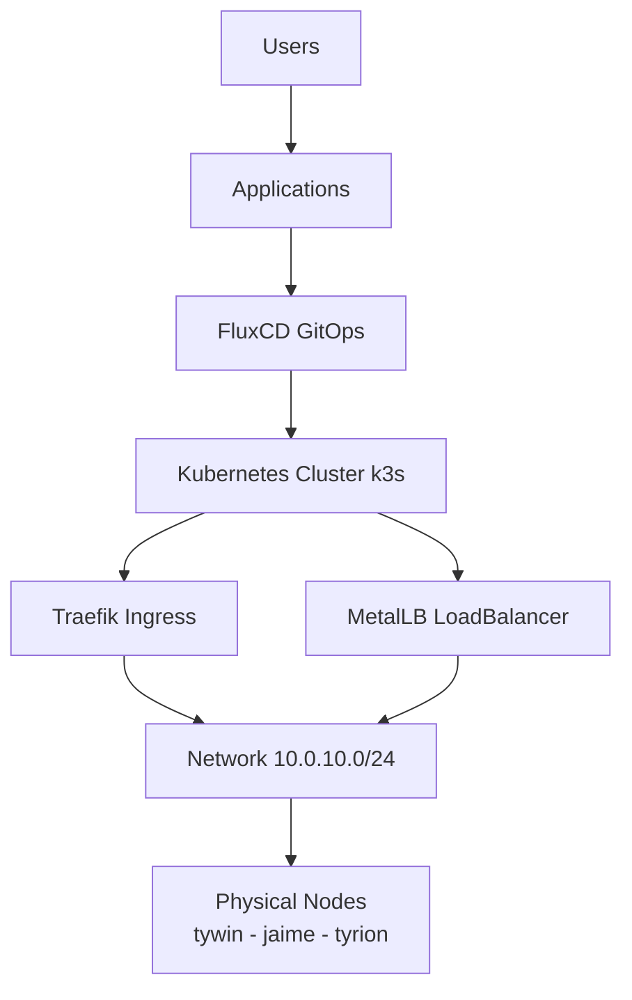
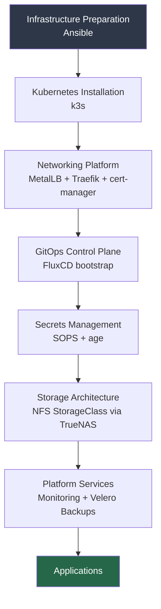

# 00 — Platform Philosophy
## Building a Reliable Kubernetes Platform

**Author:** Kagiso Tjeane
**Difficulty:** ⭐☆☆☆☆☆☆☆☆☆ (1/10)
**Guide:** 00 of 13

> This handbook documents the design, deployment, and operation of a production‑grade Kubernetes homelab platform.
>
> The objective is not experimentation. The objective is **operational excellence**.

---

# Why This Platform Exists

Most homelab Kubernetes environments begin the same way:

1. A cluster is created to experiment with containers.
2. Applications are manually deployed.
3. Infrastructure grows organically.
4. Documentation slowly disappears.
5. Eventually the cluster becomes fragile.

When that moment arrives, rebuilding the cluster becomes painful because:

- configuration is undocumented
- services were installed manually
- networking decisions were never written down
- backups were not considered early enough

This platform exists to **avoid that outcome entirely**.

The design goal is simple:

> The entire platform must be rebuildable from scratch with predictable results.

---

# Core Platform Principles

The platform follows several non‑negotiable principles.

## 1 — Automation First

Infrastructure must never rely on manual configuration.

Cluster provisioning is handled through Ansible. Application deployment is handled through Flux. This ensures that rebuilding the cluster is simply a matter of executing automation.

Infrastructure is therefore **reproducible code**, not undocumented procedures.

---

## 2 — Git Is the Operational API

Application deployment and cluster configuration are managed through **GitOps**.

```
Git commit → Flux reconciliation → cluster state updated
```

All configuration lives in Git. If the cluster ever drifts from the declared configuration, the GitOps controller reconciles it back to the desired state automatically.

This produces an environment where:

- configuration drift is impossible
- deployments are traceable and reversible
- rollback is a `git revert` away

---

## 3 — Secrets Never Reach Git in Plaintext

All sensitive values — API keys, passwords, TLS private keys — are encrypted before being committed to Git using **SOPS + age**.

Flux natively decrypts these files at reconciliation time. The only secret stored outside of Git is the age private key, held in a single Kubernetes Secret on the cluster.

This preserves the GitOps model while meeting the trust requirements of a production platform.

---

## 4 — Observability Is Mandatory

Every platform component must be observable.

The cluster therefore includes:

```
Prometheus  → metrics collection
Grafana     → dashboards and alerting
Loki        → centralized log aggregation
Promtail    → log shipping
```

Operational visibility is essential for diagnosing failures and understanding system behaviour before users report problems.

---

## 5 — Backups Are Part of the Platform

Backups are not an afterthought. The platform protects four independent layers:

```
Layer 1 → Kubernetes manifests     (Git is the backup)
Layer 2 → Cluster state (etcd)     (k3s etcd-snapshot → TrueNAS NFS)
Layer 3 → Persistent volume data   (Velero → TrueNAS NFS)
Layer 4 → Offsite backup           (Backblaze B2 offsite via rclone)
```

Velero provides Kubernetes-native backup and restore of persistent volumes, giving a consistent application-level recovery path. k3s etcd-snapshot provides a point-in-time consistent snapshot of cluster state. Backblaze B2 offsite replication ensures data survives local hardware loss.

Backups run automatically and are visible through monitoring dashboards.

---

# Platform Architecture

The platform is structured as layered infrastructure.



Each layer has a distinct purpose:

| Layer | Responsibility |
|-------|----------------|
| Infrastructure | provisioning and hardening nodes |
| Cluster | container orchestration |
| Networking | service exposure and TLS termination |
| Secrets | encrypted secret management |
| GitOps | configuration lifecycle |
| Observability | metrics, logs, and alerting |
| Applications | workloads |

---

# Platform Components

| Component | Purpose |
|-----------|---------|
| Ansible | infrastructure automation |
| k3s | lightweight Kubernetes distribution |
| MetalLB | LoadBalancer support for bare‑metal |
| Traefik | ingress controller and TLS termination |
| cert-manager | automatic TLS certificate lifecycle |
| FluxCD | GitOps controller |
| SOPS + age | encrypted secret management |
| Prometheus | metrics collection |
| Grafana | metrics visualization and alerting |
| Loki + Promtail | centralized log aggregation |
| Velero | persistent volume backup and restore |
| NFS Subdir Provisioner | dynamic PV provisioning via TrueNAS |
| TrueNAS | centralized NFS storage backend |

Each component was selected based on operational simplicity, reliability, and suitability for a single-operator platform. Architecture Decision Records documenting each technology choice are maintained in `docs/adr/`.

---

# High‑Level Deployment Flow

The cluster is built in several stages. Each stage builds upon the previous one.



---

# Node Topology

```
bran    → 10.0.10.10   Raspberry Pi 3B+ — automation host, self-hosted runner, Pi-hole, cloudflared
tywin   → 10.0.10.11   k3s control-plane
jaime   → 10.0.10.12   k3s worker
tyrion  → 10.0.10.13   k3s worker
docker  → 10.0.10.20   Docker host (bare metal Intel NUC i3-7100U)
truenas → 10.0.10.80   TrueNAS storage
```

Storage is decoupled from compute. All persistent data is backed by **TrueNAS** at `10.0.10.80`. This means nodes are fully disposable — a node can be wiped and rebuilt without data loss.

---

# CI/CD Model

This platform uses a **PR-based validation** workflow. There is no staging cluster. Changes are validated before merge, not by deploying to an intermediate environment.

```
Feature branch → Pull Request → CI validation → Merge to main → Flux reconciles prod
```

CI runs on a self-hosted GitHub Actions runner on `bran` (10.0.10.10), which has LAN access to the production cluster for health checks.

**What CI validates on every PR:**

```
kubeconform      → schema validation of all Kubernetes manifests
kustomize build  → all kustomizations render without error
kubectl dry-run  → server-side dry-run against the live cluster API
pluto            → detect deprecated API versions
```

This approach enforces that only valid, schema-correct manifests reach `main`. Flux watches `main` directly and reconciles immediately on merge.

**Branch protection** on `main` requires all CI checks to pass before merge. No manual approval is required for infrastructure changes — CI is the gate.

---

# Operational Expectations

The following rules must always be respected:

### Rule 1 — Never modify cluster resources manually

Changes must always be made through Git. Manual `kubectl apply` is only acceptable for bootstrapping Flux and the initial age key Secret.

### Rule 2 — Always monitor platform health

Grafana dashboards provide real-time visibility into cluster performance. Alerts fire before failures become user-visible.

### Rule 3 — Test backup restoration

Backups are only valuable if they can be restored. Restoration procedures must be tested against non-production state at least quarterly.

### Rule 4 — Secrets must never be committed in plaintext

All secrets are encrypted with SOPS before being committed. Any accidental plaintext commit must be treated as a key compromise and rotated immediately.

---

# Failure Scenarios

This platform is designed around the assumption that failures will occur:

- node hardware failure
- disk corruption
- network outages
- cluster misconfiguration
- accidental resource deletion

The recovery objective is:

```
Full cluster rebuild 90–120 min
Individual workload recovery < 15 minutes
```

Achieving these objectives requires automation, GitOps configuration, and reliable tested backups.

---

# Documentation Structure

This handbook is organized as three parallel sections.

## Sequential Build Guides

Each guide introduces a new layer of the platform in dependency order.

```
00   — Platform Philosophy            (this document)
00.5 — Infrastructure Prerequisites  (TrueNAS datasets, NFS exports, MinIO, Cloudflare token)
01   — Node Preparation & Hardening
02   — Kubernetes Installation
03   — Secrets Management (SOPS + age)
04   — GitOps Control Plane (FluxCD)
05   — Networking: MetalLB & Traefik
06   — Security: cert-manager & TLS
07   — Namespaces & Cluster Identity
08   — Storage Architecture
09   — Monitoring & Observability
10   — Backups & Disaster Recovery
11   — Platform Upgrade Controller
12   — Applications via GitOps
13   — Platform Operations & Lifecycle
```

## Architecture Reference

Technology decisions and component-level reference documentation.

```
architecture/networking.md          → network design and IP allocation
architecture/storage.md             → storage classes and PV lifecycle
architecture/security.md            → security model and threat surface
adr/                               → Architecture Decision Records
```

## Operational Runbooks

Procedures for specific failure scenarios, tested against real recovery paths.

```
runbooks/cluster-rebuild.md         → full cluster rebuild procedure
runbooks/node-replacement.md        → replace a failed worker node
runbooks/backup-restoration.md      → restore from etcd snapshot + Velero
runbooks/certificate-failure.md     → recover from cert-manager failures
runbooks/alerts/                    → per-alert response procedures
```

---

## Navigation

| | Guide |
|---|---|
| ← Previous | *Start of series* |
| Current | **00 — Platform Philosophy** |
| → Next | [00.5 — Infrastructure Prerequisites](./00.5-Infrastructure-Prerequisites.md) |
