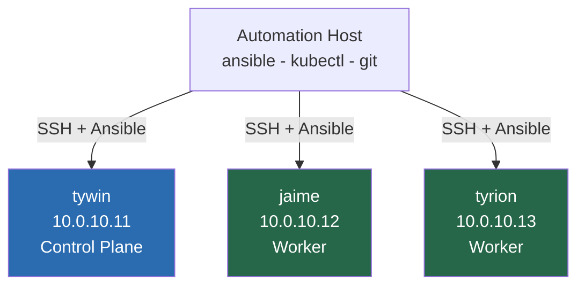

# 01 — Node Preparation & Hardening
## Automation Host, SSH Access, and Node Baseline

**Author:** Kagiso Tjeane
**Difficulty:** ⭐⭐⭐⭐☆☆☆☆☆☆ (4/10)
**Guide:** 01 of 14

> This phase prepares both **the cluster nodes** and the **automation host** that will manage them.
>
> Every step that follows in this handbook assumes:
>
> • Ansible is installed and working
> • SSH key access exists between the automation host and nodes
> • nodes have consistent baseline configuration
>
> This guide establishes those prerequisites.

---

# Purpose of This Phase

Before Kubernetes is installed, the machines that will host the cluster must be:

• reachable via SSH
• configured consistently
• managed through automation

Many Kubernetes tutorials skip this step and configure nodes manually.

That approach creates several problems:

• inconsistent node configuration
• undocumented setup steps
• difficult cluster rebuilds

Instead, this platform treats **node preparation as code**.

Automation is used from the very beginning.

---

# Platform Topology

The platform consists of several machines.



The **automation host** runs:

```
Ansible
kubectl
git
```

All cluster management operations originate from this machine.

---

# Step 1 — Install Tools on the Automation Host

Install all tools required across the entire guide series. These only need to be installed once.

```bash
sudo apt update
sudo apt install -y ansible git nfs-common
```

Install `kubectl`:

```bash
curl -LO "https://dl.k8s.io/release/$(curl -L -s https://dl.k8s.io/release/stable.txt)/bin/linux/arm64/kubectl"
sudo install -o root -g root -m 0755 kubectl /usr/local/bin/kubectl
rm kubectl
```

> **Note:** The automation host is a Raspberry Pi (arm64). Use the `arm64` kubectl binary above.
> For amd64 hosts, replace `arm64` with `amd64` in the URL.

Verify:

```bash
ansible --version
kubectl version --client
git --version
```

`kubectl` will not connect to a cluster yet — that is configured in Guide 02 after the cluster is installed.

---

# Step 2 — Generate SSH Keys

Ansible relies on passwordless SSH access.

Generate an SSH key on the automation host.

```
ssh-keygen -t ed25519
```

Accept the default path:

```
~/.ssh/id_ed25519
```

This creates:

```
~/.ssh/id_ed25519
~/.ssh/id_ed25519.pub
```

The **public key** will be copied to all nodes.

---

# Step 3 — Assign Static IPs to Nodes

Before copying SSH keys, the nodes must have stable IPs that match the inventory.

**Required static assignments:**

| Node | IP |
|---|---|
| tywin (control-plane) | `10.0.10.11` |
| jaime (worker) | `10.0.10.12` |
| tyrion (worker) | `10.0.10.13` |

Configure these as **DHCP reservations** in your router or UniFi controller
(match by MAC address), or set them as static IPs in `/etc/netplan/` on each node.

> DHCP reservations are preferred — the nodes will always request the same IP from the
> router, with no per-node network configuration needed.

---

# Step 4 — Copy SSH Keys to Nodes

The automation host must be able to connect to every node without passwords.

Use:

```
ssh-copy-id user@node-ip
```

Example:

```
ssh-copy-id kagiso@10.0.10.11
ssh-copy-id kagiso@10.0.10.12
ssh-copy-id kagiso@10.0.10.13
```

Verify access:

```
ssh kagiso@10.0.10.11
```

You should be able to log in **without a password**.

Repeat for every node.

---

# Step 5 — Clone the Repository

The Ansible inventory already lives in this repo at `ansible/inventory/homelab.yml`. Rather than creating one manually, clone the repo on the machine you'll run Ansible from:

```bash
git clone https://github.com/Kagiso-me/homelab-infrastructure.git
cd homelab-infrastructure
```

The inventory at `ansible/inventory/homelab.yml` defines all nodes and groups:

```yaml
all:
  children:
    rpi:
      hosts:
        rpi:
          ansible_host: 10.0.10.10

    k3s_controller:
      hosts:
        tywin:
          ansible_host: 10.0.10.11

    k3s_workers:
      hosts:
        jaime:
          ansible_host: 10.0.10.12
        tyrion:
          ansible_host: 10.0.10.13

  vars:
    ansible_user: kagiso
    ansible_ssh_private_key_file: ~/.ssh/id_ed25519
```

No manual inventory creation needed — it's already maintained in version control.

---

# Step 6 — Create the Vault Password File

The Ansible configuration at `ansible/ansible.cfg` references a vault password file:

```
vault_password_file = ~/.vault_pass
```

This file must exist before running any Ansible command, even those that don't use encrypted secrets. Without it, every command will error:

```
[ERROR]: The vault password file /home/kagiso/.vault_pass was not found
```

Create the file on the automation host:

```bash
echo "your-vault-password-here" > ~/.vault_pass
chmod 600 ~/.vault_pass
```

> **Note:** Choose a strong password and store it somewhere safe (e.g. a password manager).
> This password will be used to encrypt any secrets added to the repo later (SSH keys, API tokens, etc.).
> The `chmod 600` restricts the file to your user only.

---

# Step 7 — Test Ansible Connectivity

Before running any automation, confirm Ansible can reach the nodes.

Run from the repo root:

```bash
ansible all -m ping
```

Expected output:

```
SUCCESS
```

Each node should respond successfully.

If this fails, check:

• SSH connectivity
• IP addresses
• inventory configuration
• `~/.vault_pass` exists and is readable

---

# Step 8 — Harden the Raspberry Pi (Automation Host)

The Raspberry Pi (`bran`, `10.0.10.10`) is both the automation host and a managed node. It must be hardened before it starts managing others.

Run the three security playbooks targeting the `rpi` group only:

```bash
  ansible-playbook ansible/playbooks/security/firewall.yml -l rpi
  ansible-playbook ansible/playbooks/security/ssh-hardening.yml -l rpi
  ansible-playbook ansible/playbooks/security/fail2ban.yml -l rpi
```

### What each playbook does for the RPi

**Firewall (`firewall.yml`)**

UFW is configured with a default-deny policy. The RPi is only allowed inbound traffic from the LAN (`10.0.10.0/24`):

| Port | Protocol | Reason |
|---|---|---|
| 22 | TCP | SSH from LAN workstations |
| 53 | TCP + UDP | DNS queries (Pi-hole) |

All other inbound traffic is dropped.

**SSH hardening (`ssh-hardening.yml`)**

Modifies `/etc/ssh/sshd_config`:

| Setting | Value |
|---|---|
| `PasswordAuthentication` | `no` |
| `PermitRootLogin` | `no` |
| `MaxAuthTries` | `3` |
| `X11Forwarding` | `no` |
| `ClientAliveInterval` | `300` |

Only key-based login is permitted after this runs.

**Fail2Ban (`fail2ban.yml`)**

Installs Fail2Ban and enables the SSH jail:

| Setting | Value |
|---|---|
| `bantime` | 1 hour |
| `findtime` | 10 minutes |
| `maxretry` (SSH) | 3 attempts |

> **Important:** Ensure your SSH public key is already present in `~/.ssh/authorized_keys` on the RPi before running `ssh-hardening.yml`. Password login will be permanently disabled.

---

# Step 9 — Baseline Node Preparation

The automation repository already contains several playbooks for node preparation.

```
playbooks/security
playbooks/maintenance
```

These playbooks perform:

• operating system upgrades
• swap disabling
• firewall configuration
• SSH hardening
• Fail2Ban installation


---

# Upgrade Nodes

Ensure all nodes are fully updated.

```
ansible-playbook ansible/playbooks/maintenance/upgrade-nodes.yml
```

This performs:

• package index refresh
• system upgrades
• security updates

---

# Disable Swap

Kubernetes requires swap to be disabled.

Run:

```
ansible-playbook ansible/playbooks/security/disable-swap.yml
```

Swap interferes with Kubernetes scheduling and must always remain disabled.

---

# Enable Time Synchronization

Cluster nodes must share consistent system time.

Run:

```
ansible-playbook ansible/playbooks/security/time-sync.yml
```

This ensures the nodes synchronize with NTP servers.

---

# Configure Firewall

The platform uses **UFW**.

Apply firewall configuration:

```
ansible-playbook ansible/playbooks/security/firewall.yml
```

This ensures Kubernetes communication ports remain open while protecting the nodes.

---

# Harden SSH

Secure the SSH configuration.

```
ansible-playbook ansible/playbooks/security/ssh-hardening.yml
```

Typical changes include:

• disabling password authentication
• enforcing key-based login

---

# Install Fail2Ban

Enable SSH protection.

```
ansible-playbook ansible/playbooks/security/fail2ban.yml
```

Fail2Ban protects against brute force login attempts.

---

# Validation Checklist

Before continuing ensure:

```
✓ ~/.vault_pass exists with chmod 600
✓ SSH access works to every node (including bran)
✓ ansible all -m ping succeeds (run from ansible/ directory)
✓ bran: UFW enabled, SSH + DNS from LAN only
✓ bran: password authentication disabled
✓ bran: Fail2Ban running (fail2ban-client status sshd)
✓ swap is disabled on cluster nodes
✓ firewall rules are applied to all nodes
✓ system clocks are synchronized
✓ nodes are fully updated
```

---

# Exit Criteria

This phase is complete when:

• Ansible can connect to every node
• baseline security configuration is applied
• nodes are ready for Kubernetes installation

---

# Next Guide

➡ **[02 — Kubernetes Installation (k3s via Ansible)](./02-Kubernetes-Installation.md)**

The next guide explains how the Kubernetes cluster itself is installed using the existing automation playbook.

---

## Navigation

| | Guide |
|---|---|
| ← Previous | [00.5 — Infrastructure Prerequisites](./00.5-Infrastructure-Prerequisites.md) |
| Current | **01 — Node Preparation & Hardening** |
| → Next | [02 — Kubernetes Installation](./02-Kubernetes-Installation.md) |
