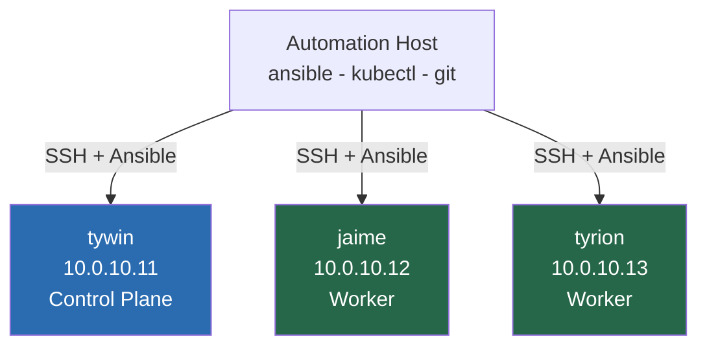

# 01 — Node Preparation & Hardening
## Automation Host, SSH Access, and Node Baseline

**Author:** Kagiso Tjeane
**Difficulty:** ⭐⭐⭐⭐☆☆☆☆☆☆ (4/10)
**Guide:** 01 of 12

> This phase prepares both **the cluster nodes** and the **automation host** that will manage them.
>
> Every step that follows in this handbook assumes:
>
> • Ansible is installed and working
> • SSH key access exists between the automation host and nodes
> • nodes have consistent baseline configuration
>
> This guide establishes those prerequisites.

---

# Purpose of This Phase

Before Kubernetes is installed, the machines that will host the cluster must be:

• reachable via SSH
• configured consistently
• managed through automation

Many Kubernetes tutorials skip this step and configure nodes manually.

That approach creates several problems:

• inconsistent node configuration
• undocumented setup steps
• difficult cluster rebuilds

Instead, this platform treats **node preparation as code**.

Automation is used from the very beginning.

---

# Platform Topology

The platform consists of several machines.



The **automation host** runs:

```
Ansible
kubectl
git
```

All cluster management operations originate from this machine.

---

# Step 1 — Install Ansible

Ansible must be installed on the automation host.

Recommended installation:

```
sudo apt update
sudo apt install -y ansible
```

Verify installation:

```
ansible --version
```

Expected output:

```
ansible [version]
```

Ansible will be used for:

• node preparation
• Kubernetes installation
• cluster maintenance

---

# Step 2 — Generate SSH Keys

Ansible relies on passwordless SSH access.

Generate an SSH key on the automation host.

```
ssh-keygen -t ed25519
```

Accept the default path:

```
~/.ssh/id_ed25519
```

This creates:

```
~/.ssh/id_ed25519
~/.ssh/id_ed25519.pub
```

The **public key** will be copied to all nodes.

---

# Step 3 — Copy SSH Keys to Nodes

The automation host must be able to connect to every node without passwords.

Use:

```
ssh-copy-id user@node-ip
```

Example:

```
ssh-copy-id kagiso@10.0.10.11
ssh-copy-id kagiso@10.0.10.12
ssh-copy-id kagiso@10.0.10.13
```

Verify access:

```
ssh kagiso@10.0.10.11
```

You should be able to log in **without a password**.

Repeat for every node.

---

# Step 4 — Create the Ansible Inventory

Ansible needs to know which machines it should manage.

Create an inventory file:

```
inventory/homelab.yml
```

Example structure:

```
all:
  hosts:
    tywin:
      ansible_host: 10.0.10.11
    jaime:
      ansible_host: 10.0.10.12
    tyrion:
      ansible_host: 10.0.10.13
```

This file tells Ansible how to connect to each machine.

---

# Step 5 — Test Ansible Connectivity

Before running any automation, confirm Ansible can reach the nodes.

Run:

```
ansible all -m ping -i inventory/homelab.yml
```

Expected output:

```
SUCCESS
```

Each node should respond successfully.

If this fails, check:

• SSH connectivity
• IP addresses
• inventory configuration

---

# Step 6 — Baseline Node Preparation

The automation repository already contains several playbooks for node preparation.

```
playbooks/security
playbooks/maintenance
```

These playbooks perform:

• operating system upgrades
• swap disabling
• firewall configuration
• SSH hardening
• Fail2Ban installation


---

# Upgrade Nodes

Ensure all nodes are fully updated.

```
ansible-playbook ansible/playbooks/maintenance/upgrade-nodes.yml
```

This performs:

• package index refresh
• system upgrades
• security updates

---

# Disable Swap

Kubernetes requires swap to be disabled.

Run:

```
ansible-playbook ansible/playbooks/security/disable-swap.yml
```

Swap interferes with Kubernetes scheduling and must always remain disabled.

---

# Enable Time Synchronization

Cluster nodes must share consistent system time.

Run:

```
ansible-playbook ansible/playbooks/security/time-sync.yml
```

This ensures the nodes synchronize with NTP servers.

---

# Configure Firewall

The platform uses **UFW**.

Apply firewall configuration:

```
ansible-playbook ansible/playbooks/security/firewall.yml
```

This ensures Kubernetes communication ports remain open while protecting the nodes.

---

# Harden SSH

Secure the SSH configuration.

```
ansible-playbook ansible/playbooks/security/ssh-hardening.yml
```

Typical changes include:

• disabling password authentication
• enforcing key-based login

---

# Install Fail2Ban

Enable SSH protection.

```
ansible-playbook ansible/playbooks/security/fail2ban.yml
```

Fail2Ban protects against brute force login attempts.

---

# Validation Checklist

Before continuing ensure:

```
✓ SSH access works to every node
✓ ansible all -m ping succeeds
✓ swap is disabled
✓ firewall rules are applied
✓ system clocks are synchronized
✓ nodes are fully updated
```

---

# Exit Criteria

This phase is complete when:

• Ansible can connect to every node
• baseline security configuration is applied
• nodes are ready for Kubernetes installation

---

# Next Guide

➡ **[02 — Kubernetes Installation (k3s via Ansible)](./02-Kubernetes-Installation.md)**

The next guide explains how the Kubernetes cluster itself is installed using the existing automation playbook.

---

## Navigation

| | Guide |
|---|---|
| ← Previous | [00 — Platform Philosophy](./00-Platform-Philosophy.md) |
| Current | **01 — Node Preparation & Hardening** |
| → Next | [02 — Kubernetes Installation](./02-Kubernetes-Installation.md) |
