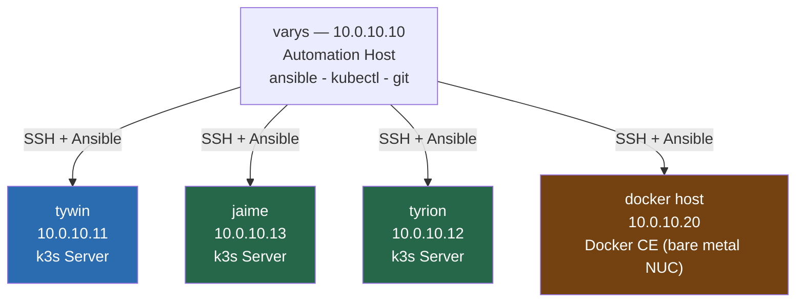

# 01 — Node Preparation & Hardening
## Automation Host, SSH Access, and Node Baseline

**Author:** Kagiso Tjeane
**Difficulty:** ⭐⭐⭐⭐☆☆☆☆☆☆ (4/10)
**Guide:** 01 of 13

> This phase prepares both **the cluster nodes** and the **automation host** that will manage them.
>
> Every step that follows in this handbook assumes:
>
> • Ansible is installed and working
> • SSH key access exists between the automation host and nodes
> • nodes have consistent baseline configuration
>
> This guide establishes those prerequisites.

---

# Purpose of This Phase

Before Kubernetes is installed, the machines that will host the cluster must be:

- reachable via SSH
- configured consistently
- managed through automation

Many Kubernetes tutorials skip this step and configure nodes manually.

That approach creates several problems:

- inconsistent node configuration
- undocumented setup steps
- difficult cluster rebuilds

Instead, this platform treats **node preparation as code**.

Automation is used from the very beginning.

---

# Platform Topology

The platform consists of the following machines. This guide covers the k3s cluster nodes and
the Docker host. `varys` is the automation host used to run all Ansible
commands throughout this guide.



| Node | Role | IP |
|---|---|---|
| varys | Control hub: Ansible, kubectl, Pi-hole (primary), cloudflared, Headscale, Grafana, Alertmanager, GitHub Actions runner, Beesly | 10.0.10.10 |
| tywin | k3s server | 10.0.10.11 |
| tyrion | k3s server | 10.0.10.12 |
| jaime | k3s server | 10.0.10.13 |
| docker host | Docker CE (bare metal Intel NUC i3-7100U) | 10.0.10.20 |

---

# Step 1 — Install Tools on the Automation Host (varys)

> **If you followed Guide 00.5:** `kubectl`, `flux`, `kubeconform`, `kustomize`, `pluto`, and `gh`
> were already installed there for the self-hosted runner. This step adds `ansible`, `git`, and
> `nfs-common` — the remaining tools needed for day-to-day cluster management. Skip anything
> already present.

Install all tools required across the entire guide series. These only need to be installed once.
The self-hosted runner tool installations (kubeconform, pluto, etc.) are covered in Guide 00.5.
This step covers the tools needed for day-to-day cluster management from varys.

```bash
sudo apt update
sudo apt install -y ansible git nfs-common
```

Install `kubectl` (amd64 — varys is an Intel NUC, x86_64):

```bash
curl -LO "https://dl.k8s.io/release/$(curl -L -s https://dl.k8s.io/release/stable.txt)/bin/linux/amd64/kubectl"
sudo install -o root -g root -m 0755 kubectl /usr/local/bin/kubectl
rm kubectl
```

> **Architecture note:** The automation host is an Intel NUC (x86_64 / amd64). Use the `amd64` kubectl binary above.

Verify:

```bash
ansible --version
kubectl version --client
git --version
```

`kubectl` will not connect to a cluster yet — that is configured in Guide 02 after the cluster is installed.

---

# Step 2 — Generate SSH Keys

> **If your nodes were already reachable before starting this guide series:** you likely generated
> an SSH key during initial OS setup. Run `ls ~/.ssh/id_ed25519` — if the file exists, skip to Step 3.

Ansible relies on passwordless SSH access. Generate an SSH key on the automation host.

```bash
ssh-keygen -t ed25519
```

Accept the default path:

```
~/.ssh/id_ed25519
```

This creates:

```
~/.ssh/id_ed25519       ← private key (never share this)
~/.ssh/id_ed25519.pub   ← public key (copied to nodes)
```

The **public key** will be copied to all nodes in the next steps.

---

# Step 3 — Assign Static IPs to Nodes

> **If your nodes were already reachable at the IPs in the table below:** static IPs are already
> assigned. Verify the addresses match and move on to Step 4.

Before copying SSH keys, all nodes must have stable IPs that match the inventory.

**Required static assignments:**

| Node | IP |
|---|---|
| varys (Intel NUC i3-5010U) | `10.0.10.10` |
| tywin (k3s server) | `10.0.10.11` |
| jaime (k3s server) | `10.0.10.13` |
| tyrion (k3s server) | `10.0.10.12` |
| docker host (NUC) | `10.0.10.20` |

Configure these as **DHCP reservations** in your router or UniFi controller
(match by MAC address), or set them as static IPs in `/etc/netplan/` on each node.

> DHCP reservations are preferred — the nodes always request the same IP from the router,
> with no per-node network configuration needed.

For the Docker host (bare metal NUC), a static netplan configuration is appropriate since
it is not managed by Ansible:

```bash
# On the Docker host — edit /etc/netplan/00-installer-config.yaml
sudo nano /etc/netplan/00-installer-config.yaml
```

```yaml
network:
  version: 2
  ethernets:
    eno1:              # replace with your actual interface name (ip link show)
      dhcp4: no
      addresses:
        - 10.0.10.20/24
      routes:
        - to: default
          via: 10.0.10.1
      nameservers:
        addresses:
          - 10.0.10.10   # varys runs Pi-hole
          - 1.1.1.1
```

```bash
sudo netplan apply
```

---

# Step 4 — Copy SSH Keys to Nodes

> **If you could already SSH into nodes without a password before starting this guide series:**
> this step is done. Verify with `ssh kagiso@10.0.10.11` — if it connects without a prompt, move on.

The automation host must be able to connect to every node without passwords.

```bash
ssh-copy-id kagiso@10.0.10.11
ssh-copy-id kagiso@10.0.10.13
ssh-copy-id kagiso@10.0.10.12
```

Verify access by logging in without a password:

```bash
ssh kagiso@10.0.10.11
# Should drop you into a shell with no password prompt
exit
```

Repeat the verification for each node. If you are prompted for a password, the key was not
copied correctly — check that the remote user exists and that `~/.ssh/authorized_keys` was created.

---

# Step 5 — Clone the Repository

> **If you followed Guide 00.5:** the repo was already cloned to run the self-hosted runner setup.
> Verify with `ls ~/homelab-infrastructure` — if it exists, skip this step.

The Ansible inventory already lives in this repo at `ansible/inventory/homelab.yml`. Rather than creating one manually, clone the repo on the machine you will run Ansible from:

```bash
git clone https://github.com/Kagiso-me/homelab-infrastructure.git
cd homelab-infrastructure
```

The inventory at `ansible/inventory/homelab.yml` defines all nodes and groups:

```yaml
all:
  children:
    control_hub:
      hosts:
        varys:
          ansible_host: 10.0.10.10

    k3s_primary:
      hosts:
        tywin:
          ansible_host: 10.0.10.11

    k3s_servers:
      hosts:
        jaime:
          ansible_host: 10.0.10.13
        tyrion:
          ansible_host: 10.0.10.12

    docker:
      hosts:
        nuc:
          ansible_host: 10.0.10.20

  vars:
    ansible_user: kagiso
    ansible_ssh_private_key_file: ~/.ssh/id_ed25519
```

No manual inventory creation needed — it is already maintained in version control.

---

# Step 6 — Create the Vault Password File

The Ansible configuration at `ansible/ansible.cfg` references a vault password file:

```
vault_password_file = ~/.vault_pass
```

This file must exist before running any Ansible command, even those that do not use encrypted
secrets. Without it, every command will fail:

```
[ERROR]: The vault password file /home/kagiso/.vault_pass was not found
```

Create the file on the automation host:

```bash
echo "your-vault-password-here" > ~/.vault_pass
chmod 600 ~/.vault_pass
```

> **Note:** Choose a strong password and store it somewhere safe (e.g. a password manager).
> This password will be used to encrypt any secrets added to the repo later (SSH keys, API tokens, etc.).
> The `chmod 600` restricts the file to your user only.

---

# Step 7 — Test Ansible Connectivity

Before running any automation, confirm Ansible can reach all nodes.

Run from the repo root — Ansible reads `ansible.cfg` from the current directory to locate the inventory:

```bash
cd ~/homelab-infrastructure
ansible all -m ping
```

Expected output (one SUCCESS block per host):

```
varys | SUCCESS => {"ping": "pong"}
tywin | SUCCESS => {"ping": "pong"}
jaime | SUCCESS => {"ping": "pong"}
tyrion | SUCCESS => {"ping": "pong"}
```

If any node fails, check:

- SSH connectivity (can you `ssh kagiso@<ip>` without a password?)
- IP addresses match the inventory
- `~/.vault_pass` exists and is readable (`ls -la ~/.vault_pass`)
- The remote user `kagiso` exists on the target node

---

# Step 8 — Harden the Automation Host (varys)

`varys` (`10.0.10.10`) is both the automation host and a managed node. It
must be hardened before it starts managing others. Harden it first, targeting the `control_hub` group only.

```bash
ansible-playbook ansible/playbooks/security/firewall.yml -l control_hub
ansible-playbook ansible/playbooks/security/ssh-hardening.yml -l control_hub
ansible-playbook ansible/playbooks/security/fail2ban.yml -l control_hub
```

> **Important:** Ensure your SSH public key is already present in `~/.ssh/authorized_keys` on
> varys before running `ssh-hardening.yml`. Password login will be permanently disabled.

### What each playbook does for varys

**Firewall (`firewall.yml`)**

UFW is configured with a default-deny policy. varys is only allowed inbound traffic from the LAN (`10.0.10.0/24`):

| Port | Protocol | Reason |
|---|---|---|
| 22 | TCP | SSH from LAN workstations |
| 53 | TCP + UDP | DNS queries (Pi-hole) |

All other inbound traffic is dropped.

**SSH hardening (`ssh-hardening.yml`)**

Modifies `/etc/ssh/sshd_config`:

| Setting | Value |
|---|---|
| `PasswordAuthentication` | `no` |
| `PermitRootLogin` | `no` |
| `MaxAuthTries` | `3` |
| `X11Forwarding` | `no` |
| `ClientAliveInterval` | `300` |

Only key-based login is permitted after this runs.

**Fail2Ban (`fail2ban.yml`)**

Installs Fail2Ban and enables the SSH jail:

| Setting | Value |
|---|---|
| `bantime` | 1 hour |
| `findtime` | 10 minutes |
| `maxretry` (SSH) | 3 attempts |

### Verify varys hardening

```bash
# Check UFW status
ssh kagiso@10.0.10.10 "sudo ufw status"
# Expected: Status: active, with rules for 22/tcp and 53

# Check Fail2Ban is running
ssh kagiso@10.0.10.10 "sudo fail2ban-client status sshd"
# Expected: Jail Status sshd with Currently failed: 0

# Confirm password auth is disabled
ssh -o PasswordAuthentication=yes kagiso@10.0.10.10
# Expected: Permission denied (publickey)
```

---

# Step 9 — Baseline Node Preparation (k3s Nodes)

Run the full baseline preparation sequence against the k3s cluster nodes. These playbooks
bring all nodes to a consistent, hardened, Kubernetes-ready state.


Run each playbook in order. The `-l k3s_primary,k3s_servers` limit targets only the cluster
nodes, not varys (which was already hardened in Step 8).

All commands in this step must be run from the repo root on `varys`:

```bash
cd ~/homelab-infrastructure
```

### Upgrade Nodes

Ensure all cluster nodes are fully updated before installing Kubernetes. Running Kubernetes on
nodes with outdated packages introduces known CVEs and compatibility issues.

```bash
ansible-playbook ansible/playbooks/maintenance/upgrade-nodes.yml \
  -l k3s_primary,k3s_servers
```

This performs a package index refresh, upgrades all installed packages, and installs security
updates. Nodes may require a reboot after this step — the playbook handles that automatically.

### Disable Swap

Kubernetes requires swap to be disabled on all nodes. If swap is active, the kubelet will
refuse to start.

```bash
ansible-playbook ansible/playbooks/security/disable-swap.yml \
  -l k3s_primary,k3s_servers
```

This disables swap immediately and removes swap entries from `/etc/fstab` so the change
survives reboots.

Verify swap is off:

```bash
ansible k3s_primary,k3s_servers -m shell -a "swapon --show" --become
# Expected: no output (empty = no swap active)
```

### Enable Time Synchronization

Cluster nodes must share consistent system time. etcd and TLS certificate validation both
depend on accurate clocks. Drift greater than a few seconds can cause etcd elections to fail
and certificates to be rejected.

```bash
ansible-playbook ansible/playbooks/security/time-sync.yml \
  -l k3s_primary,k3s_servers
```

This installs chrony and removes any conflicting NTP daemons. chrony takes over NTP directly,
so `timedatectl`'s `NTPSynchronized` field will remain `no` — that field reflects systemd-timesyncd,
which is no longer active. Use chrony's own tracking command to verify sync.

Verify time sync is active:

```bash
ansible k3s_primary,k3s_servers -m shell -a "chronyc tracking" --become
# Expected: output includes "Reference ID" and "System time" offset in seconds
# A reference source of 162.159.200.1 (time.cloudflare.com) confirms sync
```

### Configure Firewall

Apply UFW firewall rules to all cluster nodes. The firewall allows Kubernetes control plane
traffic (6443, 2379-2380 for etcd, 10250 for kubelet) while blocking unnecessary inbound
access.

```bash
ansible-playbook ansible/playbooks/security/firewall.yml \
  -l k3s_primary,k3s_servers
```

### Harden SSH

Apply SSH configuration hardening to all cluster nodes. The same settings applied to varys in
Step 8 are applied here — no password authentication, no root login, key-only access.

```bash
ansible-playbook ansible/playbooks/security/ssh-hardening.yml \
  -l k3s_primary,k3s_servers
```

> **Important:** Verify that your SSH public key is in `~/.ssh/authorized_keys` on each node
> before running this. Once password authentication is disabled, you cannot log in without a key.

### Install Fail2Ban

Protect all cluster nodes against brute-force SSH attempts.

```bash
ansible-playbook ansible/playbooks/security/fail2ban.yml \
  -l k3s_primary,k3s_servers
```

---

# Step 10 — Docker Host OS Setup (bare metal NUC)

The Docker host at `10.0.10.20` is a bare metal Intel NUC i3-7100U running Ubuntu 24.04. It
is not managed by Ansible. This step documents its initial configuration.

## OS Installation

Install **Ubuntu Server 24.04 LTS** from a USB installer. During installation:

- Hostname: `docker` (or whichever name you prefer)
- Username: `kagiso`
- Static IP configured via netplan (see Step 3 above)
- SSH server enabled during installation

## Copy SSH Key

After the OS is installed, copy your SSH key from varys:

```bash
ssh-copy-id kagiso@10.0.10.20
```

Verify:

```bash
ssh kagiso@10.0.10.20
```

## Update the System

```bash
ssh kagiso@10.0.10.20
sudo apt update && sudo apt upgrade -y
```

## Install Docker CE

Docker's official repository provides the latest stable release. Do not use the version
from Ubuntu's default package repository — it is typically several major versions behind.

```bash
# Install prerequisites
sudo apt install -y ca-certificates curl

# Add Docker's official GPG key
sudo install -m 0755 -d /etc/apt/keyrings
sudo curl -fsSL https://download.docker.com/linux/ubuntu/gpg \
  -o /etc/apt/keyrings/docker.asc
sudo chmod a+r /etc/apt/keyrings/docker.asc

# Add the Docker repository
echo \
  "deb [arch=$(dpkg --print-architecture) signed-by=/etc/apt/keyrings/docker.asc] \
  https://download.docker.com/linux/ubuntu \
  $(. /etc/os-release && echo "$VERSION_CODENAME") stable" | \
  sudo tee /etc/apt/sources.list.d/docker.list > /dev/null

# Install Docker CE
sudo apt update
sudo apt install -y docker-ce docker-ce-cli containerd.io docker-buildx-plugin docker-compose-plugin

# Allow kagiso to run Docker without sudo
sudo usermod -aG docker kagiso
```

Log out and back in for the group change to take effect, then verify:

```bash
docker version
docker compose version
```

## Install NFS Client

The Docker host mounts NFS shares from TrueNAS for backup jobs.

```bash
sudo apt install -y nfs-common
```

Test the NFS mount:

```bash
sudo mount -t nfs 10.0.10.80:/mnt/archive/backups /tmp/test-nfs
ls /tmp/test-nfs
sudo umount /tmp/test-nfs
```

## Basic Security Hardening

Apply the same SSH hardening and firewall rules manually since the Docker host is not in the
Ansible inventory:

```bash
# Disable password authentication
sudo sed -i 's/^#PasswordAuthentication yes/PasswordAuthentication no/' /etc/ssh/sshd_config
sudo sed -i 's/^PasswordAuthentication yes/PasswordAuthentication no/' /etc/ssh/sshd_config
sudo systemctl restart ssh

# Enable UFW
sudo ufw default deny incoming
sudo ufw default allow outgoing
sudo ufw allow from 10.0.10.0/24 to any port 22 proto tcp
sudo ufw --force enable
sudo ufw status
```

---

# Validation Checklist

Before continuing to Guide 02, confirm every item below:

```
✓ ~/.vault_pass exists on varys with chmod 600
✓ SSH key-only access works to every k3s node (tywin, jaime, tyrion)
✓ ansible all -m ping returns SUCCESS for all hosts
✓ varys: UFW enabled, SSH (22/tcp) + DNS (53) from LAN only
✓ varys: password authentication disabled
✓ varys: Fail2Ban running (sudo fail2ban-client status sshd)
✓ k3s nodes: swap disabled (swapon --show shows no output)
✓ k3s nodes: time synchronized (timedatectl shows NTPSynchronized=yes)
✓ k3s nodes: UFW enabled with Kubernetes ports open
✓ k3s nodes: password authentication disabled
✓ k3s nodes: Fail2Ban installed and running
✓ k3s nodes: all packages upgraded
✓ Docker host: Ubuntu 24.04 installed with static IP 10.0.10.20
✓ Docker host: Docker CE installed and running (docker version)
✓ Docker host: nfs-common installed, test NFS mount succeeds
✓ Docker host: SSH password authentication disabled
```

---

# Exit Criteria

This phase is complete when:

- Ansible can connect to every node without passwords
- baseline security configuration is applied to varys and all k3s nodes
- Docker host is configured with Docker CE, NFS client, and basic hardening
- nodes are ready for Kubernetes installation

---

# Next Guide

➡ **[02 — Kubernetes Installation (k3s via Ansible)](./02-Kubernetes-Installation.md)**

The next guide installs the Kubernetes cluster on tywin, jaime, and tyrion using the existing Ansible automation playbook.

---

## Navigation

| | Guide |
|---|---|
| ← Previous | [00.5 — Infrastructure Prerequisites](./00.5-Infrastructure-Prerequisites.md) |
| Current | **01 — Node Preparation & Hardening** |
| → Next | [02 — Kubernetes Installation](./02-Kubernetes-Installation.md) |

