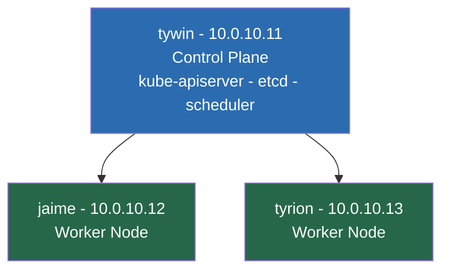
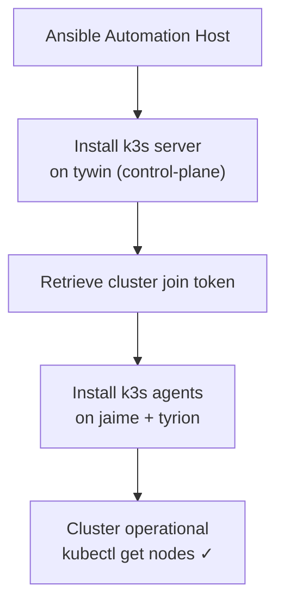

# 02 — Kubernetes Installation (k3s via Ansible)
## Bootstrapping the Cluster

**Author:** Kagiso Tjeane
**Difficulty:** ⭐⭐⭐⭐⭐⭐☆☆☆☆ (6/10)
**Guide:** 02 of 13

> In this phase we install Kubernetes using **k3s** and the existing Ansible automation.

---

# Why k3s

Kubernetes can be installed in many ways. Common approaches include:

• kubeadm
• managed cloud clusters
• k3s

For this platform we intentionally use **k3s**.

k3s is a lightweight Kubernetes distribution created by Rancher that packages
core Kubernetes components into a simplified deployment model.

Key advantages include:

• extremely simple installation
• embedded etcd datastore
• minimal resource footprint
• full Kubernetes API compatibility

k3s behaves like a normal Kubernetes cluster while significantly reducing
operational complexity.

---

# Why Installation Is Automated

A Kubernetes cluster should **never be installed manually**.

Manual installation introduces several problems:

• inconsistent configuration between nodes
• undocumented setup steps
• difficult disaster recovery

Instead, the cluster installation is performed through **Ansible playbooks**.

Automation provides:

```
repeatability
documentation
disaster recovery capability
```

If the cluster ever needs to be rebuilt, the same playbook can be executed again.

---

# Automation Repository Structure

The automation repository used for cluster installation has the following structure.

```
ansible/
├── ansible.cfg
├── inventory
│   └── homelab.yml
├── playbooks
│   ├── lifecycle
│   │   ├── install-cluster.yml
│   │   ├── install-platform.yml
│   │   └── purge-k3s.yml
│   ├── maintenance
│   │   ├── reboot-nodes.yml
│   │   └── upgrade-nodes.yml
│   ├── security
│   │   ├── disable-swap.yml
│   │   ├── fail2ban.yml
│   │   ├── firewall.yml
│   │   ├── ssh-hardening.yml
│   │   └── time-sync.yml
│   └── services
│       └── install-pihole.yml
└── roles
    └── k3s_install
        ├── defaults
        └── tasks
```

This repository represents **the source of truth for cluster provisioning**.

---

# Cluster Topology

The cluster consists of three nodes.



Node roles:

| Node | Role |
|-----|------|
tywin | control-plane |
jaime | worker |
tyrion | worker |

---

# Control Plane Responsibilities

The control-plane node runs the core Kubernetes control components.

```
kube-apiserver
kube-controller-manager
kube-scheduler
etcd
```

These components coordinate all cluster activity.

Worker nodes host:

• application workloads
• platform services
• stateful workloads

---

# Installing the Cluster

Cluster installation is executed using the existing playbook.

From the automation host, run from the repository root:

```bash
cd ~/homelab-infrastructure/ansible
ansible-playbook playbooks/lifecycle/install-cluster.yml
```

The playbook performs the following operations:

1. installs k3s server on the control-plane node
2. retrieves the cluster join token
3. installs k3s agents on worker nodes
4. configures cluster connectivity

Because the installation is automated, the entire cluster can be deployed
in a few minutes.

---

# Installation Flow

The high level installation process looks like this.



This process ensures every node is configured consistently.

---

# Retrieving Kubeconfig

After installation, copy the kubeconfig from the control-plane node (`tywin`) to the automation host (`bran`) and configure `kubectl` to use it.

Run on **bran**:

```bash
# Copy kubeconfig from tywin and fix the address (k3s writes 127.0.0.1, which is only reachable on tywin itself)
scp kagiso@10.0.10.11:/etc/rancher/k3s/k3s.yaml ~/.kube/prod-config
sed -i 's/127.0.0.1/10.0.10.11/' ~/.kube/prod-config

# Activate for this session
export KUBECONFIG=~/.kube/prod-config

# Persist so future sessions don't need the export
echo 'export KUBECONFIG=~/.kube/prod-config' >> ~/.bashrc
```

Verify connectivity:

```bash
kubectl get nodes
```

Expected output:

```
tywin    Ready
jaime    Ready
tyrion   Ready
```

---

# Verifying System Components

Next verify that system pods are running.

```
kubectl get pods -A
```

Core components should include:

```
coredns
metrics-server
local-path-provisioner
```
These components are deployed automatically by k3s.

---

# Understanding the Embedded Datastore

k3s uses an embedded **etcd datastore** to store cluster state.

This datastore maintains information about:

• nodes
• pods
• services
• cluster configuration

The reliability of the control-plane node is therefore critical.

Later in this handbook we will introduce **Velero backups**
to protect this cluster state.

---

# Common Installation Issues

Several problems may occur during installation.

### SSH Connectivity

If Ansible cannot connect to nodes, the playbook will fail.

Verify connectivity:

```
ansible all -m ping
```

---

### Firewall Blocking Ports

If cluster ports are blocked the workers may fail to join the cluster.

Ensure port **6443** is reachable between nodes.

---

### Incorrect Inventory

If the Ansible inventory does not correctly list the nodes,
installation will not succeed.

Always verify the inventory before running the playbook.

---

# Staging Cluster Installation

The platform uses a two-cluster GitOps model: a single-node staging cluster and the three-node
production cluster. Every change lands on staging first. Only after staging is healthy is it
promoted to production.

> **Why this architecture exists:** See [ADR-006 — Pivot Docker Host to Proxmox](../adr/ADR-006-proxmox-pivot.md)
> for the full rationale. The full Proxmox host setup, VM template creation, and Docker VM
> restore are documented in [Ops Log: 2026-03-16 Pivot NUC to Proxmox](../ops-log/2026-03-16-pivot-nuc-to-proxmox.md).

The staging cluster is a single-node k3s VM running on the Proxmox host (NUC at `10.0.10.30`).

```
Proxmox host — 10.0.10.30
├── docker-vm    — 10.0.10.32
└── staging-k3s  — 10.0.10.31  ← this section
```

---

## Prerequisites

Before continuing, the following must already be in place:

- Proxmox VE installed on the NUC (`10.0.10.30`)
- Ubuntu 22.04 cloud-init template created as VM 9000
- SSH key loaded on the Proxmox host

Both are covered in the ops log linked above.

---

## Creating the staging-k3s VM

Run on the **Proxmox host** (`ssh root@10.0.10.30`):

```bash
# Clone the cloud-init template (VM 9000) into a new VM with ID 3031
qm clone 9000 3031 --name staging-k3s --full

# Configure resources and networking
qm set 3031 \
  --memory 6144 \
  --cores 2 \
  --cpu host \
  --ipconfig0 ip=10.0.10.31/24,gw=10.0.10.1 \
  --nameserver 10.0.10.10

# Expand disk to 60GB before first boot
qm resize 3031 scsi0 60G

# Start the VM
qm start 3031
```

Cloud-init runs on first boot and automatically:
- sets the static IP (`10.0.10.31`)
- injects your SSH key
- expands the root filesystem

No installer interaction is required.

---

## First Boot — Install k3s

Once the VM is up, SSH in and install k3s:

```bash
ssh kagiso@10.0.10.31

# Install QEMU guest agent (enables graceful shutdown and IP visibility in Proxmox UI)
sudo apt install -y qemu-guest-agent
sudo systemctl enable --now qemu-guest-agent

# Install k3s as a single-node cluster
# --disable traefik  → Traefik is managed by Flux, not bundled with k3s
# --write-kubeconfig-mode 644  → allows non-root kubeconfig reads
curl -sfL https://get.k3s.io | sh -s - \
  --disable traefik \
  --write-kubeconfig-mode 644
```

Verify the node is ready:

```bash
kubectl get nodes
```

Expected output:

```
NAME          STATUS   ROLES                  AGE   VERSION
staging-k3s   Ready    control-plane,master   ...   v1.x.x+k3s1
```

---

## Retrieving the Staging Kubeconfig

Copy the kubeconfig from the staging VM to bran and fix the server address.

Run on **bran**:

```bash
# Copy kubeconfig from staging VM and patch the address
# (k3s writes 127.0.0.1, which is only reachable on the VM itself)
scp kagiso@10.0.10.31:/etc/rancher/k3s/k3s.yaml ~/.kube/staging-config
sed -i 's/127.0.0.1/10.0.10.31/' ~/.kube/staging-config
```

Verify connectivity from bran:

```bash
export KUBECONFIG=~/.kube/staging-config
kubectl get nodes
```

> Do **not** persist `KUBECONFIG=~/.kube/staging-config` in `.bashrc` at this point.
> Guide 04 sets the default kubeconfig to prod. Staging is activated per-session when needed.

---

# Exit Criteria

This phase is complete when both clusters are reachable from bran.

**Production cluster** (`~/.kube/prod-config`):

```bash
export KUBECONFIG=~/.kube/prod-config
kubectl get nodes
```

Expected:

```
tywin    Ready    control-plane,master
jaime    Ready    <none>
tyrion   Ready    <none>
```

**Staging cluster** (`~/.kube/staging-config`):

```bash
export KUBECONFIG=~/.kube/staging-config
kubectl get nodes
```

Expected:

```
staging-k3s   Ready    control-plane,master
```

Additionally, on each cluster:

```
kubectl get pods -A
```

should show all system pods running (`coredns`, `metrics-server`, `local-path-provisioner`).

---

# Next Guide

➡ **[03 — Secrets Management](./03-Secrets-Management.md)**

The next guide covers how secrets are encrypted, stored in Git, and decrypted by Flux at reconciliation time.

---

## Navigation

| | Guide |
|---|---|
| ← Previous | [01 — Node Preparation & Hardening](./01-Node-Preparation-Hardening.md) |
| Current | **02 — Kubernetes Installation** |
| → Next | [03 — Secrets Management](./03-Secrets-Management.md) |
