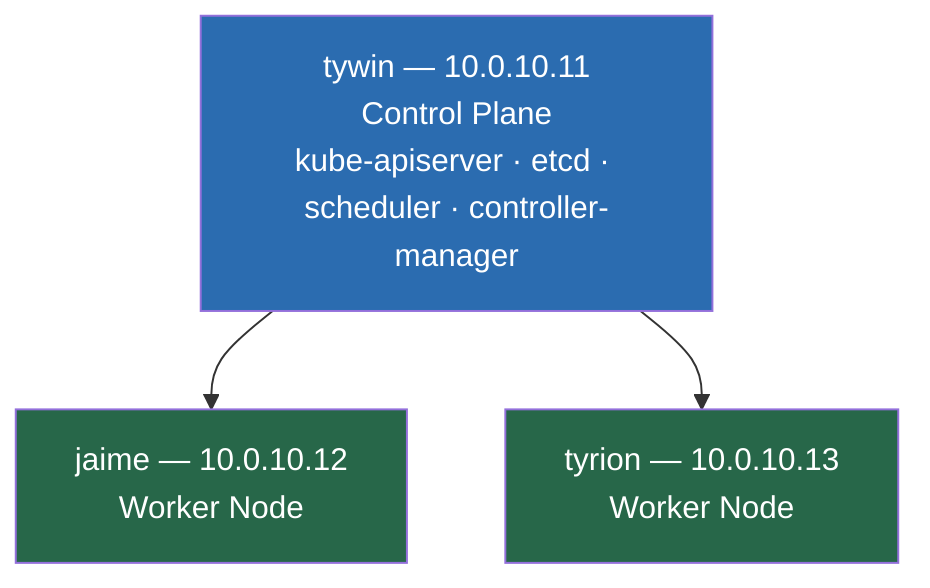
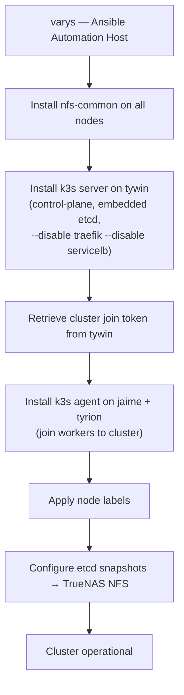

# 02 — Kubernetes Installation (k3s via Ansible)
## Bootstrapping the Production Cluster

**Author:** Kagiso Tjeane
**Difficulty:** ⭐⭐⭐⭐⭐⭐☆☆☆☆ (6/10)
**Guide:** 02 of 13

> In this phase we install Kubernetes using **k3s** and the existing Ansible automation.
>
> By the end of this guide, a three-node k3s cluster will be running and accessible from `varys`.

---

# Why k3s

Kubernetes can be installed in many ways. Common approaches include:

- kubeadm
- managed cloud clusters
- k3s

For this platform we intentionally use **k3s**.

k3s is a lightweight Kubernetes distribution created by Rancher that packages core Kubernetes
components into a simplified deployment model.

Key advantages for this platform:

| Advantage | Why it matters |
|---|---|
| Embedded etcd datastore | No external database required — etcd runs inside k3s itself |
| Single binary | Dramatically simpler to install and upgrade than multi-component kubeadm |
| Full Kubernetes API compatibility | All standard manifests, Helm charts, and tools work unchanged |
| Minimal resource footprint | ThinkCentre nodes run comfortably with headroom for workloads |
| Automated snapshot support | Built-in etcd-snapshot to NFS/S3 — no external tooling needed |

k3s behaves like a full Kubernetes cluster while significantly reducing operational complexity.
This is not a tradeoff — it is the correct tool for a single-operator homelab platform.

---

# Why Installation Is Automated

A Kubernetes cluster should **never be installed manually**.

Manual installation introduces several problems:

- inconsistent configuration between nodes
- undocumented setup steps
- disaster recovery depends on memory, not automation

Instead, the cluster installation is performed through **Ansible playbooks**.

Automation provides:

```
repeatability       → exact same result on every run
documentation       → the playbook IS the installation procedure
disaster recovery   → cluster rebuild = run the playbook again
```

If the cluster ever needs to be rebuilt, executing `install-cluster.yml` again produces an
identical result. This is the core of the Automation First principle.

---

# Automation Repository Structure

The Ansible automation lives under `ansible/` in the repo root.

```
ansible/
├── ansible.cfg
├── inventory
│   └── homelab.yml
├── playbooks
│   ├── lifecycle
│   │   ├── install-cluster.yml      ← cluster installation (this guide)
│   │   ├── install-platform.yml
│   │   └── purge-k3s.yml
│   ├── maintenance
│   │   ├── reboot-nodes.yml
│   │   └── upgrade-nodes.yml
│   ├── security
│   │   ├── disable-swap.yml
│   │   ├── fail2ban.yml
│   │   ├── firewall.yml
│   │   ├── ssh-hardening.yml
│   │   └── time-sync.yml
│   └── services
│       └── install-pihole.yml
└── roles
    └── k3s_install
        ├── defaults
        └── tasks
```

This repository is the **source of truth for cluster provisioning**. The role at
`roles/k3s_install` is what actually installs k3s and configures each node. The playbook
`install-cluster.yml` calls that role with the correct parameters for each node type.

---

# Cluster Topology

The cluster consists of three nodes.



| Node | Role | IP |
|---|---|---|
| tywin | control-plane | 10.0.10.11 |
| jaime | worker | 10.0.10.12 |
| tyrion | worker | 10.0.10.13 |

---

# Control Plane Architecture

The control-plane node (`tywin`) runs all core Kubernetes control components:

```
kube-apiserver          → serves the Kubernetes API on port 6443
kube-controller-manager → reconciles desired vs actual cluster state
kube-scheduler          → assigns pods to nodes
etcd                    → distributed key-value store for all cluster state
```

This is a **single-node control plane** with embedded etcd. See [ADR-005](../adr/ADR-005-embedded-etcd.md) for the rationale — a single-node control plane is appropriate for a homelab where the added complexity of HA etcd is not justified.

Worker nodes (`jaime`, `tyrion`) host:

- application workloads
- platform services (Prometheus, Loki, Traefik, etc.)
- stateful workloads backed by NFS PVCs

---

# What install-cluster.yml Does

Before running the playbook, it is important to understand what it does so you can diagnose
any failures.

The `install-cluster.yml` playbook, through the `k3s_install` role, performs these operations in order:

1. **Installs `nfs-common`** on all nodes — required by the NFS Subdir Provisioner that Flux deploys later. Without it, NFS PVC mounts fail with `bad option; need helper program`.
2. **Installs k3s server on `tywin`** — starts the control plane with embedded etcd, disables the bundled Traefik ingress and bundled ServiceLB load balancer (both are managed by Flux instead).
3. **Retrieves the cluster join token** from tywin — this token allows worker nodes to authenticate with the control plane.
4. **Installs k3s agent on `jaime` and `tyrion`** — joins each worker to the cluster using the join token.
5. **Applies node labels** — labels `tywin` as `node-role.kubernetes.io/control-plane` and workers as `node-role.kubernetes.io/worker`.
6. **Configures etcd snapshots** — sets up automatic etcd snapshots to the TrueNAS NFS path `/mnt/archive/backups/k8s/etcd` on a schedule.

The bundled Traefik and ServiceLB are disabled because this platform manages both through
Flux — Traefik via the `platform-networking` kustomization, and MetalLB as the LoadBalancer
implementation. The bundled versions conflict with the GitOps-managed ones.

---

# Running the Installation

From the automation host (`varys`), run from the repository root:

```bash
cd ~/homelab-infrastructure
ansible-playbook ansible/playbooks/lifecycle/install-cluster.yml
```

The playbook runs Ansible tasks against all three nodes in the correct order. Expect it to
complete in 3–5 minutes on a healthy network.



---

# Retrieving the Kubeconfig

After installation, copy the kubeconfig from the control-plane node (`tywin`) to the
automation host (`varys`) and configure `kubectl` to use it.

k3s writes `127.0.0.1` as the API server address in the generated kubeconfig. This address
is only reachable on tywin itself. Replace it with tywin's LAN IP so varys can connect.

Run on **varys**:

```bash
# Create the .kube directory if it does not exist
mkdir -p ~/.kube

# Copy the kubeconfig and patch the server address
scp kagiso@10.0.10.11:/etc/rancher/k3s/k3s.yaml ~/.kube/prod-config
sed -i 's/127.0.0.1/10.0.10.11/' ~/.kube/prod-config

# Restrict file permissions (kubectl warns if the file is world-readable)
chmod 600 ~/.kube/prod-config

# Activate for this session
export KUBECONFIG=~/.kube/prod-config

# Persist so future sessions don't need the export
echo 'export KUBECONFIG=~/.kube/prod-config' >> ~/.bashrc
```

Verify connectivity:

```bash
kubectl get nodes
```

Expected output:

```
NAME     STATUS   ROLES                  AGE   VERSION
tywin    Ready    control-plane,master   2m    v1.x.x+k3s1
jaime    Ready    worker                 1m    v1.x.x+k3s1
tyrion   Ready    worker                 1m    v1.x.x+k3s1
```

All three nodes must show `Ready`. If any node shows `NotReady`, wait 30 seconds and retry —
the agent may still be completing its initialization.

---

# Verifying System Components

Confirm that the core Kubernetes system pods are running:

```bash
kubectl get pods -A
```

Core components deployed automatically by k3s:

| Component | Namespace | Purpose |
|---|---|---|
| `coredns` | `kube-system` | DNS resolution inside the cluster |
| `metrics-server` | `kube-system` | Resource metrics for HPA and `kubectl top` |
| `local-path-provisioner` | `kube-system` | Local PVC provisioning (not used by this platform but included by default) |

All pods must show `Running` or `Completed`. If any pod is stuck in `Pending` or `CrashLoopBackOff`:

```bash
kubectl describe pod <pod-name> -n kube-system
kubectl logs <pod-name> -n kube-system
```

---

# Understanding the Embedded Datastore

k3s uses an **embedded etcd** datastore to store all cluster state. This is the single source
of truth for:

- node registrations
- pod assignments
- service definitions
- ConfigMaps and Secrets
- all custom resource definitions and their instances

Because etcd runs on the control-plane node (`tywin`), the reliability of tywin is critical.
Losing tywin without a recent etcd snapshot means losing the cluster state entirely.

**This is why etcd snapshots to TrueNAS NFS are configured in the playbook** — they provide a
point-in-time consistent backup of the entire cluster state, independent of the node itself.
Guide 10 covers the full backup and restore procedures for etcd snapshots.

---

# Verifying etcd Snapshot Configuration

Confirm that k3s is configured to write etcd snapshots to the TrueNAS NFS path.

SSH into tywin and check the k3s configuration:

```bash
ssh kagiso@10.0.10.11
sudo cat /etc/rancher/k3s/config.yaml
```

You should see snapshot configuration similar to:

```yaml
etcd-snapshot-dir: /mnt/archive/backups/k8s/etcd
etcd-snapshot-schedule-cron: "0 */6 * * *"
etcd-snapshot-retention: 10
```

This schedules snapshots every 6 hours, retaining the 10 most recent snapshots. Verify the
NFS path is mounted:

```bash
ls /mnt/archive/backups/k8s/etcd
# Should list snapshot files after the first scheduled snapshot runs
```

If the directory is empty immediately after install, that is expected — the first snapshot
runs on the configured cron schedule.

---

# Verifying Node Labels

Confirm that the Ansible role applied the correct node labels:

```bash
kubectl get nodes --show-labels
```

Key labels to verify:

| Node | Expected label |
|---|---|
| tywin | `node-role.kubernetes.io/control-plane=true` |
| jaime | `node-role.kubernetes.io/worker=true` |
| tyrion | `node-role.kubernetes.io/worker=true` |

These labels are used by platform workloads to constrain scheduling — for example, ensuring
that Prometheus does not run on the control-plane node.

---

# Confirming Traefik and ServiceLB Are Disabled

The Ansible role passes `--disable traefik --disable servicelb` to the k3s installer. Confirm
these are not running:

```bash
kubectl get pods -A | grep -E "traefik|svclb"
```

Expected output: **no results**. If traefik or svclb pods appear, the disable flags were not
applied correctly. Check the k3s service arguments on tywin:

```bash
ssh kagiso@10.0.10.11
sudo systemctl cat k3s | grep disable
# Expected: --disable traefik --disable servicelb
```

---

# Common Installation Issues

### Ansible cannot connect to a node

```bash
ansible all -m ping
```

If a node fails, verify SSH key access and that the node is reachable:

```bash
ssh kagiso@10.0.10.11
```

### Workers fail to join the cluster

The workers join using port 6443 on tywin. If the firewall is blocking this port, worker agents
will fail to register. Verify from a worker node:

```bash
ssh kagiso@10.0.10.12
curl -k https://10.0.10.11:6443/version
# Expected: JSON response with Kubernetes version info
```

If this fails, check the UFW rules on tywin:

```bash
ssh kagiso@10.0.10.11
sudo ufw status | grep 6443
```

### kubectl cannot connect after copying kubeconfig

The most common cause is forgetting to replace `127.0.0.1` with `10.0.10.11` in the kubeconfig.

```bash
grep server ~/.kube/prod-config
# Expected: server: https://10.0.10.11:6443
# Wrong:    server: https://127.0.0.1:6443
```

If wrong, run the `sed` command again:

```bash
sed -i 's/127.0.0.1/10.0.10.11/' ~/.kube/prod-config
```

### nfs-common not installed after playbook

The `install-cluster.yml` playbook installs `nfs-common` as part of node preparation. If it was
skipped for any reason, verify manually:

```bash
ansible k3s_primary,k3s_servers \
  -m shell -a "dpkg -l nfs-common | grep '^ii'" --become
```

If missing on any node:

```bash
ansible k3s_primary,k3s_servers \
  -m apt -a "name=nfs-common state=present update_cache=yes" --become
```

---

# Exit Criteria

This phase is complete when the following are all true.

**Cluster is reachable from varys:**

```bash
export KUBECONFIG=~/.kube/prod-config
kubectl get nodes
```

Expected:

```
NAME     STATUS   ROLES                  AGE   VERSION
tywin    Ready    control-plane,master   ...   v1.x.x+k3s1
jaime    Ready    worker                 ...   v1.x.x+k3s1
tyrion   Ready    worker                 ...   v1.x.x+k3s1
```

**All system pods are running:**

```bash
kubectl get pods -A
# coredns, metrics-server, local-path-provisioner — all Running
```

**Traefik and ServiceLB are disabled:**

```bash
kubectl get pods -A | grep -E "traefik|svclb"
# No output
```

**Node labels are applied:**

```bash
kubectl get nodes --show-labels | grep "node-role"
# tywin: control-plane label present
# jaime, tyrion: worker label present
```

**nfs-common is installed on all nodes:**

```bash
ansible k3s_primary,k3s_servers \
  -m shell -a "dpkg -l nfs-common | grep '^ii'" --become
# All nodes return the installed package line
```

**kubeconfig persisted:**

```bash
grep KUBECONFIG ~/.bashrc
# Expected: export KUBECONFIG=~/.kube/prod-config
```

---

# Next Guide

➡ **[03 — Secrets Management](./03-Secrets-Management.md)**

The next guide covers how secrets are encrypted, stored in Git, and decrypted by Flux at reconciliation time. The `sops-age` Kubernetes Secret created in Guide 03 must exist before you bootstrap Flux in Guide 04.

---

## Navigation

| | Guide |
|---|---|
| ← Previous | [01 — Node Preparation & Hardening](./01-Node-Preparation-Hardening.md) |
| Current | **02 — Kubernetes Installation** |
| → Next | [03 — Secrets Management](./03-Secrets-Management.md) |
