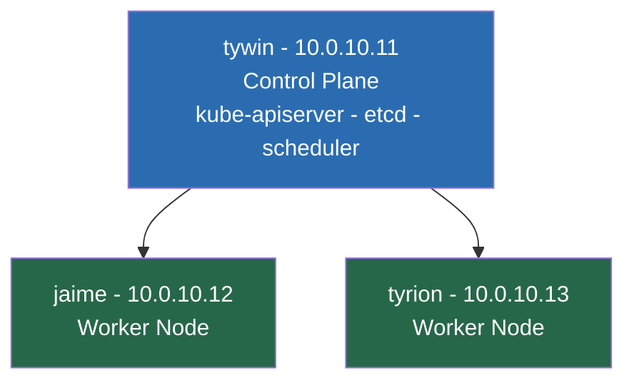
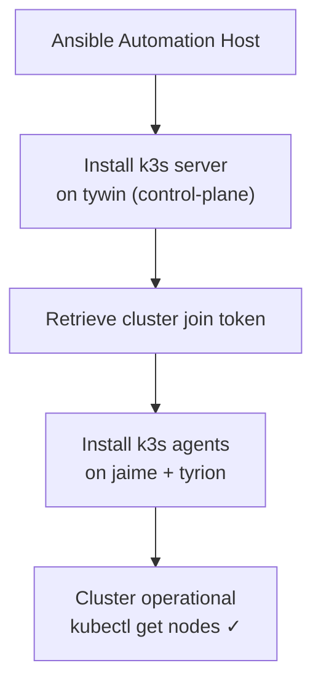

# 02 — Kubernetes Installation (k3s via Ansible)
## Bootstrapping the Cluster

**Author:** Kagiso Tjeane
**Difficulty:** ⭐⭐⭐⭐⭐⭐☆☆☆☆ (6/10)
**Guide:** 02 of 14

> In this phase we install Kubernetes using **k3s** and the existing Ansible automation.

---

# Why k3s

Kubernetes can be installed in many ways. Common approaches include:

• kubeadm
• managed cloud clusters
• k3s

For this platform we intentionally use **k3s**.

k3s is a lightweight Kubernetes distribution created by Rancher that packages
core Kubernetes components into a simplified deployment model.

Key advantages include:

• extremely simple installation
• embedded etcd datastore
• minimal resource footprint
• full Kubernetes API compatibility

k3s behaves like a normal Kubernetes cluster while significantly reducing
operational complexity.

---

# Why Installation Is Automated

A Kubernetes cluster should **never be installed manually**.

Manual installation introduces several problems:

• inconsistent configuration between nodes
• undocumented setup steps
• difficult disaster recovery

Instead, the cluster installation is performed through **Ansible playbooks**.

Automation provides:

```
repeatability
documentation
disaster recovery capability
```

If the cluster ever needs to be rebuilt, the same playbook can be executed again.

---

# Automation Repository Structure

The automation repository used for cluster installation has the following structure.

```
ansible/
├── ansible.cfg
├── inventory
│   └── homelab.yml
├── playbooks
│   ├── lifecycle
│   │   ├── install-cluster.yml
│   │   ├── install-platform.yml
│   │   └── purge-k3s.yml
│   ├── maintenance
│   │   ├── reboot-nodes.yml
│   │   └── upgrade-nodes.yml
│   ├── security
│   │   ├── disable-swap.yml
│   │   ├── fail2ban.yml
│   │   ├── firewall.yml
│   │   ├── ssh-hardening.yml
│   │   └── time-sync.yml
│   └── services
│       └── install-pihole.yml
└── roles
    └── k3s_install
        ├── defaults
        └── tasks
```

This repository represents **the source of truth for cluster provisioning**.

---

# Cluster Topology

The cluster consists of three nodes.



Node roles:

| Node | Role |
|-----|------|
tywin | control-plane |
jaime | worker |
tyrion | worker |

---

# Control Plane Responsibilities

The control-plane node runs the core Kubernetes control components.

```
kube-apiserver
kube-controller-manager
kube-scheduler
etcd
```

These components coordinate all cluster activity.

Worker nodes host:

• application workloads
• platform services
• stateful workloads

---

# Installing the Cluster

Cluster installation is executed using the existing playbook.

From the automation host, run from the repository root:

```bash
cd ~/homelab-infrastructure/ansible
ansible-playbook playbooks/lifecycle/install-cluster.yml
```

The playbook performs the following operations:

1. installs k3s server on the control-plane node
2. retrieves the cluster join token
3. installs k3s agents on worker nodes
4. configures cluster connectivity

Because the installation is automated, the entire cluster can be deployed
in a few minutes.

---

# Installation Flow

The high level installation process looks like this.



This process ensures every node is configured consistently.

---

# Retrieving Kubeconfig

After installation the playbook retrieves the cluster kubeconfig file
from the control-plane node.

The kubeconfig allows the automation host to communicate with the cluster.

Verify connectivity:

```
kubectl get nodes
```

Expected output:

```
tywin    Ready
jaime    Ready
tyrion   Ready
```

---

# Verifying System Components

Next verify that system pods are running.

```
kubectl get pods -A
```

Core components should include:

```
coredns
metrics-server
local-path-provisioner
```
These components are deployed automatically by k3s.

---

# Understanding the Embedded Datastore

k3s uses an embedded **etcd datastore** to store cluster state.

This datastore maintains information about:

• nodes
• pods
• services
• cluster configuration

The reliability of the control-plane node is therefore critical.

Later in this handbook we will introduce **Velero backups**
to protect this cluster state.

---

# Common Installation Issues

Several problems may occur during installation.

### SSH Connectivity

If Ansible cannot connect to nodes, the playbook will fail.

Verify connectivity:

```
ansible all -m ping
```

---

### Firewall Blocking Ports

If cluster ports are blocked the workers may fail to join the cluster.

Ensure port **6443** is reachable between nodes.

---

### Incorrect Inventory

If the Ansible inventory does not correctly list the nodes,
installation will not succeed.

Always verify the inventory before running the playbook.

---

# Exit Criteria

This phase is complete when:

```
kubectl get nodes
```

returns:

```
control-plane Ready
worker nodes Ready
```

Additionally:

```
kubectl get pods -A
```

should show all system pods running.

---

# Next Guide

➡ **[03 — Networking Platform (MetalLB + Traefik)](./03-Networking-Platform.md)**

The next guide introduces the networking layer that exposes services
from the cluster to the local network.

---

## Navigation

| | Guide |
|---|---|
| ← Previous | [01 — Node Preparation & Hardening](./01-Node-Preparation-Hardening.md) |
| Current | **02 — Kubernetes Installation** |
| → Next | [03 — Networking Platform](./03-Networking-Platform.md) |
