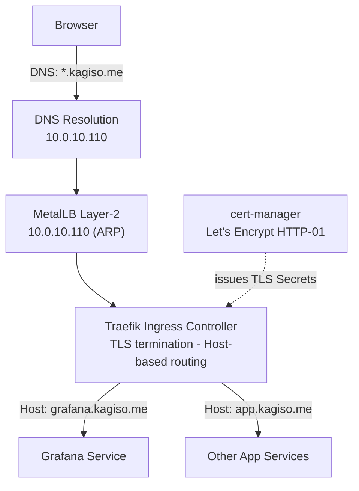
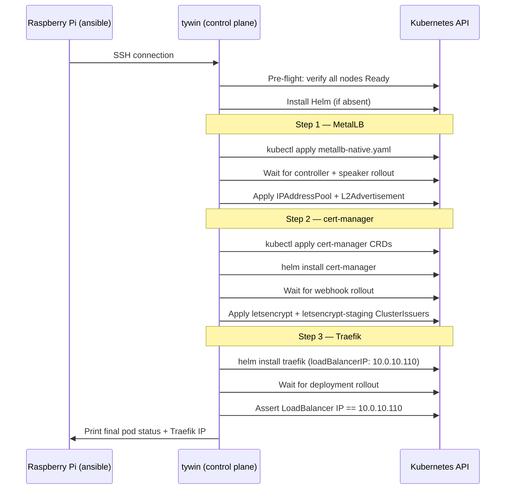
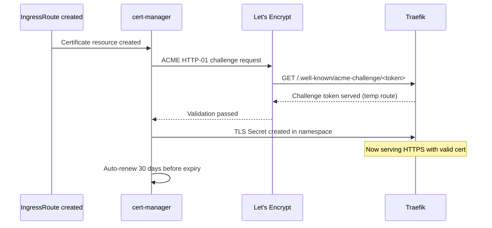

# 03 — Networking Platform (MetalLB + Traefik + DNS + TLS)
## Exposing Services from the Cluster

**Author:** Kagiso Tjeane
**Difficulty:** ⭐⭐⭐⭐⭐⭐⭐☆☆☆ (7/10)
**Guide:** 03 of 12

> Kubernetes clusters running on bare-metal do not provide built‑in load balancers or ingress gateways.
>
> This phase introduces the **networking platform** responsible for exposing cluster services to the network
> in a predictable, production‑style way.
>
> All three components (MetalLB, cert-manager, Traefik) are installed by a **single Ansible playbook**
> that handles ordering, dependency waits, and post-install verification automatically.

The networking layer consists of:

- **MetalLB** — provides LoadBalancer IP addresses on bare metal
- **Traefik** — ingress controller handling HTTP/S routing
- **Wildcard DNS** — human‑friendly service hostnames
- **cert-manager** — automatic TLS certificate lifecycle

Together these components transform a raw Kubernetes cluster into a **usable application platform**.

---

## Table of Contents

1. [Why a Networking Layer Is Required](#why-a-networking-layer-is-required)
2. [Full Networking Architecture](#full-networking-architecture)
3. [Component Overview](#component-overview)
4. [Prerequisites](#prerequisites)
5. [Installation — Ansible Playbook](#installation--ansible-playbook)
6. [What the Playbook Does](#what-the-playbook-does)
7. [DNS Configuration](#dns-configuration)
8. [TLS Certificate Flow](#tls-certificate-flow)
9. [Ingress vs IngressRoute](#ingress-vs-ingressroute)
10. [Verifying the Platform](#verifying-the-platform)
11. [Exit Criteria](#exit-criteria)
12. [Troubleshooting](#troubleshooting)

---

## Why a Networking Layer Is Required

In cloud environments Kubernetes automatically provisions load balancers:

```
AWS   → Elastic Load Balancer
GCP   → Cloud Load Balancer
Azure → Azure Load Balancer
```

Bare‑metal clusters lack this functionality. Without a networking platform, services appear like this:

```
kubectl get svc

NAME       TYPE           CLUSTER-IP     EXTERNAL-IP   PORT(S)
grafana    LoadBalancer   10.96.44.12    <pending>     80:31234/TCP
```

`<pending>` means no external IP was ever assigned — the service is unreachable from outside the cluster.

MetalLB solves this problem by allowing Kubernetes to allocate real IP addresses from the local network
and advertising them using ARP (Layer-2 mode), making the cluster appear to "own" those IPs to the rest
of the LAN.

---

## Full Networking Architecture



Traffic flows from the browser through DNS → MetalLB → Traefik → the target service. cert-manager
runs in the background, keeping TLS certificates renewed and storing them as Kubernetes Secrets that
Traefik serves to clients.

---

## Component Overview

| Component | Version | Namespace | Responsibility |
|-----------|---------|-----------|----------------|
| MetalLB | v0.14.5 | `metallb-system` | Assign LoadBalancer IPs from the local IP pool |
| cert-manager | v1.14.4 | `cert-manager` | Issue + auto-renew TLS certificates via Let's Encrypt |
| Traefik | 28.x | `traefik` | HTTP/S routing, TLS termination, IngressRoute CRDs |

### MetalLB — Layer-2 Mode

MetalLB operates in Layer-2 (ARP) mode for this homelab. A Speaker pod on each node listens for
ARP requests and claims ownership of addresses in the pool:

```
Client sends ARP: "Who owns 10.0.10.110?"
MetalLB Speaker responds: "I do" (node MAC address)
Traffic routed to that node → kube-proxy → Traefik pod
```

**IP pool:** `10.0.10.110 – 10.0.10.125` (21 addresses available for LoadBalancer services)
**Traefik pinned to:** `10.0.10.110`

### cert-manager — ACME HTTP-01

cert-manager handles the full TLS lifecycle:

1. An IngressRoute references a TLS secret
2. cert-manager sees the Certificate resource and initiates an ACME HTTP-01 challenge
3. Let's Encrypt sends a GET to `http://<domain>/.well-known/acme-challenge/<token>`
4. Traefik serves the challenge response (cert-manager creates a temporary route)
5. Let's Encrypt validates and issues the certificate
6. cert-manager stores the cert as a Kubernetes Secret
7. Traefik reads the Secret and serves HTTPS
8. cert-manager auto-renews 30 days before expiry

### Traefik — Ingress Controller

Traefik is the single entry point for all HTTP/S traffic. It:

- Listens on port 80 and 443 at `10.0.10.110`
- Redirects all HTTP → HTTPS automatically
- Routes requests to the correct backend Service based on the `Host` header
- Serves TLS certificates stored as Kubernetes Secrets by cert-manager

---

## Prerequisites

Before running the platform playbook:

| Requirement | Check |
|-------------|-------|
| k3s cluster running | `kubectl get nodes` — all nodes Ready |
| Ansible installed on RPi | `ansible --version` |
| RPi can SSH to tywin (10.0.10.11) | `ssh kagiso@10.0.10.11` |
| DNS wildcard configured | `*.kagiso.me → 10.0.10.110` in your DNS server |
| Ports 80 and 443 reachable | Router/firewall allows traffic to `10.0.10.110` |

> **DNS note:** The wildcard DNS record must be configured in your DNS server (e.g., Pi-hole,
> router, or upstream DNS provider) before cert-manager can complete HTTP-01 challenges.
> The record should point `*.kagiso.me` to `10.0.10.110` (the Traefik LoadBalancer IP).

---

## Installation — Ansible Playbook

The entire networking platform is installed by a single playbook from the Raspberry Pi control hub:

```bash
# From the Raspberry Pi (10.0.10.10)
ansible-playbook -i ansible/inventory/homelab.yml \
  ansible/playbooks/lifecycle/install-platform.yml
```

**Playbook location:** [`ansible/playbooks/lifecycle/install-platform.yml`](../../ansible/playbooks/lifecycle/install-platform.yml)

To install only a specific component (using tags):

```bash
# MetalLB only
ansible-playbook ... --tags metallb

# cert-manager only
ansible-playbook ... --tags cert-manager

# Traefik only
ansible-playbook ... --tags traefik
```

To override defaults (e.g., for a different email or IP range):

```bash
ansible-playbook ... \
  -e letsencrypt_email=your@email.com \
  -e metallb_ip_range=10.0.10.110-10.0.10.125 \
  -e traefik_loadbalancer_ip=10.0.10.110
```

---

## What the Playbook Does

The playbook runs on the k3s control plane node (`tywin`) in strict dependency order:



The playbook performs explicit waits after each rollout and asserts that Traefik received the
expected LoadBalancer IP from MetalLB before completing.

---

## DNS Configuration

Once the platform is installed, all service hostnames follow the pattern:

```
<service>.kagiso.me → 10.0.10.110 → Traefik → backend Service
```

Configure a single wildcard record in your DNS server:

| Record | Type | Value |
|--------|------|-------|
| `*.kagiso.me` | A | `10.0.10.110` |

This means every subdomain automatically resolves to Traefik, which then routes by `Host` header.
No new DNS records are needed when adding services — only new IngressRoutes in Kubernetes.

---

## TLS Certificate Flow



Two ClusterIssuers are created by the playbook:

- **`letsencrypt-staging`** — Use this first when testing new certificate configs. Staging certs
  are invalid (not trusted by browsers) but do not count against Let's Encrypt rate limits.
- **`letsencrypt`** — Production issuer. Use this for real services once staging is confirmed working.

IngressRoute TLS configuration references the issuer via annotation:

```yaml
apiVersion: traefik.io/v1alpha1
kind: IngressRoute
metadata:
  name: grafana
  annotations:
    cert-manager.io/cluster-issuer: letsencrypt
spec:
  entryPoints: [websecure]
  routes:
    - match: Host(`grafana.kagiso.me`)
      kind: Rule
      services:
        - name: grafana
          port: 3000
  tls:
    secretName: grafana-tls
```

---

## Ingress vs IngressRoute

Traefik supports two routing models:

### Standard Kubernetes Ingress

```yaml
apiVersion: networking.k8s.io/v1
kind: Ingress
metadata:
  name: grafana
spec:
  ingressClassName: traefik
  rules:
    - host: grafana.kagiso.me
      http:
        paths:
          - path: /
            pathType: Prefix
            backend:
              service:
                name: grafana
                port:
                  number: 3000
```

- Portable across ingress controllers
- Limited to basic path/host routing
- No middleware support without annotations

### Traefik IngressRoute (Recommended)

```yaml
apiVersion: traefik.io/v1alpha1
kind: IngressRoute
metadata:
  name: grafana
spec:
  entryPoints: [websecure]
  routes:
    - match: Host(`grafana.kagiso.me`)
      kind: Rule
      middlewares:
        - name: secure-headers
      services:
        - name: grafana
          port: 3000
  tls:
    secretName: grafana-tls
```

- Full Traefik routing rule syntax
- Middleware support (auth, rate limiting, headers)
- Better observability via Traefik dashboard

**All homelab services use IngressRoute.** The pattern is established in
[`apps/base/grafana/`](../../apps/base/grafana/) and followed by all subsequent applications.

---

## Verifying the Platform

After the playbook completes, run these checks from the RPi:

```bash
# MetalLB — controller and speakers running
kubectl get pods -n metallb-system
# Expected: metallb-controller (1/1) and metallb-speaker (1/1 per node)

# MetalLB — IP pool configured
kubectl get ipaddresspool -n metallb-system
# Expected: homelab-pool with 10.0.10.110-10.0.10.125

# cert-manager — all pods running
kubectl get pods -n cert-manager
# Expected: cert-manager, cert-manager-cainjector, cert-manager-webhook (all 1/1)

# cert-manager — ClusterIssuers ready
kubectl get clusterissuer
# Expected: letsencrypt and letsencrypt-staging both READY=True

# Traefik — running and assigned LoadBalancer IP
kubectl get svc -n traefik
# Expected: traefik TYPE=LoadBalancer EXTERNAL-IP=10.0.10.110

# End-to-end — Traefik is responding (expect 404, not connection refused)
curl -k https://10.0.10.110
# Expected: 404 page not found
```

The `404 page not found` response from Traefik is correct — it means Traefik is running and
handling requests, but no IngressRoute has been defined yet to route them anywhere.

---

## Exit Criteria

The networking platform is complete when all of the following are true:

- ✓ `kubectl get pods -n metallb-system` — all pods Running
- ✓ `kubectl get pods -n cert-manager` — all pods Running
- ✓ `kubectl get pods -n traefik` — pod Running
- ✓ Traefik service shows `EXTERNAL-IP: 10.0.10.110`
- ✓ `kubectl get clusterissuer` — both issuers `READY=True`
- ✓ `curl -k https://10.0.10.110` returns `404 page not found`
- ✓ DNS wildcard `*.kagiso.me` resolves to `10.0.10.110` from a client machine

---

## Troubleshooting

**Traefik `EXTERNAL-IP` stays `<pending>`**

MetalLB did not assign an IP. Check:

```bash
kubectl describe svc traefik -n traefik          # Look for events
kubectl get ipaddresspool -n metallb-system      # Pool must exist
kubectl get pods -n metallb-system               # Speakers must be Running
```

Ensure `10.0.10.110` is within the configured pool range (`10.0.10.110-10.0.10.125`).

**cert-manager ClusterIssuer not Ready**

```bash
kubectl describe clusterissuer letsencrypt       # Check Status.Conditions
kubectl logs -n cert-manager deploy/cert-manager # Look for ACME errors
```

Common cause: the ACME account registration requires an internet connection. Verify the cluster
can reach `acme-v02.api.letsencrypt.org`.

**Certificate stuck in `Pending`**

```bash
kubectl describe certificate <name> -n <namespace>  # Check events
kubectl describe certificaterequest -n <namespace>   # Check challenge status
kubectl get challenges -n <namespace>               # HTTP-01 challenge status
```

Common cause: `*.kagiso.me` DNS not yet pointing to `10.0.10.110`, so Let's Encrypt cannot
complete the HTTP-01 challenge.

**Traefik returning 404 for a deployed service**

```bash
kubectl get ingressroute -A                     # Verify the IngressRoute exists
kubectl describe ingressroute <name> -n <ns>    # Check the Host rule
kubectl logs -n traefik deploy/traefik          # Check for routing errors
```

Ensure the `Host()` rule in the IngressRoute matches the requested hostname exactly.

---

## Next Guide

➡ **[04 — GitOps Control Plane (FluxCD)](./04-Flux-GitOps.md)**

The next phase introduces FluxCD, allowing the entire platform to be managed declaratively through Git.

---

## Navigation

| | Guide |
|---|---|
| ← Previous | [02 — Kubernetes Installation](./02-Kubernetes-Installation.md) |
| Current | **03 — Networking Platform** |
| → Next | [04 — GitOps Control Plane](./04-Flux-GitOps.md) |
