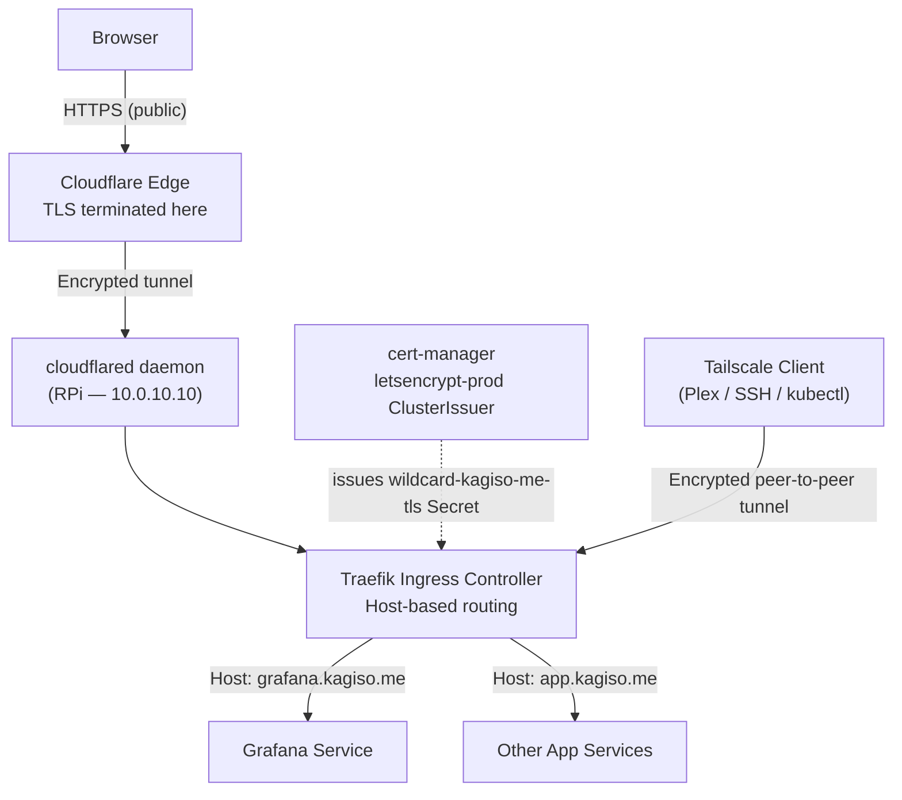
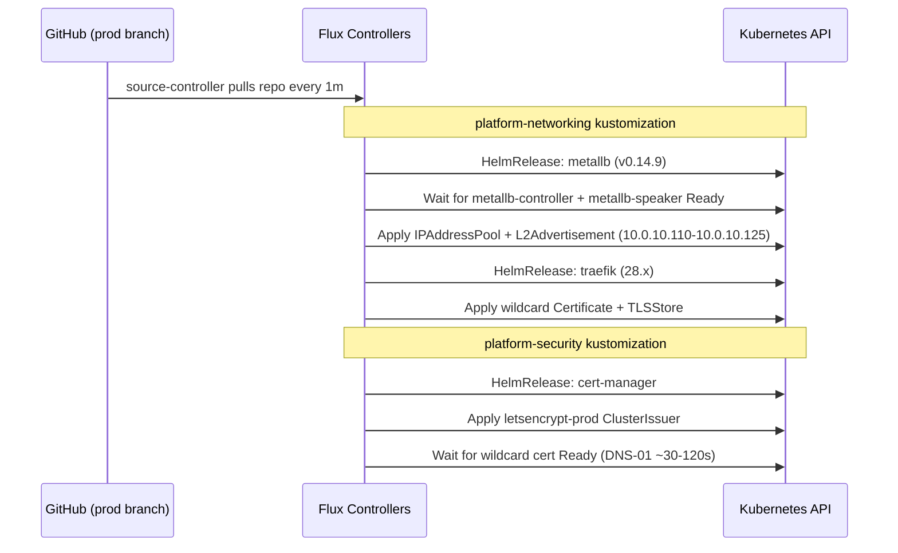

# 03 — Networking Platform (MetalLB + Traefik + DNS + TLS)
## Exposing Services from the Cluster

**Author:** Kagiso Tjeane
**Difficulty:** ⭐⭐⭐⭐⭐⭐⭐☆☆☆ (7/10)
**Guide:** 03 of 13

> Kubernetes clusters running on bare-metal do not provide built‑in load balancers or ingress gateways.
>
> This phase introduces the **networking platform** responsible for exposing cluster services to the network
> in a predictable, production‑style way.
>
> MetalLB, cert-manager, and Traefik are **managed entirely by Flux GitOps** via HelmReleases and
> Kustomizations committed to this repository. They are not manually installed — Flux reconciles
> them automatically after the cluster is bootstrapped in Guide 04.
> Cloudflare Tunnel and Tailscale are separate setup steps covered later in this guide.

The networking layer consists of:

- **MetalLB** — provides LoadBalancer IP addresses on bare metal
- **Traefik** — ingress controller handling HTTP/S routing
- **Wildcard DNS** — human-friendly service hostnames
- **cert-manager** — issues browser-trusted wildcard TLS cert (`*.kagiso.me`) via Let's Encrypt DNS-01 + Cloudflare API
- **Cloudflare Tunnel** — outbound tunnel for public service exposure (no open inbound ports)
- **Tailscale / Headscale** — encrypted private access for Plex, SSH, and kubectl

Together these components transform a raw Kubernetes cluster into a **usable application platform**.

---

## Table of Contents

1. [Why a Networking Layer Is Required](#why-a-networking-layer-is-required)
2. [Full Networking Architecture](#full-networking-architecture)
3. [Component Overview](#component-overview)
4. [Prerequisites](#prerequisites)
5. [Installation — Via Flux GitOps](#installation--via-flux-gitops)
6. [What Flux Manages](#what-flux-manages)
7. [DNS Configuration](#dns-configuration)
8. [Cloudflare Tunnel Setup](#cloudflare-tunnel-setup)
9. [Pi-hole (Split DNS + Ad Blocking)](#pi-hole-split-dns--ad-blocking)
10. [Tailscale / Headscale (Private Remote Access)](#tailscale--headscale-private-remote-access)
11. [TLS Certificate Flow](#tls-certificate-flow)
12. [Ingress vs IngressRoute](#ingress-vs-ingressroute)
13. [Verifying the Platform](#verifying-the-platform)
14. [Exit Criteria](#exit-criteria)
15. [Troubleshooting](#troubleshooting)

---

## Why a Networking Layer Is Required

In cloud environments Kubernetes automatically provisions load balancers:

```
AWS   → Elastic Load Balancer
GCP   → Cloud Load Balancer
Azure → Azure Load Balancer
```

Bare‑metal clusters lack this functionality. Without a networking platform, services appear like this:

```
kubectl get svc

NAME       TYPE           CLUSTER-IP     EXTERNAL-IP   PORT(S)
grafana    LoadBalancer   10.96.44.12    <pending>     80:31234/TCP
```

`<pending>` means no external IP was ever assigned — the service is unreachable from outside the cluster.

MetalLB solves this problem by allowing Kubernetes to allocate real IP addresses from the local network
and advertising them using ARP (Layer-2 mode), making the cluster appear to "own" those IPs to the rest
of the LAN.

---

## Full Networking Architecture



Traffic flows from the browser through Cloudflare Edge → cloudflared tunnel → Traefik → the target service. Cloudflare handles public TLS automatically. For private remote access (Plex, SSH, kubectl), Tailscale provides encrypted peer-to-peer tunnels with its own certificate infrastructure. cert-manager issues and renews the single `*.kagiso.me` wildcard certificate used by Traefik for all LAN and Cloudflare Tunnel services.

---

## Component Overview

| Component | Version | Namespace | Managed By | Responsibility |
|-----------|---------|-----------|------------|----------------|
| MetalLB | 0.14.9 (Helm) | `metallb-system` | Flux HelmRelease | Assign LoadBalancer IPs from the local IP pool |
| cert-manager | v1.14.4 (Helm) | `cert-manager` | Flux HelmRelease | Issues `*.kagiso.me` wildcard cert via Let's Encrypt DNS-01 (Cloudflare API) |
| Traefik | 28.x (Helm) | `ingress` | Flux HelmRelease | HTTP/S routing, TLS termination, IngressRoute CRDs |

All three are defined as HelmReleases under `platform/networking/` and `platform/security/`, reconciled by Flux after the cluster is bootstrapped. See [Guide 04](./04-Flux-GitOps.md) for the bootstrap process.

### MetalLB — Layer-2 Mode

MetalLB operates in Layer-2 (ARP) mode for this homelab. A Speaker pod on each node listens for
ARP requests and claims ownership of addresses in the pool:

```
Client sends ARP: "Who owns 10.0.10.110?"
MetalLB Speaker responds: "I do" (node MAC address)
Traffic routed to that node → kube-proxy → Traefik pod
```

**IP pool:** `10.0.10.110 – 10.0.10.125` (21 addresses available for LoadBalancer services)
**Traefik pinned to:** `10.0.10.110`

### cert-manager — Wildcard TLS via Let's Encrypt DNS-01

cert-manager issues a single `*.kagiso.me` wildcard certificate using Let's Encrypt and the DNS-01 challenge via the Cloudflare API. Because DNS-01 proves ownership by writing a TXT record in Cloudflare DNS — rather than by serving an HTTP challenge — the certificate is issued without any public HTTP exposure. This means **every service, including LAN-only internal services, gets a browser-trusted TLS certificate automatically**.

The wildcard cert is stored as a Kubernetes Secret (`wildcard-kagiso-me-tls`) in the `ingress` namespace and is configured as Traefik's default TLS certificate via a `TLSStore` resource. No per-service `Certificate` resource is required.

**The three TLS paths are:**

- **Public services** → Cloudflare Tunnel + wildcard cert. TLS is terminated at Cloudflare Edge. Internally, Traefik serves the wildcard cert to `cloudflared`.
- **LAN / internal services** → wildcard cert via Traefik default TLSStore. Browser-trusted on any device whose DNS resolves `*.kagiso.me` to `10.0.10.110` (via Pi-hole).
- **Private remote access** → Tailscale. Plex, SSH, and kubectl use Tailscale's own encrypted tunnels. No cert-manager involvement.

### Traefik — Ingress Controller

Traefik is the single entry point for all HTTP/S traffic. It:

- Listens on port 80 and 443 at `10.0.10.110`
- Redirects all HTTP → HTTPS automatically
- Routes requests to the correct backend Service based on the `Host` header
- Serves TLS certificates stored as Kubernetes Secrets by cert-manager

---

## Prerequisites

Before running the Flux bootstrap:

| Requirement | Check |
|-------------|-------|
| k3s cluster running | `kubectl get nodes` — all nodes Ready |
| Ansible installed on RPi | `ansible --version` |
| RPi can SSH to tywin (10.0.10.11) | `ssh kagiso@10.0.10.11` |
| Ansible Vault file created | `ansible/vars/vault.yml` exists on the RPi — see [Guide 04 Vault Setup](./04-Flux-GitOps.md#ansible-vault-setup) |
| Flux SSH deploy key in vault | `flux_github_ssh_private_key` present in vault — see [Guide 04](./04-Flux-GitOps.md#saving-the-deploy-key-to-vault) |

> **DNS note:** Internal DNS (Pi-hole or router) should point `*.kagiso.me` to `10.0.10.110` for
> LAN and Tailscale access. Cloudflare Tunnel setup is a separate step — see the
> [Cloudflare Tunnel Setup](#cloudflare-tunnel-setup) section below.

---

## Installation — Via Flux GitOps

MetalLB, cert-manager, and Traefik are **not installed manually**. They are defined as Flux
HelmReleases in this repository and reconciled automatically after the cluster is bootstrapped.

The full installation process — including the `install-platform.yml` playbook that triggers Flux
reconciliation — is covered in **[Guide 04 — GitOps Control Plane](./04-Flux-GitOps.md)**.

---

## What Flux Manages

Flux reconciles the networking platform in dependency order:



The manifests driving this are located at:

```
platform/
├── networking/
│   ├── metallb/          ← HelmRelease + HelmRepository
│   ├── metallb-config/   ← IPAddressPool + L2Advertisement
│   └── traefik/          ← HelmRelease + middlewares + wildcard cert + TLSStore
└── security/
    └── cert-manager/     ← HelmRelease + ClusterIssuer
```

Any change to these manifests (e.g., upgrading a chart version) is made via a Git commit.
Flux detects the change and reconciles the cluster to match. No `helm upgrade` or `kubectl apply`
commands are run manually.

---

## DNS Configuration

There are two DNS layers: Cloudflare (public) and internal DNS (LAN/Tailscale).

### Cloudflare DNS — Public access

Public services use proxied CNAME records in Cloudflare, pointing to the Cloudflare Tunnel:

| Record | Type | Value | Proxy |
|--------|------|-------|-------|
| `cloud.kagiso.me` | CNAME | `<tunnel-id>.cfargotunnel.com` | Proxied (orange cloud) |
| `photos.kagiso.me` | CNAME | `<tunnel-id>.cfargotunnel.com` | Proxied (orange cloud) |

With Cloudflare proxying enabled, external clients resolve to Cloudflare's anycast IPs — the home network IP is never exposed publicly.

### Internal DNS — LAN and Tailscale access

Configure a wildcard record on the internal DNS server (Pi-hole or router):

| Record | Type | Value |
|--------|------|-------|
| `*.kagiso.me` | A | `10.0.10.110` |

This routes all internal hostnames directly to Traefik, bypassing Cloudflare. New services added to Kubernetes are immediately reachable on the LAN without DNS changes — only a new IngressRoute is required. When connected via Tailscale, the same wildcard resolves to `10.0.10.110` if the internal DNS server is set as the Tailscale DNS resolver.

---

## Cloudflare Tunnel Setup

Cloudflare Tunnel (`cloudflared`) creates an outbound encrypted connection from the homelab to Cloudflare's edge. No inbound ports need to be opened on the router or firewall — the tunnel is initiated from inside the network.

**How it works:** `cloudflared` on the RPi establishes persistent outbound connections to Cloudflare's edge. When a request arrives at `grafana.kagiso.me`, Cloudflare routes it through the tunnel to `cloudflared`, which forwards it to Traefik at `10.0.10.110`. Traefik matches the `Host` header and routes to the correct backend service.

### Installation on RPi (arm64)

```bash
# On the Raspberry Pi (10.0.10.10)
curl -L --output cloudflared.deb \
  https://github.com/cloudflare/cloudflared/releases/latest/download/cloudflared-linux-arm64.deb
sudo dpkg -i cloudflared.deb
cloudflared --version
```

### Authenticate and Create Tunnel

```bash
cloudflared tunnel login
cloudflared tunnel create homelab
```

`tunnel login` opens a browser to authenticate with Cloudflare. `tunnel create` registers the tunnel and writes the credentials file to `~/.cloudflared/`.

### Config File

Create `/etc/cloudflared/config.yml`:

```yaml
tunnel: <tunnel-id>
credentials-file: /root/.cloudflared/<tunnel-id>.json
ingress:
  - hostname: nextcloud.kagiso.me
    service: http://10.0.10.110
    originRequest:
      httpHostHeader: nextcloud.kagiso.me
  - hostname: immich.kagiso.me
    service: http://10.0.10.110
    originRequest:
      httpHostHeader: immich.kagiso.me
  - service: http_status:404
```

The `httpHostHeader` ensures Traefik receives the original hostname and routes to the correct backend. The catch-all `http_status:404` at the end is required — `cloudflared` rejects configs without a final catch-all rule.

### Route DNS and Install as Service

```bash
cloudflared tunnel route dns homelab nextcloud.kagiso.me
cloudflared tunnel route dns homelab immich.kagiso.me
sudo cloudflared service install
sudo systemctl enable --now cloudflared
```

`tunnel route dns` creates the proxied CNAME record in Cloudflare DNS automatically.

### Adding a New Service

Adding a new public service only requires adding an ingress rule to `/etc/cloudflared/config.yml` and restarting `cloudflared`. No Cloudflare dashboard changes are needed if using tunnel DNS routing:

```bash
# Add rule to config.yml, then:
sudo systemctl restart cloudflared
# Run once to create the DNS record:
cloudflared tunnel route dns homelab newservice.kagiso.me
```

> **Plex / media streaming:** Do NOT route Plex through Cloudflare Tunnel. Cloudflare's ToS prohibits proxying video streaming. Use Tailscale instead (see next section).

---

## Pi-hole (Split DNS + Ad Blocking)

Pi-hole runs on the RPi at `10.0.10.10` alongside `cloudflared`. It serves as the DNS resolver for every device on the LAN and provides two key capabilities:

- **Split DNS:** The wildcard entry `*.kagiso.me → 10.0.10.110` means all internal services with a `*.kagiso.me` hostname resolve directly to Traefik on the LAN — without being publicly exposed.
- **Ad blocking:** Network-wide DNS-based ad filtering for all LAN clients.

### Installation

Pi-hole is installed via an Ansible playbook. Run from inside the `ansible/` directory on the RPi:

```bash
cd ~/homelab-infrastructure/ansible
ansible-playbook -i inventory/homelab.yml \
  playbooks/services/install-pihole.yml
```

The playbook installs Pi-hole, configures the `*.kagiso.me` wildcard dnsmasq directive, and sets upstream resolvers to Cloudflare `1.1.1.1` / `1.0.0.1` with DNSSEC.

### Post-Install: Set USG DHCP DNS

After installation, configure the UniFi Security Gateway to hand out Pi-hole as the DNS server for all DHCP clients:

```
UniFi Controller → Networks → [LAN network] → DHCP → DNS Server 1: 10.0.10.10
```

Once this is set, all LAN devices will use Pi-hole for DNS resolution automatically on their next DHCP renewal.

### Admin UI

Pi-hole's admin dashboard is accessible at:

```
http://10.0.10.10/admin
```

### Security Model: Certs Don't Expose Services

> **The TLS certificate does not expose a service. DNS and routing do.**

A service can have a valid `*.kagiso.me` cert and still be completely invisible from the internet. Pi-hole's wildcard makes the hostname resolvable on the LAN. For a service to be reachable from the WAN, it needs **both** a public Cloudflare DNS record **and** an ingress rule in the `cloudflared` config. Without those, the hostname simply does not resolve outside the LAN.

### Adding a New Internal-Only Service

Create an `IngressRoute` in k3s with the desired `Host(*.kagiso.me)` rule. No DNS changes are needed — Pi-hole's wildcard `*.kagiso.me → 10.0.10.110` handles resolution on the LAN automatically.

The service is reachable on the LAN. It is not reachable from the WAN.

### Adding a New Public Service

Three steps are required:

1. Create an `IngressRoute` in k3s with the desired hostname.
2. Add a hostname ingress rule to `/etc/cloudflared/config.yml` on the RPi and restart `cloudflared`.
3. Add a proxied CNAME record in Cloudflare DNS pointing to the tunnel:

```bash
cloudflared tunnel route dns homelab newservice.kagiso.me
sudo systemctl restart cloudflared
```

---

## Tailscale / Headscale (Private Remote Access)

The access model is split by service type:

- **Public web services** (Nextcloud, Immich) → Cloudflare Tunnel
- **Private services** (Plex, SSH, kubectl) → Tailscale

Tailscale creates encrypted WireGuard-based peer-to-peer tunnels between devices. Devices enrolled in the same Tailscale network can reach each other directly using Tailscale IPs or MagicDNS hostnames.

### Install Tailscale on RPi and Nodes

```bash
curl -fsSL https://tailscale.com/install.sh | sh
sudo tailscale up
```

Run this on each device that needs remote access (RPi, workstation, phone, etc.). After `tailscale up`, each device gets a stable Tailscale IP (100.x.x.x range).

### Accessing Plex via Tailscale

Once enrolled, access Plex directly using its Tailscale IP or via MagicDNS:

```
# Direct by Tailscale IP
http://100.x.x.x:32400/web

# Via MagicDNS (if enabled in Tailscale admin)
http://plex-host.tail<network>.ts.net:32400/web
```

No Traefik IngressRoute is required for Tailscale-only services — clients connect directly to the host running the service.

### SSH and kubectl via Tailscale

```bash
# SSH to a homelab node over Tailscale
ssh kagiso@100.x.x.x

# kubectl via Tailscale (after adding Tailscale IP to kubeconfig)
kubectl --server=https://100.x.x.x:6443 get nodes
```

### Headscale — Self-Hosted Coordination Server

[Headscale](https://headscale.net/) is a self-hosted alternative to the Tailscale coordination server. Running Headscale as an LXC container on Proxmox removes the dependency on Tailscale's hosted service. This is a planned future enhancement for this homelab.

> **TLS note:** Tailscale handles its own certificate infrastructure for MagicDNS and HTTPS. No cert-manager configuration or Let's Encrypt setup is required for Tailscale-connected services.

---

## TLS Certificate Flow

TLS is handled by three paths. A single wildcard cert covers all `*.kagiso.me` services automatically.

**Wildcard cert → `*.kagiso.me`.** cert-manager requests one certificate from Let's Encrypt using DNS-01 (Cloudflare API). The resulting Secret (`wildcard-kagiso-me-tls` in the `ingress` namespace) is configured as Traefik's default TLS certificate via a `TLSStore` resource. Every IngressRoute using `entryPoints: [websecure]` and `tls: {}` automatically serves this cert — no per-service `Certificate` resource is needed.

**Public services → Cloudflare Tunnel.** TLS is terminated at the Cloudflare Edge. Internally, `cloudflared` forwards requests to Traefik over HTTP. Cloudflare manages its own edge certificate separately.

**Private remote access → Tailscale.** Plex, SSH, and `kubectl` use Tailscale's encrypted tunnels. No cert-manager involvement.

**IngressRoute pattern (all services):**

```yaml
apiVersion: traefik.io/v1alpha1
kind: IngressRoute
metadata:
  name: my-service
  namespace: my-namespace
spec:
  entryPoints: [websecure]
  routes:
    - match: Host(`my-service.kagiso.me`)
      kind: Rule
      services:
        - name: my-service
          port: 8080
  tls: {}    # Uses wildcard-kagiso-me-tls from Traefik default TLSStore
```

---

## Ingress vs IngressRoute

Traefik supports two routing models:

### Standard Kubernetes Ingress

```yaml
apiVersion: networking.k8s.io/v1
kind: Ingress
metadata:
  name: grafana
spec:
  ingressClassName: traefik
  rules:
    - host: grafana.kagiso.me
      http:
        paths:
          - path: /
            pathType: Prefix
            backend:
              service:
                name: grafana
                port:
                  number: 3000
```

- Portable across ingress controllers
- Limited to basic path/host routing
- No middleware support without annotations

### Traefik IngressRoute (Recommended)

```yaml
apiVersion: traefik.io/v1alpha1
kind: IngressRoute
metadata:
  name: grafana
spec:
  entryPoints: [websecure]
  routes:
    - match: Host(`grafana.kagiso.me`)
      kind: Rule
      middlewares:
        - name: secure-headers
      services:
        - name: grafana
          port: 3000
  tls: {}    # Uses wildcard-kagiso-me-tls from Traefik default TLSStore
```

- Full Traefik routing rule syntax
- Middleware support (auth, rate limiting, headers)
- Better observability via Traefik dashboard

**All homelab services use IngressRoute.** The pattern is established in
[`apps/base/grafana/`](../../apps/base/grafana/) and followed by all subsequent applications.

---

## Verifying the Platform

After the playbook completes, run these checks from the RPi:

```bash
# MetalLB — controller and speakers running
kubectl get pods -n metallb-system
# Expected: metallb-controller (1/1) and metallb-speaker (1/1 per node)

# MetalLB — IP pool configured
kubectl get ipaddresspool -n metallb-system
# Expected: homelab-pool with 10.0.10.110-10.0.10.125

# cert-manager — all pods running
kubectl get pods -n cert-manager
# Expected: cert-manager, cert-manager-cainjector, cert-manager-webhook (all 1/1)

# cert-manager — ClusterIssuer ready
kubectl get clusterissuer
# Expected: letsencrypt-prod READY=True

# Wildcard certificate issued and ready
kubectl get certificate -n ingress
# Expected: wildcard-kagiso-me READY=True

# Traefik — running and assigned LoadBalancer IP
kubectl get svc traefik -n ingress
# Expected: traefik TYPE=LoadBalancer EXTERNAL-IP=10.0.10.110

# End-to-end — Traefik is responding (expect 404, not connection refused)
curl -k https://10.0.10.110
# Expected: 404 page not found
```

The `404 page not found` response from Traefik is correct — it means Traefik is running and
handling requests, but no IngressRoute has been defined yet to route them anywhere.

---

## Exit Criteria

The networking platform is complete when all of the following are true:

- ✓ `flux get kustomization platform-networking` — `READY=True`
- ✓ `flux get helmrelease -A` — metallb and traefik both `READY=True`
- ✓ `kubectl get pods -n metallb-system` — metallb-controller and metallb-speaker Running on all nodes
- ✓ `kubectl get pods -n cert-manager` — all pods Running
- ✓ `kubectl get pods -n ingress` — Traefik pod Running
- ✓ Traefik service shows `EXTERNAL-IP: 10.0.10.110`
- ✓ `kubectl get clusterissuer` — `letsencrypt-prod` `READY=True`
- ✓ `kubectl get certificate -n ingress` — `wildcard-kagiso-me` `READY=True`
- ✓ `curl https://10.0.10.110` returns `404 page not found` with a valid `*.kagiso.me` cert
- ✓ DNS wildcard `*.kagiso.me` resolves to `10.0.10.110` from a client machine

---

## Troubleshooting

**Traefik `EXTERNAL-IP` stays `<pending>`**

MetalLB did not assign an IP. Check:

```bash
kubectl describe svc traefik -n ingress          # Look for events
kubectl get ipaddresspool -n metallb-system      # Pool must exist
kubectl get pods -n metallb-system               # Speakers must be Running
```

Ensure `10.0.10.110` is within the configured pool range (`10.0.10.110-10.0.10.125`).

**cert-manager ClusterIssuer not Ready**

```bash
kubectl describe clusterissuer letsencrypt-prod  # Check Status.Conditions
kubectl logs -n cert-manager deploy/cert-manager # Look for errors
```

Common causes:
- cert-manager webhook not yet ready — wait for all cert-manager pods to be Running
- `cloudflare-api-token` Secret missing from `cert-manager` namespace — ensure `ansible/vars/vault.yml` exists and `~/.vault_pass` is on the RPi (see [Ansible Vault Setup](#pre-install-ansible-vault-setup-one-time))

**Wildcard certificate stuck in `Pending`**

```bash
kubectl describe certificate wildcard-kagiso-me -n ingress   # Check events
kubectl describe certificaterequest -n ingress               # Check issuer + challenge status
kubectl get challenges -A                                    # DNS-01 challenge in progress?
```

The DNS-01 challenge creates a TXT record in Cloudflare DNS and waits for propagation (typically 30–120 seconds). If the challenge stays pending beyond 5 minutes, check that the `cloudflare-api-token` Secret exists in the `cert-manager` namespace and has the correct permissions (`Zone → Zone → Read`, `Zone → DNS → Edit`).

**Traefik returning 404 for a deployed service**

```bash
kubectl get ingressroute -A                     # Verify the IngressRoute exists
kubectl describe ingressroute <name> -n <ns>    # Check the Host rule
kubectl logs -n traefik deploy/traefik          # Check for routing errors
```

Ensure the `Host()` rule in the IngressRoute matches the requested hostname exactly.

---

## Next Guide

➡ **[04 — GitOps Control Plane (FluxCD)](./04-Flux-GitOps.md)**

The next phase introduces FluxCD, allowing the entire platform to be managed declaratively through Git.

---

## Navigation

| | Guide |
|---|---|
| ← Previous | [02 — Kubernetes Installation](./02-Kubernetes-Installation.md) |
| Current | **03 — Networking Platform** |
| → Next | [04 — GitOps Control Plane](./04-Flux-GitOps.md) |
