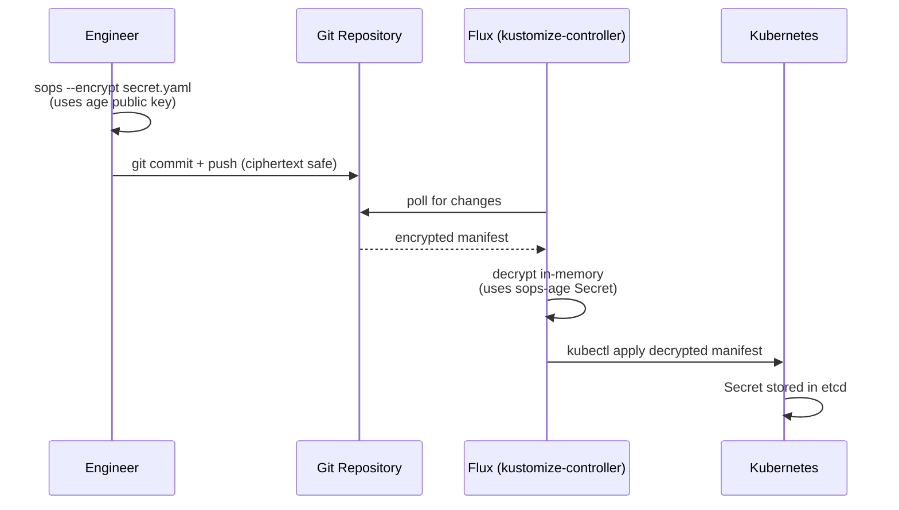

# 03 — Secrets Management (SOPS + age)
## Encrypted Secrets in a GitOps World

**Author:** Kagiso Tjeane
**Difficulty:** ⭐⭐⭐⭐⭐⭐⭐☆☆☆ (7/10)
**Guide:** 03 of 13

> GitOps requires that everything is stored in Git.
>
> Secrets cannot be stored in Git in plaintext.
>
> These two requirements appear to conflict. SOPS + age resolves them.

This guide walks you through the complete SOPS + age setup from scratch. By the end you will have:

- SOPS and age installed on the automation host
- An age key pair generated, with the private key backed up
- `.sops.yaml` updated with your public key and committed
- All three repository secret files encrypted
- The `sops-age` Kubernetes Secret created in the cluster

**This guide must be completed before bootstrapping Flux in Guide 04.** Flux begins reconciling encrypted secrets immediately on first sync — if the `sops-age` Secret does not exist, reconciliation fails.

---

# How SOPS + age Works

**SOPS** (Secrets OPerationS) encrypts specific values inside YAML files while leaving key names visible. Diffs remain readable. Reviews remain meaningful.

**age** provides the key pair:

- **public key** — used to encrypt files; safe to store in `.sops.yaml` and commit to Git
- **private key** — used to decrypt files; stored in one Kubernetes Secret on the cluster, never committed

**Flux** integrates natively with SOPS. When it reconciles a Kustomization it decrypts encrypted files in memory using the age private key, then applies the plaintext to Kubernetes.



---

# Step 1 — Install SOPS and age on the Automation Host

These tools are installed on **bran** (the Raspberry Pi at 10.0.10.10), which is the machine you run all `kubectl` and `flux` commands from.

```bash
# Install age
sudo apt install -y age

# Verify
age --version
```

```bash
# Install SOPS
# bran is arm64 (Raspberry Pi). Use amd64 if your automation host is x86.
SOPS_VERSION=3.8.1
curl -LO https://github.com/getsops/sops/releases/download/v${SOPS_VERSION}/sops-v${SOPS_VERSION}.linux.arm64
sudo install -m 755 sops-v${SOPS_VERSION}.linux.arm64 /usr/local/bin/sops

# Verify
sops --version
```

---

# Step 2 — Generate the age Key Pair

Run this once on bran. Never run it again unless you are rotating keys.

```bash
age-keygen -o ~/age.key
```

Output:

```
Public key: age1xxxxxxxxxxxxxxxxxxxxxxxxxxxxxxxxxxxxxxxxxxxxxxxxxxxxxxxxxxxx
```

**Copy and save that public key** — you need it in the next step. The file `~/age.key` contains both the public and private keys.

**Back up the private key offline now**, before doing anything else:

```bash
# Print it so you can store it somewhere safe (password manager, encrypted USB, etc.)
cat ~/age.key
```

> **If this key is lost and the cluster is destroyed, all SOPS-encrypted secrets in the repository are unrecoverable.** There is no recovery path. Back up offline.

---

# Step 3 — Update .sops.yaml with Your Public Key

`.sops.yaml` is already in the repository root with placeholder keys. You need to replace every `age1xxx...` placeholder with your actual public key from Step 2.

> **If `.sops.yaml` already contains your real public key** (not a placeholder), skip this step — it was already done.

Edit the file:

```bash
cd ~/homelab-infrastructure
nano .sops.yaml
```

Replace all four `age: age1xxx...` lines with your public key. The file should look like this after editing (with your actual key):

```yaml
creation_rules:
  - path_regex: platform/.*secret.*\.yaml$
    age: age1xxxxxxxxxxxxxxxxxxxxxxxxxxxxxxxxxxxxxxxxxxxxxxxxxxxxxxxxxxxx

  - path_regex: apps/.*secret.*\.yaml$
    age: age1xxxxxxxxxxxxxxxxxxxxxxxxxxxxxxxxxxxxxxxxxxxxxxxxxxxxxxxxxxxx

  - path_regex: clusters/.*secret.*\.yaml$
    age: age1xxxxxxxxxxxxxxxxxxxxxxxxxxxxxxxxxxxxxxxxxxxxxxxxxxxxxxxxxxxx

  - path_regex: .*/secrets/.*\.yaml$
    age: age1xxxxxxxxxxxxxxxxxxxxxxxxxxxxxxxxxxxxxxxxxxxxxxxxxxxxxxxxxxxx
```

Commit the updated `.sops.yaml`:

```bash
git add .sops.yaml
git commit -m "chore: set age public key in .sops.yaml"
git push
```

The `.sops.yaml` file contains only the public key. It is safe to commit.

---

# Step 4 — Encrypt the Repository's Three Secret Files

This repository contains three secret files with placeholder values. You must:

1. Open each file and fill in real values
2. Encrypt it with SOPS
3. Commit the encrypted result

SOPS reads `.sops.yaml` automatically to find the correct encryption key for each file.

**Before you start** — set the `SOPS_AGE_KEY_FILE` environment variable so SOPS knows where your private key is:

```bash
export SOPS_AGE_KEY_FILE=~/age.key
```

Add this to `~/.bashrc` so it persists across sessions:

```bash
echo 'export SOPS_AGE_KEY_FILE=~/age.key' >> ~/.bashrc
```

---

## Secret 1 — MinIO Credentials for Velero

These are the S3 access credentials Velero uses to store backups in your TrueNAS MinIO bucket.

Get your MinIO access key and secret key from the MinIO web console:

```
MinIO Console → Identity → Access Keys → Create access key
```

Open and edit the file:

```bash
sops platform/backup/velero/minio-credentials.yaml
```

This opens the file in your `$EDITOR`. Replace the placeholder values:

```yaml
stringData:
  cloud: |
    [default]
    aws_access_key_id=YOUR_MINIO_ACCESS_KEY_HERE
    aws_secret_access_key=YOUR_MINIO_SECRET_KEY_HERE
```

Save and exit. SOPS encrypts the file on save.

Alternatively, create and encrypt in a single command:

```bash
kubectl create secret generic velero-minio-credentials \
  --namespace velero \
  --from-literal=cloud="[default]
aws_access_key_id=YOUR_MINIO_ACCESS_KEY
aws_secret_access_key=YOUR_MINIO_SECRET_KEY" \
  --dry-run=client -o yaml | \
  sops --encrypt --input-type yaml --output-type yaml /dev/stdin \
  > platform/backup/velero/minio-credentials.yaml
```

---

## Secret 2 — Grafana Admin Credentials

These credentials control access to the Grafana dashboard at `grafana.kagiso.me`.

Generate a strong password:

```bash
openssl rand -base64 24
```

Open and edit the file:

```bash
sops platform/observability/kube-prometheus-stack/grafana-admin-secret.yaml
```

Replace the placeholder values:

```yaml
stringData:
  admin-user: admin
  admin-password: YOUR_GENERATED_PASSWORD_HERE
```

Save and exit. SOPS encrypts the file on save.

---

## Secret 3 — Alertmanager Webhook / Slack URLs

These are the notification endpoints Alertmanager uses to send alerts.

Open and edit the file:

```bash
sops platform/observability/alertmanager-config/alertmanager-secret.yaml
```

Replace the three placeholder values:

| Key | Where to get it |
|-----|----------------|
| `slack-api-url` | Slack App settings → Incoming Webhooks → copy URL |
| `webhook-url` | Your webhook endpoint (ntfy.sh, Grafana OnCall, etc.) |
| `watchdog-webhook-url` | healthchecks.io ping URL or similar heartbeat endpoint |

If you do not use Slack or a watchdog yet, put a placeholder URL (e.g. `https://placeholder`) — you can update it later with `sops` without decrypting manually.

Save and exit. SOPS encrypts the file on save.

---

## Verify All Three Files Are Encrypted

Each file must contain `ENC[` strings and a `sops:` footer — not plaintext values.

```bash
grep -l "ENC\[" \
  platform/backup/velero/minio-credentials.yaml \
  platform/observability/kube-prometheus-stack/grafana-admin-secret.yaml \
  platform/observability/alertmanager-config/alertmanager-secret.yaml
```

All three filenames should be printed. If any are missing, that file is still plaintext — do not commit it.

Commit the encrypted files:

```bash
git add \
  platform/backup/velero/minio-credentials.yaml \
  platform/observability/kube-prometheus-stack/grafana-admin-secret.yaml \
  platform/observability/alertmanager-config/alertmanager-secret.yaml

git commit -m "chore: encrypt repository secrets with SOPS"
git push
```

---

# Step 5 — Create the sops-age Secret in the Cluster

This is the Kubernetes Secret that Flux uses to decrypt encrypted manifests at reconciliation time. It holds your age **private key**.

> This Secret is not managed by Flux — it cannot be, because Flux uses it to decrypt everything else. It must be created manually before bootstrap and recreated manually after any cluster rebuild.

**For staging** (set your kubeconfig to staging first):

```bash
export KUBECONFIG=~/.kube/staging-config

# Create the flux-system namespace if it does not exist yet
kubectl create namespace flux-system --dry-run=client -o yaml | kubectl apply -f -

# Create the secret from your age private key
kubectl create secret generic sops-age \
  --namespace=flux-system \
  --from-file=age.agekey=$HOME/age.key
```

**For prod** (set your kubeconfig to prod):

```bash
export KUBECONFIG=~/.kube/prod-config

kubectl create namespace flux-system --dry-run=client -o yaml | kubectl apply -f -

kubectl create secret generic sops-age \
  --namespace=flux-system \
  --from-file=age.agekey=$HOME/age.key
```

Verify for each cluster:

```bash
kubectl get secret sops-age -n flux-system
```

Expected output:

```
NAME        TYPE     DATA   AGE
sops-age    Opaque   1      Xs
```

---

# Step 6 — Verify End-to-End

Confirm the setup is complete before moving to Guide 04:

```bash
# 1. SOPS and age are installed
sops --version
age --version

# 2. .sops.yaml contains your real public key (not a placeholder)
grep "age:" .sops.yaml

# 3. All three secret files are encrypted
grep -l "ENC\[" \
  platform/backup/velero/minio-credentials.yaml \
  platform/observability/kube-prometheus-stack/grafana-admin-secret.yaml \
  platform/observability/alertmanager-config/alertmanager-secret.yaml

# 4. sops-age Secret exists in the cluster
kubectl get secret sops-age -n flux-system
```

All four checks must pass before proceeding to Guide 04.

---

# Reference: How Flux Uses SOPS

Kustomizations that contain encrypted files declare a `decryption` block referencing the `sops-age` Secret:

```yaml
# clusters/prod/infrastructure.yaml
apiVersion: kustomize.toolkit.fluxcd.io/v1
kind: Kustomization
metadata:
  name: infrastructure
  namespace: flux-system
spec:
  decryption:
    provider: sops
    secretRef:
      name: sops-age
  # ... rest of spec
```

This is already configured in the repository. You do not need to add it.

---

# Reference: Editing an Encrypted File Later

Never decrypt, edit, and re-encrypt manually. Use `sops` directly:

```bash
sops platform/observability/kube-prometheus-stack/grafana-admin-secret.yaml
```

This opens the decrypted file in `$EDITOR` and re-encrypts on save.

To verify plaintext contents without editing:

```bash
sops --decrypt platform/observability/kube-prometheus-stack/grafana-admin-secret.yaml
```

Do not redirect this output to a file.

---

# Reference: Key Rotation

Rotate the age key if the private key is suspected compromised or a team member with access departs.

**Step 1 — Generate a new key pair:**

```bash
age-keygen -o age-new.key
```

**Step 2 — Update `.sops.yaml` to include both old and new public keys:**

```yaml
creation_rules:
  - path_regex: platform/.*secret.*\.yaml$
    age: >-
      age1old_public_key,
      age1new_public_key
```

**Step 3 — Re-encrypt all secrets with both keys:**

```bash
find platform/ apps/ clusters/ -name "*.yaml" -exec grep -l "sops:" {} \; | xargs -I{} sops --rotate --in-place {}
```

**Step 4 — Update the cluster Secret:**

```bash
kubectl create secret generic sops-age \
  --namespace=flux-system \
  --from-file=age.agekey=age-new.key \
  --dry-run=client -o yaml | kubectl apply -f -
```

**Step 5 — Remove the old public key from `.sops.yaml` and re-encrypt:**

```yaml
creation_rules:
  - path_regex: platform/.*secret.*\.yaml$
    age: age1new_public_key
```

```bash
find platform/ apps/ clusters/ -name "*.yaml" -exec grep -l "sops:" {} \; | xargs -I{} sops --rotate --in-place {}
```

**Step 6 — Commit and push. Destroy the old private key.**

---

# Reference: What Happens If the Private Key Is Lost

If the age private key is lost and there is no backup:

- All SOPS-encrypted secrets in the repository are **unrecoverable**.
- The cluster itself may still be running (Kubernetes holds decrypted secrets in etcd).
- Recovery path: extract secrets from the running cluster (`kubectl get secret -o yaml`), rebuild the encryption setup with a new key, and re-encrypt all secrets.

This is why the private key must be backed up offline immediately after generation.

---

# Reference: After a Cluster Rebuild

After rebuilding the cluster, recreate the `sops-age` Secret from your offline backup before running the Flux playbook:

```bash
kubectl create secret generic sops-age \
  --namespace=flux-system \
  --from-file=age.agekey=age.key
```

Flux will then decrypt and apply all secrets automatically when it reconciles.

---

# Exit Criteria

This guide is complete when all of the following are true:

✓ SOPS and age installed on bran (automation host)
✓ age key pair generated and private key backed up offline
✓ `.sops.yaml` committed with your real public key
✓ All three repository secrets encrypted and committed
✓ `sops-age` Secret created in `flux-system` namespace on the target cluster(s)

---

# Next Guide

➡ **[04 — Flux GitOps Bootstrap](./04-Flux-GitOps.md)**

The next guide bootstraps the Flux GitOps control plane. The `sops-age` Secret you just created is a required prerequisite.

---

## Navigation

| | Guide |
|---|---|
| ← Previous | [02 — Kubernetes Installation](./02-Kubernetes-Installation.md) |
| Current | **03 — Secrets Management** |
| → Next | [04 — Flux GitOps Bootstrap](./04-Flux-GitOps.md) |
