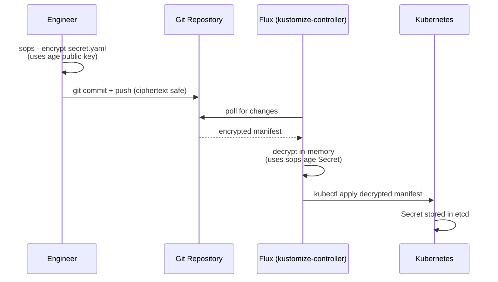

# 03 — Secrets Management (SOPS + age)
## Encrypted Secrets in a GitOps World

**Author:** Kagiso Tjeane
**Difficulty:** ⭐⭐⭐⭐⭐⭐⭐☆☆☆ (7/10)
**Guide:** 03 of 13

> GitOps requires that everything is stored in Git.
>
> Secrets cannot be stored in Git in plaintext.
>
> These two requirements appear to conflict. SOPS + age resolves them.

This guide walks you through the complete SOPS + age setup from scratch. By the end you will have:

- SOPS and age installed on the automation host
- An age key pair generated, with the private key backed up
- `.sops.yaml` updated with your public key and committed
- All three repository secret files encrypted and committed
- The `sops-age` Kubernetes Secret created in the cluster

**This guide must be completed before bootstrapping Flux in Guide 04.** Flux begins reconciling
encrypted secrets immediately on first sync — if the `sops-age` Secret does not exist in
`flux-system`, reconciliation fails with decryption errors.

---

# How SOPS + age Works

**SOPS** (Secrets OPerationS) encrypts specific values inside YAML files while leaving key
names visible. Diffs remain readable. Reviews remain meaningful. The structure of the file
is preserved — only the values are encrypted.

**age** provides the key pair:

- **public key** — used to encrypt files; safe to store in `.sops.yaml` and commit to Git
- **private key** — used to decrypt files; stored in one Kubernetes Secret on the cluster, never committed

**Flux** integrates natively with SOPS. When it reconciles a Kustomization it decrypts
encrypted files in memory using the age private key from the `sops-age` Secret, then applies
the plaintext to Kubernetes. The decrypted values never touch disk.



---

# A Note on Two Different Secret Storage Mechanisms

This platform uses two separate mechanisms for storing secrets, each appropriate for a
different consumer:

| Mechanism | Where stored | Who uses it | Example |
|---|---|---|---|
| SOPS + age | Git repository (encrypted) | Flux (inside the cluster) | Grafana password, Velero MinIO credentials, Alertmanager URLs |
| GitHub repository secrets | GitHub Settings → Secrets | GitHub Actions (outside the cluster) | `KUBECONFIG` for CI dry-run validation |

**SOPS secrets** are decrypted by Flux inside the cluster at reconciliation time. Flux has access
to the age private key via the `sops-age` Kubernetes Secret and performs all decryption in memory.

**GitHub repository secrets** (like `KUBECONFIG`) are consumed by the GitHub Actions CI pipeline,
which runs on `varys` as a self-hosted runner. The runner is outside the cluster and cannot use
Flux's decryption mechanism. GitHub's built-in secret storage is the correct tool for CI credentials.

This guide covers only SOPS secrets. The `KUBECONFIG` GitHub secret was set up in Guide 00.5.

---

# Step 1 — Install SOPS and age on the Automation Host

These tools are installed on **varys** (the Intel NUC at 10.0.10.10), which is the machine
you run all `kubectl` and `flux` commands from.

```bash
# Install age
sudo apt install -y age

# Verify
age --version
```

```bash
# Install SOPS
# varys is amd64 (Intel NUC x86_64)
SOPS_VERSION=3.8.1
curl -LO https://github.com/getsops/sops/releases/download/v${SOPS_VERSION}/sops-v${SOPS_VERSION}.linux.amd64
sudo install -m 755 sops-v${SOPS_VERSION}.linux.amd64 /usr/local/bin/sops
rm sops-v${SOPS_VERSION}.linux.amd64

# Verify
sops --version
```

---

# Step 2 — Generate the age Key Pair

Run this **once** on varys. Never run it again unless you are intentionally rotating keys.

```bash
age-keygen -o ~/age.key
```

Output:

```
Public key: age1xxxxxxxxxxxxxxxxxxxxxxxxxxxxxxxxxxxxxxxxxxxxxxxxxxxxxxxxxxxx
```

**Copy and save that public key** — you need it in the next step. The file `~/age.key` contains
both the public and private keys.

**Back up the private key offline now**, before doing anything else:

```bash
# Print it so you can store it somewhere safe (password manager, encrypted USB, etc.)
cat ~/age.key
```

> **If this key is lost and the cluster is destroyed, all SOPS-encrypted secrets in the repository
> are unrecoverable.** There is no recovery path. Back up offline immediately.

---

# Step 3 — Update .sops.yaml with Your Public Key

`.sops.yaml` is already in the repository root with placeholder keys. You need to replace every
`age1xxx...` placeholder with your actual public key from Step 2.

> **If `.sops.yaml` already contains your real public key** (not a placeholder), skip this step.

Edit the file:

```bash
cd ~/homelab-infrastructure
nano .sops.yaml
```

Replace all `age: age1xxx...` lines with your public key. The file should look like this after
editing (with your actual key in place of the placeholder):

```yaml
creation_rules:
  - path_regex: platform/.*secret.*\.yaml$
    age: age1xxxxxxxxxxxxxxxxxxxxxxxxxxxxxxxxxxxxxxxxxxxxxxxxxxxxxxxxxxxx

  - path_regex: apps/.*secret.*\.yaml$
    age: age1xxxxxxxxxxxxxxxxxxxxxxxxxxxxxxxxxxxxxxxxxxxxxxxxxxxxxxxxxxxx

  - path_regex: clusters/.*secret.*\.yaml$
    age: age1xxxxxxxxxxxxxxxxxxxxxxxxxxxxxxxxxxxxxxxxxxxxxxxxxxxxxxxxxxxx

  - path_regex: .*/secrets/.*\.yaml$
    age: age1xxxxxxxxxxxxxxxxxxxxxxxxxxxxxxxxxxxxxxxxxxxxxxxxxxxxxxxxxxxx
```

Commit the updated `.sops.yaml`:

```bash
git add .sops.yaml
git commit -m "chore: set age public key in .sops.yaml"
git push
```

The `.sops.yaml` file contains only the public key. It is safe to commit. The private key is
never committed to Git.

---

# Step 4 — Encrypt the Repository's Three Secret Files

This repository contains three secret files with placeholder values. You must:

1. Open each file and fill in real values
2. Encrypt it with SOPS
3. Commit the encrypted result

SOPS reads `.sops.yaml` automatically to find the correct encryption key for each file based
on the path regex rules defined there.

**Before you start** — set the `SOPS_AGE_KEY_FILE` environment variable so SOPS knows where
your private key is:

```bash
export SOPS_AGE_KEY_FILE=~/age.key
```

Add this to `~/.bashrc` so it persists across sessions:

```bash
echo 'export SOPS_AGE_KEY_FILE=~/age.key' >> ~/.bashrc
```

---

## Secret 1 — MinIO Credentials for Velero

These are the S3 access credentials Velero uses to store backups in your TrueNAS MinIO bucket.
You generated these credentials in Guide 00.5 (Step 4) and saved them to your password manager.

Open and edit the file:

```bash
sops platform/backup/velero/minio-credentials.yaml
```

This opens the file in your `$EDITOR`. Replace the placeholder values with your MinIO access key
and secret key:

```yaml
stringData:
  cloud: |
    [default]
    aws_access_key_id=YOUR_MINIO_ACCESS_KEY_HERE
    aws_secret_access_key=YOUR_MINIO_SECRET_KEY_HERE
```

Save and exit. SOPS encrypts the file on save. The file on disk will now contain `ENC[` strings
instead of your plaintext credentials.

Alternatively, create and encrypt in a single command (useful if the file doesn't exist yet):

```bash
kubectl create secret generic velero-minio-credentials \
  --namespace velero \
  --from-literal=cloud="[default]
aws_access_key_id=YOUR_MINIO_ACCESS_KEY
aws_secret_access_key=YOUR_MINIO_SECRET_KEY" \
  --dry-run=client -o yaml | \
  sops --encrypt --input-type yaml --output-type yaml /dev/stdin \
  > platform/backup/velero/minio-credentials.yaml
```

---

## Secret 2 — Grafana Admin Credentials

These credentials control access to the Grafana dashboard at `grafana.kagiso.me`.

Generate a strong password:

```bash
openssl rand -base64 24
```

Open and edit the file:

```bash
sops platform/observability/kube-prometheus-stack/grafana-admin-secret.yaml
```

Replace the placeholder values:

```yaml
stringData:
  admin-user: admin
  admin-password: YOUR_GENERATED_PASSWORD_HERE
```

Save and exit. SOPS encrypts the file on save.

---

## Secret 3 — Alertmanager Discord Webhook URLs

These are the Discord webhook endpoints Alertmanager uses to send alerts when something goes wrong
in the cluster. Alerts use Discord's Slack-compatible webhook format (`/slack` suffix).

Create and encrypt the secret:

```bash
kubectl create secret generic alertmanager-secret \
  --namespace monitoring \
  --from-literal=discord-alerts-url=https://discord.com/api/webhooks/YOUR_ID/YOUR_TOKEN/slack \
  --from-literal=discord-critical-url=https://discord.com/api/webhooks/YOUR_ID/YOUR_TOKEN/slack \
  --from-literal=watchdog-webhook-url=https://discord.com/api/webhooks/YOUR_ID/YOUR_TOKEN/slack \
  --dry-run=client -o yaml \
  > platform/observability/observability-config/alertmanager-secret.yaml

sops --encrypt --in-place platform/observability/observability-config/alertmanager-secret.yaml
```

| Key | Where to get it |
|-----|----------------|
| `discord-alerts-url` | Discord channel → Edit → Integrations → Webhooks → copy URL, append `/slack` |
| `discord-critical-url` | Discord channel → Edit → Integrations → Webhooks → copy URL, append `/slack` |
| `watchdog-webhook-url` | Discord channel → Edit → Integrations → Webhooks → copy URL, append `/slack` |

---

## Verify All Three Files Are Encrypted

Each file must contain `ENC[` strings and a `sops:` footer — not plaintext values.

```bash
grep -l "ENC\[" \
  platform/backup/velero/minio-credentials.yaml \
  platform/observability/kube-prometheus-stack/grafana-admin-secret.yaml \
  platform/observability/observability-config/alertmanager-secret.yaml
```

All three filenames should be printed. If any are missing from the output, that file is still
plaintext — do not commit it. Re-open it with `sops <file>` and save again.

Commit the encrypted files:

```bash
git add \
  platform/backup/velero/minio-credentials.yaml \
  platform/observability/kube-prometheus-stack/grafana-admin-secret.yaml \
  platform/observability/observability-config/alertmanager-secret.yaml

git commit -m "chore: encrypt repository secrets with SOPS"
git push
```

---

# Step 5 — Create the sops-age Secret in the Cluster

This is the Kubernetes Secret that Flux uses to decrypt encrypted manifests at reconciliation
time. It holds your age **private key**.

> **Why this Secret is created manually:** This Secret cannot be managed by Flux — it is the
> key Flux uses to decrypt everything else. It forms a bootstrapping dependency: Flux cannot
> decrypt the `sops-age` Secret itself because it needs the Secret to already exist before
> it can decrypt anything. It must be created manually before bootstrap and recreated manually
> after any cluster rebuild.

```bash
# Ensure the kubeconfig is pointing at the production cluster
export KUBECONFIG=~/.kube/config

# Create the flux-system namespace if it does not exist yet
# (bootstrap will also create it, but creating it now avoids a timing issue)
kubectl create namespace flux-system --dry-run=client -o yaml | kubectl apply -f -

# Create the sops-age Secret from your age private key file
kubectl create secret generic sops-age \
  --namespace=flux-system \
  --from-file=age.agekey=$HOME/age.key
```

Verify the Secret was created:

```bash
kubectl get secret sops-age -n flux-system
```

Expected output:

```
NAME       TYPE     DATA   AGE
sops-age   Opaque   1      Xs
```

Verify the key material is present (the value will be base64-encoded):

```bash
kubectl get secret sops-age -n flux-system -o jsonpath='{.data.age\.agekey}' | base64 -d | head -2
# Expected: first two lines of your age.key file (comment and public key line)
```

---

# Step 6 — Verify End-to-End

Confirm the setup is complete before moving to Guide 04:

```bash
# 1. SOPS and age are installed
sops --version
age --version

# 2. .sops.yaml contains your real public key (not a placeholder)
grep "age:" .sops.yaml
# Should print lines with your actual age1... key, not age1xxx...

# 3. All three secret files are encrypted
grep -l "ENC\[" \
  platform/backup/velero/minio-credentials.yaml \
  platform/observability/kube-prometheus-stack/grafana-admin-secret.yaml \
  platform/observability/observability-config/alertmanager-secret.yaml
# All three filenames must be printed

# 4. sops-age Secret exists in the cluster
kubectl get secret sops-age -n flux-system
# Must show TYPE=Opaque DATA=1
```

All four checks must pass before proceeding to Guide 04.

---

# Reference: How Flux Uses SOPS

Kustomizations that contain encrypted files declare a `decryption` block referencing the
`sops-age` Secret:

```yaml
# clusters/prod/infrastructure.yaml
apiVersion: kustomize.toolkit.fluxcd.io/v1
kind: Kustomization
metadata:
  name: infrastructure
  namespace: flux-system
spec:
  decryption:
    provider: sops
    secretRef:
      name: sops-age
  # ... rest of spec
```

This is already configured in the repository. You do not need to add it.

When Flux reconciles a Kustomization with this `decryption` block, the kustomize-controller:

1. Fetches the `sops-age` Secret from the `flux-system` namespace
2. Loads the age private key from the Secret
3. Decrypts any SOPS-encrypted files in the Kustomization path in memory
4. Applies the decrypted manifests to the cluster
5. Discards the plaintext — it is never written to disk

---

# Reference: Editing an Encrypted File Later

Never decrypt, edit in a text editor, and re-encrypt manually. Use `sops` directly to open
the file — it decrypts in memory, opens in `$EDITOR`, and re-encrypts on save:

```bash
sops platform/observability/kube-prometheus-stack/grafana-admin-secret.yaml
```

To view plaintext contents without editing:

```bash
sops --decrypt platform/observability/kube-prometheus-stack/grafana-admin-secret.yaml
```

Do not redirect this output to a file.

---

# Reference: Key Rotation

Rotate the age key if the private key is suspected compromised or a team member with access
departs.

**Step 1 — Generate a new key pair:**

```bash
age-keygen -o age-new.key
```

**Step 2 — Update `.sops.yaml` to include both old and new public keys temporarily:**

```yaml
creation_rules:
  - path_regex: platform/.*secret.*\.yaml$
    age: >-
      age1old_public_key,
      age1new_public_key
```

**Step 3 — Re-encrypt all secrets with both keys:**

```bash
find platform/ apps/ clusters/ -name "*.yaml" -exec grep -l "sops:" {} \; \
  | xargs -I{} sops --rotate --in-place {}
```

**Step 4 — Update the cluster Secret with the new private key:**

```bash
kubectl create secret generic sops-age \
  --namespace=flux-system \
  --from-file=age.agekey=age-new.key \
  --dry-run=client -o yaml | kubectl apply -f -
```

**Step 5 — Remove the old public key from `.sops.yaml` and re-encrypt with the new key only:**

```yaml
creation_rules:
  - path_regex: platform/.*secret.*\.yaml$
    age: age1new_public_key
```

```bash
find platform/ apps/ clusters/ -name "*.yaml" -exec grep -l "sops:" {} \; \
  | xargs -I{} sops --rotate --in-place {}
```

**Step 6 — Commit and push. Replace `~/age.key` with the new key. Destroy the old private key.**

---

# Reference: What Happens If the Private Key Is Lost

If the age private key is lost and there is no backup:

- All SOPS-encrypted secrets in the repository are **unrecoverable** from Git alone.
- The cluster itself may still be running — Kubernetes holds decrypted secrets in etcd.
- Recovery path: extract secrets from the running cluster with `kubectl get secret -o yaml`,
  generate a new age key pair, re-encrypt all secrets with the new key, update the cluster Secret.

This is why the private key must be backed up offline immediately after generation. A lost key
on a destroyed cluster is a permanent, unrecoverable loss.

---

# Reference: After a Cluster Rebuild

After rebuilding the cluster (e.g. following the purge procedure in [runbooks/cluster-rebuild.md](../runbooks/cluster-rebuild.md)),
recreate the `sops-age` Secret from your offline backup before running the Flux bootstrap playbook:

```bash
kubectl create namespace flux-system --dry-run=client -o yaml | kubectl apply -f -

kubectl create secret generic sops-age \
  --namespace=flux-system \
  --from-file=age.agekey=age.key
```

Flux will then decrypt and apply all secrets automatically when it reconciles.

---

# Exit Criteria

This guide is complete when all of the following are true:

```
✓ SOPS and age installed on varys (sops --version and age --version both succeed)
✓ age key pair generated at ~/age.key and private key backed up offline
✓ .sops.yaml committed with your real public key (not a placeholder)
✓ All three repository secrets encrypted and committed (grep -l "ENC[" shows all three files)
✓ SOPS_AGE_KEY_FILE=~/age.key added to ~/.bashrc
✓ sops-age Secret created in flux-system namespace on the production cluster
✓ kubectl get secret sops-age -n flux-system shows TYPE=Opaque DATA=1
```

---

# Next Guide

➡ **[04 — Flux GitOps Bootstrap](./04-Flux-GitOps.md)**

The next guide bootstraps the Flux GitOps control plane. The `sops-age` Secret you just created
is a required prerequisite — Flux will immediately attempt to decrypt secrets on first sync.

---

## Navigation

| | Guide |
|---|---|
| ← Previous | [02 — Kubernetes Installation](./02-Kubernetes-Installation.md) |
| Current | **03 — Secrets Management** |
| → Next | [04 — Flux GitOps Bootstrap](./04-Flux-GitOps.md) |
