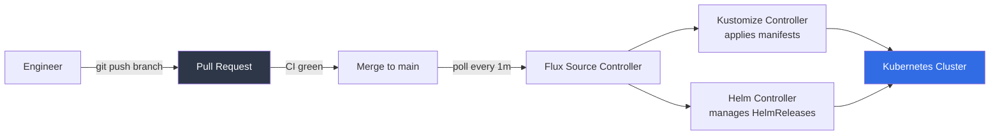
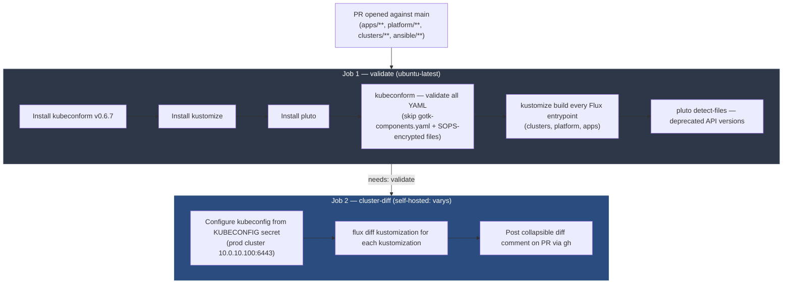
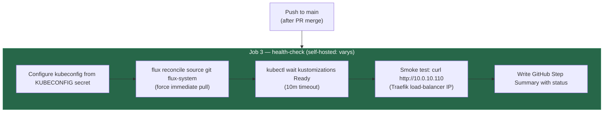

# 04 — GitOps Control Plane (FluxCD)
## Git as the Cluster API

**Author:** Kagiso Tjeane
**Difficulty:** ⭐⭐⭐⭐⭐⭐⭐⭐☆☆ (8/10)
**Guide:** 04 of 13

> Up to this point the cluster has been built using traditional infrastructure automation.
> Nodes were prepared with Ansible, Kubernetes was installed, and secrets encryption
> has been configured with SOPS + age.
>
> The next step is a major architectural shift:
>
> **Git becomes the control plane for the platform.**
>
> Once Flux is bootstrapped, every change to the cluster flows through a pull request.
> Manifests are validated before they can merge. Flux reconciles the cluster continuously
> from `main`. The cluster is disposable; Git is the source of truth.

---

## Table of Contents

1. [Overview — What GitOps Means](#1-overview--what-gitops-means)
2. [How It Works — Branch Model and CI Pipeline](#2-how-it-works--branch-model-and-ci-pipeline)
3. [Prerequisites](#3-prerequisites)
4. [Setting Up the Self-Hosted Runner on varys](#4-setting-up-the-self-hosted-runner-on-varys)
5. [Bootstrapping Flux on the Prod Cluster](#5-bootstrapping-flux-on-the-prod-cluster)
6. [Adding KUBECONFIG to GitHub Secrets](#6-adding-kubeconfig-to-github-secrets)
7. [Enabling Branch Protection on main](#7-enabling-branch-protection-on-main)
8. [The PR Workflow — Day-to-Day Operations](#8-the-pr-workflow--day-to-day-operations)
9. [Post-Merge — Flux Reconciles and Health Check Runs](#9-post-merge--flux-reconciles-and-health-check-runs)
10. [Monitoring Flux](#10-monitoring-flux)
11. [Troubleshooting](#11-troubleshooting)
12. [Cluster Rebuild via Ansible](#12-cluster-rebuild-via-ansible)

---

## 1. Overview — What GitOps Means

Traditional Kubernetes operations look like this:

```
Engineer → kubectl apply -f deployment.yaml
```

That works until it doesn't. Over time it causes:

- **Configuration drift** — the cluster diverges from what anyone documented
- **Undocumented changes** — "who changed the replica count?" has no answer
- **Difficult rollbacks** — there is no canonical previous state to return to
- **Inconsistent rebuilds** — recreating the cluster from scratch requires tribal knowledge

GitOps replaces all of that with a **declarative, version-controlled workflow**.

```
Git repository → Flux reconciliation → Cluster state
```

The Git repository is the single source of truth. Flux runs inside the cluster and
continuously pulls from Git, applying any difference between what Git says should exist
and what the cluster currently has. If someone deletes a deployment manually, Flux
restores it within minutes. If a change needs to be made, it goes into Git — not into
`kubectl`.



### Why This Matters for a Solo Operator

On a team, GitOps enables peer review. For a solo homelab operator, it provides something
equally valuable: **a complete audit trail and a repeatable recovery path**.

Every change that has ever touched this cluster exists in Git history. If a config change
breaks something at 2am, `git revert` is faster than debugging a corrupted state. If the
cluster needs to be rebuilt from scratch, two Ansible commands reconstruct the entire
platform — no manual steps required.

### Flux vs ArgoCD

Flux was chosen over ArgoCD because it is lighter, Kubernetes-native, fully declarative,
and CNCF graduated. ArgoCD provides a richer UI but requires more resources. For a
homelab platform where every workload on the cluster competes for the same RAM budget,
Flux's lightweight controllers are the right trade-off. See
[ADR-002](../adr/ADR-002-flux-over-argocd.md) for the full rationale.

---

## 2. How It Works — Branch Model and CI Pipeline

### Single Branch: `main`

This repository uses a **single-branch model**. There is no `staging` cluster and no
`prod` branch to promote to. The `main` branch is the production branch. Every commit
that lands on `main` is immediately reconciled into the prod cluster by Flux.

This simplifies the workflow dramatically:

```
feature/my-change  →  PR against main  →  CI validates  →  merge  →  Flux applies
```

### What Flux Watches

Flux's `GitRepository` source is configured to watch the `main` branch at
`clusters/prod`. The poll interval is one minute — within 60 seconds of a merge, Flux
pulls the new commit and begins reconciling.

```yaml
# clusters/prod/flux-system/gotk-sync.yaml
spec:
  ref:
    branch: main   # watches main directly
  url: ssh://git@github.com/Kagiso-me/homelab-infrastructure.git
```

### Which Paths Trigger CI

Not every commit needs CI. Documentation edits, roadmap updates, and project notes should
be able to land on `main` without requiring a PR. CI only runs when infrastructure
changes:

| Path | Triggers CI |
|------|-------------|
| `apps/**` | Yes |
| `platform/**` | Yes |
| `clusters/**` | Yes |
| `ansible/**` | Yes |
| `docs/**` | No |
| `projects/**` | No |
| `ROADMAP.md` | No |
| `CHANGELOG.md` | No |

Direct pushes to `main` are allowed for non-infrastructure paths. For infrastructure
paths, branch protection requires a PR with CI passing before merge.

### CI Pipeline Overview

The live pipeline in this repository is `.github/workflows/validate.yml` and runs two sets of jobs
depending on the event.

**On PR opened against `main` (infra paths):**



**On push to `main` (infra paths, i.e. after merge):**



### The Complete Workflow YAML

This is the pipeline structure reflected by `.github/workflows/validate.yml`.

```yaml
name: GitOps Pipeline

# ─── Triggers ──────────────────────────────────────────────────────────────────
# On PR: run validate + cluster-diff (no cluster writes)
# On push to main: run health-check (confirms Flux reconciled successfully)
#
# Infrastructure paths only — docs/projects/roadmap can merge directly.

on:
  pull_request:
    branches: [main]
    paths:
      - "apps/**"
      - "platform/**"
      - "clusters/**"
      - "ansible/**"

  push:
    branches: [main]
    paths:
      - "apps/**"
      - "platform/**"
      - "clusters/**"
      - "ansible/**"

jobs:
  # ─── Job 1: Manifest validation ──────────────────────────────────────────────
  # Runs on GitHub-hosted ubuntu-latest — no cluster access needed.
  # Validates every YAML file with kubeconform, renders the Flux entrypoints with
  # kustomize, and checks for deprecated Kubernetes API versions with pluto.
  #
  # Excludes:
  #   gotk-components.yaml — generated by flux bootstrap, intentionally non-strict
  #   SOPS-encrypted files — encrypted YAML is not valid Kubernetes manifests

  validate:
    name: Validate manifests
    runs-on: ubuntu-latest
    if: github.event_name == 'pull_request'

    steps:
      - name: Checkout
        uses: actions/checkout@v4

      - name: Install kubeconform
        run: |
          KUBECONFORM_VERSION="v0.6.7"
          curl -sSL \
            "https://github.com/yannh/kubeconform/releases/download/${KUBECONFORM_VERSION}/kubeconform-linux-amd64.tar.gz" \
            | tar -xz -C /usr/local/bin kubeconform
          chmod +x /usr/local/bin/kubeconform
          kubeconform -v

      - name: Install kustomize
        run: |
          curl -sSL https://raw.githubusercontent.com/kubernetes-sigs/kustomize/master/hack/install_kustomize.sh | bash
          sudo mv kustomize /usr/local/bin/
          kustomize version

      - name: Install pluto
        run: |
          PLUTO_VERSION="v5.19.0"
          curl -sSL \
            "https://github.com/FairwindsOps/pluto/releases/download/${PLUTO_VERSION}/pluto_${PLUTO_VERSION#v}_linux_amd64.tar.gz" \
            | tar -xz -C /usr/local/bin pluto
          chmod +x /usr/local/bin/pluto
          pluto version

      - name: Run kubeconform
        run: |
          # Exclude gotk-components.yaml (Flux bootstrap artifact, not strict Kubernetes manifests)
          # Exclude any file containing 'sops' in its first few lines (SOPS-encrypted files have
          # encrypted data fields — not valid YAML for schema validation purposes)
          find platform/ apps/ clusters/ \
            -type f \( -name "*.yaml" -o -name "*.yml" \) \
            ! -name "gotk-components.yaml" \
            ! -path "*/secrets/*" \
            | xargs grep -L "^sops:" \
            | xargs kubeconform \
                -strict \
                -ignore-missing-schemas \
                -schema-location default \
                -schema-location 'https://raw.githubusercontent.com/datreeio/CRDs-catalog/main/{{.Group}}/{{.ResourceKind}}_{{.ResourceAPIVersion}}.json' \
                -summary

      - name: Kustomize build — Flux entrypoints
        run: |
          for path in \
            clusters/prod/flux-system \
            platform/networking \
            platform/security \
            platform/namespaces \
            platform/storage \
            platform/databases \
            platform/observability \
            platform/backup \
            platform/upgrade \
            apps/prod; do
            kustomize build "$path" >/dev/null
          done

      - name: Check for deprecated API versions (pluto)
        run: |
          for path in \
            clusters/prod/flux-system \
            platform/networking \
            platform/security \
            platform/namespaces \
            platform/storage \
            platform/databases \
            platform/observability \
            platform/backup \
            platform/upgrade \
            apps/prod; do
            kustomize build "$path" | pluto detect - || true
          done

  # ─── Job 2: Cluster diff ─────────────────────────────────────────────────────
  # Runs on the self-hosted runner on varys (10.0.10.10), which has direct LAN
  # access to the prod cluster at 10.0.10.100:6443.
  #
  # Runs flux diff kustomization against every Flux Kustomization resource in the
  # cluster. The output shows exactly what would change in the cluster if this PR
  # is merged — before any change is applied.
  #
  # The diff is posted as a collapsible comment on the PR. On every new push to
  # the PR branch, the comment is updated in place (not duplicated).
  #
  # Required GitHub secret: KUBECONFIG (prod cluster kubeconfig)
  # Required permission: pull-requests: write (for gh pr comment)

  cluster-diff:
    name: Cluster diff
    runs-on: [self-hosted, linux, homelab]
    needs: validate
    if: github.event_name == 'pull_request'

    permissions:
      pull-requests: write

    steps:
      - name: Checkout
        uses: actions/checkout@v4

      - name: Configure kubeconfig
        run: |
          mkdir -p ~/.kube
          echo "${{ secrets.KUBECONFIG }}" > ~/.kube/config
          chmod 600 ~/.kube/config
          kubectl cluster-info --request-timeout=10s

      - name: Run flux diff kustomizations
        id: diff
        run: |
          set +e
          DIFF_OUTPUT=""

          KUSTOMIZATIONS=(
            "apps"
            "platform-networking"
            "platform-networking-config"
            "platform-networking-tls"
            "platform-security"
            "platform-security-issuers"
            "platform-namespaces"
            "platform-storage"
            "platform-databases"
            "platform-observability"
            "platform-observability-config"
            "platform-observability-digest"
            "platform-backup"
            "platform-backup-config"
            "platform-upgrade"
            "platform-upgrade-plans"
            "platform-crowdsec"
            "platform-authentik"
          )

          for ks in "${KUSTOMIZATIONS[@]}"; do
            KS_DIFF=$(flux diff kustomization "${ks}" \
              --path "$(kubectl get kustomization "${ks}" -n flux-system \
                -o jsonpath='{.spec.path}' 2>/dev/null)" \
              -n flux-system 2>&1 || true)
            if [ -n "$KS_DIFF" ]; then
              DIFF_OUTPUT="${DIFF_OUTPUT}\n### ${ks}\n\`\`\`diff\n${KS_DIFF}\n\`\`\`\n"
            fi
          done

          if [ -z "$DIFF_OUTPUT" ]; then
            DIFF_OUTPUT="No changes detected in any Kustomization."
          fi

          # Write to file to avoid GitHub Actions output length limits
          echo "$DIFF_OUTPUT" > /tmp/diff_output.txt
          echo "has_diff=true" >> "$GITHUB_OUTPUT"

      - name: Post diff comment on PR
        env:
          GH_TOKEN: ${{ secrets.GITHUB_TOKEN }}
        run: |
          DIFF=$(cat /tmp/diff_output.txt)
          BODY="<details>
          <summary><b>flux diff — cluster change preview</b> (click to expand)</summary>

          ${DIFF}

          ---
          <sub>Generated by <code>flux diff kustomization</code> against prod cluster (10.0.10.100:6443) on commit \`${{ github.sha }}\`</sub>
          </details>"

          # Update existing bot comment if present, otherwise create new one
          EXISTING=$(gh pr view ${{ github.event.pull_request.number }} \
            --json comments \
            --jq '.comments[] | select(.author.login == "github-actions[bot]") | select(.body | startswith("<details")) | .databaseId' \
            2>/dev/null | head -1)

          if [ -n "$EXISTING" ]; then
            gh api \
              --method PATCH \
              "/repos/${{ github.repository }}/issues/comments/${EXISTING}" \
              -f body="$BODY"
          else
            gh pr comment ${{ github.event.pull_request.number }} --body "$BODY"
          fi

  # ─── Job 3: Post-merge health check ──────────────────────────────────────────
  # Runs on the self-hosted runner on varys after a push to main (i.e. after merge).
  # Forces an immediate Flux source reconcile, then waits for all Kustomizations
  # to report Ready. Fails fast if Traefik's load-balancer IP stops responding.
  #
  # A GitHub Step Summary is written with reconciliation status for visibility
  # in the GitHub Actions UI without needing to parse raw logs.
  #
  # Required GitHub secret: KUBECONFIG

  health-check:
    name: Post-merge health check
    runs-on: [self-hosted, linux, homelab]
    if: github.event_name == 'push'

    steps:
      - name: Configure kubeconfig
        run: |
          mkdir -p ~/.kube
          echo "${{ secrets.KUBECONFIG }}" > ~/.kube/config
          chmod 600 ~/.kube/config

      - name: Force Flux source reconcile
        run: |
          echo "Triggering immediate Flux pull from Git..."
          flux reconcile source git flux-system -n flux-system --timeout=60s

      - name: Wait for all kustomizations to be Ready
        run: |
          KUSTOMIZATIONS=(
            "platform-networking"
            "platform-networking-config"
            "platform-networking-tls"
            "platform-security"
            "platform-security-issuers"
            "platform-namespaces"
            "platform-storage"
            "platform-databases"
            "platform-observability"
            "platform-backup"
            "platform-crowdsec"
            "platform-authentik"
            "apps"
          )

          for ks in "${KUSTOMIZATIONS[@]}"; do
            echo "Waiting for kustomization/${ks}..."
            kubectl wait kustomization/"${ks}" \
              --for=condition=ready \
              --timeout=10m \
              -n flux-system
          done

      - name: Smoke test — Traefik responds
        run: |
          HTTP_CODE=$(curl -s --max-time 15 \
            --write-out '%{http_code}' --output /dev/null \
            http://10.0.10.110)
          echo "Traefik HTTP response: ${HTTP_CODE}"
          if [ "$HTTP_CODE" = "000" ]; then
            echo "ERROR: Traefik at 10.0.10.110 is not reachable (connection refused or timeout)"
            exit 1
          fi
          echo "Traefik is healthy: HTTP ${HTTP_CODE}"

      - name: Write step summary
        if: always()
        run: |
          echo "## Flux Reconciliation Status" >> "$GITHUB_STEP_SUMMARY"
          echo "" >> "$GITHUB_STEP_SUMMARY"
          echo "**Commit:** \`${{ github.sha }}\`" >> "$GITHUB_STEP_SUMMARY"
          echo "" >> "$GITHUB_STEP_SUMMARY"
          echo "\`\`\`" >> "$GITHUB_STEP_SUMMARY"
          flux get kustomizations -n flux-system >> "$GITHUB_STEP_SUMMARY" 2>&1 || true
          echo "\`\`\`" >> "$GITHUB_STEP_SUMMARY"
```

---

## 3. Prerequisites

Before proceeding, verify these tools are installed and configured on the machine you
will run bootstrap commands from (varys, the Intel NUC control hub, at `10.0.10.10`).

### Flux CLI

```bash
# Install
curl -s https://fluxcd.io/install.sh | sudo bash

# Verify
flux --version
# Expected: flux version 2.x.x
```

### kubectl

```bash
# amd64 (varys is an Intel NUC x86_64)
curl -sL "https://dl.k8s.io/release/$(curl -sL https://dl.k8s.io/release/stable.txt)/bin/linux/amd64/kubectl" \
  -o /usr/local/bin/kubectl
chmod +x /usr/local/bin/kubectl

# Verify
kubectl version --client
```

### gh CLI (GitHub CLI)

The `gh` CLI is used by the `cluster-diff` job to post PR comments. It must be installed
on `varys` with a token that has `repo` scope.

```bash
# Install (Debian/Ubuntu amd64)
curl -fsSL https://cli.github.com/packages/githubcli-archive-keyring.gpg \
  | sudo dd of=/usr/share/keyrings/githubcli-archive-keyring.gpg
echo "deb [arch=amd64 signed-by=/usr/share/keyrings/githubcli-archive-keyring.gpg] \
  https://cli.github.com/packages stable main" \
  | sudo tee /etc/apt/sources.list.d/github-cli.list
sudo apt update && sudo apt install gh -y

# Authenticate (follow interactive prompts)
gh auth login

# Verify
gh auth status
```

### kubeconfig for the Prod Cluster

Bootstrap commands must target the prod cluster. Copy the kubeconfig from `tywin`
(the prod control plane) to `varys` and patch the server address:

```bash
# On varys
scp kagiso@10.0.10.11:/etc/rancher/k3s/k3s.yaml ~/.kube/prod-config
# k3s writes 127.0.0.1:6443 — correct on tywin but unreachable from varys
sed -i 's/127.0.0.1/10.0.10.100/' ~/.kube/prod-config
chmod 600 ~/.kube/prod-config

export KUBECONFIG=~/.kube/prod-config

# Verify connectivity
kubectl cluster-info
# Expected: Kubernetes control plane is running at https://10.0.10.100:6443
```

### SOPS-Age Secret

Flux needs the age private key to decrypt SOPS-encrypted secrets during reconciliation.
This secret must exist in the `flux-system` namespace **before** Flux bootstraps. If it
does not exist, every Kustomization that references an encrypted secret will fail
immediately.

> **Complete [Guide 03 — Secrets Management](./03-Secrets-Management.md) before
> proceeding.** That guide covers age key generation, `.sops.yaml` configuration, and
> creating the `sops-age` Secret. All of those steps must be done first.

Verify:

```bash
kubectl get secret sops-age -n flux-system
# Expected: NAME       TYPE     DATA   AGE
#           sops-age   Opaque   1      Xs
```

If this returns `NotFound`, complete Guide 03 before continuing.

---

## 4. Setting Up the Self-Hosted Runner on varys

The `cluster-diff` and `health-check` jobs run on a self-hosted runner installed on
`varys` (`10.0.10.10`). GitHub-hosted runners run in GitHub's cloud and cannot reach
private LAN addresses (`10.0.10.x`). Rather than routing through a VPN, a permanent
runner agent on `varys` — which already has direct LAN access to both clusters — keeps
CI simple and fast.

See [ADR-007](../adr/ADR-007-self-hosted-runners.md) for the full rationale.

### Step 1 — Install Pre-required Tools on varys

All cluster-touching CI tools must be installed on `varys` before the runner is
registered. The runner executes jobs using whatever is already on the machine — there is
no per-job tool installation for these.

```bash
# kubectl (amd64 — varys is an Intel NUC x86_64)
curl -sL "https://dl.k8s.io/release/$(curl -sL https://dl.k8s.io/release/stable.txt)/bin/linux/amd64/kubectl" \
  -o /usr/local/bin/kubectl
chmod +x /usr/local/bin/kubectl
kubectl version --client

# flux CLI (amd64)
curl -s https://fluxcd.io/install.sh | sudo bash
flux --version

# kubeconform (amd64) — used by validate job if it ever runs on the self-hosted runner
KUBECONFORM_VERSION="v0.6.7"
curl -sSL \
  "https://github.com/yannh/kubeconform/releases/download/${KUBECONFORM_VERSION}/kubeconform-linux-amd64.tar.gz" \
  | tar -xz -C /usr/local/bin kubeconform
kubeconform -v

# kustomize (amd64)
curl -sSL https://raw.githubusercontent.com/kubernetes-sigs/kustomize/master/hack/install_kustomize.sh | bash
sudo mv kustomize /usr/local/bin/
kustomize version

# pluto (amd64) — deprecated API version detector
PLUTO_VERSION="v5.19.0"
curl -sSL \
  "https://github.com/FairwindsOps/pluto/releases/download/${PLUTO_VERSION}/pluto_${PLUTO_VERSION#v}_linux_amd64.tar.gz" \
  | tar -xz -C /usr/local/bin pluto
pluto version

# gh CLI — for posting PR comments in the cluster-diff job
curl -fsSL https://cli.github.com/packages/githubcli-archive-keyring.gpg \
  | sudo dd of=/usr/share/keyrings/githubcli-archive-keyring.gpg
echo "deb [arch=amd64 signed-by=/usr/share/keyrings/githubcli-archive-keyring.gpg] \
  https://cli.github.com/packages stable main" \
  | sudo tee /etc/apt/sources.list.d/github-cli.list
sudo apt update && sudo apt install gh -y
gh --version
```

### Step 2 — Download the Runner Agent

```bash
# Create directory
sudo mkdir -p /opt/github-runner
sudo chown kagiso:kagiso /opt/github-runner
cd /opt/github-runner

# Check https://github.com/actions/runner/releases for latest version
RUNNER_VERSION="2.321.0"
curl -sL \
  "https://github.com/actions/runner/releases/download/v${RUNNER_VERSION}/actions-runner-linux-x64-${RUNNER_VERSION}.tar.gz" \
  | tar -xz
```

### Step 3 — Get a Registration Token

1. Go to `https://github.com/Kagiso-me/homelab-infrastructure`
2. **Settings** → **Actions** → **Runners** → **New self-hosted runner**
3. Set architecture to **Linux / x64**
4. Copy the token from the `./config.sh` command shown on the page

> The token is valid for **one hour** and is single-use. Run the config step
> immediately after generating it.

### Step 4 — Configure the Runner

```bash
cd /opt/github-runner

./config.sh \
  --url https://github.com/Kagiso-me/homelab-infrastructure \
  --token <TOKEN_FROM_GITHUB> \
  --labels homelab \
  --name varys \
  --unattended
```

The `--labels homelab` flag is what the workflow YAML targets with
`runs-on: [self-hosted, linux, homelab]`. The `linux` label is added automatically
by the runner agent.

### Step 5 — Install as a systemd Service

Do not run `./run.sh`. That runs the runner in the foreground and stops when the SSH
session ends. Install it as a systemd service so it starts automatically on boot:

```bash
cd /opt/github-runner

# Install the service (this creates /etc/systemd/system/actions.runner.*.service)
sudo ./svc.sh install

# Start it
sudo ./svc.sh start

# Verify it is running
sudo ./svc.sh status
# Expected: Active: active (running)
```

### Step 6 — Verify the Runner Appears in GitHub

1. Go to `https://github.com/Kagiso-me/homelab-infrastructure`
2. **Settings** → **Actions** → **Runners**
3. The runner named `varys` should appear with status **Idle**

> **If the runner shows Offline:** Check the systemd service logs.
> ```bash
> journalctl -u actions.runner.Kagiso-me-homelab-infrastructure.varys.service -f
> ```

### Runner Maintenance

The runner agent updates itself automatically when GitHub requires a new minimum version.
The systemd service handles the update without intervention. Check the runner status
periodically:

```bash
sudo ./svc.sh status
```

---

## 5. Bootstrapping Flux on the Prod Cluster

This section walks through bootstrapping Flux onto the prod cluster for the first time.

> **This is a one-time operation per repository.** Once bootstrap has been run,
> `clusters/prod/flux-system/gotk-sync.yaml` is committed to Git. Every future cluster
> rebuild uses the Ansible playbook method instead — see
> [Section 12](#12-cluster-rebuild-via-ansible).

### Pre-Bootstrap Checklist

Do not bootstrap Flux until every item in this table is true. Flux reconciles the
entire platform stack immediately on first sync. If a prerequisite is missing, the
corresponding Kustomization will fail and may require manual recovery.

| Prerequisite | How to verify |
|---|---|
| TrueNAS `core/k8s-volumes` NFS share exported | `showmount -e 10.0.10.80` — must list `/mnt/core/k8s-volumes` |
| `nfs-common` installed on all k3s nodes | `ansible k3s_primary,k3s_servers -m shell -a "dpkg -l nfs-common" --become` |
| `sops-age` secret created in `flux-system` namespace (Guide 03) | `kubectl get secret sops-age -n flux-system` |
| Cloudflare API token secret created in `cert-manager` namespace | `kubectl get secret cloudflare-api-token -n cert-manager` |

If `nfs-common` is missing:

```bash
ansible k3s_primary,k3s_servers -i ansible/inventory/homelab.yml \
  -m apt -a "name=nfs-common state=present" --become
```

### Run Bootstrap

From `varys` with `KUBECONFIG` pointing at the prod cluster:

```bash
export KUBECONFIG=~/.kube/prod-config

# Verify you are targeting the correct cluster
kubectl config current-context
kubectl cluster-info
# Expected: control plane at https://10.0.10.100:6443

# Bootstrap Flux
flux bootstrap github \
  --owner=Kagiso-me \
  --repository=homelab-infrastructure \
  --branch=main \
  --path=clusters/prod \
  --personal
```

> **What `--personal` means:** This uses your personal GitHub token (set via
> `GITHUB_TOKEN` environment variable or the `gh` CLI auth) to create a deploy key
> on the repository. Flux generates an SSH key pair, adds the public key to the
> repository as a deploy key with write access, and stores the private key as the
> `flux-system` Secret inside the cluster.

Bootstrap will:

1. Install Flux controllers into the `flux-system` namespace
2. Generate an SSH deploy key and add it to the GitHub repository
3. Commit `gotk-sync.yaml` and `kustomization.yaml` into `clusters/prod/flux-system/`
4. Push those files to `main`
5. Begin reconciling from `clusters/prod`

Watch bootstrap progress:

```bash
flux get all -n flux-system
# Wait until all resources show READY: True
```

### After Bootstrap: Create the Cloudflare API Token Secret

Flux begins reconciling immediately after bootstrap. It will reach `platform-security`
(cert-manager) and attempt to create a `ClusterIssuer` for Let's Encrypt DNS-01
validation. This requires a Cloudflare API token secret in the `cert-manager` namespace.
Create it now:

```bash
# Retrieve the token from Ansible Vault
ansible-vault view ansible/vars/vault.yml | grep cloudflare_api_token

# Create the namespace if it does not exist yet
kubectl create namespace cert-manager --dry-run=client -o yaml | kubectl apply -f -

# Create the secret
kubectl create secret generic cloudflare-api-token \
  --namespace cert-manager \
  --from-literal=api-token=<TOKEN_FROM_VAULT_OUTPUT>
```

Verify:

```bash
kubectl get secret cloudflare-api-token -n cert-manager
```

Once this secret exists, cert-manager can complete the DNS-01 ACME challenge and the
`platform-security-issuers` Kustomization will converge.

### Watch Convergence

```bash
watch flux get kustomizations
```

The dependency chain resolves in this order. Each row depends on the rows above it being
`Ready` first.

| Order | Kustomization | Depends On |
|-------|--------------|------------|
| 1 | `platform-networking` | (none — deploys first) |
| 2 | `platform-networking-config` | `platform-networking` |
| 3 | `platform-security` | `platform-networking` |
| 4 | `platform-namespaces` | `platform-networking` |
| 5 | `platform-security-issuers` | `platform-security` |
| 6 | `platform-networking-tls` | `platform-networking`, `platform-security-issuers` |
| 7 | `platform-storage` | `platform-namespaces` |
| 8 | `platform-databases` | `platform-namespaces`, `platform-storage` |
| 9 | `platform-observability` | `platform-security`, `platform-namespaces` |
| 10 | `platform-observability-config` | `platform-observability` |
| 11 | `platform-observability-digest` | `platform-observability` |
| 12 | `platform-backup` | `platform-storage` |
| 13 | `platform-backup-config` | `platform-backup` |
| 14 | `platform-upgrade` | `platform-networking` |
| 15 | `platform-upgrade-plans` | `platform-upgrade` |
| 16 | `platform-crowdsec` | `platform-namespaces`, `platform-networking`, `platform-storage` |
| 17 | `platform-authentik` | `platform-namespaces`, `platform-networking-tls`, `platform-storage` |
| 18 | `apps` | `platform-observability`, `platform-storage`, `platform-authentik`, `platform-crowdsec` |

A full cold-start convergence takes approximately 15–25 minutes, dominated by Helm chart
pulls and container image downloads.

### Verify Bootstrap

```bash
# All controllers running
kubectl get pods -n flux-system
# Expected: source-controller, kustomize-controller, helm-controller,
#           notification-controller — all Running

# Full status
flux get all -n flux-system

# All kustomizations
flux get kustomizations
# All should eventually show READY: True

# HelmReleases
flux get helmreleases -A
```

Expected output from `flux get kustomizations` after full convergence:

```
NAME                          REVISION             READY   MESSAGE
flux-system                   main@sha1:xxxxxxxx   True    Applied revision: main@sha1:xxxxxxxx
platform-networking           main@sha1:xxxxxxxx   True    Applied revision: ...
platform-networking-config    main@sha1:xxxxxxxx   True    Applied revision: ...
platform-networking-tls       main@sha1:xxxxxxxx   True    Applied revision: ...
platform-security             main@sha1:xxxxxxxx   True    Applied revision: ...
platform-security-issuers     main@sha1:xxxxxxxx   True    Applied revision: ...
platform-namespaces           main@sha1:xxxxxxxx   True    Applied revision: ...
platform-storage              main@sha1:xxxxxxxx   True    Applied revision: ...
platform-databases            main@sha1:xxxxxxxx   True    Applied revision: ...
platform-observability        main@sha1:xxxxxxxx   True    Applied revision: ...
platform-observability-config main@sha1:xxxxxxxx   True    Applied revision: ...
platform-observability-digest main@sha1:xxxxxxxx   True    Applied revision: ...
platform-backup               main@sha1:xxxxxxxx   True    Applied revision: ...
platform-backup-config        main@sha1:xxxxxxxx   True    Applied revision: ...
platform-upgrade              main@sha1:xxxxxxxx   True    Applied revision: ...
platform-upgrade-plans        main@sha1:xxxxxxxx   True    Applied revision: ...
platform-crowdsec             main@sha1:xxxxxxxx   True    Applied revision: ...
platform-authentik            main@sha1:xxxxxxxx   True    Applied revision: ...
apps                          main@sha1:xxxxxxxx   True    Applied revision: ...
```

---

## 6. Adding KUBECONFIG to GitHub Secrets

The `cluster-diff` and `health-check` jobs authenticate to the prod cluster using a
kubeconfig stored as a GitHub Actions secret. This is the **one additional secret**
required beyond what Flux manages internally.

> The `sops-age` Secret is the one manually created secret inside the cluster (covered
> in Guide 03). The `KUBECONFIG` secret is separate — it lives in GitHub, not in
> Kubernetes.

### Step 1 — Generate the kubeconfig

On `tywin` (the prod control plane node):

```bash
# k3s writes 127.0.0.1 into the kubeconfig — this is correct on tywin
# but the runner on varys needs the LAN IP to reach the API server
cat /etc/rancher/k3s/k3s.yaml | sed 's/127.0.0.1/10.0.10.100/'
```

Copy the entire output. It will look like:

```yaml
apiVersion: v1
clusters:
- cluster:
    certificate-authority-data: <base64-encoded-ca-cert>
    server: https://10.0.10.100:6443   # ← patched from 127.0.0.1
  name: default
contexts:
- context:
    cluster: default
    user: default
  name: default
current-context: default
kind: Config
preferences: {}
users:
- name: default
  user:
    client-certificate-data: <base64-encoded-cert>
    client-key-data: <base64-encoded-key>
```

### Step 2 — Add the Secret to GitHub

1. Go to `https://github.com/Kagiso-me/homelab-infrastructure`
2. **Settings** → **Secrets and variables** → **Actions**
3. Click **New repository secret**
4. Name: `KUBECONFIG`
5. Value: paste the full kubeconfig content from Step 1
6. Click **Add secret**

### Step 3 — Verify the Secret Works

Push a trivial change to a feature branch, open a PR against `main`, and watch the
`cluster-diff` job in GitHub Actions. It should connect to the cluster and produce
diff output. If it connects but the diff is empty, that is correct — it means nothing
changed in the cluster manifests.

---

## 7. Enabling Branch Protection on main

Branch protection ensures that infrastructure changes can only land on `main` after CI
passes. Without it, a push with a YAML syntax error or a broken kustomization could
land directly and cause Flux to fail on reconciliation.

### GitHub UI Steps

1. Go to `https://github.com/Kagiso-me/homelab-infrastructure`
2. **Settings** → **Branches**
3. Under **Branch protection rules**, click **Add rule**
4. **Branch name pattern:** `main`
5. Enable **Require status checks to pass before merging**
6. In the search box, add these required checks:
   - `Validate manifests`
   - `Cluster diff`
7. Enable **Require branches to be up to date before merging**
8. **Do NOT enable** "Require a pull request before merging" if you want to allow direct
   pushes for non-infra paths (docs, projects, roadmap). GitHub's branch protection
   applies to the whole branch, but the path filters in the workflow YAML mean CI simply
   won't run for non-infra pushes, so they pass automatically.
9. Enable **Allow auto-merge** — this lets you merge immediately after CI passes without
   returning to the browser
10. Click **Save changes**

> **No reviewer required.** This is a solo operator setup. The PR workflow exists to
> provide a pre-merge validation gate, not a review process. Branch protection without
> a required reviewer still enforces that CI must pass.

### Enable Auto-Merge on a PR

When auto-merge is enabled on the repository, you can enable it per PR:

```bash
# After opening a PR
gh pr merge <PR_NUMBER> --auto --squash
```

This queues the PR for automatic merge the moment all required status checks turn green.

---

## 8. The PR Workflow — Day-to-Day Operations

This is the standard workflow for every infrastructure change.

### Example: Adding a New Application

```bash
# 1. Create a feature branch
git checkout -b feat/add-paperless

# 2. Make your changes
mkdir -p apps/base/paperless
# ... create manifests ...

# 3. Commit
git add apps/base/paperless/
git commit -m "feat(apps): add Paperless-ngx deployment"

# 4. Push the branch
git push -u origin feat/add-paperless

# 5. Open a PR
gh pr create \
  --title "feat(apps): add Paperless-ngx" \
  --body "Adds Paperless-ngx document management. Depends on platform-databases (PostgreSQL)."
```

### What Happens Next (Automatic)

**Within seconds of the PR opening:**

- GitHub Actions starts the `validate` job on an `ubuntu-latest` runner
- kubeconform validates every YAML file against Kubernetes schemas
- kustomize builds the Flux entrypoints (`clusters/`, `platform/`, and `apps/prod`) to ensure the rendered platform stays healthy end to end
- pluto checks for deprecated API versions in the rendered output

**After `validate` passes:**

- The `cluster-diff` job starts on `varys`
- Flux connects to the prod cluster and diffs every Kustomization against the PR branch
- The diff output is posted as a collapsible comment on the PR showing exactly what the
  cluster would look like after merge

**Review the diff comment:**

The PR comment will look like this:

```
<details>
<summary>flux diff — cluster change preview (click to expand)</summary>

### apps
```diff
+ apiVersion: apps/v1
+ kind: Deployment
+ metadata:
+   name: paperless-ngx
+   namespace: apps
...
```

This is the cluster-level preview. It shows what resources will be created, modified, or
deleted — before anything touches the real cluster.

### Merging

Once CI is green:

```bash
# Option A: merge via gh CLI
gh pr merge --squash

# Option B: enable auto-merge (merges automatically when CI passes)
gh pr merge --auto --squash

# Option C: merge via GitHub web UI
```

After merge, the `health-check` job runs. See the next section.

### Documentation and Roadmap Changes

For non-infra changes (docs, projects, roadmap, CHANGELOG), push directly to `main`:

```bash
git checkout main
git pull origin main
# Make changes to docs/ or projects/ or ROADMAP.md
git add -p
git commit -m "docs: update guide 05 networking section"
git push origin main
```

No PR is required. No CI runs. The push lands directly.

---

## 9. Post-Merge: Flux Reconciles and Health Check Runs

After a PR merges to `main`, two things happen simultaneously:

1. **Flux source-controller polls** `main` every 60 seconds. It detects the new commit
   and downloads the updated manifests.

2. **The `health-check` job** starts on `varys`. It does not wait for Flux to discover
   the commit — it forces an immediate reconcile.

### Health Check Job Sequence

```
1. Configure kubeconfig (from KUBECONFIG secret)
2. flux reconcile source git flux-system  → forces Flux to pull right now
3. kubectl wait kustomization/<each-ks> --for=condition=ready --timeout=10m
4. curl http://10.0.10.110  → Traefik must respond (any HTTP code except 000)
5. Write GitHub Step Summary with full flux get kustomizations output
```

### Reading the Step Summary

After the `health-check` job completes, click on it in GitHub Actions and scroll to the
bottom. The Summary tab shows the full `flux get kustomizations` table — the same output
you would get running `flux get kustomizations` on `varys` directly.

### What Failure Means

If the health check fails:

- The GitHub Actions run is marked failed (red)
- The failing step shows which Kustomization did not become Ready, or that Traefik
  stopped responding
- The change is already on `main` — Flux has applied it or is attempting to

Investigate on `varys`:

```bash
flux get kustomizations
flux logs --follow
kubectl get events -n flux-system --sort-by='.lastTimestamp'
```

If the change is the cause of the failure, revert it:

```bash
git revert HEAD
git push origin main
```

Flux will apply the revert commit within 60 seconds.

---

## 10. Monitoring Flux

### CLI Commands (on varys)

```bash
# All Flux resources at a glance
flux get all -n flux-system

# Kustomizations only (most useful for tracking reconciliation)
flux get kustomizations

# Watch kustomizations update in real time
watch flux get kustomizations

# HelmReleases across all namespaces
flux get helmreleases -A

# Flux controller logs (source-controller, kustomize-controller, etc.)
flux logs --follow

# Logs for a specific controller
flux logs --kind=KustomizeController --follow

# Force an immediate reconcile without waiting for the 1-minute poll
flux reconcile source git flux-system

# Reconcile a specific Kustomization immediately
flux reconcile kustomization apps

# Suspend a Kustomization (stop reconciling it temporarily)
flux suspend kustomization apps

# Resume a suspended Kustomization
flux resume kustomization apps

# Check Flux component health
flux check
```

### Grafana Dashboard

The `platform-observability` stack includes kube-prometheus-stack, which ships Flux
dashboards. After the platform converges:

1. Open Grafana at `https://grafana.kagiso.me`
2. Go to **Dashboards** → search for "Flux"
3. The **Flux Cluster Stats** dashboard shows reconciliation counts, durations,
   error rates, and source sync lag over time

For day-to-day monitoring, `watch flux get kustomizations` on `varys` is sufficient.
The Grafana dashboard is useful for spotting patterns — for example, a Kustomization
that reconciles successfully but has been retrying every minute for hours is a sign of
an intermittent dependency problem.

---

## 11. Troubleshooting

### Flux Not Reconciling After a Push

**Symptom:** A commit lands on `main` but `flux get kustomizations` still shows the
old revision 5 minutes later.

**Check 1 — Source controller status:**

```bash
flux get source git flux-system
```

If `READY` is `False`, the source controller cannot reach GitHub. Common causes:

- SSH deploy key was rotated in GitHub but not updated in the cluster
- Network issue from the cluster to github.com

Check the source controller logs:

```bash
flux logs --kind=GitRepository --name=flux-system
```

**Check 2 — Force a reconcile:**

```bash
flux reconcile source git flux-system --timeout=60s
```

If this command hangs or fails, the problem is network connectivity from the cluster to
GitHub. Check the k3s node network and DNS resolution for `github.com`.

**Check 3 — Flux controllers running:**

```bash
kubectl get pods -n flux-system
```

All four pods (`source-controller`, `kustomize-controller`, `helm-controller`,
`notification-controller`) must be `Running`. If any are `CrashLoopBackOff` or
`Pending`, check their logs:

```bash
kubectl logs -n flux-system deployment/source-controller
kubectl logs -n flux-system deployment/kustomize-controller
```

---

### dry-run Failing on CRD Resources

**Symptom:** A Kustomization shows:

```
False   no matches for kind "IPAddressPool" in version "metallb.io/v1beta1"
```

or similar for other custom resource types (`ServiceMonitor`, `BackupStorageLocation`,
`Plan`, etc.).

**Cause:** This is the CRD bootstrapping problem. Flux dry-runs every resource in a
Kustomization before applying any of them. Custom resource types only exist in the API
server after their parent Helm chart installs. If the CRs and the HelmRelease that
creates their CRDs are in the same Kustomization, the dry-run fails on a fresh cluster.

**Resolution:** This repository already handles this with the split-Kustomization
pattern. Every custom resource type that causes this problem is separated into its own
Kustomization with a `dependsOn` pointing to the Kustomization that installs the
HelmRelease. For example:

- `platform-networking-config` (`IPAddressPool`) depends on `platform-networking`
  (MetalLB HelmRelease)
- `platform-security-issuers` (`ClusterIssuer`) depends on `platform-security`
  (cert-manager HelmRelease)
- `platform-observability-config` (`AlertmanagerConfig`, `PrometheusRule`) depends on
  `platform-observability` (kube-prometheus-stack HelmRelease)

If you add a new HelmRelease that introduces CRDs and also want to apply CRs for those
types, always put the CRs in a separate Kustomization with `dependsOn: [the-helmrelease-ks]`.

If the error persists on a known-good repo state (e.g. after a fresh cluster bootstrap),
the HelmRelease may have exhausted its install retries before the split was applied.
Force a retry:

```bash
# Suspend and resume resets the retry counter
flux suspend helmrelease <name> -n <namespace>
flux resume helmrelease <name> -n <namespace>

# Watch it converge
flux get helmrelease <name> -n <namespace> --watch
```

---

### PR Comment Not Posting

**Symptom:** The `cluster-diff` job succeeds but no comment appears on the PR.

**Check 1 — GITHUB_TOKEN permissions:**

The `cluster-diff` job requires `pull-requests: write` permission. Verify the workflow
YAML has this under the `cluster-diff` job's `permissions` block:

```yaml
permissions:
  pull-requests: write
```

If the repository is in an organization with restricted default permissions, this
explicit `permissions` block is required. Without it, `GITHUB_TOKEN` may have read-only
access and `gh pr comment` silently fails.

**Check 2 — gh CLI authentication on varys:**

The `cluster-diff` job uses `GH_TOKEN: ${{ secrets.GITHUB_TOKEN }}` as an environment
variable to authenticate the `gh` CLI. Verify the step sets this correctly:

```yaml
env:
  GH_TOKEN: ${{ secrets.GITHUB_TOKEN }}
```

**Check 3 — Runner job logs:**

Open the failing job in GitHub Actions, expand the "Post diff comment on PR" step, and
look for the exact `gh` error message. Common errors:

- `HTTP 403` — token does not have write permission on pull requests
- `Could not resolve host` — `varys` lost internet connectivity

---

### Kustomization Stuck in "Reconciling"

**Symptom:** One or more Kustomizations show `Unknown / Reconciliation in progress` for
more than 10 minutes.

**Check 1 — dependsOn chain:**

```bash
flux get kustomizations
```

A Kustomization waits indefinitely if any of its `dependsOn` entries are not `Ready`.
Identify which dependency is blocking:

```bash
kubectl get kustomization <stuck-name> -n flux-system -o yaml | grep -A5 dependsOn
```

Then check the blocking dependency:

```bash
flux get kustomization <dependency-name>
kubectl describe kustomization <dependency-name> -n flux-system
```

Fix the blocking dependency first — the downstream chain will unblock automatically
once all dependencies are `Ready`.

**Check 2 — HelmRelease install failure:**

If the Kustomization contains a HelmRelease and that release has failed, the
Kustomization may report `Reconciling` while the HelmRelease is stuck:

```bash
flux get helmreleases -A
# Look for READY: False

kubectl describe helmrelease <name> -n <namespace>
# The Events section shows the exact Helm error
```

Reset a stuck HelmRelease:

```bash
flux suspend helmrelease <name> -n <namespace>
flux resume helmrelease <name> -n <namespace>
```

**Check 3 — Resource timeout:**

Each Kustomization has a `timeout` field. If applying a resource takes longer than this
value (e.g. a Deployment that never becomes Ready), the Kustomization marks itself as
failed. Check the Kustomization timeout and the resource that is taking too long:

```bash
kubectl describe kustomization <name> -n flux-system
# Look for "timeout" in the spec and "timed out waiting" in the status
```

---

### `flux reconcile` Times Out

**Symptom:**

```
✗ timeout waiting for GitRepository/flux-system reconciliation
```

**Cause:** The source-controller cannot reach GitHub within the timeout period.

**Quick check:**

```bash
# From varys
kubectl exec -n flux-system deployment/source-controller -- \
  wget -qO- https://github.com 2>&1 | head -1
```

If this fails with a DNS or connection error, the cluster nodes cannot reach the
internet. Check the k3s node network configuration and the upstream DNS server.

---

## 12. Cluster Rebuild via Ansible

GitOps means the cluster is fully disposable. If a node is lost or the cluster needs
to be rebuilt from scratch, the recovery sequence is exactly two commands.

This assumes:

- k3s has been removed (or you are starting from freshly imaged nodes — see
  [Guide 01](./01-Node-Preparation-Hardening.md) and
  [Guide 02](./02-Kubernetes-Installation.md))
- `clusters/prod/flux-system/gotk-sync.yaml` exists in the repo (committed during
  first bootstrap — see Section 5 above)
- The Flux SSH deploy key is stored in Ansible Vault (see the Flux deploy key vault
  storage steps in the old bootstrap notes, or in `ansible/vars/vault.yml`)

### Step 1 — Reinstall k3s

```bash
cd ~/homelab-infrastructure/ansible

ansible-playbook -i inventory/homelab.yml \
  playbooks/lifecycle/install-cluster.yml
```

This installs k3s on all nodes, configures the CNI, and waits for all nodes to reach
`Ready`.

### Step 2 — Reinstall Flux and Wait for Platform Convergence

```bash
cd ~/homelab-infrastructure/ansible

ansible-playbook -i inventory/homelab.yml \
  playbooks/lifecycle/install-platform.yml
```

> **Always run from inside `ansible/`.** Ansible reads `ansible.cfg` from the current
> working directory. Running from the repo root will fail to find the vault password file.

The `install-platform.yml` playbook:

1. Installs the Flux CLI on the control plane (`tywin`)
2. Runs `flux install` to deploy the Flux controllers
3. Creates the `sops-age` Secret from Ansible Vault
4. Applies `clusters/prod/flux-system/gotk-sync.yaml` to connect Flux to the repo
5. Waits for the `GitRepository` source to sync
6. Waits for `platform-networking`, `platform-security`, and `platform-storage` to reach
   `Ready`

Once the playbook exits, Flux continues converging the full platform stack
autonomously — all remaining Kustomizations resolve through the `dependsOn` chain.

### After Rebuild: Recreate External Secrets

The Ansible playbook recreates the `sops-age` Secret from vault automatically. One
additional secret must be recreated manually — the Cloudflare API token for cert-manager:

```bash
export KUBECONFIG=~/.kube/prod-config

# Get the token from vault
ansible-vault view ansible/vars/vault.yml | grep cloudflare_api_token

kubectl create secret generic cloudflare-api-token \
  --namespace cert-manager \
  --from-literal=api-token=<TOKEN_FROM_VAULT>
```

Without this, cert-manager cannot issue the wildcard TLS certificate and all HTTPS
Ingresses remain in a `CertificateNotReady` state.

### What GitOps Rebuild Gives You

Two commands. No manual `kubectl apply`, no `helm install`, no manually re-creating
Deployments or ConfigMaps. Every service that was running before the rebuild —
MetalLB, Traefik, cert-manager, kube-prometheus-stack, Velero, Authentik, all apps —
is restored automatically from Git.

Application data (PVC contents: databases, media files, app state) is restored
separately via Velero from MinIO backups — see [Guide 10](./10-Backups-Disaster-Recovery.md).

---

## Emergency: Force a Reconcile Manually

Use these commands when you need Flux to act immediately without waiting for the
1-minute poll cycle.

```bash
# Force Flux to pull the latest commit from GitHub right now
flux reconcile source git flux-system

# Reconcile a specific Kustomization immediately (also forces the source)
flux reconcile kustomization apps --with-source

# Reconcile all Kustomizations (forces source first)
flux reconcile source git flux-system
for ks in $(kubectl get kustomization -n flux-system -o name); do
  flux reconcile "${ks/kustomization.kustomize.toolkit.fluxcd.io\//kustomization }"
done
```

This is useful when you know a change just merged and want to see the reconciliation
result immediately rather than waiting up to 60 seconds for the next poll.

---

## Navigation

| | Guide |
|---|---|
| Previous | [03 — Secrets Management](./03-Secrets-Management.md) |
| Current | **04 — Flux GitOps** |
| Next | [05 — Networking: MetalLB & Traefik](./05-Networking-MetalLB-Traefik.md) |

