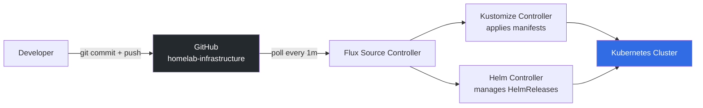
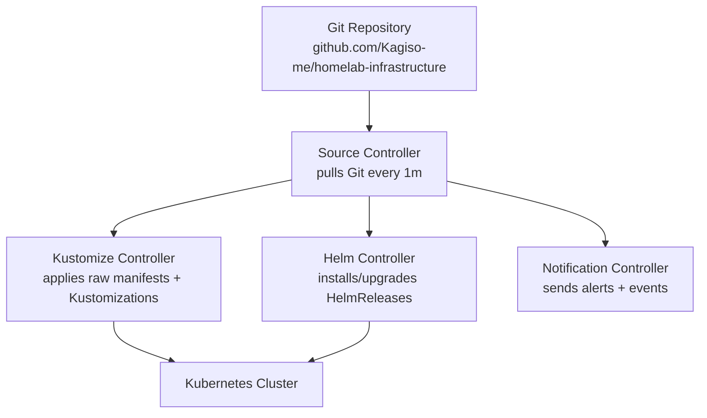

# 04 — GitOps Control Plane (FluxCD)
## Turning Git Into the Cluster API

**Author:** Kagiso Tjeane
**Difficulty:** ⭐⭐⭐⭐⭐⭐⭐⭐☆☆ (8/10)
**Guide:** 04 of 13

> Up to this point the cluster has been built using traditional infrastructure automation.
> Nodes were prepared with Ansible, Kubernetes was installed, and the networking platform
> (MetalLB + Traefik + DNS + TLS) now exposes services to the network.
>
> The next step is a major architectural shift:
>
> **Git becomes the control plane for the platform.**

In this phase we install **FluxCD**, a GitOps controller that continuously reconciles
the state of the Kubernetes cluster with the contents of a Git repository.

From this point forward:

```
Git commit → Flux reconciliation → Cluster state updated
```

No more manual `kubectl apply` operations for platform services or applications.

---

# What GitOps Means

Traditional Kubernetes operations often look like this:

```
Engineer → kubectl apply -f deployment.yaml
```

Over time this causes problems:

• configuration drift
• undocumented changes
• difficult rollbacks
• inconsistent environments

GitOps replaces manual operations with a **declarative workflow**.



The cluster always converges toward the desired state defined in Git.

---

# Why Flux Was Chosen

Flux is one of the two dominant GitOps tools in Kubernetes (the other being ArgoCD).

Flux was selected because it is:

• lightweight
• Kubernetes-native
• fully declarative
• CNCF graduated
• widely used in platform engineering environments

Flux works by deploying several controllers inside the cluster.

---

# Flux Architecture

Flux consists of several cooperating controllers.



Each controller performs a specific function.

| Controller | Responsibility |
|-----------|---------------|
source-controller | pulls Git repositories |
kustomize-controller | applies manifests |
helm-controller | manages Helm releases |
notification-controller | handles alerts and events |

---

# Repository Structure

This repository uses a two-environment layout. Every change lands in `staging` first and
is automatically promoted to `production` after validation.

```
homelab-infrastructure/
├── clusters/
│   ├── prod/
│   │   └── flux-system/     ← prod Flux sync (watches prod branch)
│   └── staging/
│       └── flux-system/     ← staging Flux sync (watches main branch)
├── platform/                ← shared platform services (MetalLB, Traefik, cert-manager)
└── apps/
    ├── base/                ← shared app manifests
    ├── prod/                ← prod overlay (full resources, production certs)
    └── staging/             ← staging overlay (reduced resources, staging certs)
```

| Directory | Purpose |
|----------|---------|
`clusters/prod/flux-system` | Prod Flux sync — watches the `prod` branch |
`clusters/staging/flux-system` | Staging Flux sync — watches the `main` branch |
`platform/` | Shared platform services — same manifests for both environments |
`apps/base/` | Shared application manifests |
`apps/prod/` | Production Kustomize overlay |
`apps/staging/` | Staging Kustomize overlay |

## Promotion Model

```
git push → main
    ↓
GitHub Actions: kubeconform + kustomize build
    ↓
Flux staging reconciles (watches main)
    ↓
GitHub Actions: staging health checks
    ↓
GitHub Actions: auto-merge main → prod branch
    ↓
Flux prod reconciles (watches prod branch)
```

Changes never reach production without passing through staging first.
The promotion is fully automated — no manual merge required.

Flux continuously reconciles the manifests stored here.

---

# Bootstrapping Flux

Flux is installed by **bootstrapping** the cluster to a Git repository.

This operation performs three actions:

1. installs Flux controllers in the cluster
2. commits Flux manifests into Git
3. connects the cluster to the repository

Once complete the cluster continuously monitors Git for changes.

---

# Generate a Deploy Key

Flux authenticates to Git using SSH.

Create a key:

```
ssh-keygen -t ed25519 -f ~/.ssh/flux_deploy_key -C "flux@cluster"
```

This produces:

```
~/.ssh/flux_deploy_key
~/.ssh/flux_deploy_key.pub
```

Add the public key to the Git repository as a **Deploy Key** with write access.

---

# Installing the Flux CLI

Install the CLI tool:

```
curl -s https://fluxcd.io/install.sh | sudo bash
```

Verify installation:

```
flux --version
```

---

# Bootstrapping the Cluster

Bootstrap **prod** cluster first (your ThinkCentre cluster):

```bash
# On the Raspberry Pi (10.0.10.10)
flux bootstrap git \
  --url=ssh://git@github.com/Kagiso-me/homelab-infrastructure.git \
  --branch=prod \
  --path=clusters/prod \
  --private-key-file=$HOME/.ssh/flux_deploy_key
```

Bootstrap **staging** cluster when ready (single-node k3s on Docker NUC):

```bash
flux bootstrap git \
  --url=ssh://git@github.com/Kagiso-me/homelab-infrastructure.git \
  --branch=main \
  --path=clusters/staging \
  --private-key-file=$HOME/.ssh/flux_deploy_key
```

Flux will:

- install controllers into the `flux-system` namespace
- commit `gotk-components.yaml` into the repository
- start reconciling from the specified path and branch

> **Before running bootstrap**, ensure the `sops-age` Secret exists in `flux-system` so
> Flux can decrypt the SOPS-encrypted secrets on its first reconciliation:
>
> ```bash
> kubectl create namespace flux-system || true
> kubectl create secret generic sops-age \
>   --namespace=flux-system \
>   --from-file=age.agekey=age.key
> ```
>
> See [Guide 11 — Secrets Management](./11-Secrets-Management.md) for the full SOPS setup.

---

# What Bootstrap Creates

After bootstrap the repository will contain:

```
clusters/prod/flux-system/
├── gotk-components.yaml     ← all Flux controller manifests
├── gotk-sync.yaml           ← GitRepository (prod branch) + Kustomization
└── kustomization.yaml
```

These manifests describe how Flux connects the cluster to Git.

---

# Flux Reconciliation Model

Flux continuously compares Git state with cluster state.

```
Git repository
      │
      ▼
Flux controllers
      │
      ▼
Cluster manifests
```

If drift occurs Flux corrects it automatically.

Example:

```
kubectl delete deployment grafana
```

Within minutes Flux restores the deployment because it still exists in Git.

---

# Verifying Flux Installation

Check the Flux namespace.

```
kubectl get pods -n flux-system
```

Expected:

```
source-controller
kustomize-controller
helm-controller
notification-controller
```

Check Flux health:

```
flux get all
```

All resources should report **Ready**.

---

# Operational Model After Flux

Once Flux is installed the operational model changes.

Instead of:

```
kubectl apply
```

engineers work through Git.

Example workflow:

```
1. edit manifest
2. commit change
3. push to Git
4. Flux reconciles cluster
```

This approach provides:

• version history
• safe rollbacks
• peer review via pull requests
• deterministic deployments

---

# Failure and Recovery

GitOps makes cluster recovery significantly easier.

If a cluster must be rebuilt:

```
reinstall Kubernetes
bootstrap Flux
```

Flux automatically reconstructs the platform from Git.

This is one of the most powerful advantages of GitOps.

---

# Exit Criteria

Flux is correctly installed when:

✓ flux-system namespace exists
✓ Flux controllers are running
✓ repository successfully reconciles

Run:

```
flux get kustomizations
```

Status should be **Ready**.

---

# Next Guide

➡ **[05 — Cluster Identity & Scheduling](./05-Cluster-Identity-Scheduling.md)**

The next phase defines how workloads are distributed across nodes.
Cluster identity determines where infrastructure services, storage,
and applications are allowed to run.

---

## Navigation

| | Guide |
|---|---|
| ← Previous | [03 — Networking Platform](./03-Networking-Platform.md) |
| Current | **04 — GitOps Control Plane (FluxCD)** |
| → Next | [05 — Cluster Identity & Scheduling](./05-Cluster-Identity-Scheduling.md) |
