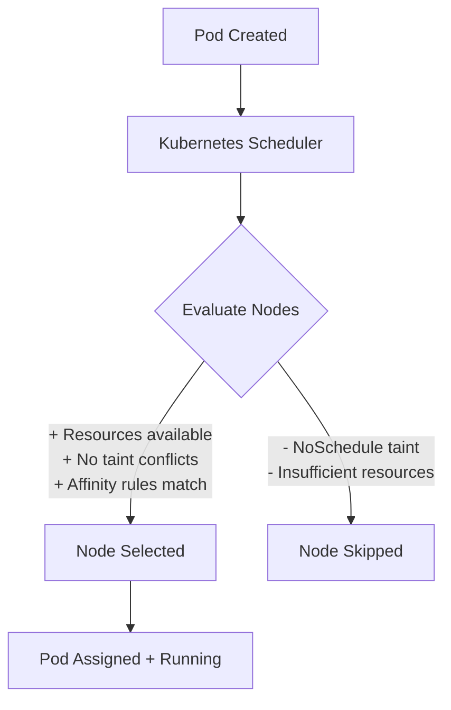
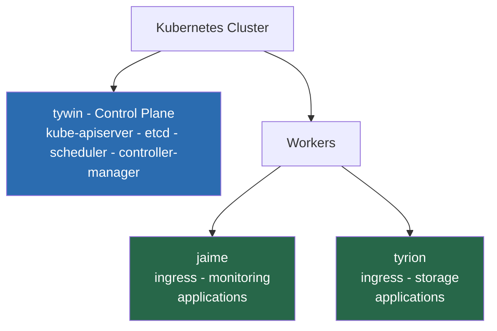

# 05 — Cluster Identity & Scheduling
## Defining the Roles of Your Nodes

**Author:** Kagiso Tjeane
**Difficulty:** ⭐⭐⭐⭐⭐⭐☆☆☆☆ (6/10)
**Guide:** 05 of 14

> A Kubernetes cluster can technically run workloads anywhere.
> That flexibility is powerful — but without structure it quickly becomes chaos.
>
> This phase defines **cluster identity**: which nodes are responsible for which workloads,
> and how the scheduler should behave when placing pods.

Small clusters often fall into an anti‑pattern:

```
All nodes are treated the same.
Everything runs everywhere.
```

While this works initially, it leads to problems:

• infrastructure services competing with applications
• unpredictable performance
• accidental scheduling of workloads on the control plane

A well-structured cluster instead has **clear node responsibilities**.

---

# The Nodes in This Cluster

Your cluster currently contains three nodes.

Example:

```
tywin   → control-plane
jaime   → worker
tyrion  → worker
```

Each node plays a specific role.

| Node | Role |
|-----|------|
tywin | Kubernetes control-plane |
jaime | application workloads |
tyrion | application workloads |

The control-plane node is responsible for running the components that manage the cluster.

---

# Control Plane Responsibilities

The control plane hosts Kubernetes system services.

Examples include:

```
kube-apiserver
kube-scheduler
kube-controller-manager
etcd
```

These components form the **brain of the cluster**.

They should remain stable and lightly loaded.

For this reason we generally **avoid scheduling application workloads** on the control plane.

---

# Worker Node Responsibilities

Worker nodes host the majority of workloads.

Examples:

• application pods
• monitoring stack
• storage services
• ingress controllers

Workers provide the compute capacity for the platform.

---

# Understanding the Kubernetes Scheduler

When a pod is created the Kubernetes scheduler decides **where it should run**.

The decision is based on several factors:

• node availability
• resource requests
• node labels
• taints and tolerations
• affinity rules

Diagram:



Without constraints the scheduler simply chooses the most suitable node.

---

# Preventing Workloads on the Control Plane

The safest practice is to prevent application workloads from running on the control-plane node.

This is done using a **taint**.

Run:

```
kubectl taint nodes tywin node-role.kubernetes.io/control-plane=:NoSchedule
```

This tells the scheduler:

```
Do not place pods on this node unless they explicitly tolerate the taint.
```

Diagram:

```
Control Plane Node
       │
       ▼
[NoSchedule Taint]
       │
       ▼
Scheduler avoids this node
```

Infrastructure pods that require the control plane can still run if they declare a toleration.

---

# Node Labels

Labels are key/value tags assigned to nodes.

Example:

```
kubectl label nodes jaime node-role=worker
kubectl label nodes tyrion node-role=worker
```

Labels allow workloads to target specific nodes.

Example scheduling rule:

```
nodeSelector:
  node-role: worker
```

This ensures a pod only runs on worker nodes.

---

# Infrastructure Placement Strategy

Not all workloads should be treated the same.

Infrastructure services may need different placement rules.

Example platform components:

```
MetalLB
Traefik
cert-manager
Flux
```

These should typically run on worker nodes rather than the control plane.

Diagram:



This separation improves reliability.

---

# High Availability Considerations

Even in small clusters we should consider **distribution of workloads**.

Example:

```
Replica 1 → jaime
Replica 2 → tyrion
```

This ensures that if one worker node fails the service remains available.

This is achieved using **replicas and anti-affinity rules**.

---

# Verifying Node Configuration

Check nodes:

```
kubectl get nodes
```

Example output:

```
NAME     STATUS   ROLES           AGE
tywin    Ready    control-plane
jaime    Ready    worker
tyrion   Ready    worker
```

Check labels:

```
kubectl get nodes --show-labels
```

Check taints:

```
kubectl describe node tywin
```

You should see the `NoSchedule` taint applied.

---

# Why This Matters

Cluster identity may seem minor, but it forms the foundation for reliable scheduling.

A cluster without scheduling rules eventually develops problems such as:

• infrastructure pods competing with applications
• uneven workload distribution
• accidental overload of control-plane nodes

Defining identity early prevents these issues.

---

# Exit Criteria

This phase is complete when:

✓ control-plane node is tainted
✓ worker nodes are labeled
✓ scheduler behavior is predictable

The cluster now has a clear structure.

---

# Next Guide

➡ **[06 — Platform Namespaces & Layout](./06-Platform-Namespaces.md)**

The next phase defines how workloads are organized inside the cluster.
Namespaces create logical boundaries between infrastructure services,
platform components, and applications.

---

## Navigation

| | Guide |
|---|---|
| ← Previous | [04 — GitOps Control Plane](./04-Flux-GitOps.md) |
| Current | **05 — Cluster Identity & Scheduling** |
| → Next | [06 — Platform Namespaces & Layout](./06-Platform-Namespaces.md) |
