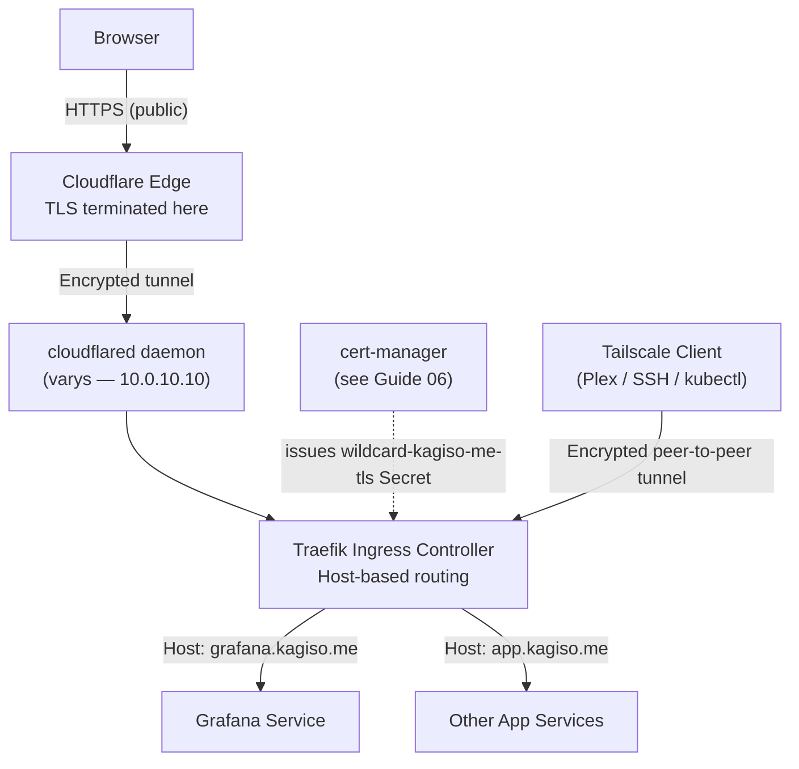
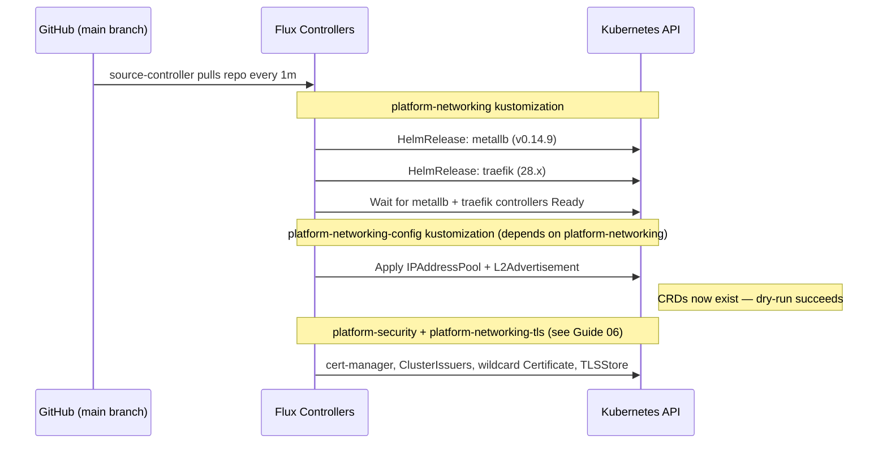

# 05 — Networking: MetalLB & Traefik
## Layer-2 Load Balancing and Ingress

**Author:** Kagiso Tjeane
**Difficulty:** ⭐⭐⭐⭐⭐⭐⭐☆☆☆ (7/10)
**Guide:** 05 of 13

> Kubernetes clusters running on bare-metal do not provide built-in load balancers or ingress gateways.
>
> This guide introduces the **networking platform** responsible for exposing cluster services to the network
> in a predictable, production-style way.
>
> MetalLB and Traefik are **managed entirely by Flux GitOps** via HelmReleases and
> Kustomizations committed to this repository. They are not manually installed — Flux reconciles
> them automatically after the cluster is bootstrapped in [Guide 04](./04-Flux-GitOps.md).
> Cloudflare Tunnel and Tailscale are separate setup steps covered later in this guide.

The networking layer consists of:

- **MetalLB** — provides LoadBalancer IP addresses on bare metal
- **Traefik** — ingress controller handling HTTP/S routing
- **Wildcard DNS** — human-friendly service hostnames
- **Cloudflare Tunnel** — outbound tunnel for public service exposure (no open inbound ports)
- **Tailscale / Headscale** — encrypted private access for Plex, SSH, and kubectl

TLS certificates (cert-manager, Let's Encrypt, wildcard cert) are covered in [Guide 06 — Security: cert-manager & TLS](./06-Security-CertManager-TLS.md).

Together these components transform a raw Kubernetes cluster into a **usable application platform**.

---

## Table of Contents

1. [Why a Networking Layer Is Required](#why-a-networking-layer-is-required)
2. [Full Networking Architecture](#full-networking-architecture)
3. [Component Overview](#component-overview)
4. [Prerequisites](#prerequisites)
5. [Installation — Via Flux GitOps](#installation--via-flux-gitops)
6. [What Flux Manages](#what-flux-manages)
7. [DNS Configuration](#dns-configuration)
8. [Cloudflare Tunnel Setup](#cloudflare-tunnel-setup)
9. [Pi-hole (Split DNS + Ad Blocking)](#pi-hole-split-dns--ad-blocking)
10. [Tailscale / Headscale (Private Remote Access)](#tailscale--headscale-private-remote-access)
11. [Ingress vs IngressRoute](#ingress-vs-ingressroute)
12. [CrowdSec ForwardAuth](#crowdsec-forwardauth)
13. [Verifying the Platform](#verifying-the-platform)
14. [Exit Criteria](#exit-criteria)
15. [Troubleshooting](#troubleshooting)

---

## Why a Networking Layer Is Required

In cloud environments Kubernetes automatically provisions load balancers:

```
AWS   → Elastic Load Balancer
GCP   → Cloud Load Balancer
Azure → Azure Load Balancer
```

Bare-metal clusters lack this functionality. Without a networking platform, services appear like this:

```
kubectl get svc

NAME       TYPE           CLUSTER-IP     EXTERNAL-IP   PORT(S)
grafana    LoadBalancer   10.96.44.12    <pending>     80:31234/TCP
```

`<pending>` means no external IP was ever assigned — the service is unreachable from outside the cluster.

MetalLB solves this problem by allowing Kubernetes to allocate real IP addresses from the local network
and advertising them using ARP (Layer-2 mode), making the cluster appear to "own" those IPs to the rest
of the LAN.

---

## Full Networking Architecture



Traffic flows from the browser through Cloudflare Edge → cloudflared tunnel → Traefik → the target service. Cloudflare handles public TLS automatically. For private remote access (Plex, SSH, kubectl), Tailscale provides encrypted peer-to-peer tunnels with its own certificate infrastructure. TLS certificate management is covered in [Guide 06](./06-Security-CertManager-TLS.md).

---

## Component Overview

| Component | Version | Namespace | Managed By | Responsibility |
|-----------|---------|-----------|------------|----------------|
| MetalLB | 0.14.9 (Helm) | `metallb-system` | Flux HelmRelease | Assign LoadBalancer IPs from the local IP pool |
| Traefik | 28.x (Helm) | `ingress` | Flux HelmRelease | HTTP/S routing, TLS termination, IngressRoute CRDs |

Both are defined as HelmReleases under `platform/networking/`, reconciled by Flux after the cluster is bootstrapped. See [Guide 04](./04-Flux-GitOps.md) for the bootstrap process. cert-manager (the third networking-adjacent component) is covered in [Guide 06](./06-Security-CertManager-TLS.md).

### MetalLB — Layer-2 Mode

MetalLB operates in Layer-2 (ARP) mode for this homelab. A Speaker pod on each node listens for
ARP requests and claims ownership of addresses in the pool:

```
Client sends ARP: "Who owns 10.0.10.110?"
MetalLB Speaker responds: "I do" (node MAC address)
Traffic routed to that node → kube-proxy → Traefik pod
```

**IP pool:** `10.0.10.110 – 10.0.10.115` (6 addresses available for LoadBalancer services)
**Traefik pinned to:** `10.0.10.110`

### Traefik — Ingress Controller

Traefik is the single entry point for all HTTP/S traffic. It:

- Listens on port 80 and 443 at `10.0.10.110`
- Redirects all HTTP to HTTPS automatically
- Routes requests to the correct backend Service based on the `Host` header
- Serves TLS certificates stored as Kubernetes Secrets by cert-manager (see [Guide 06](./06-Security-CertManager-TLS.md))

For resilience, Traefik now runs as a **two-replica deployment** with a
**PodDisruptionBudget of `minAvailable: 1`**. A single node reboot or drain
should not take ingress down as long as the cluster still has one healthy Traefik pod available.

---

## Prerequisites

Before running the Flux bootstrap:

| Requirement | Check |
|-------------|-------|
| k3s cluster running | `kubectl get nodes` — all nodes Ready |
| Ansible installed on varys | `ansible --version` |
| varys can SSH to tywin (10.0.10.11) | `ssh kagiso@10.0.10.11` |
| Ansible Vault file created | `ansible/vars/vault.yml` exists on varys — see [Guide 04 — Saving the Deploy Key to Vault](./04-Flux-GitOps.md#saving-the-deploy-key-to-vault) |
| Flux SSH deploy key in vault | `flux_github_ssh_private_key` present in vault — see [Guide 04](./04-Flux-GitOps.md#saving-the-deploy-key-to-vault) |

> **DNS note:** Internal DNS (Pi-hole or router) should point `*.kagiso.me` to `10.0.10.110` for
> LAN and Tailscale access. Cloudflare Tunnel setup is a separate step — see the
> [Cloudflare Tunnel Setup](#cloudflare-tunnel-setup) section below.

---

## Installation — Via Flux GitOps

MetalLB and Traefik are **not installed manually**. They are defined as Flux
HelmReleases in this repository and reconciled automatically after the cluster is bootstrapped.

The full installation process — including the `install-platform.yml` playbook that triggers Flux
reconciliation — is covered in **[Guide 04 — GitOps Control Plane](./04-Flux-GitOps.md)**.

---

## What Flux Manages

Flux reconciles the networking platform in dependency order:



> **Why `metallb-config` is a separate Kustomization:**
> `IPAddressPool` and `L2Advertisement` are custom resource types that only exist after MetalLB
> installs its CRDs. Flux validates all resources in a Kustomization with a dry-run before
> applying any of them. If these CRs were in the same Kustomization as the MetalLB HelmRelease,
> the dry-run would fail on a fresh cluster because the CRDs don't exist yet — blocking the
> entire networking stack. Keeping them in a separate, dependent Kustomization ensures the
> HelmRelease (and its CRDs) lands first.

The manifests driving this are located at:

```
platform/
├── networking/
│   ├── metallb/          ← HelmRelease + HelmRepository (installs MetalLB CRDs)
│   ├── metallb-config/   ← IPAddressPool + L2Advertisement (applied after CRDs exist)
│   ├── traefik/          ← HelmRelease + HelmRepository
│   └── traefik-config/   ← Middlewares + TLSStore + wildcard Certificate (see Guide 06)
└── security/
    ├── cert-manager/     ← HelmRelease + ClusterIssuer (see Guide 06)
    └── cluster-issuers/  ← letsencrypt-prod, letsencrypt-staging, internal-ca (see Guide 06)
```

Any change to these manifests (e.g., upgrading a chart version) is made via a Git commit.
Flux detects the change and reconciles the cluster to match. No `helm upgrade` or `kubectl apply`
commands are run manually.

---

## DNS Configuration

There are two DNS layers: Cloudflare (public) and internal DNS (LAN/Tailscale).

### Cloudflare DNS — Public access

Public services use proxied CNAME records in Cloudflare, pointing to the Cloudflare Tunnel:

| Record | Type | Value | Proxy |
|--------|------|-------|-------|
| `cloud.kagiso.me` | CNAME | `<tunnel-id>.cfargotunnel.com` | Proxied (orange cloud) |
| `photos.kagiso.me` | CNAME | `<tunnel-id>.cfargotunnel.com` | Proxied (orange cloud) |

With Cloudflare proxying enabled, external clients resolve to Cloudflare's anycast IPs — the home network IP is never exposed publicly.

### Internal DNS — LAN and Tailscale access

Configure a wildcard record on the internal DNS server (Pi-hole or router):

| Record | Type | Value |
|--------|------|-------|
| `*.kagiso.me` | A | `10.0.10.110` |

This routes all internal hostnames directly to Traefik, bypassing Cloudflare. New services added to Kubernetes are immediately reachable on the LAN without DNS changes — only a new IngressRoute is required. When connected via Tailscale, the same wildcard resolves to `10.0.10.110` if the internal DNS server is set as the Tailscale DNS resolver.

---

## Cloudflare Tunnel Setup

Cloudflare Tunnel (`cloudflared`) creates an outbound encrypted connection from the homelab to Cloudflare's edge. No inbound ports need to be opened on the router or firewall — the tunnel is initiated from inside the network.

**How it works:** `cloudflared` on varys establishes persistent outbound connections to Cloudflare's edge. When a request arrives at `grafana.kagiso.me`, Cloudflare routes it through the tunnel to `cloudflared`, which forwards it to Traefik at `10.0.10.110`. Traefik matches the `Host` header and routes to the correct backend service.

### Installation on varys (amd64)

```bash
# On varys (10.0.10.10)
curl -L --output cloudflared.deb \
  https://github.com/cloudflare/cloudflared/releases/latest/download/cloudflared-linux-amd64.deb
sudo dpkg -i cloudflared.deb
cloudflared --version
```

### Authenticate and Create Tunnel

```bash
cloudflared tunnel login
cloudflared tunnel create homelab
```

`tunnel login` opens a browser to authenticate with Cloudflare. `tunnel create` registers the tunnel and writes the credentials file to `~/.cloudflared/`.

### Config File

Create `/etc/cloudflared/config.yml`:

```yaml
tunnel: <tunnel-id>
credentials-file: /root/.cloudflared/<tunnel-id>.json
ingress:
  - hostname: cloud.kagiso.me
    service: http://10.0.10.110
    originRequest:
      httpHostHeader: cloud.kagiso.me
  - hostname: photos.kagiso.me
    service: http://10.0.10.110
    originRequest:
      httpHostHeader: photos.kagiso.me
  - service: http_status:404
```

The `httpHostHeader` ensures Traefik receives the original hostname and routes to the correct backend. The catch-all `http_status:404` at the end is required — `cloudflared` rejects configs without a final catch-all rule.

### Route DNS and Install as Service

```bash
cloudflared tunnel route dns homelab cloud.kagiso.me
cloudflared tunnel route dns homelab photos.kagiso.me
sudo cloudflared service install
sudo systemctl enable --now cloudflared
```

`tunnel route dns` creates the proxied CNAME record in Cloudflare DNS automatically.

> **Note:** `cloudflared service install` runs as root and expects the tunnel credentials file at `/root/.cloudflared/<tunnel-id>.json`. If you created the tunnel as a non-root user, copy the credentials file before starting the service:
> ```bash
> sudo mkdir -p /root/.cloudflared
> sudo cp ~/.cloudflared/<tunnel-id>.json /root/.cloudflared/
> ```

### Adding a New Service

Adding a new public service only requires adding an ingress rule to `/etc/cloudflared/config.yml` and restarting `cloudflared`. No Cloudflare dashboard changes are needed if using tunnel DNS routing:

```bash
# Add rule to config.yml, then:
sudo systemctl restart cloudflared
# Run once to create the DNS record:
cloudflared tunnel route dns homelab newservice.kagiso.me
```

> **Plex / media streaming:** Do NOT route Plex through Cloudflare Tunnel. Cloudflare's ToS prohibits proxying video streaming. Use Tailscale instead (see next section).

---

## Pi-hole (Split DNS + Ad Blocking)

Pi-hole runs on varys at `10.0.10.10` alongside `cloudflared`. It serves as the DNS resolver for every device on the LAN and provides two key capabilities:

- **Split DNS:** The wildcard entry `*.kagiso.me → 10.0.10.110` means all internal services with a `*.kagiso.me` hostname resolve directly to Traefik on the LAN — without being publicly exposed.
- **Ad blocking:** Network-wide DNS-based ad filtering for all LAN clients.

### Installation

Pi-hole is installed via an Ansible playbook. Run from inside the `ansible/` directory on varys:

```bash
cd ~/homelab-infrastructure/ansible
ansible-playbook -i inventory/homelab.yml \
  playbooks/services/install-pihole.yml
```

The playbook installs Pi-hole, configures the `*.kagiso.me` wildcard dnsmasq directive, and sets upstream resolvers to Cloudflare `1.1.1.1` / `1.0.0.1` with DNSSEC.

### Post-Install: Set USG DHCP DNS

After installation, configure the UniFi Security Gateway to hand out Pi-hole as the DNS server for all DHCP clients:

```
UniFi Controller → Networks → [LAN network] → DHCP → DNS Server 1: 10.0.10.10
```

Once this is set, all LAN devices will use Pi-hole for DNS resolution automatically on their next DHCP renewal.

### Admin UI

Pi-hole's admin dashboard is accessible at:

```
http://10.0.10.10/admin
```

### Adding a New Internal-Only Service

Create an `IngressRoute` in k3s with the desired `Host(*.kagiso.me)` rule. No DNS changes are needed — Pi-hole's wildcard `*.kagiso.me → 10.0.10.110` handles resolution on the LAN automatically.

The service is reachable on the LAN. It is not reachable from the WAN.

### Adding a New Public Service

Three steps are required:

1. Create an `IngressRoute` in k3s with the desired hostname.
2. Add a hostname ingress rule to `/etc/cloudflared/config.yml` on `varys` and restart `cloudflared`.
3. Add a proxied CNAME record in Cloudflare DNS pointing to the tunnel:

```bash
cloudflared tunnel route dns homelab newservice.kagiso.me
sudo systemctl restart cloudflared
```

---

## Tailscale / Headscale (Private Remote Access)

The access model is split by service type:

- **Public web services** (Nextcloud, Immich) → Cloudflare Tunnel
- **Private services** (Plex, SSH, kubectl) → Tailscale

Tailscale creates encrypted WireGuard-based peer-to-peer tunnels between devices. Devices enrolled in the same Tailscale network can reach each other directly using Tailscale IPs or MagicDNS hostnames.

### Install Tailscale on RPi and Nodes

```bash
curl -fsSL https://tailscale.com/install.sh | sh
sudo tailscale up
```

Run this on each device that needs remote access (RPi, workstation, phone, etc.). After `tailscale up`, each device gets a stable Tailscale IP (100.x.x.x range).

### Configure RPi as Exit Node

The RPi doubles as a Tailscale exit node, allowing other devices to route all internet traffic through the home network when away.

**On the RPi:**

```bash
# Enable IP forwarding
echo 'net.ipv4.ip_forward = 1' | sudo tee -a /etc/sysctl.d/99-tailscale.conf
echo 'net.ipv6.conf.all.forwarding = 1' | sudo tee -a /etc/sysctl.d/99-tailscale.conf
sudo sysctl -p /etc/sysctl.d/99-tailscale.conf

# Advertise as exit node
sudo tailscale up --advertise-exit-node
```

**In the Tailscale admin console:**

Go to [login.tailscale.com/admin/machines](https://login.tailscale.com/admin/machines), find bran, and approve the exit node under **Edit route settings**.

**On client devices** (when you want to use the exit node):

```bash
# Enable exit node
sudo tailscale up --exit-node=<bran-tailscale-ip>

# Disable exit node
sudo tailscale up --exit-node=
```

Or toggle it from the Tailscale GUI/app on mobile.

### Accessing Plex via Tailscale

Once enrolled, access Plex directly using its Tailscale IP or via MagicDNS:

```
# Direct by Tailscale IP
http://100.x.x.x:32400/web

# Via MagicDNS (if enabled in Tailscale admin)
http://plex-host.tail<network>.ts.net:32400/web
```

No Traefik IngressRoute is required for Tailscale-only services — clients connect directly to the host running the service.

### SSH and kubectl via Tailscale

```bash
# SSH to a homelab node over Tailscale
ssh kagiso@100.x.x.x

# kubectl via Tailscale (after adding Tailscale IP to kubeconfig)
kubectl --server=https://100.x.x.x:6443 get nodes
```

### Headscale — Self-Hosted Coordination Server

[Headscale](https://headscale.net/) is a self-hosted alternative to the Tailscale coordination server. This is a planned future enhancement for this homelab.

> **TLS note:** Tailscale handles its own certificate infrastructure for MagicDNS and HTTPS. No cert-manager configuration or Let's Encrypt setup is required for Tailscale-connected services.

---

## Ingress vs IngressRoute

Traefik supports two routing models:

### Standard Kubernetes Ingress

```yaml
apiVersion: networking.k8s.io/v1
kind: Ingress
metadata:
  name: grafana
spec:
  ingressClassName: traefik
  rules:
    - host: grafana.kagiso.me
      http:
        paths:
          - path: /
            pathType: Prefix
            backend:
              service:
                name: grafana
                port:
                  number: 3000
```

- Portable across ingress controllers
- Limited to basic path/host routing
- No middleware support without annotations

### Traefik IngressRoute (Recommended)

```yaml
apiVersion: traefik.io/v1alpha1
kind: IngressRoute
metadata:
  name: grafana
spec:
  entryPoints: [websecure]
  routes:
    - match: Host(`grafana.kagiso.me`)
      kind: Rule
      middlewares:
        - name: secure-headers
      services:
        - name: grafana
          port: 3000
  tls: {}    # Uses wildcard-kagiso-me-tls from Traefik default TLSStore (see Guide 06)
```

- Full Traefik routing rule syntax
- Middleware support (auth, rate limiting, headers)
- Better observability via Traefik dashboard

**All homelab services use IngressRoute.** The pattern is established in
[`apps/base/grafana/`](../../apps/base/grafana/) and followed by all subsequent applications.

---

## CrowdSec ForwardAuth

CrowdSec is a collaborative, behaviour-based intrusion prevention system. It is applied as a **global ForwardAuth middleware on the `websecure` entrypoint**, meaning every HTTPS request to Traefik passes through CrowdSec's bouncer before reaching a backend service.

> **Deployment order:** CrowdSec ForwardAuth is deployed **after** all platform components (MetalLB, Traefik, cert-manager, the monitoring stack) are healthy. Do not configure the global middleware until the platform is fully operational. See [Guide 04 — Deployment Order](./04-Flux-GitOps.md) for the full dependency chain.

### How It Works

1. A request arrives at Traefik's `websecure` entrypoint.
2. Traefik forwards the request to the CrowdSec bouncer (ForwardAuth middleware) before any routing occurs.
3. The bouncer queries the CrowdSec local API to determine if the source IP is in the blocklist.
4. If the IP is blocked, the bouncer returns `403 Forbidden` and Traefik rejects the request immediately.
5. If the IP is clean, the bouncer returns `200 OK` and Traefik routes the request normally.

### Global vs Per-Route Middleware

Applying CrowdSec at the entrypoint level (rather than per-IngressRoute) means:
- **Every** service is automatically protected — no per-app configuration required.
- New services added to the cluster are protected from the moment their IngressRoute is created.
- Bypassing protection requires explicitly setting `middlewares: []` on an IngressRoute (do not do this unless necessary).

### Verifying CrowdSec Is Active

```bash
# Check the bouncer is registered with the CrowdSec local API
cscli bouncers list

# Check the ForwardAuth middleware exists in Traefik
kubectl get middleware -n ingress

# Confirm the entrypoint annotation is set on the Traefik HelmRelease
kubectl get helmrelease traefik -n ingress -o yaml | grep -A5 entryPoints
```

---

## Verifying the Platform

> **Note:** None of these components exist yet at this point in the guide sequence. MetalLB
> and Traefik are deployed by Flux when [Guide 04](./04-Flux-GitOps.md) runs. Run these checks
> **after completing Guide 04**.

```bash
# MetalLB — controller and speakers running
kubectl get pods -n metallb-system
# Expected: metallb-controller (1/1) and metallb-speaker (1/1 per node)

# MetalLB — IP pool configured
kubectl get ipaddresspool -n metallb-system
# Expected: homelab-pool with 10.0.10.110-10.0.10.115
# Traefik - running and assigned LoadBalancer IP
kubectl get svc traefik -n ingress
# Expected: traefik TYPE=LoadBalancer EXTERNAL-IP=10.0.10.110

# Traefik - deployment highly available
kubectl get deploy traefik -n ingress
# Expected: READY 2/2

# Traefik - safe disruption budget
kubectl get pdb -n ingress
# Expected: traefik minAvailable=1

# End-to-end - Traefik is responding (expect 404, not connection refused)
curl -k https://10.0.10.110
# Expected: 404 page not found
```

The `404 page not found` response from Traefik is correct — it means Traefik is running and
handling requests, but no IngressRoute has been defined yet to route them anywhere.

For cert-manager and TLS certificate verification steps, see [Guide 06 — Verifying Certificates](./06-Security-CertManager-TLS.md#verifying-certificates).

---

## Exit Criteria

> Verify these after [Guide 04](./04-Flux-GitOps.md) — Flux deploys everything in this guide.

The networking platform is complete when all of the following are true:

- `flux get kustomization platform-networking` — `READY=True`
- `flux get helmrelease -A` — metallb and traefik both `READY=True`
- `kubectl get pods -n metallb-system` — metallb-controller and metallb-speaker Running on all nodes
- `kubectl get pods -n ingress` — two Traefik pods Running
- `kubectl get deploy traefik -n ingress` — `READY 2/2`
- `kubectl get pdb -n ingress` — Traefik PDB present with `minAvailable=1`
- Traefik service shows `EXTERNAL-IP: 10.0.10.110`
- `curl https://10.0.10.110` returns `404 page not found`
- DNS wildcard `*.kagiso.me` resolves to `10.0.10.110` from a client machine

For cert-manager and TLS exit criteria, see [Guide 06 — Exit Criteria](./06-Security-CertManager-TLS.md#exit-criteria).

---

## Troubleshooting

**Traefik `EXTERNAL-IP` stays `<pending>`**

MetalLB did not assign an IP. Check:

```bash
kubectl describe svc traefik -n ingress          # Look for events
kubectl get ipaddresspool -n metallb-system      # Pool must exist
kubectl get pods -n metallb-system               # Speakers must be Running
```

Ensure `10.0.10.110` is within the configured pool range (`10.0.10.110-10.0.10.115`).

**Traefik returning 404 for a deployed service**

```bash
kubectl get ingressroute -A                     # Verify the IngressRoute exists
kubectl describe ingressroute <name> -n <ns>    # Check the Host rule
kubectl logs -n ingress deploy/traefik          # Check for routing errors
```

Ensure the `Host()` rule in the IngressRoute matches the requested hostname exactly.

**cert-manager and TLS troubleshooting** is covered in [Guide 06 — Troubleshooting](./06-Security-CertManager-TLS.md#troubleshooting).

---

## Navigation

| | Guide |
|---|---|
| ← Previous | [04 — Flux GitOps Bootstrap](./04-Flux-GitOps.md) |
| Current | **05 — Networking: MetalLB & Traefik** |
| → Next | [06 — Security: cert-manager & TLS](./06-Security-CertManager-TLS.md) |
