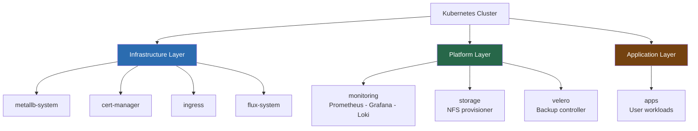

# 06 — Platform Namespaces & Layout
## Organising the Cluster Like a Platform

**Author:** Kagiso Tjeane
**Difficulty:** ⭐⭐⭐⭐⭐⭐☆☆☆☆ (6/10)
**Guide:** 06 of 14

> Kubernetes does not enforce how workloads are organised.
> Without structure, clusters quickly become difficult to manage.
>
> This phase introduces **namespaces and platform layout**, defining how
> infrastructure services, platform components, and applications are
> separated inside the cluster.

This step might appear simple, but it is actually **foundational platform engineering work**.

A clean namespace model provides:

• operational clarity
• security boundaries
• easier troubleshooting
• safer GitOps workflows

---

# Why Namespaces Matter

Without namespaces everything lives in the `default` namespace.

Example:

```
kubectl get pods

grafana-abc123
jellyfin-xyz321
prometheus-abc999
traefik-qwe888
```

This quickly becomes unmanageable.

Namespaces provide **logical isolation**.

```
kubectl get pods -n monitoring
kubectl get pods -n ingress
kubectl get pods -n databases
```

Diagram:

```
Kubernetes Cluster
│
├── ingress
├── monitoring
├── storage
├── databases
└── apps
```

Each namespace represents a **layer of the platform**.

---

# Namespace Design Philosophy

The namespace model used in this platform follows a layered approach.

```
Infrastructure Layer
Platform Layer
Application Layer
```

Diagram:



This separation makes it clear **what belongs where**.

---

# Recommended Namespaces

Create the following namespaces.

| Namespace | Purpose |
|----------|--------|
ingress | ingress controllers |
monitoring | Prometheus / Grafana |
storage | storage infrastructure |
databases | stateful databases |
apps | user applications |

Infrastructure namespaces such as `metallb-system` and `cert-manager`
are created automatically during installation.

---

# Creating Namespaces

Namespaces in this platform are **managed by Flux** — they are defined as manifests under
`platform/namespaces/` and reconciled automatically by the `platform-namespaces` Kustomization
after `install-platform.yml` completes. No manual `kubectl apply` is required or expected.

The namespace manifests follow this pattern:

```yaml
apiVersion: v1
kind: Namespace
metadata:
  name: ingress
---
apiVersion: v1
kind: Namespace
metadata:
  name: monitoring
---
apiVersion: v1
kind: Namespace
metadata:
  name: storage
---
apiVersion: v1
kind: Namespace
metadata:
  name: databases
---
apiVersion: v1
kind: Namespace
metadata:
  name: apps
```

To add a new namespace, add a manifest to `platform/namespaces/`, commit, and push. Flux
reconciles it into the cluster automatically. **Do not run `kubectl apply` directly** — Flux
owns these resources and a manual apply will be overwritten on the next reconciliation.

Verify Flux has reconciled them:

```bash
flux get kustomization platform-namespaces
kubectl get namespaces
```

Expected namespaces:

```
ingress
monitoring
storage
databases
apps
```

---

# Namespaces and GitOps

Namespaces also define the **Git repository structure** used by Flux.

Example layout:

```
platform-infra/
└── clusters
    └── prod
        ├── infrastructure
        │   ├── metallb
        │   ├── traefik
        │   └── cert-manager
        │
        ├── platform
        │   ├── monitoring
        │   ├── storage
        │   └── databases
        │
        └── apps
```

This layout mirrors the namespace structure inside the cluster.

---

# Benefits of Layered Platform Layout

A structured layout provides several advantages.

### Clear ownership

```
Infrastructure → platform engineering
Applications → developers
```

### Safe GitOps workflows

Changes to platform infrastructure remain isolated from application deployments.

### Easier troubleshooting

Example:

```
kubectl get pods -n monitoring
kubectl get pods -n ingress
```

You immediately know where to look.

---

# Namespace Resource Boundaries

Namespaces can also enforce limits.

Examples include:

• CPU quotas
• memory limits
• network policies

Although these controls are optional in small clusters, designing namespaces
properly now makes it easier to introduce them later.

---

# Observability Benefits

Monitoring tools such as Prometheus and Grafana rely heavily on namespaces.

Metrics are often grouped by namespace.

Example Prometheus query:

```
sum(container_cpu_usage_seconds_total) by (namespace)
```

Namespaces therefore help provide **meaningful operational visibility**.

---

# Verifying Namespace Layout

Run:

```
kubectl get namespaces
```

You should see:

```
ingress
monitoring
storage
databases
apps
```

Check pods within each namespace.

```
kubectl get pods -n ingress
kubectl get pods -n monitoring
```

This confirms workloads are correctly isolated.

---

# Exit Criteria

This phase is complete when:

✓ platform namespaces exist
✓ workloads are deployed into the correct namespaces
✓ repository layout mirrors namespace structure

Your cluster now has a **clear organisational model**.

---

# Next Guide

➡ **[07 — Monitoring & Observability](./07-Monitoring-Observability.md)**

The next phase introduces the monitoring stack
(Prometheus, Grafana, and log aggregation), providing
visibility into cluster health, application performance,
and operational metrics.

---

## Navigation

| | Guide |
|---|---|
| ← Previous | [05 — Cluster Identity & Scheduling](./05-Cluster-Identity-Scheduling.md) |
| Current | **06 — Platform Namespaces & Layout** |
| → Next | [07 — Monitoring & Observability](./07-Monitoring-Observability.md) |
