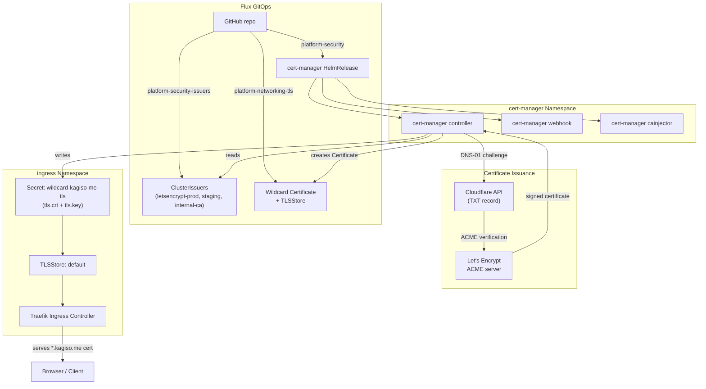
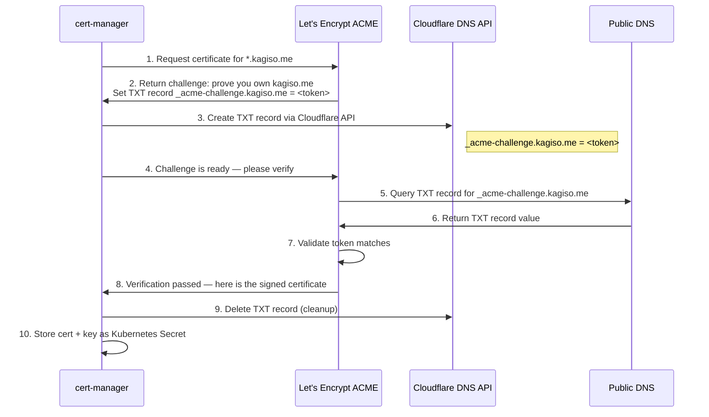

# 06 — Security: cert-manager & TLS
## Automated Certificate Management for the Platform

**Author:** Kagiso Tjeane
**Difficulty:** ⭐⭐⭐⭐⭐⭐⭐☆☆☆ (7/10)
**Guide:** 06 of 13

> A networking platform can route traffic, but without TLS the platform is not production-ready.
> Browsers show security warnings, API clients reject self-signed certificates, and credentials
> traverse the network in cleartext.
>
> This guide describes the **security layer** that issues and manages browser-trusted TLS
> certificates for every service in the cluster — automatically, with zero manual renewal.
>
> cert-manager, the ClusterIssuers, and the wildcard certificate are **managed entirely by
> Flux GitOps** via HelmReleases and Kustomizations committed to this repository. They are not
> manually installed — Flux reconciles them automatically after the cluster is bootstrapped
> in [Guide 04](./04-Flux-GitOps.md).

> **Flux Kustomizations that deploy this layer:**
>
> | Kustomization | What it deploys | Depends on |
> |---|---|---|
> | `platform-security` | cert-manager HelmRelease (controller, webhook, cainjector) | `platform-networking` |
> | `platform-security-issuers` | ClusterIssuers (letsencrypt-prod, letsencrypt-staging, internal-ca) | `platform-security` |
> | `platform-networking-tls` | Wildcard Certificate, TLSStore, Traefik Middlewares | `platform-networking` + `platform-security-issuers` |
>
> The dependency chain ensures each layer's CRDs exist before the resources that depend on them
> are applied. cert-manager CRDs must be registered before ClusterIssuers can be created, and
> both cert-manager and Traefik CRDs must exist before the Certificate and TLSStore resources
> can be validated.

---

## Table of Contents

1. [Why Automated TLS Matters](#why-automated-tls-matters)
2. [Architecture Overview](#architecture-overview)
3. [cert-manager: What It Does](#cert-manager-what-it-does)
4. [ClusterIssuers](#clusterissuers)
5. [DNS-01 Challenge Flow via Cloudflare API](#dns-01-challenge-flow-via-cloudflare-api)
6. [The Wildcard Certificate](#the-wildcard-certificate)
7. [TLS Certificate Lifecycle](#tls-certificate-lifecycle)
8. [Traefik TLS Integration](#traefik-tls-integration)
9. [The Three TLS Paths](#the-three-tls-paths)
10. [Repository Manifest Layout](#repository-manifest-layout)
11. [Verifying Certificates](#verifying-certificates)
12. [Exit Criteria](#exit-criteria)
13. [Troubleshooting](#troubleshooting)

---

## Why Automated TLS Matters

Without cert-manager, every service in the cluster would require one of the following:

- **Self-signed certificates** — browsers display warnings, users learn to click through security prompts, and the habit transfers to real attacks.
- **Manually provisioned certificates** — an operator requests, downloads, converts, and installs a certificate, then remembers to renew it every 90 days per service.
- **No TLS at all** — credentials, tokens, and data traverse the network unencrypted.

cert-manager eliminates all three scenarios. It requests, issues, stores, and renews browser-trusted TLS certificates automatically. Services are born with TLS. No operator intervention is required at any point in the certificate lifecycle.

---

## Architecture Overview



---

## cert-manager: What It Does

[cert-manager](https://cert-manager.io/) is a Kubernetes-native certificate management controller. It runs as a set of pods in the `cert-manager` namespace and extends the Kubernetes API with custom resources for certificates, issuers, and challenges.

### Components

| Pod | Responsibility |
|-----|----------------|
| `cert-manager` | Core controller. Watches Certificate resources, creates ACME orders, solves challenges, writes Secrets containing the signed certificate and private key. |
| `cert-manager-webhook` | Validates and converts cert-manager custom resources. Blocks malformed Certificate or ClusterIssuer specs at admission time. |
| `cert-manager-cainjector` | Injects CA certificates into webhook configurations and API services that require TLS. Ensures the webhook itself and any mutating/validating webhooks trust the correct CA. |

### How It Is Deployed

cert-manager is installed as a Flux HelmRelease from the Jetstack Helm repository:

```
Namespace:   cert-manager
Chart:       cert-manager (Jetstack)
Version:     v1.16.x
CRD policy:  CreateReplace (CRDs are installed and updated with each release)
```

The HelmRelease is defined at `platform/security/cert-manager/helmrelease.yaml`. Flux reconciles it as part of the `platform-security` Kustomization.

### Custom Resource Definitions

cert-manager registers the following CRDs on installation:

| CRD | Purpose |
|-----|---------|
| `Certificate` | Declares a desired TLS certificate. cert-manager creates and renews it automatically. |
| `CertificateRequest` | Internal representation of a single issuance attempt. Created by cert-manager, not by operators. |
| `ClusterIssuer` | Cluster-scoped authority that can issue certificates in any namespace. |
| `Issuer` | Namespace-scoped authority (not used in this homelab — ClusterIssuers cover all namespaces). |
| `Order` | Represents an ACME order with Let's Encrypt. Tracks the lifecycle of a certificate request. |
| `Challenge` | Represents an individual ACME challenge (DNS-01 or HTTP-01) within an Order. |

---

## ClusterIssuers

A ClusterIssuer defines **how** cert-manager obtains certificates. This homelab configures three ClusterIssuers, each serving a different purpose.

### letsencrypt-prod

The production issuer. Issues browser-trusted certificates signed by Let's Encrypt. Used for all services that need real TLS. This is the **default issuer** for all cluster services.

```yaml
apiVersion: cert-manager.io/v1
kind: ClusterIssuer
metadata:
  name: letsencrypt-prod
spec:
  acme:
    email: admin@kagiso.me
    server: https://acme-v02.api.letsencrypt.org/directory
    privateKeySecretRef:
      name: letsencrypt-prod-key
    solvers:
      - dns01:
          cloudflare:
            email: admin@kagiso.me
            apiTokenSecretRef:
              name: cloudflare-api-token
              key: api-token
```

**Manifest:** `platform/security/cluster-issuers/letsencrypt-prod.yaml`

Let's Encrypt production has [rate limits](https://letsencrypt.org/docs/rate-limits/). Only use after confirming issuance works with the staging issuer.

### letsencrypt-staging

Identical configuration to production, but points at the Let's Encrypt staging ACME server:

```
server: https://acme-staging-v02.api.letsencrypt.org/directory
```

Certificates issued by staging are **not trusted by browsers**. The staging environment exists for testing the entire issuance flow without consuming production rate limits. Use `letsencrypt-staging` any time you need to verify that DNS-01 challenges are working or that the cert-manager ACME account is healthy — without risking a rate limit against production.

This ClusterIssuer always exists in the cluster. It is not the default for any environment's running services, but it is available whenever you need a safe issuance test.

**Manifest:** `platform/security/cluster-issuers/letsencrypt-staging.yaml`

### internal-ca

A self-signed Certificate Authority for internal-only services that do not need browser trust (Traefik dashboard, cluster-internal monitoring endpoints). The chain is:

1. A `selfsigned` ClusterIssuer bootstraps the CA.
2. A `Certificate` named `homelab-ca` is issued by `selfsigned` (ECDSA P-256, valid 10 years).
3. An `internal-ca` ClusterIssuer references the CA's Secret and can issue certificates in any namespace.

Certificates from `internal-ca` are only trusted by clients that have the `homelab-ca` root certificate installed in their trust store.

**Manifest:** `platform/security/cluster-issuers/internal-ca.yaml`

### Cloudflare API Token Prerequisite

All Let's Encrypt issuers reference a Kubernetes Secret named `cloudflare-api-token` in the `cert-manager` namespace. This Secret contains the Cloudflare API token used to create DNS-01 challenge TXT records.

**This Secret must be created out-of-band before Flux reconciles the ClusterIssuers.** It is never committed to Git.

```bash
kubectl create secret generic cloudflare-api-token \
  --namespace cert-manager \
  --from-literal=api-token=<your-cloudflare-api-token>
```

Required Cloudflare API token permissions:

| Permission | Access |
|------------|--------|
| Zone / Zone | Read |
| Zone / DNS | Edit |

Scope the token to the `kagiso.me` zone only. Do not use a global API key.

A template file exists at `platform/security/cluster-issuers/cloudflare-api-token.yaml.template` for reference. Do not apply it directly — it contains a placeholder value.

---

## DNS-01 Challenge Flow via Cloudflare API

The ACME protocol requires proof of domain ownership before issuing a certificate. cert-manager supports two challenge types: HTTP-01 and DNS-01. This homelab uses **DNS-01 exclusively**.

### Why DNS-01 Instead of HTTP-01

HTTP-01 requires Let's Encrypt to reach a specific URL on port 80 of the requesting server. This fails for:

- **Wildcard certificates** — HTTP-01 cannot issue `*.kagiso.me`. Only DNS-01 supports wildcards.
- **LAN-only services** — the homelab cluster is not directly reachable from the public internet.
- **Firewall-blocked environments** — no inbound port 80 needs to be opened.

DNS-01 proves domain ownership by writing a TXT record in the domain's DNS zone. Let's Encrypt queries DNS to verify the record exists. The cluster never needs to be reachable from the internet.

### The Challenge Sequence



The entire process takes 30 to 120 seconds. cert-manager handles every step automatically.

### What Happens During the Challenge

1. cert-manager reads the `Certificate` resource and determines it needs a new certificate (or renewal).
2. It creates an `Order` resource representing the ACME transaction.
3. For each domain in the certificate (`*.kagiso.me` and `kagiso.me`), it creates a `Challenge` resource.
4. The DNS-01 solver uses the `cloudflare-api-token` Secret to authenticate with the Cloudflare API.
5. It creates a TXT record at `_acme-challenge.kagiso.me` with the challenge token.
6. It tells Let's Encrypt the challenge is ready for verification.
7. Let's Encrypt queries public DNS, finds the TXT record, and validates the token.
8. On success, Let's Encrypt issues the signed certificate.
9. cert-manager stores the certificate and private key in a Kubernetes Secret.
10. cert-manager cleans up the TXT record from Cloudflare DNS.

---

## The Wildcard Certificate

A single wildcard certificate covers **all** `*.kagiso.me` services. No per-service certificate is required.

### Certificate Resource

```yaml
apiVersion: cert-manager.io/v1
kind: Certificate
metadata:
  name: wildcard-kagiso-me
  namespace: ingress
spec:
  secretName: wildcard-kagiso-me-tls
  issuerRef:
    name: letsencrypt-prod
    kind: ClusterIssuer
  dnsNames:
    - "*.kagiso.me"
    - "kagiso.me"
  duration: 2160h    # 90 days (Let's Encrypt maximum)
  renewBefore: 360h  # Renew 15 days before expiry
```

**Manifest:** `platform/networking/traefik-config/wildcard-certificate.yaml`

### Key Design Decisions

| Decision | Rationale |
|----------|-----------|
| **Wildcard (`*.kagiso.me`)** | One certificate covers every subdomain. Adding a new service (e.g., `wiki.kagiso.me`) requires zero certificate changes. |
| **Apex included (`kagiso.me`)** | The bare domain is covered alongside all subdomains. |
| **Stored in `ingress` namespace** | Traefik runs in the `ingress` namespace and needs direct access to the Secret. Cross-namespace Secret references are not supported by Traefik's TLSStore. |
| **`letsencrypt-prod` issuer** | Browser-trusted certificates for production use. |
| **90-day duration / 15-day renewal** | Matches Let's Encrypt's maximum certificate lifetime. Renewal starts 15 days before expiry, providing a comfortable margin for transient failures. |

### The Resulting Secret

When the certificate is issued, cert-manager creates (or updates) a Kubernetes Secret:

```
Secret: wildcard-kagiso-me-tls
Namespace: ingress
Type: kubernetes.io/tls
Data:
  tls.crt   — the signed certificate chain (leaf + intermediate)
  tls.key   — the private key
  ca.crt    — the issuing CA certificate
```

This Secret is the bridge between cert-manager and Traefik. cert-manager writes it; Traefik reads it.

---

## TLS Certificate Lifecycle

The certificate lifecycle is fully automated. No operator action is required at any point.

### Initial Issuance

```
Flux reconciles platform-networking-tls Kustomization
  → Certificate resource created in cluster
    → cert-manager detects new Certificate
      → ACME Order created with Let's Encrypt
        → DNS-01 Challenge: TXT record written to Cloudflare
          → Let's Encrypt verifies TXT record
            → Signed certificate returned
              → Secret wildcard-kagiso-me-tls created in ingress namespace
                → Traefik loads certificate from Secret via TLSStore
```

### Automatic Renewal

cert-manager continuously monitors the certificate's `notAfter` date. When the remaining validity drops below `renewBefore` (15 days / 360 hours), cert-manager initiates a renewal:

1. A new ACME Order is created.
2. DNS-01 challenges are solved (new TXT records in Cloudflare).
3. A new certificate is issued by Let's Encrypt.
4. The Secret `wildcard-kagiso-me-tls` is updated in place with the new certificate and key.
5. Traefik detects the Secret change and hot-reloads the certificate — no restart required.

The renewal process is identical to initial issuance. There is no downtime. The old certificate continues to serve traffic until the new one is written to the Secret.

### Failure Handling

If renewal fails (Cloudflare API outage, DNS propagation delay, Let's Encrypt rate limit), cert-manager retries with exponential backoff. The 15-day renewal window provides multiple retry opportunities before the certificate expires.

Monitor renewal health with:

```bash
kubectl get certificate -n ingress
# READY=True means the cert is valid and not expiring soon
# READY=False means issuance or renewal has failed — check events
```

---

## Traefik TLS Integration

Traefik is configured to serve the wildcard certificate as the **default** for all HTTPS connections. This is accomplished through three resources working together.

### Default TLSStore

```yaml
apiVersion: traefik.io/v1alpha1
kind: TLSStore
metadata:
  name: default
  namespace: ingress
spec:
  defaultCertificate:
    secretName: wildcard-kagiso-me-tls
```

**Manifest:** `platform/networking/traefik-config/tls-store.yaml`

A TLSStore named `default` is special in Traefik: it is the **fallback certificate** for any HTTPS connection that does not match a more specific TLS configuration. Every IngressRoute using the `websecure` entryPoint automatically serves the `*.kagiso.me` wildcard cert without needing an explicit `tls.secretName`.

### Traefik HelmRelease TLS Settings

The Traefik HelmRelease configures the `websecure` entryPoint with TLS enabled and global HTTP-to-HTTPS redirection:

```yaml
ports:
  web:
    redirectTo:
      port: websecure       # All HTTP → HTTPS automatically
  websecure:
    tls:
      enabled: true          # TLS termination at Traefik
```

This means:
- Port 80 (`web`) redirects every request to port 443 (`websecure`).
- Port 443 terminates TLS using the certificate from the default TLSStore.
- No service ever needs to handle TLS itself — Traefik handles it for the entire cluster.

### IngressRoute Pattern

Every service in the cluster uses the same minimal IngressRoute pattern:

```yaml
apiVersion: traefik.io/v1alpha1
kind: IngressRoute
metadata:
  name: my-service
  namespace: my-namespace
spec:
  entryPoints: [websecure]
  routes:
    - match: Host(`my-service.kagiso.me`)
      kind: Rule
      services:
        - name: my-service
          port: 8080
  tls: {}    # Uses wildcard-kagiso-me-tls from Traefik default TLSStore
```

The `tls: {}` block tells Traefik to serve the default TLSStore certificate. No `secretName`, no `certResolver`, no per-service Certificate resource. The wildcard cert covers it.

### How TLS Termination Works End-to-End

```
Client → HTTPS request to grafana.kagiso.me:443
  → DNS resolves to 10.0.10.110 (Traefik LoadBalancer IP)
    → Traefik accepts TLS connection
      → TLS handshake: Traefik presents *.kagiso.me wildcard cert
        → Client verifies cert (trusted — signed by Let's Encrypt)
          → Traefik decrypts request, reads Host header
            → IngressRoute matches Host(`grafana.kagiso.me`)
              → Request forwarded to grafana Service (plaintext HTTP internally)
```

Traffic between Traefik and backend pods is unencrypted (cluster-internal HTTP). This is standard for most Kubernetes deployments — the trust boundary is the cluster network. Services that require end-to-end encryption can configure mutual TLS separately.

---

## The Three TLS Paths

The homelab has three distinct paths for securing traffic, each using different certificate infrastructure:

### 1. LAN / Internal Services — Wildcard Cert via Traefik

```
Browser → Pi-hole DNS (*.kagiso.me → 10.0.10.110) → Traefik → Backend Service
```

TLS is terminated at Traefik using the `*.kagiso.me` wildcard cert. The certificate is browser-trusted on any device. Pi-hole's wildcard DNS record routes all `*.kagiso.me` hostnames directly to Traefik on the LAN.

### 2. Public Services — Cloudflare Tunnel + Wildcard Cert

```
Browser → Cloudflare Edge (TLS terminated here) → cloudflared tunnel → Traefik → Backend Service
```

TLS is terminated at the Cloudflare Edge. Cloudflare manages its own edge certificate. Internally, `cloudflared` forwards requests to Traefik, which still holds the wildcard cert for internal connections. The service is exposed publicly without opening inbound firewall ports.

### 3. Private Remote Access — Tailscale

```
Client → Tailscale WireGuard tunnel → Target service directly
```

Plex, SSH, and `kubectl` use Tailscale's encrypted peer-to-peer tunnels with Tailscale's own certificate infrastructure. No cert-manager involvement. No Traefik involvement.

### Security Model: Certificates Do Not Expose Services

> **The TLS certificate does not expose a service. DNS and routing do.**

A service can have a valid `*.kagiso.me` certificate and still be completely invisible from the internet. For a service to be reachable from the WAN, it needs **both** a public Cloudflare DNS record **and** an ingress rule in the `cloudflared` config. Without those, the hostname simply does not resolve outside the LAN.

---

## Repository Manifest Layout

```
platform/
├── security/
│   ├── kustomization.yaml                         ← includes cert-manager/
│   ├── cert-manager/
│   │   ├── kustomization.yaml
│   │   ├── namespace.yaml                         ← cert-manager namespace
│   │   ├── helmrepository.yaml                    ← Jetstack Helm repo (charts.jetstack.io)
│   │   └── helmrelease.yaml                       ← cert-manager HelmRelease (v1.16.x)
│   └── cluster-issuers/
│       ├── kustomization.yaml
│       ├── letsencrypt-prod.yaml                  ← Production ClusterIssuer (DNS-01/Cloudflare)
│       ├── letsencrypt-staging.yaml               ← Staging ClusterIssuer (DNS-01/Cloudflare, not rate-limited)
│       ├── internal-ca.yaml                       ← Self-signed CA for internal services
│       └── cloudflare-api-token.yaml.template     ← Template only — never apply directly
└── networking/
    └── traefik-config/
        ├── kustomization.yaml
        ├── wildcard-certificate.yaml              ← Certificate: *.kagiso.me + kagiso.me
        ├── tls-store.yaml                         ← TLSStore: default → wildcard-kagiso-me-tls
        └── middlewares.yaml                       ← HTTP→HTTPS redirect, strip-slash
```

The wildcard Certificate and TLSStore live under `platform/networking/traefik-config/` rather than `platform/security/` because they are **consumed by Traefik** and must exist in the `ingress` namespace. The `platform-networking-tls` Kustomization depends on both `platform-networking` (Traefik CRDs) and `platform-security-issuers` (cert-manager CRDs + ClusterIssuers), ensuring all prerequisites are met before these resources are applied.

---

## Verifying Certificates

> **Note:** None of these components exist yet at this point in the guide sequence. cert-manager
> and the wildcard certificate are deployed by Flux when [Guide 04](./04-Flux-GitOps.md) runs.
> Run these checks **after completing Guide 04**.

### cert-manager Pods

```bash
kubectl get pods -n cert-manager
# Expected: cert-manager, cert-manager-cainjector, cert-manager-webhook (all 1/1 Running)
```

### ClusterIssuers

```bash
kubectl get clusterissuer
# Expected:
# NAME                  READY   AGE
# letsencrypt-prod      True    ...
# letsencrypt-staging   True    ...
# internal-ca           True    ...
# selfsigned            True    ...
```

If a ClusterIssuer shows `READY=False`, check its events:

```bash
kubectl describe clusterissuer letsencrypt-prod
```

### Wildcard Certificate

```bash
kubectl get certificate -n ingress
# Expected:
# NAME                READY   SECRET                    AGE
# wildcard-kagiso-me  True    wildcard-kagiso-me-tls    ...
```

### Certificate Secret

```bash
kubectl get secret wildcard-kagiso-me-tls -n ingress
# Expected: Type=kubernetes.io/tls with tls.crt and tls.key data keys
```

### Certificate Details

```bash
kubectl describe certificate wildcard-kagiso-me -n ingress
# Look for:
#   Status: True (Ready)
#   Not After: <date ~90 days from issuance>
#   Renewal Time: <date ~75 days from issuance>
```

### Verify the Certificate Chain

```bash
# Extract and decode the certificate
kubectl get secret wildcard-kagiso-me-tls -n ingress \
  -o jsonpath='{.data.tls\.crt}' | base64 -d | openssl x509 -text -noout

# Key fields to verify:
#   Issuer: C = US, O = Let's Encrypt, CN = R11  (or current LE intermediate)
#   Subject: CN = *.kagiso.me
#   X509v3 Subject Alternative Name: DNS:*.kagiso.me, DNS:kagiso.me
#   Validity: Not Before / Not After (should span ~90 days)
```

### End-to-End TLS Verification

```bash
# From a machine on the LAN (with *.kagiso.me resolving to 10.0.10.110)
curl -v https://grafana.kagiso.me 2>&1 | grep -E 'subject|issuer|expire'
# Should show:
#   subject: CN=*.kagiso.me
#   issuer: C=US; O=Let's Encrypt; CN=R11
#   expire date: <~90 days from issuance>
```

### Flux Kustomization Health

```bash
flux get kustomization platform-security
flux get kustomization platform-security-issuers
flux get kustomization platform-networking-tls
# All should show READY=True
```

---

## Exit Criteria

> Verify these after [Guide 04](./04-Flux-GitOps.md) — Flux deploys everything in this guide.

The security layer is complete when all of the following are true:

- cert-manager pods are Running in the `cert-manager` namespace (controller, webhook, cainjector)
- `flux get kustomization platform-security` — `READY=True`
- `flux get kustomization platform-security-issuers` — `READY=True`
- `flux get kustomization platform-networking-tls` — `READY=True`
- `kubectl get clusterissuer` — `letsencrypt-prod`, `letsencrypt-staging`, `internal-ca`, `selfsigned` all `READY=True`
- `kubectl get certificate -n ingress` — `wildcard-kagiso-me` `READY=True`
- `kubectl get secret wildcard-kagiso-me-tls -n ingress` — exists with `tls.crt` and `tls.key`
- `curl https://<any-service>.kagiso.me` returns a valid `*.kagiso.me` certificate signed by Let's Encrypt

---

## Troubleshooting

### Certificate Stuck at READY=False

The most common failure path. Diagnose step by step:

```bash
# 1. Check the Certificate status
kubectl describe certificate wildcard-kagiso-me -n ingress

# 2. Check the latest CertificateRequest
kubectl get certificaterequest -n ingress
kubectl describe certificaterequest <name> -n ingress

# 3. Check the Order
kubectl get order -n ingress
kubectl describe order <name> -n ingress

# 4. Check the Challenge (this is where DNS-01 failures surface)
kubectl get challenge -n ingress
kubectl describe challenge <name> -n ingress
```

The chain is: `Certificate` → `CertificateRequest` → `Order` → `Challenge`. Errors propagate upward but the root cause is almost always at the `Challenge` level.

### Cloudflare API Token Invalid or Missing

**Symptom:** Challenge shows `Error presenting challenge: cloudflare: failed to find zone`
or `Unauthorized`.

```bash
# Verify the Secret exists
kubectl get secret cloudflare-api-token -n cert-manager

# If missing, create it:
kubectl create secret generic cloudflare-api-token \
  --namespace cert-manager \
  --from-literal=api-token=<your-token>

# Verify API token permissions in Cloudflare dashboard:
# Zone → Zone → Read
# Zone → DNS → Edit
# Scoped to kagiso.me zone
```

### DNS Propagation Timeout

**Symptom:** Challenge shows `Waiting for DNS-01 challenge propagation: DNS record not yet propagated`.

This is usually transient. cert-manager waits for the TXT record to appear in public DNS before telling Let's Encrypt to verify. Cloudflare DNS typically propagates within seconds, but can take up to 60 seconds.

If persistent:

```bash
# Check if the TXT record exists in Cloudflare DNS
dig TXT _acme-challenge.kagiso.me @1.1.1.1

# If the record does not appear, the Cloudflare API call may be failing.
# Check cert-manager controller logs:
kubectl logs -n cert-manager deploy/cert-manager --tail=100
```

### Let's Encrypt Rate Limits

**Symptom:** Order shows `Error: urn:ietf:params:acme:error:rateLimited`.

Let's Encrypt enforces [rate limits](https://letsencrypt.org/docs/rate-limits/) including 5 duplicate certificates per week and 50 certificates per registered domain per week. If you hit a rate limit:

1. Wait for the rate limit window to expire (usually 1 week).
2. Use `letsencrypt-staging` for testing to avoid production rate limits.
3. Check if stale Certificate resources are triggering unnecessary issuance attempts.

### ClusterIssuer Shows READY=False

```bash
kubectl describe clusterissuer letsencrypt-prod
# Common causes:
# - ACME account registration failed (email invalid, server unreachable)
# - privateKeySecretRef conflict (leftover Secret from a previous installation)
```

To reset the ACME account registration:

```bash
# Delete the ACME account key and let cert-manager re-register
kubectl delete secret letsencrypt-prod-key -n cert-manager
# cert-manager will re-create it on next reconciliation
```

### cert-manager Webhook Timeout

**Symptom:** `Internal error occurred: failed calling webhook "webhook.cert-manager.io"`.

The webhook is not ready. This is common during initial installation or after a node restart.

```bash
# Check webhook pod status
kubectl get pods -n cert-manager -l app.kubernetes.io/component=webhook

# Check webhook endpoint
kubectl get endpoints -n cert-manager cert-manager-webhook

# If the pod is running but the endpoint is not populated, restart the webhook:
kubectl rollout restart deployment cert-manager-webhook -n cert-manager
```

### Traefik Not Serving the Wildcard Cert

**Symptom:** Browser shows a self-signed "TRAEFIK DEFAULT CERT" instead of the `*.kagiso.me` wildcard.

```bash
# Verify the TLSStore exists
kubectl get tlsstore -n ingress
# Should show: default

# Verify the Secret it references exists
kubectl get secret wildcard-kagiso-me-tls -n ingress
# Should exist with Type: kubernetes.io/tls

# Verify the IngressRoute uses the websecure entryPoint and tls: {}
kubectl get ingressroute <name> -n <namespace> -o yaml
# spec.entryPoints should include "websecure"
# spec.tls should be {} (empty object, not omitted)
```

If the TLSStore and Secret both exist but Traefik still serves its default cert, restart Traefik:

```bash
kubectl rollout restart deployment traefik -n ingress
```

### cert-manager CRD Conflicts (Observability Stack)

When `platform-observability` (kube-prometheus-stack) is installed, its CRDs can conflict with cert-manager if ServiceMonitor resources reference cert-manager before its CRDs are registered. This is handled by disabling the ServiceMonitor in the cert-manager HelmRelease during bootstrap:

```yaml
values:
  prometheus:
    enabled: true
    servicemonitor:
      enabled: false    # Re-enable once platform-observability is healthy
```

If you see CRD-related errors mentioning `ServiceMonitor` or `monitoring.coreos.com`, verify this setting in `platform/security/cert-manager/helmrelease.yaml`.

---

## Navigation

| | Guide |
|---|---|
| ← Previous | [05 — Networking: MetalLB & Traefik](./05-Networking-MetalLB-Traefik.md) |
| Current | **06 — Security: cert-manager & TLS** |
| → Next | [07 — Namespaces & Cluster Identity](./07-Namespaces-Cluster-Identity.md) |
