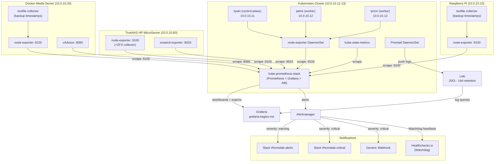

# 07 — Monitoring & Observability
## Full-Stack Visibility Across the Entire Homelab

**Author:** Kagiso Tjeane
**Difficulty:** ⭐⭐⭐⭐⭐⭐⭐⭐☆☆ (8/10)
**Guide:** 07 of 13

> A system that cannot be observed cannot be operated. You don't know it's
> broken until a user tells you — and by then the data that would explain
> *why* it broke has already rolled off the edge of your `kubectl logs`.
> Observability means knowing something is wrong *before* anyone notices,
> and knowing exactly why it happened *after* the fact.

---

## Table of Contents

1. [Monitoring Philosophy](#1-monitoring-philosophy)
2. [Full Architecture](#2-full-architecture)
3. [What Gets Monitored](#3-what-gets-monitored)
4. [kube-prometheus-stack Deployment](#4-kube-prometheus-stack-deployment)
5. [External Scrape Targets](#5-external-scrape-targets)
6. [Alert Rules](#6-alert-rules)
7. [Grafana Dashboards](#7-grafana-dashboards)
8. [Custom Backup Status Dashboard](#8-custom-backup-status-dashboard)
9. [Log Monitoring with Loki](#9-log-monitoring-with-loki)
10. [Alertmanager Configuration](#10-alertmanager-configuration)
11. [Watchdog Pattern](#11-watchdog-pattern)
12. [Verifying the Monitoring Stack](#12-verifying-the-monitoring-stack)
13. [Alert Response Runbooks](#13-alert-response-runbooks)
14. [Exit Criteria](#14-exit-criteria)

---

## 1. Monitoring Philosophy

### Observable vs Unobservable Systems

An **unobservable system** is one where you can only answer the question "is it up right now?" by checking manually. You find out it was broken last Tuesday because the logs from Tuesday are gone, no metric was recording the thing that mattered, and no alert fired.

An **observable system** lets you answer:

- What happened, and at what time?
- Which component broke first?
- Was this gradual degradation or a sudden failure?
- Did it affect any other system?
- Is the remediation working?

For a homelab, the practical difference is this: without observability, a drive quietly accumulating reallocated sectors goes unnoticed until the pool degrades. With observability, you get a `DiskReallocatedSectors` alert the moment the first bad block appears — days or weeks before failure — and you replace the drive on your schedule, not at 2 AM.

### The Four Golden Signals (Applied to Homelab)

The "four golden signals" from Google's SRE book are the four metrics that most accurately characterise the health of any system. Here is what they mean in the context of this homelab:

| Signal | What it measures | Homelab examples |
|--------|-----------------|------------------|
| **Latency** | Time to serve a request | Traefik p95 response time; NFS mount I/O latency |
| **Traffic** | Volume of demand on the system | Traefik requests/sec per service; Loki ingest rate |
| **Errors** | Rate of failed requests | Traefik 5xx rate; pod crash-loop restarts; failed backups |
| **Saturation** | How full a resource is | Node CPU/memory %; PVC usage %; ZFS pool capacity |

Every alert rule in this stack maps to one or more of these four signals. When a page fires at 2 AM, the first question is always: which signal is saturated, erroring, slow, or silent?

### Knowing Why and When

A metric time series gives you "when" for free — every data point is timestamped. Knowing "why" requires three things working together:

1. **Metrics** — quantitative measurements over time (Prometheus)
2. **Logs** — event records with context (Loki)
3. **Correlation** — the ability to pivot from a metric anomaly to the log lines that coincide with it (Grafana Explore)

This is why the stack runs both Prometheus and Loki, and why Grafana is the single pane that surfaces both. A spike in `kube_pod_container_status_restarts_total` means nothing in isolation; the Loki log line showing `OOMKilled` or `panic: runtime error` at the same timestamp is the explanation.

---

## 2. Full Architecture

The monitoring data flow covers all six physical systems in the homelab. Metrics flow inward to Prometheus; logs flow inward to Loki; both surface in Grafana; and Alertmanager fans out notifications.



### Component Responsibilities

| Component | Where it runs | What it does |
|-----------|--------------|-------------|
| **kube-prometheus-stack** | Kubernetes `monitoring` namespace | Prometheus, Grafana, Alertmanager, node-exporter DaemonSet, kube-state-metrics |
| **Loki + Promtail** | Kubernetes `monitoring` namespace | Log aggregation from all k8s pods |
| **node-exporter** | All 6 hosts (DaemonSet on k8s, binary on others) | Host-level metrics: CPU, memory, disk, network, textfile |
| **smartctl-exporter** | TrueNAS (10.0.10.80) | Per-disk SMART attribute metrics |
| **cAdvisor** | Docker host (10.0.10.20) | Per-container resource metrics |
| **Alertmanager** | Kubernetes `monitoring` namespace | Alert routing, deduplication, grouping, inhibition |

---

## 3. What Gets Monitored

Every signal collected by this stack, where it comes from, how to query it, and why it matters.

### Node-Level Signals (All Hosts)

| Signal | Source | Metric / PromQL | Why it matters |
|--------|--------|-----------------|----------------|
| CPU usage | node-exporter | `100 - (avg by(instance)(rate(node_cpu_seconds_total{mode="idle"}[5m])) * 100)` | Sustained high CPU degrades all workloads on that node |
| Memory usage % | node-exporter | `(1 - node_memory_MemAvailable_bytes / node_memory_MemTotal_bytes) * 100` | Memory exhaustion triggers OOM kills; kubelet may evict pods |
| Root disk free % | node-exporter | `node_filesystem_avail_bytes{mountpoint="/"} / node_filesystem_size_bytes{mountpoint="/"} * 100` | Full disks crash kubelet, corrupt etcd, and fill logs |
| Disk fill rate (predictive) | node-exporter | `predict_linear(node_filesystem_avail_bytes{mountpoint="/"}[6h], 4*3600) < 0` | Warns 4h before disk fills based on observed write rate |
| Network receive rate | node-exporter | `rate(node_network_receive_bytes_total{device!="lo"}[5m])` | Identifies saturation or unexpected traffic patterns |
| System load | node-exporter | `node_load15` | Load > CPU count indicates CPU starvation |

### Kubernetes Pod / Workload Signals

| Signal | Source | Metric / PromQL | Why it matters |
|--------|--------|-----------------|----------------|
| Pod not ready | kube-state-metrics | `kube_pod_status_ready{condition="false"} == 1` | Pod is serving no traffic; deployment may be degraded |
| Container restarts | kube-state-metrics | `rate(kube_pod_container_status_restarts_total[15m]) * 900` | Crash-loop indicates application failure |
| OOMKilled | kube-state-metrics | `kube_pod_container_status_last_terminated_reason{reason="OOMKilled"} == 1` | Memory limit too low or memory leak; data loss risk |
| Deployment replicas mismatch | kube-state-metrics | `kube_deployment_status_replicas_available != kube_deployment_spec_replicas` | Service running at reduced capacity |
| Node not ready | kube-state-metrics | `kube_node_status_condition{condition="Ready",status="true"} == 0` | Node lost; workloads evicting, scheduling blocked |
| Unschedulable pods | kube-state-metrics | `kube_pod_status_phase{phase="Pending"} == 1` | Cluster capacity or taint/toleration issue |

### PersistentVolumeClaim Storage

| Signal | Source | Metric / PromQL | Why it matters |
|--------|--------|-----------------|----------------|
| PVC usage % | kubelet | `kubelet_volume_stats_used_bytes / kubelet_volume_stats_capacity_bytes * 100` | Full PVC causes application writes to fail |
| PVC stuck pending | kube-state-metrics | `kube_persistentvolumeclaim_status_phase{phase="Pending"} == 1` | NFS provisioner down; application will not start |

### TLS Certificate Health (cert-manager)

| Signal | Source | Metric / PromQL | Why it matters |
|--------|--------|-----------------|----------------|
| Cert expiry < 30d | cert-manager | `certmanager_certificate_expiration_timestamp_seconds - time() < 30*86400` | Auto-renewal may have silently failed |
| Cert expiry < 7d | cert-manager | `certmanager_certificate_expiration_timestamp_seconds - time() < 7*86400` | Services will go HTTPS-broken imminently |
| Certificate not ready | cert-manager | `certmanager_certificate_ready_status{condition="True"} == 0` | ACME challenge failed; DNS or firewall issue |

### Flux GitOps Reconciliation

| Signal | Source | Metric / PromQL | Why it matters |
|--------|--------|-----------------|----------------|
| Reconciliation failed | flux-system | `gotk_reconcile_condition{type="Ready",status="False"} == 1` | Cluster drifting from Git; change was not applied |
| Reconciliation stalled >30m | flux-system | Same metric, `for: 30m` | Transient errors resolved; this is a persistent problem |
| Resource suspended >1h | flux-system | `gotk_suspend_status == 1` | Left suspended after maintenance; drift accumulating |

### Ingress / Traefik

| Signal | Source | Metric / PromQL | Why it matters |
|--------|--------|-----------------|----------------|
| 5xx error rate | Traefik | `rate(traefik_service_requests_total{code=~"5.."}[5m]) / rate(traefik_service_requests_total[5m]) > 0.05` | >5% of requests failing to a backend |
| p95 latency | Traefik | `histogram_quantile(0.95, rate(traefik_service_request_duration_seconds_bucket[5m])) > 2` | Backend is slow; user experience degraded |
| Request rate | Traefik | `rate(traefik_service_requests_total[5m])` | Traffic baseline for anomaly detection |

### Backup Health

| Signal | Source | Metric / PromQL | Why it matters |
|--------|--------|-----------------|----------------|
| etcd backup age | textfile (k8s node) | `time() - etcd_backup_last_success_timestamp_seconds > 86400` | etcd backup >24h old = disaster recovery gap |
| Docker appdata backup age | textfile (docker-host) | `time() - docker_backup_last_success_timestamp_seconds > 86400` | Media server appdata not backed up |
| RPi backup age | textfile (rpi) | `time() - rpi_backup_last_success_timestamp_seconds > 86400` | kubeconfig, GPG, SSH keys not protected |
| Velero schedule status | Velero | `velero_backup_success_total` / `velero_backup_failure_total` | PVC snapshots covering stateful workloads |
| Backup duration trend | textfile | `docker_backup_duration_seconds` | Sudden increase indicates storage or network issue |

### TrueNAS — ZFS

| Signal | Source | Metric / PromQL | Why it matters |
|--------|--------|-----------------|----------------|
| ZFS pool health | node-exporter (ZFS collector) | `node_zfs_pool_state{state!="online"} == 1` | Pool degraded or faulted; data at risk |
| ZFS read/write errors | node-exporter (ZFS collector) | `node_zfs_pool_vdev_errors_total > 0` | Vdev accumulating errors before failing |
| ZFS scrub errors | node-exporter (ZFS collector) | `node_zfs_pool_scan_errors` | Scrub found unrecoverable errors |
| ZFS pool capacity | node-exporter (ZFS collector) | `node_zfs_pool_allocated / node_zfs_pool_size * 100 > 80` | ZFS performance degrades above ~80% full |

### TrueNAS — SMART / Drive Health

| Signal | Source | Metric / PromQL | Why it matters |
|--------|--------|-----------------|----------------|
| Reallocated sectors | smartctl-exporter | `smartctl_device_attribute{attribute_name="Reallocated_Sector_Ct"} > 0` | Drive hiding bad blocks — replace immediately |
| Pending sectors | smartctl-exporter | `smartctl_device_attribute{attribute_name="Current_Pending_Sector"} > 0` | Sectors awaiting reallocation — drive unstable |
| Uncorrectable errors | smartctl-exporter | `smartctl_device_attribute{attribute_name="Offline_Uncorrectable"} > 0` | Data loss has occurred or is occurring |
| Drive temperature | smartctl-exporter | `smartctl_device_attribute{attribute_name="Temperature_Celsius"} > 50` | Thermal throttling or imminent failure |
| Drive power-on hours | smartctl-exporter | `smartctl_device_attribute{attribute_name="Power_On_Hours"}` | Lifespan tracking; plan replacements proactively |
| SMART overall health | smartctl-exporter | `smartctl_device_smart_status != 1` | Drive failed SMART self-assessment |

### Docker Host — Container Health

| Signal | Source | Metric / PromQL | Why it matters |
|--------|--------|-----------------|----------------|
| Container CPU usage | cAdvisor | `rate(container_cpu_usage_seconds_total{name!=""}[5m]) * 100` | Identify resource-hungry containers |
| Container memory usage | cAdvisor | `container_memory_usage_bytes{name!=""}` | Detect memory leaks in media containers |
| Container up/down | cAdvisor | `container_last_seen{name!=""} < time() - 60` | Container exited or crashed |
| Container restart rate | cAdvisor | `rate(container_start_time_seconds{name!=""}[30m])` | Containers restart-looping on Docker host |

---

## 4. kube-prometheus-stack Deployment

The entire in-cluster monitoring stack is managed by Flux via a single HelmRelease at:

```
platform/observability/kube-prometheus-stack/helmrelease.yaml
```

### HelmRelease Summary

The HelmRelease pins to chart version `67.x` and configures the following:

**Prometheus:**
- Retention: `15d` with a 15GB size cap (stored on NFS)
- `serviceMonitorSelectorNilUsesHelmValues: false` — Prometheus scrapes ServiceMonitors from all namespaces, not just the ones Helm created
- Storage: 20Gi PVC on `nfs-truenas`

**Grafana:**
- Admin credentials loaded from `grafana-admin` Secret (SOPS-encrypted, see Guide 11)
- Persistence: 2Gi PVC on `nfs-truenas`
- Ingress disabled at Helm level — managed via Traefik IngressRoute in the apps layer
- Root URL: `https://grafana.kagiso.me`

**Alertmanager:**
- Storage: 1Gi PVC on `nfs-truenas` (retains silences and notification state across restarts)

**Node Exporter:**
- Control-plane toleration added so the DaemonSet runs on `tywin` as well as workers

**kube-state-metrics:**
- `metricLabelsAllowlist` includes all pod and deployment labels to enable label-based filtering in dashboards

### Adding additionalScrapeConfigs

External (non-Kubernetes) targets are added to the in-cluster Prometheus by extending the HelmRelease values with `additionalScrapeConfigs`. Add this block under `prometheus.prometheusSpec` in the HelmRelease:

```yaml
prometheus:
  prometheusSpec:
    retention: 15d
    retentionSize: "15GB"
    storageSpec:
      volumeClaimTemplate:
        spec:
          storageClassName: nfs-truenas
          accessModes: ["ReadWriteOnce"]
          resources:
            requests:
              storage: 20Gi
    serviceMonitorSelectorNilUsesHelmValues: false
    podMonitorSelectorNilUsesHelmValues: false
    ruleSelectorNilUsesHelmValues: false
    additionalScrapeConfigs:
      - job_name: node-k8s-nodes
        static_configs:
          - targets: ['10.0.10.11:9100']
            labels:
              instance: tywin
              role: control-plane
          - targets: ['10.0.10.12:9100']
            labels:
              instance: jaime
              role: worker
          - targets: ['10.0.10.13:9100']
            labels:
              instance: tyrion
              role: worker
```

Note: the node-exporter DaemonSet already scrapes the k8s nodes via ServiceMonitor. The `node-k8s-nodes` static_configs entries above are for the Docker-hosted Prometheus (see Section 5). The in-cluster Prometheus picks up node metrics automatically via the DaemonSet's ServiceMonitor.

---

## 5. External Scrape Targets

External hosts (Docker server, TrueNAS, RPi) are not part of the Kubernetes cluster and cannot be discovered via ServiceMonitors. They are scraped via `additionalScrapeConfigs` in the HelmRelease values.

The Docker-hosted Prometheus at `docker/config/prometheus/prometheus.yml` handles this for the Docker-side Prometheus instance. For the in-cluster Prometheus to also have full coverage, mirror these jobs via `additionalScrapeConfigs`:

```yaml
additionalScrapeConfigs:
  - job_name: node-docker-host
    static_configs:
      - targets: ['10.0.10.20:9100']
        labels:
          instance: docker-host

  - job_name: node-truenas
    static_configs:
      - targets: ['10.0.10.80:9100']
        labels:
          instance: truenas

  - job_name: node-rpi
    static_configs:
      - targets: ['10.0.10.10:9100']
        labels:
          instance: rpi

  - job_name: smartctl-truenas
    scrape_interval: 5m
    scrape_timeout: 60s
    static_configs:
      - targets: ['10.0.10.80:9633']
        labels:
          instance: truenas

  - job_name: cadvisor-docker
    static_configs:
      - targets: ['10.0.10.20:8080']
        labels:
          instance: docker-host
    metric_relabel_configs:
      - source_labels: [__name__]
        regex: 'container_(cpu|memory|network|fs|last_seen|start_time).*'
        action: keep
      - source_labels: [name]
        regex: 'k8s_.*|POD_.*'
        action: drop
```

### Why the smartctl scrape interval is 5m

SMART polling via `smartctl` requires the drive head to perform a seek on spinning media. A 30-second interval would generate unnecessary wear and thermal load. Five minutes is sufficient for drive health monitoring — a reallocated sector that appeared in the last 5 minutes is still an emergency, not a missed alert.

### Firewall Requirements

For Prometheus to scrape these targets, ensure the following ports are reachable from the Kubernetes node IPs (`10.0.10.11-13`) to the target hosts:

| Host | Port | Service |
|------|------|---------|
| `10.0.10.20` | `9100` | node-exporter (Docker host) |
| `10.0.10.20` | `8080` | cAdvisor (Docker host) |
| `10.0.10.80` | `9100` | node-exporter (TrueNAS) |
| `10.0.10.80` | `9633` | smartctl-exporter (TrueNAS) |
| `10.0.10.10`  | `9100` | node-exporter (RPi) |

---

## 6. Alert Rules

Alert rule files are committed under `docker/config/prometheus/alerts/`. The full set lives in:

- `docker/config/prometheus/alerts/kubernetes.yml` — node health, pod health, PVCs, certificates, Flux, Traefik
- `docker/config/prometheus/alerts/backups.yml` — backup freshness for all backup types
- `docker/config/prometheus/alerts/infrastructure.yml` — Docker container health, RPi SD card, NFS mounts
- `docker/config/prometheus/alerts/truenas.yml` — ZFS pool state, SMART attributes, scrub status

The most critical rules are shown below. All rules follow the same severity routing:
- `severity: warning` → `#homelab-alerts` Slack channel
- `severity: critical` → `#homelab-critical` Slack + generic webhook

### Drive Failure — Reallocated Sectors (P0)

This is the single most important alert for a homelab with physical storage. A reallocated sector means the drive has found a bad block and remapped it to a spare sector. The drive is hiding data corruption. One reallocated sector is not immediately catastrophic — RAID/ZFS can tolerate it — but it is a definitive signal that the drive is dying. Replace within 24 hours.

```yaml
- alert: DiskReallocatedSectors
  expr: smartctl_device_attribute{attribute_name="Reallocated_Sector_Ct"} > 0
  for: 1m
  labels:
    severity: critical
  annotations:
    summary: "Drive {{ $labels.device }} on TrueNAS has reallocated sectors"
    description: >
      {{ $value }} reallocated sectors detected on drive {{ $labels.device }}.
      This drive is hiding bad blocks by remapping them to spare sectors.
      The drive is in the early stages of failure. Replace it immediately
      before the spare sector pool is exhausted and data loss begins.
      ZFS may mask the failure — do not assume the pool health indicator
      is sufficient. Run: smartctl -a {{ $labels.device }}
```

### Node Not Ready

```yaml
- alert: NodeNotReady
  expr: kube_node_status_condition{condition="Ready",status="true"} == 0
  for: 5m
  labels:
    severity: critical
  annotations:
    summary: "Kubernetes node {{ $labels.node }} is not ready"
    description: >
      Node {{ $labels.node }} has been in NotReady state for more than 5 minutes.
      Workloads cannot be scheduled and existing pods may be evicted. Check
      kubelet logs: journalctl -u kubelet -f on the affected node.
    runbook_url: "docs/operations/runbooks/alerts/NodeNotReady.md"
```

### Pod Crash Looping

```yaml
- alert: PodCrashLooping
  expr: rate(kube_pod_container_status_restarts_total[15m]) * 60 * 15 > 0
  for: 15m
  labels:
    severity: warning
  annotations:
    summary: "Pod {{ $labels.namespace }}/{{ $labels.pod }} is crash-looping"
    description: >
      Container {{ $labels.container }} in {{ $labels.namespace }}/{{ $labels.pod }}
      has restarted at least once in the last 15 minutes and continues to crash.
      Check logs: kubectl logs -n {{ $labels.namespace }} {{ $labels.pod }} --previous
    runbook_url: "docs/operations/runbooks/alerts/PodCrashLoop.md"

- alert: PodCrashLoopingFrequent
  expr: rate(kube_pod_container_status_restarts_total[15m]) * 60 * 15 > 5
  for: 15m
  labels:
    severity: critical
  annotations:
    summary: "Pod {{ $labels.namespace }}/{{ $labels.pod }} crash-looping rapidly (>5 restarts/15m)"
    description: >
      Container {{ $labels.container }} has restarted more than 5 times in 15 minutes.
      This is actively disrupting service. kubectl describe pod -n {{ $labels.namespace }} {{ $labels.pod }}
```

### etcd Backup Too Old

```yaml
- alert: EtcdBackupTooOld
  expr: time() - etcd_backup_last_success_timestamp_seconds > 86400
  for: 5m
  labels:
    severity: critical
  annotations:
    summary: "etcd backup has not succeeded in more than 24 hours"
    description: >
      The last successful etcd backup was {{ $value | humanizeDuration }} ago.
      If the cluster is lost without a recent etcd snapshot, full cluster
      reconstruction from scratch is required. Investigate the backup CronJob:
      kubectl get cronjob -n kube-system etcd-backup
      kubectl logs -n kube-system -l job-name=etcd-backup --tail=50
```

### ZFS Pool Degraded

```yaml
- alert: ZFSPoolDegraded
  expr: node_zfs_pool_state{state!="online"} == 1
  for: 1m
  labels:
    severity: critical
  annotations:
    summary: "ZFS pool {{ $labels.pool }} on TrueNAS is {{ $labels.state }}"
    description: >
      ZFS pool {{ $labels.pool }} is in a {{ $labels.state }} state — it is no
      longer in normal operation. Data redundancy has been reduced or lost.
      Run: zpool status {{ $labels.pool }} on TrueNAS immediately.
      If state is 'degraded', a vdev has failed but data is intact.
      If state is 'faulted', the pool is offline and data may be at risk.
```

### Certificate Expiring Critical

```yaml
- alert: CertificateExpiringCritical
  expr: certmanager_certificate_expiration_timestamp_seconds - time() < 7 * 24 * 3600
  for: 1h
  labels:
    severity: critical
  annotations:
    summary: "Certificate {{ $labels.namespace }}/{{ $labels.name }} expires in less than 7 days"
    description: >
      cert-manager Certificate {{ $labels.name }} in {{ $labels.namespace }}
      expires in {{ $value | humanizeDuration }}. Automatic renewal has failed.
      Manually trigger renewal: kubectl cert-manager renew -n {{ $labels.namespace }} {{ $labels.name }}
      Then check ACME challenges and DNS records.
    runbook_url: "docs/operations/runbooks/certificate-failure.md"
```

### Docker Backup Too Old

```yaml
- alert: DockerBackupTooOld
  expr: time() - docker_backup_last_success_timestamp_seconds > 86400
  for: 5m
  labels:
    severity: warning
  annotations:
    summary: "Docker appdata backup has not succeeded in more than 24 hours"
    description: >
      The Docker media server appdata backup (Jellyfin config, Sonarr/Radarr
      databases, etc.) has not completed successfully in {{ $value | humanizeDuration }}.
      Check the backup script logs on the Docker host:
      journalctl -u docker-backup.service --since "24 hours ago"
```

---

## 7. Grafana Dashboards

Import these dashboards from grafana.com into the Grafana instance at `https://grafana.kagiso.me`. All are compatible with the metrics collected by this stack.

| Dashboard | ID | Purpose |
|-----------|----|---------|
| Node Exporter Full | 1860 | All 5+ nodes: CPU, memory, disk I/O, network, system load. The definitive host-level dashboard. |
| Kubernetes Cluster Monitoring | 7249 | Pod status, deployment health, namespace resource usage. Overview of the k8s layer. |
| Kubernetes PVC Monitor | 13646 | PVC usage, growth trends, and capacity across all claims. Essential for NFS storage management. |
| Flux CD | 16714 | Flux reconciliation status, sync health, controller logs. Shows which Flux resources are drifting. |
| Traefik v3 | 17346 | Ingress request rate, error rate, p50/p95/p99 latency per service. |
| Loki Dashboard | 13639 | Log ingest volume, error rate, query performance. Verify Loki is receiving all pod logs. |
| Docker Container Monitoring | 893 | Per-container CPU, memory, and network on the Docker media server via cAdvisor. |
| ZFS on Linux | 12081 | ZFS pool metrics: allocated space, I/O ops, ARC hit rate, dataset breakdown. |
| SMART Disk Monitor | custom | Drive health — reallocated sectors, temperature, pending sectors per drive on TrueNAS. |
| Backup Status | custom | All backup last-run times, backup sizes, age. See Section 8 for panel queries. |

### Importing a Dashboard

1. In Grafana, navigate to **Dashboards → Import**
2. Enter the dashboard ID from the table above
3. Select the **Prometheus** data source when prompted
4. Save into an appropriate folder (`Infrastructure`, `Kubernetes`, `Storage`, etc.)

### Configuring the Prometheus Data Source

When the kube-prometheus-stack HelmRelease is deployed, Grafana is automatically configured with Prometheus as a data source (via the chart's built-in provisioning). Loki requires a manual data source addition:

1. Navigate to **Connections → Data Sources → Add data source**
2. Select **Loki**
3. URL: `http://loki-stack:3100`
4. Save and test

---

## 8. Custom Backup Status Dashboard

Create a new dashboard titled "Backup Status" with the following panels. This dashboard is the single place to verify that all backup jobs across all systems ran recently.

### Panel 1 — etcd Last Backup (Stat)

**Query:**
```promql
(time() - etcd_backup_last_success_timestamp_seconds) / 3600
```

**Panel settings:**
- Visualization: Stat
- Unit: `hours`
- Thresholds: green < 12h, yellow < 24h, red > 24h
- Title: "etcd Last Backup"

### Panel 2 — Docker Appdata Last Backup (Stat)

**Query:**
```promql
(time() - docker_backup_last_success_timestamp_seconds) / 3600
```

**Panel settings:**
- Visualization: Stat
- Unit: `hours`
- Thresholds: green < 12h, yellow < 24h, red > 24h
- Title: "Docker Appdata Last Backup"

### Panel 3 — RPi Last Backup (Stat)

**Query:**
```promql
(time() - rpi_backup_last_success_timestamp_seconds) / 3600
```

**Panel settings:**
- Visualization: Stat
- Unit: `hours`
- Thresholds: green < 48h, yellow < 72h, red > 72h (RPi backup is less frequent)
- Title: "RPi Config Last Backup"

### Panel 4 — Velero Backup Status by Schedule (Table)

**Query A — Successful:**
```promql
velero_backup_success_total
```

**Query B — Failed:**
```promql
velero_backup_failure_total
```

**Panel settings:**
- Visualization: Table
- Group by: `schedule`
- Transform: Join by field `schedule`, rename columns to "Schedule", "Successes", "Failures"
- Color "Failures" column red if > 0
- Title: "Velero Backup Results by Schedule"

### Panel 5 — Backup Sizes Over 30 Days (Time Series)

**Query A:**
```promql
etcd_backup_size_bytes
```

**Query B:**
```promql
docker_backup_size_bytes
```

**Panel settings:**
- Visualization: Time series
- Time range: Last 30 days
- Unit: `bytes (IEC)` (auto-formats to MiB/GiB)
- Title: "Backup Sizes — 30 Day Trend"
- Use this to detect when a backup unexpectedly shrinks (possible truncation) or grows (runaway data)

### Panel 6 — Firing Backup Alerts (Alert List)

**Panel settings:**
- Visualization: Alert list
- Filter: Alert name contains "Backup"
- Show: Firing alerts only
- Title: "Backup Alerts Currently Firing"
- If this panel is empty, all backup alerts are resolved

---

## 9. Log Monitoring with Loki

Loki aggregates logs from all Kubernetes pods via the Promtail DaemonSet. Access logs through **Grafana → Explore**, selecting the Loki data source.

### Essential LogQL Queries

Bookmark these in Grafana Explore for rapid incident investigation.

**All errors from k8s pods in the last hour:**
```logql
{namespace=~".+"} |= "error" | json | level=~"error|ERROR|Error"
```

**Failed SSH login attempts on Docker host:**
```logql
{job="system",filename="/var/log/auth.log"} |= "Failed password"
```

**OOMKilled events across the cluster:**
```logql
{job=~"system.*"} |= "OOMKilling"
```

**Flux reconciliation errors:**
```logql
{namespace="flux-system"} |= "error"
```

**Backup script failures:**
```logql
{job="backup"} |= "ERROR"
```

**Sonarr/Radarr download failures:**
```logql
{container=~"sonarr|radarr"} |= "failed" | json
```

**cert-manager ACME challenge failures:**
```logql
{namespace="cert-manager"} |= "failed" |= "challenge"
```

**Traefik 5xx responses with request details:**
```logql
{namespace="traefik"} | json | status >= 500
```

**All logs from a specific pod (last 1000 lines):**
```logql
{namespace="<namespace>", pod="<pod-name>"}
```

**Volume of error logs per namespace (for anomaly detection):**
```logql
sum by (namespace) (count_over_time({namespace=~".+"} |= "error" [5m]))
```

### Promtail Configuration

Promtail is deployed as part of the `loki-stack` HelmRelease (`platform/observability/loki/helmrelease.yaml`) as a DaemonSet. It automatically discovers all pods via Kubernetes API and ships their stdout/stderr to Loki with labels for `namespace`, `pod`, `container`, and `node_name`.

No manual Promtail configuration is needed for k8s pods. For Docker host container logs, either:
1. Run a second Promtail instance on the Docker host pointing at `/var/lib/docker/containers/**/*.log`, or
2. Use the node-exporter textfile approach for structured metrics (backup success/failure) rather than raw log shipping

---

## 10. Alertmanager Configuration

Alertmanager is deployed by kube-prometheus-stack. Its routing configuration is stored in:

```
platform/observability/alertmanager-config/alertmanager-config.yaml
```

Credentials (Slack API URL, webhook URL, watchdog webhook URL) are in the SOPS-encrypted secret:

```
platform/observability/alertmanager-config/alertmanager-secret.yaml
```

### Routing Logic

```
All alerts
├── alertname = "Watchdog"  →  watchdog-webhook receiver (healthchecks.io)
├── severity = "critical"   →  slack-critical receiver
│                               ├── Slack #homelab-critical
│                               └── Generic webhook (additional delivery)
└── (default)               →  slack-alerts receiver
                                └── Slack #homelab-alerts
```

**Group behaviour:**
- Alerts are grouped by `alertname` + `namespace`
- `groupWait: 30s` — wait 30s before sending the first notification in a new group (allows related alerts to batch)
- `groupInterval: 5m` — send a follow-up if the group changes after 5m
- `repeatInterval: 4h` — re-notify every 4h for unresolved warning alerts
- `repeatInterval: 1h` — re-notify every 1h for unresolved critical alerts

### Slack Message Format

Critical alerts include a `runbook_url` annotation that surfaces directly in the Slack message via the template in the AlertmanagerConfig. When writing alert rules, always populate `runbook_url` with the path to the relevant runbook.

---

## 11. Watchdog Pattern

The Watchdog alert is an always-firing alert that acts as a heartbeat for the entire alerting pipeline. If the Watchdog stops arriving at healthchecks.io, it means something between Prometheus and the notification channel is broken — Prometheus is down, Alertmanager is down, or the webhook is unreachable.

```yaml
- alert: Watchdog
  expr: vector(1)
  for: 0m
  labels:
    severity: none
  annotations:
    summary: "Alertmanager Watchdog"
    description: >
      This alert always fires. Its purpose is to confirm the monitoring pipeline
      is operational end-to-end. Configure healthchecks.io (or equivalent) to
      expect a ping every 5 minutes. If the ping stops, healthchecks.io will
      send an alert via its own notification channel (email, SMS, etc.) to
      indicate that your alerting system itself has failed.
```

### Configuring Healthchecks.io

1. Create a new check at healthchecks.io with a 5-minute period and a 10-minute grace period
2. Copy the ping URL (format: `https://hc-ping.com/<uuid>`)
3. Store the URL in the SOPS-encrypted `alertmanager-secret` under key `watchdog-webhook-url`
4. The `watchdog-webhook` receiver in the AlertmanagerConfig sends a POST to this URL every time the Watchdog fires (every ~5 minutes based on the global `repeatInterval` override)

If healthchecks.io stops receiving the heartbeat, it will alert you via its own configured notification channel. This is the one alert your monitoring system cannot deliver about itself.

---

## 12. Verifying the Monitoring Stack

Run these checks after initial deployment and after any change to scrape configuration.

### Check Prometheus Targets

```bash
# Port-forward to Prometheus UI
kubectl port-forward -n monitoring svc/kube-prometheus-stack-prometheus 9090:9090

# Then open http://localhost:9090/targets in a browser
# Every target should show State: UP
# External targets (truenas, docker-host, rpi) must also be UP
```

**Identify any DOWN targets via API:**
```bash
kubectl exec -n monitoring \
  deploy/kube-prometheus-stack-prometheus \
  -c prometheus -- \
  wget -qO- 'http://localhost:9090/api/v1/targets' | \
  jq '.data.activeTargets[] | select(.health == "down") | {instance: .labels.instance, job: .labels.job, error: .lastError}'
```

### Verify All 6 Hosts Are Scraping

```bash
# Should return: tywin, jaime, tyrion, docker-host, truenas, rpi (or rpi-control)
kubectl exec -n monitoring \
  deploy/kube-prometheus-stack-prometheus \
  -c prometheus -- \
  wget -qO- 'http://localhost:9090/api/v1/label/instance/values' | \
  jq '.data[]'
```

### Verify SMART Metrics Are Present

```bash
kubectl exec -n monitoring \
  deploy/kube-prometheus-stack-prometheus \
  -c prometheus -- \
  wget -qO- 'http://localhost:9090/api/v1/query?query=smartctl_device_attribute%7Battribute_name%3D%22Reallocated_Sector_Ct%22%7D' | \
  jq '.data.result'
```

If this returns an empty result set, the `smartctl-truenas` scrape job is not reaching `10.0.10.80:9633`. Check firewall rules and confirm smartctl-exporter is running on TrueNAS.

### Check Alertmanager Status

```bash
kubectl port-forward -n monitoring svc/kube-prometheus-stack-alertmanager 9093:9093
# Open http://localhost:9093 to see:
# - Active alerts
# - Configured receivers
# - Routing tree
# - Silences
```

### Test Alert Delivery End-to-End

Send a synthetic alert directly to Alertmanager and confirm it arrives in Slack `#homelab-alerts`:

```bash
curl -X POST http://localhost:9093/api/v1/alerts \
  -H 'Content-Type: application/json' \
  -d '[{
    "labels": {
      "alertname": "TestAlert",
      "severity": "warning",
      "namespace": "test"
    },
    "annotations": {
      "summary": "Test alert — verify delivery",
      "description": "This is a synthetic test alert. If you see this in Slack, the alerting pipeline is working."
    }
  }]'
```

The alert should appear in `#homelab-alerts` within 30 seconds (the `groupWait` period).

### Verify Loki Is Receiving Logs

```bash
# Check Loki readiness
kubectl exec -n monitoring deploy/loki-stack -c loki -- \
  wget -qO- http://localhost:3100/ready

# Query Loki for recent logs (should return results immediately after deployment)
kubectl exec -n monitoring deploy/loki-stack -c loki -- \
  wget -qO- 'http://localhost:3100/loki/api/v1/query_range?query=%7Bnamespace%3D%22monitoring%22%7D&limit=5' | \
  jq '.data.result | length'
```

If the count is 0, Promtail is not shipping logs. Check Promtail pod logs:

```bash
kubectl logs -n monitoring -l app.kubernetes.io/name=promtail --tail=50
```

### Verify Backup Metrics Are Present

```bash
# etcd backup metric
kubectl exec -n monitoring \
  deploy/kube-prometheus-stack-prometheus \
  -c prometheus -- \
  wget -qO- 'http://localhost:9090/api/v1/query?query=etcd_backup_last_success_timestamp_seconds' | \
  jq '.data.result'

# Docker backup metric
kubectl exec -n monitoring \
  deploy/kube-prometheus-stack-prometheus \
  -c prometheus -- \
  wget -qO- 'http://localhost:9090/api/v1/query?query=docker_backup_last_success_timestamp_seconds' | \
  jq '.data.result'
```

If these return empty, the textfile collector on the relevant hosts is not writing metrics. Check that the backup scripts write to the node-exporter textfile directory and that node-exporter is started with `--collector.textfile.directory`.

---

## 13. Alert Response Runbooks

Detailed response procedures for firing alerts are in:

```
docs/operations/runbooks/alerts/
├── NodeNotReady.md
├── NodeMemoryHigh.md
├── DiskPressure.md
└── PodCrashLoop.md
```

Additional operational runbooks:

```
docs/operations/runbooks/
├── certificate-failure.md    — cert-manager ACME troubleshooting
├── backup-restoration.md     — restoring from etcd, Velero, and Docker backups
└── node-replacement.md       — replacing a failed cluster node
```

### Severity Classification

| Severity | Response time | Examples |
|----------|--------------|---------|
| **P0 — Immediate** | Within 1 hour | ZFS pool degraded, drive reallocated sectors, NodeNotReady |
| **P1 — Same day** | Within 8 hours | etcd backup >24h old, PodCrashLooping (frequent), PVC >90% |
| **P2 — Next day** | Within 24 hours | NodeMemoryHigh, cert expiry <7d, Flux reconciliation failed |
| **P3 — This week** | Within 7 days | NodeCPUHigh, PVC >80%, cert expiry <30d, Flux suspended |

### Drive and SMART Alerts Are P0

Any SMART alert (`DiskReallocatedSectors`, `DiskPendingSectors`, `DiskUncorrectableErrors`) must be treated as P0 regardless of the current ZFS pool state. ZFS can mask drive degradation behind a healthy pool indicator. Treat every SMART warning as a drive that needs replacing within 24 hours.

Procedure when a SMART alert fires:
1. `smartctl -a /dev/sdX` on TrueNAS to confirm the attribute values
2. Identify the physical drive from the serial number
3. Order a replacement drive of equal or larger capacity
4. `zpool offline <pool> <device>` to gracefully remove the failing drive
5. Physically replace the drive
6. `zpool replace <pool> <old-device> <new-device>` to begin resilver
7. Monitor `zpool status` until resilver completes
8. Verify the SMART alert clears after the next scrape interval (5m)

---

## 14. Exit Criteria

This guide is complete when all of the following are true:

- [ ] All 6 hosts visible in Prometheus `/targets` — tywin, jaime, tyrion, docker-host, truenas, rpi — all showing `State: UP`
- [ ] smartctl-exporter scraping TrueNAS — `smartctl_device_attribute` metrics present in Prometheus for each physical drive
- [ ] ZFS metrics present — `node_zfs_pool_state` series visible in Prometheus
- [ ] All backup metrics visible — `etcd_backup_last_success_timestamp_seconds`, `docker_backup_last_success_timestamp_seconds`, `rpi_backup_last_success_timestamp_seconds`, and Velero metrics all queryable
- [ ] Grafana dashboards imported — Node Exporter Full (1860), Kubernetes Cluster Monitoring (7249), Kubernetes PVC Monitor (13646), Flux CD (16714), Traefik v3 (17346), ZFS on Linux (12081)
- [ ] Custom Backup Status dashboard created with all 6 panels showing current data
- [ ] Alertmanager routing verified — synthetic `TestAlert` curl delivers to `#homelab-alerts` in Slack within 60 seconds
- [ ] Critical routing verified — a `severity: critical` test alert delivers to `#homelab-critical` Slack channel
- [ ] Watchdog heartbeat configured at healthchecks.io — check is in "up" state
- [ ] Loki receiving logs — Grafana Explore query for `{namespace="monitoring"}` returns log lines
- [ ] Promtail DaemonSet pods running on all 3 k8s nodes — `kubectl get pods -n monitoring -l app.kubernetes.io/name=promtail`
- [ ] Zero "Down" targets in Prometheus `/targets` page
- [ ] At least one alert rule has been test-fired and confirmed delivered to the correct Slack channel
- [ ] All alert rule files committed and reachable — `docker/config/prometheus/alerts/*.yml`

---

## Navigation

| | Guide |
|---|---|
| ← Previous | [06 — Platform Namespaces & Layout](./06-Platform-Namespaces.md) |
| Current | **07 — Monitoring & Observability** |
| → Next | [08 — Cluster Backups & Disaster Recovery](./08-Cluster-Backups.md) |
