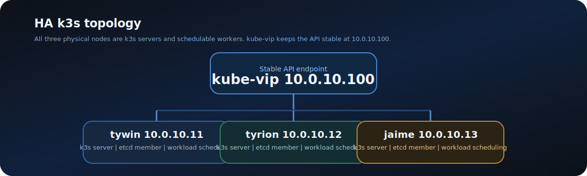
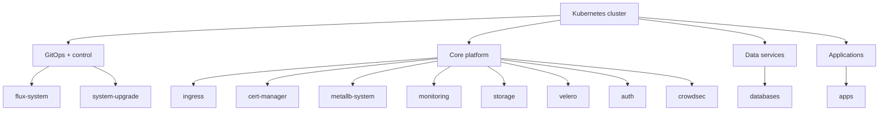

# 07 - Namespaces & Cluster Identity
## Platform Layout, Scheduling Intent, and Future Guardrails

**Author:** Kagiso Tjeane
**Difficulty:** ******---- (6/10)
**Guide:** 07 of 13

> This guide explains how the platform is organised once Flux is in control:
>
> - which namespaces exist and why
> - how workloads are grouped by responsibility
> - how node identity works in the current 3-node HA cluster
> - which scheduling patterns are deliberate, and which are not
>
> The most important mental model is simple:
>
> **all three cluster nodes are both k3s servers and schedulable worker nodes.**

---



---

## Table of Contents

1. [Why This Guide Matters](#why-this-guide-matters)
2. [Namespace Model](#namespace-model)
3. [How Namespaces Are Created](#how-namespaces-are-created)
4. [Cluster Identity: The Real Topology](#cluster-identity-the-real-topology)
5. [Scheduling Philosophy](#scheduling-philosophy)
6. [Placement Patterns Used in This Platform](#placement-patterns-used-in-this-platform)
7. [Security Boundaries to Add Next](#security-boundaries-to-add-next)
8. [Verification](#verification)
9. [Exit Criteria](#exit-criteria)

---

## Why This Guide Matters

Kubernetes gives you a lot of freedom. Left unmanaged, that freedom becomes ambiguity:

- workloads end up in the wrong namespace
- platform services and applications blur together
- nobody is sure where a pod is supposed to run
- future hardening becomes harder because the base layout is muddy

This guide locks in the operating model for the cluster before more workloads are added.

---

## Namespace Model

The platform uses a layered namespace structure.



### Repo-managed namespaces

These are declared directly in `platform/namespaces/namespaces.yaml` and reconciled by Flux:

| Namespace | Purpose |
|---|---|
| `monitoring` | Prometheus, Loki, ServiceMonitors, dashboard provisioning |
| `storage` | NFS provisioner and storage primitives |
| `databases` | Shared PostgreSQL and Redis services |
| `velero` | Backup controller and schedules |
| `auth` | Authentik and identity workloads |
| `crowdsec` | CrowdSec components and security integration |
| `apps` | User-facing application workloads |

### Chart-created or bootstrap namespaces

These are still part of the platform, but are created by bootstrap or Helm charts rather than `platform/namespaces/`:

| Namespace | Purpose |
|---|---|
| `flux-system` | Flux controllers and Git source |
| `ingress` | Traefik ingress controller |
| `metallb-system` | MetalLB controller and speakers |
| `cert-manager` | TLS certificate automation |
| `system-upgrade` | Rancher system-upgrade-controller |

The result is a clean separation between platform layers. When something breaks, you know where to start.

---

## How Namespaces Are Created

Namespaces are not created manually with `kubectl create namespace`.

They are created through GitOps.

```bash
flux get kustomization platform-namespaces
kubectl get namespaces
```

That means:

- namespace creation is version-controlled
- rebuilds are repeatable
- accidental manual changes do not become hidden cluster state

If you need a new namespace, add it to `platform/namespaces/`, commit the change, and let Flux reconcile it.

---

## Cluster Identity: The Real Topology

This cluster is no longer "one control-plane node plus two workers."

It is a **3-node HA k3s server cluster**:

| Node | IP | Role in k3s | Schedulable for workloads |
|---|---|---|---|
| `tywin` | `10.0.10.11` | server, embedded etcd member | Yes |
| `tyrion` | `10.0.10.12` | server, embedded etcd member | Yes |
| `jaime` | `10.0.10.13` | server, embedded etcd member | Yes |

All three nodes:

- run the Kubernetes API server, controller-manager, and scheduler
- participate in embedded etcd quorum
- are valid workload placement targets
- sit behind the kube-vip API endpoint at `10.0.10.100`

### What labels exist by default

Check them with:

```bash
kubectl get nodes --show-labels
```

You should expect all three nodes to carry the built-in control-plane label:

```text
node-role.kubernetes.io/control-plane=true
```

That label now means "this is a k3s server node." It does **not** mean "do not schedule workloads here."

### What is intentionally *not* done

This platform does **not** taint `tywin` or reserve a dedicated worker pool.

That would waste capacity on a small homelab where each node has enough RAM and CPU to do both jobs. The current design intentionally trades strict role isolation for better aggregate utilization.

---

## Scheduling Philosophy

The scheduler's default behaviour is now acceptable for many workloads because every node is both a server and a worker.

That said, not every workload should be treated identically.

### Default rule

If a workload is stateless or uses NFS-backed storage, let Kubernetes place it anywhere unless there is a strong reason not to.

### Constrain only when there is an actual reason

Use placement rules for one of these reasons:

- the workload depends on node-local storage
- the workload should be spread across nodes
- the workload is especially noisy or sensitive
- the workload needs to avoid co-locating replicas

### Prefer soft guidance before hard pinning

Use these tools in roughly this order:

1. `topologySpreadConstraints`
2. `podAntiAffinity`
3. `preferredDuringSchedulingIgnoredDuringExecution`
4. `requiredDuringSchedulingIgnoredDuringExecution`

Hard pinning should be deliberate. Once you require a node or class of node, you reduce the scheduler's ability to recover automatically.

---

## Placement Patterns Used in This Platform

### Pattern 1 - Stateless or portable workloads

Examples:

- Traefik
- cert-manager
- CrowdSec
- most applications with NFS-backed PVCs

Recommended approach:

- allow scheduling on any of the three server nodes
- add anti-affinity or topology spread when multiple replicas exist

### Pattern 2 - Node-local stateful workloads

Examples:

- PostgreSQL
- Redis
- Prometheus TSDB

These use `local-path`, not NFS. The important detail is:

> the PVC itself becomes node-bound after first provisioning.

So even if the initial pod is schedulable on any server node, once the `local-path` volume is created, Kubernetes will keep that workload on the node that owns the volume.

This is why a single-instance local-path workload is not "portable" in the same way an NFS-backed workload is.

### Pattern 3 - Multi-replica services

For anything with more than one replica, the objective is simple:

```text
do not let all replicas land on one node unless there is no other option
```

Typical approach:

```yaml
topologySpreadConstraints:
  - maxSkew: 1
    topologyKey: kubernetes.io/hostname
    whenUnsatisfiable: ScheduleAnyway
    labelSelector:
      matchLabels:
        app.kubernetes.io/name: my-app
```

or:

```yaml
affinity:
  podAntiAffinity:
    preferredDuringSchedulingIgnoredDuringExecution:
      - weight: 100
        podAffinityTerm:
          topologyKey: kubernetes.io/hostname
          labelSelector:
            matchLabels:
              app.kubernetes.io/name: my-app
```

### Pattern 4 - Infrastructure controllers

Controllers such as Flux or the upgrade controller may use `nodeAffinity` for predictability, but they should still tolerate the current 3-node server layout rather than assuming a separate worker pool exists.

---

## Security Boundaries to Add Next

Namespaces improve organization immediately, but by themselves they are **not** a full security boundary.

Two additions should come next as the platform matures:

### 1. Pod Security labels

These namespace labels tell Kubernetes which classes of pods are acceptable:

```yaml
pod-security.kubernetes.io/enforce: baseline
pod-security.kubernetes.io/audit: baseline
pod-security.kubernetes.io/warn: baseline
```

For a safe rollout, start with `warn` and `audit` first so you can see what would break before you enforce it.

### 2. NetworkPolicies

Without NetworkPolicies, a compromised pod can usually talk to almost anything else in the cluster.

The production-friendly rollout path is:

1. Add default-deny ingress policies for app namespaces.
2. Add explicit allow rules for DNS, ingress-to-app traffic, monitoring scrapes, and app-to-database traffic.
3. Only then move on to stricter egress controls if needed.

This is the cleanest way to turn namespaces from an organizational boundary into a real traffic boundary.

---

## Verification

### 1. Confirm namespaces exist

```bash
kubectl get namespaces
```

At minimum, you should see the platform namespaces used by this repo:

```text
apps
auth
crowdsec
databases
monitoring
storage
velero
```

### 2. Confirm all three nodes are server nodes and schedulable

```bash
kubectl get nodes
```

Expected:

```text
NAME     STATUS   ROLES                  VERSION
tywin    Ready    control-plane,master   v1.x.x+k3s1
tyrion   Ready    control-plane,master   v1.x.x+k3s1
jaime    Ready    control-plane,master   v1.x.x+k3s1
```

### 3. Confirm no manual tainting has isolated one node

```bash
kubectl describe node tywin | grep Taints
kubectl describe node tyrion | grep Taints
kubectl describe node jaime | grep Taints
```

Expected:

```text
Taints: <none>
```

### 4. Confirm Flux owns namespace creation

```bash
flux get kustomization platform-namespaces
```

Expected:

```text
READY=True
```

---

## Exit Criteria

This guide is complete when all of the following are true:

- the namespace layout is clear and matches the platform layering
- it is explicitly documented that `tywin`, `tyrion`, and `jaime` are all both server and worker nodes
- no part of the operating model depends on a dedicated worker pool
- scheduling decisions are made intentionally, not by inherited assumptions from the old topology
- the next hardening steps are clear: Pod Security labels and NetworkPolicies

---

## Navigation

| | Guide |
|---|---|
| <- Previous | [06 - Security: cert-manager & TLS](./06-Security-CertManager-TLS.md) |
| Current | **07 - Namespaces & Cluster Identity** |
| -> Next | [08 - Storage Architecture](./08-Storage-Architecture.md) |
