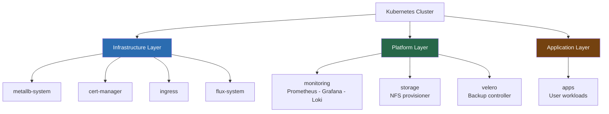
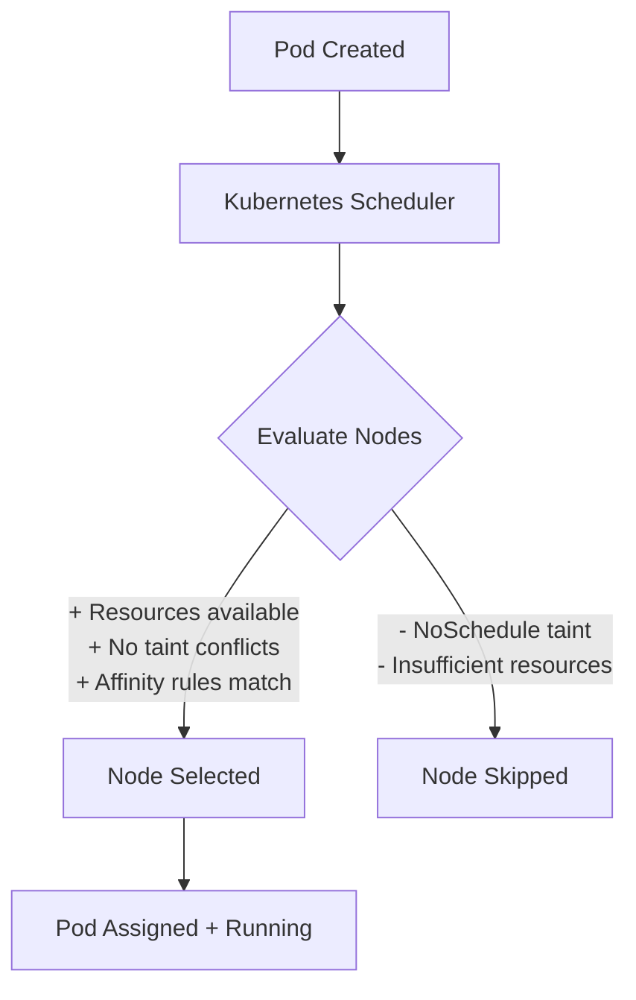
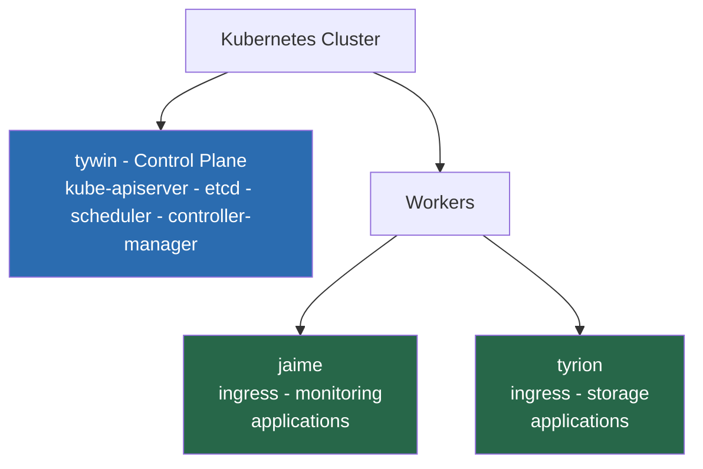

# 07 — Namespaces & Cluster Identity
## Platform Layout, Node Labels, and Scheduling Rules

**Author:** Kagiso Tjeane
**Difficulty:** ⭐⭐⭐⭐⭐⭐☆☆☆☆ (6/10)
**Guide:** 07 of 13

> This guide covers two closely related topics: the namespace layout that organizes the platform, and the node identity system that controls where workloads run. Both are deployed by Flux — namespaces via `platform-namespaces`, and node labels/taints via manual configuration during node preparation.

---

# Part 1 — Platform Namespaces & Layout

---

# Why Namespaces Matter

Kubernetes does not enforce how workloads are organised.
Without structure, clusters quickly become difficult to manage.

This step might appear simple, but it is actually **foundational platform engineering work**.

A clean namespace model provides:

• operational clarity
• security boundaries
• easier troubleshooting
• safer GitOps workflows

Without namespaces everything lives in the `default` namespace.

Example:

```
kubectl get pods

grafana-abc123
jellyfin-xyz321
prometheus-abc999
traefik-qwe888
```

This quickly becomes unmanageable.

Namespaces provide **logical isolation**.

```
kubectl get pods -n monitoring
kubectl get pods -n ingress
kubectl get pods -n databases
```

Diagram:

```
Kubernetes Cluster
│
├── ingress
├── monitoring
├── storage
├── databases
└── apps
```

Each namespace represents a **layer of the platform**.

---

# Namespace Design Philosophy

The namespace model used in this platform follows a layered approach.

```
Infrastructure Layer
Platform Layer
Application Layer
```

Diagram:



This separation makes it clear **what belongs where**.

---

# Recommended Namespaces

Create the following namespaces.

| Namespace | Purpose |
|----------|--------|
ingress | ingress controllers |
monitoring | Prometheus / Grafana |
storage | storage infrastructure |
databases | stateful databases |
apps | user applications |

Infrastructure namespaces such as `metallb-system` and `cert-manager`
are created automatically during installation.

---

# Creating Namespaces

Namespaces in this platform are **managed by Flux** — they are defined as manifests under
`platform/namespaces/` and reconciled automatically by the `platform-namespaces` Kustomization
after `install-platform.yml` completes. No manual `kubectl apply` is required or expected.

The namespace manifests follow this pattern:

```yaml
apiVersion: v1
kind: Namespace
metadata:
  name: ingress
---
apiVersion: v1
kind: Namespace
metadata:
  name: monitoring
---
apiVersion: v1
kind: Namespace
metadata:
  name: storage
---
apiVersion: v1
kind: Namespace
metadata:
  name: databases
---
apiVersion: v1
kind: Namespace
metadata:
  name: apps
```

To add a new namespace, add a manifest to `platform/namespaces/`, commit, and push. Flux
reconciles it into the cluster automatically. **Do not run `kubectl apply` directly** — Flux
owns these resources and a manual apply will be overwritten on the next reconciliation.

Verify Flux has reconciled them:

```bash
flux get kustomization platform-namespaces
kubectl get namespaces
```

Expected namespaces:

```
ingress
monitoring
storage
databases
apps
```

---

# Namespaces and GitOps

Namespaces also define the **Git repository structure** used by Flux.

Example layout:

```
platform-infra/
└── clusters
    └── prod
        ├── infrastructure
        │   ├── metallb
        │   ├── traefik
        │   └── cert-manager
        │
        ├── platform
        │   ├── monitoring
        │   ├── storage
        │   └── databases
        │
        └── apps
```

This layout mirrors the namespace structure inside the cluster.

---

# Benefits of Layered Platform Layout

A structured layout provides several advantages.

### Clear ownership

```
Infrastructure → platform engineering
Applications → developers
```

### Safe GitOps workflows

Changes to platform infrastructure remain isolated from application deployments.

### Easier troubleshooting

Example:

```
kubectl get pods -n monitoring
kubectl get pods -n ingress
```

You immediately know where to look.

---

# Namespace Resource Boundaries

Namespaces can also enforce limits.

Examples include:

• CPU quotas
• memory limits
• network policies

Although these controls are optional in small clusters, designing namespaces
properly now makes it easier to introduce them later.

---

# Observability Benefits

Monitoring tools such as Prometheus and Grafana rely heavily on namespaces.

Metrics are often grouped by namespace.

Example Prometheus query:

```
sum(container_cpu_usage_seconds_total) by (namespace)
```

Namespaces therefore help provide **meaningful operational visibility**.

---

# Verifying Namespace Layout

Run:

```
kubectl get namespaces
```

You should see:

```
ingress
monitoring
storage
databases
apps
```

Check pods within each namespace.

```
kubectl get pods -n ingress
kubectl get pods -n monitoring
```

This confirms workloads are correctly isolated.

---

# Part 2 — Cluster Identity & Scheduling

---

A Kubernetes cluster can technically run workloads anywhere.
That flexibility is powerful — but without structure it quickly becomes chaos.

This part defines **cluster identity**: which nodes are responsible for which workloads,
and how the scheduler should behave when placing pods.

Small clusters often fall into an anti-pattern:

```
All nodes are treated the same.
Everything runs everywhere.
```

While this works initially, it leads to problems:

• infrastructure services competing with applications
• unpredictable performance
• accidental scheduling of workloads on the control plane

A well-structured cluster instead has **clear node responsibilities**.

---

# The Nodes in This Cluster

Your cluster currently contains three nodes.

Example:

```
tywin   → control-plane
jaime   → worker
tyrion  → worker
```

Each node plays a specific role.

| Node | Role |
|-----|------|
tywin | Kubernetes control-plane |
jaime | application workloads |
tyrion | application workloads |

The control-plane node is responsible for running the components that manage the cluster.

---

# Control Plane Responsibilities

The control plane hosts Kubernetes system services.

Examples include:

```
kube-apiserver
kube-scheduler
kube-controller-manager
etcd
```

These components form the **brain of the cluster**.

They should remain stable and lightly loaded.

For this reason we generally **avoid scheduling application workloads** on the control plane.

---

# Worker Node Responsibilities

Worker nodes host the majority of workloads.

Examples:

• application pods
• monitoring stack
• storage services
• ingress controllers

Workers provide the compute capacity for the platform.

---

# Understanding the Kubernetes Scheduler

When a pod is created the Kubernetes scheduler decides **where it should run**.

The decision is based on several factors:

• node availability
• resource requests
• node labels
• taints and tolerations
• affinity rules

Diagram:



Without constraints the scheduler simply chooses the most suitable node.

---

# Preventing Workloads on the Control Plane

The safest practice is to prevent application workloads from running on the control-plane node.

This is done using a **taint**.

Run:

```
kubectl taint nodes tywin node-role.kubernetes.io/control-plane=:NoSchedule
```

This tells the scheduler:

```
Do not place pods on this node unless they explicitly tolerate the taint.
```

Diagram:

```
Control Plane Node
       │
       ▼
[NoSchedule Taint]
       │
       ▼
Scheduler avoids this node
```

Infrastructure pods that require the control plane can still run if they declare a toleration.

---

# Node Labels

Labels are key/value tags assigned to nodes.

Example:

```
kubectl label nodes jaime node-role=worker
kubectl label nodes tyrion node-role=worker
```

Labels allow workloads to target specific nodes.

Example scheduling rule:

```
nodeSelector:
  node-role: worker
```

This ensures a pod only runs on worker nodes.

---

# Infrastructure Placement Strategy

Not all workloads should be treated the same.

Infrastructure services may need different placement rules.

Example platform components:

```
MetalLB
Traefik
cert-manager
Flux
```

These should typically run on worker nodes rather than the control plane.

Diagram:



This separation improves reliability.

---

# High Availability Considerations

Even in small clusters we should consider **distribution of workloads**.

Example:

```
Replica 1 → jaime
Replica 2 → tyrion
```

This ensures that if one worker node fails the service remains available.

This is achieved using **replicas and anti-affinity rules**.

---

# Verifying Node Configuration

Check nodes:

```
kubectl get nodes
```

Example output:

```
NAME     STATUS   ROLES           AGE
tywin    Ready    control-plane
jaime    Ready    worker
tyrion   Ready    worker
```

Check labels:

```
kubectl get nodes --show-labels
```

Check taints:

```
kubectl describe node tywin
```

You should see the `NoSchedule` taint applied.

---

# Why This Matters

Cluster identity may seem minor, but it forms the foundation for reliable scheduling.

A cluster without scheduling rules eventually develops problems such as:

• infrastructure pods competing with applications
• uneven workload distribution
• accidental overload of control-plane nodes

Defining identity early prevents these issues.

---

# Exit Criteria

This guide is complete when:

**Namespaces:**

✓ platform namespaces exist
✓ workloads are deployed into the correct namespaces
✓ repository layout mirrors namespace structure

**Cluster Identity:**

✓ control-plane node is tainted
✓ worker nodes are labeled
✓ scheduler behavior is predictable

Your cluster now has a **clear organisational model** and a **well-defined node structure**.

---

## Navigation

| | Guide |
|---|---|
| ← Previous | [06 — Security: cert-manager & TLS](./06-Security-CertManager-TLS.md) |
| Current | **07 — Namespaces & Cluster Identity** |
| → Next | [08 — Storage Architecture](./08-Storage-Architecture.md) |
