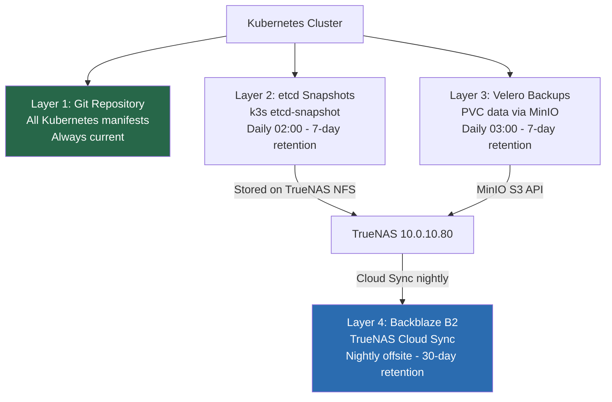
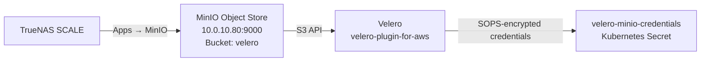

# 08 — Cluster Backups & Disaster Recovery
## Protecting the Platform from Data Loss

**Author:** Kagiso Tjeane
**Difficulty:** ⭐⭐⭐⭐⭐⭐⭐⭐☆☆ (8/10)
**Guide:** 08 of 13

> Kubernetes makes deploying systems easy.
>
> Recovering them after data loss is a different story.
>
> A resilient platform must assume that failures **will** occur:
>
> - disks fail
> - nodes die
> - configuration is deleted
> - upgrades go wrong
>
> This phase introduces a **complete backup strategy** for the platform.

The goal:

```
Any component of the cluster must be recoverable to a known-good state.
```

---

# Backup Strategy Overview

The platform protects four independent layers. Each layer uses a different mechanism.

```
Layer 1 → Kubernetes manifests     Git is the backup. Automatic and continuous.
Layer 2 → Cluster state (etcd)     k3s etcd-snapshot → TrueNAS NFS (daily 02:00, 7-day retention)
Layer 3 → Persistent volume data   Velero → MinIO on TrueNAS (daily 03:00, 7-day retention)
Layer 4 → Offsite copy             TrueNAS Cloud Sync → Backblaze B2 (nightly, 30-day retention)
```

These layers are independent. A disaster that destroys etcd can be recovered without touching volume data, and vice versa. Layer 4 protects against total TrueNAS loss (hardware failure, fire, theft).



Diagram:

```
Cluster
   │
   ├── Kubernetes Manifests (Git)
   │      └── GitHub ──────────────────────────────────────────────► Remote (always current)
   │
   ├── Cluster State (etcd)
   │      └── k3s etcd-snapshot ───────────► TrueNAS /archive/k8s-backups/etcd
   │                                                  │
   └── Persistent Volumes (PVCs)                      │
          └── Velero ──────────────────────► MinIO on TrueNAS (bucket: velero)
                                                       │
                                              TrueNAS Cloud Sync (nightly)
                                                       │
                                                       ▼
                                              Backblaze B2 (offsite)
```

---

# Layer 1 — GitOps Configuration

The first layer of protection is **Git itself**.

All Kubernetes manifests are stored in this repository. If the cluster is lost entirely, the platform can be rebuilt by:

```
1. reinstalling Kubernetes (Ansible)
2. bootstrapping Flux
3. Flux restoring all platform services and applications from Git
```

Configuration backups are therefore **automatic and continuous**. No additional tooling is required for this layer.

---

# Layer 2 — Cluster State (k3s etcd)

k3s uses an embedded etcd datastore. This database holds all Kubernetes objects:

- nodes
- secrets
- service definitions
- runtime state

Losing this database without a backup means losing the runtime state of the cluster. Unlike manifests in Git, this includes things like generated secrets, certificate private keys stored as Secrets, and dynamic state created by controllers.

> **Critical:** Do not use `tar` on `/var/lib/rancher/k3s/server/db` while k3s is running. This produces an inconsistent backup. Use `k3s etcd-snapshot` which creates a point-in-time consistent snapshot.

---

# NFS Mount — TrueNAS Backup Storage

All backup output goes to a TrueNAS NFS share. Mount this on the control-plane node.

Create the mount point:

```bash
sudo mkdir -p /mnt/backups
```

Add to `/etc/fstab`:

```
10.0.10.80:/mnt/archive/k8s-backups /mnt/backups nfs defaults,_netdev 0 0
```

Mount:

```bash
sudo mount -a
```

Verify:

```bash
df -h /mnt/backups
```

Create subdirectories:

```bash
sudo mkdir -p /mnt/backups/etcd
sudo mkdir -p /mnt/backups/velero
```

---

# k3s etcd Snapshot Backup Script

Create the script on the control-plane node (`tywin`).

```bash
cat > /usr/local/bin/k3s-snapshot.sh << 'EOF'
#!/bin/bash
# k3s-snapshot.sh — creates a point-in-time consistent etcd snapshot
# Run as root on the control-plane node.
# Do NOT use tar on /var/lib/rancher/k3s/server/db while k3s is running.

set -euo pipefail

BACKUP_DIR=/mnt/backups/etcd
DATE=$(date +%Y-%m-%d_%H%M%S)
SNAPSHOT_NAME="k3s-snapshot-${DATE}.db"
RETENTION_DAYS=7

# Verify the NFS mount is available before proceeding
if ! mountpoint -q /mnt/backups; then
  echo "ERROR: /mnt/backups is not mounted. Aborting backup." >&2
  exit 1
fi

mkdir -p "${BACKUP_DIR}"

# Create a consistent point-in-time snapshot
k3s etcd-snapshot save \
  --name "${SNAPSHOT_NAME}" \
  --dir "${BACKUP_DIR}"

# Prune snapshots older than retention period
find "${BACKUP_DIR}" -name "k3s-snapshot-*.db" -mtime +${RETENTION_DAYS} -delete

echo "Snapshot complete: ${BACKUP_DIR}/${SNAPSHOT_NAME}"
echo "Snapshot size: $(du -sh ${BACKUP_DIR}/${SNAPSHOT_NAME} | cut -f1)"
EOF

chmod +x /usr/local/bin/k3s-snapshot.sh
```

Schedule via cron (runs daily at 02:00):

```bash
echo "0 2 * * * root /usr/local/bin/k3s-snapshot.sh >> /var/log/k3s-snapshot.log 2>&1" \
  | sudo tee /etc/cron.d/k3s-snapshot
```

---

# Retention Policy

| Backup type | Retention |
|-------------|-----------|
| etcd daily snapshots | 7 days |
| Velero daily backups | 7 days |
| Velero weekly backups | 4 weeks |
| Velero monthly backups | 6 months |

Storage usage is bounded. For a small homelab cluster, etcd snapshots are typically 10–50 MB each.

---

# Layer 3 — Persistent Volumes (Velero + MinIO on TrueNAS)

Persistent volumes hold application data that is not in Git:

- database contents
- media library metadata
- monitoring time-series data (Prometheus TSDB)

**Velero** provides Kubernetes-native backup and restore for both PVCs and the Kubernetes objects that reference them (Deployments, Services, etc.).

Velero writes backups to **MinIO**, an S3-compatible object store running on TrueNAS. MinIO runs outside the cluster deliberately — if the cluster fails, MinIO on TrueNAS is still available for recovery.

---

# Setting Up MinIO on TrueNAS (One-Time)

> **Why MinIO and not a direct NFS path?**
> Velero's AWS plugin speaks S3. TrueNAS NFS does not speak S3. MinIO bridges this gap by providing an S3-compatible API on top of TrueNAS storage. This also enables bucket-level access control and works with any S3-aware tool.



## Step 1 — Deploy MinIO on TrueNAS

TrueNAS SCALE includes MinIO as a built-in application.

1. In the TrueNAS web UI, navigate to **Apps → Discover Apps**.
2. Search for **MinIO** and click **Install**.
3. Configure the application:

| Setting | Value |
|---------|-------|
| Application Name | `minio` |
| MinIO Configuration → Root User | `admin` (or your preferred username) |
| MinIO Configuration → Root Password | Generate a strong password — store in your password manager |
| Storage → MinIO Data Storage | Choose **Host Path** |
| Host Path | `/mnt/archive/k8s-backups/minio` (create this directory first — see Step 2) |
| Port | `9000` (API), `9001` (Console) |
| Network → Host Network | Enable (simpler networking, recommended for homelab) |

4. Click **Install** and wait for the application to start.
5. Access the MinIO Console at `http://10.0.10.80:9001` and log in with the credentials you set.

## Step 2 — Create the Storage Directory on TrueNAS

Before deploying MinIO, create the dataset it will use. In the TrueNAS web UI:

1. Navigate to **Storage → Create Dataset**.
2. Parent: `/mnt/archive/k8s-backups`
3. Name: `minio`
4. Sync: **Disabled** (MinIO manages its own consistency)
5. Click **Save**.

Alternatively via SSH on TrueNAS:

```bash
zfs create archive/k8s-backups/minio
```

## Step 3 — Create the Velero Bucket

Once MinIO is running, create a dedicated bucket for Velero.

1. In the MinIO Console (`http://10.0.10.80:9001`), navigate to **Buckets → Create Bucket**.
2. Bucket Name: `velero`
3. Leave all other settings at defaults.
4. Click **Create Bucket**.

## Step 4 — Create an Access Key for Velero

Velero needs its own access credentials — do not use the root credentials.

1. In the MinIO Console, navigate to **Access Keys → Create Access Key**.
2. Click **Create** (MinIO will generate a key pair).
3. Copy both values immediately — the secret key is only shown once.

| Credential | Where to store |
|-----------|---------------|
| Access Key ID | Copy now — goes into Kubernetes Secret |
| Secret Access Key | Copy now — goes into Kubernetes Secret, then save in password manager |

## Step 5 — Store the Credentials in the Cluster

The access credentials are stored as a SOPS-encrypted Kubernetes Secret. The template is at `platform/backup/velero/minio-credentials.yaml`.

Edit and encrypt it:

```bash
sops platform/backup/velero/minio-credentials.yaml
```

Replace the placeholder values:

```
[default]
aws_access_key_id=<paste Access Key ID from Step 4>
aws_secret_access_key=<paste Secret Access Key from Step 4>
```

Save and exit. SOPS will encrypt the file. Commit it to Git.

## Step 6 — Verify MinIO is Reachable from the Cluster

From any cluster node, test connectivity to MinIO:

```bash
curl -I http://10.0.10.80:9000/minio/health/live
```

Expected response: `HTTP/1.1 200 OK`

If this fails, check:
- MinIO application is running in TrueNAS Apps
- Host network is enabled (or port 9000 is accessible)
- TrueNAS firewall allows connections from the node subnet (10.0.10.0/24)

## Step 7 — Flux Deploys Velero and Connects to MinIO

Once the credentials Secret is encrypted and committed, Flux reconciles the Velero HelmRelease. Velero reads the credentials Secret and establishes a connection to MinIO.

Verify the BackupStorageLocation is ready:

```bash
velero backup-location get
```

Expected:

```
NAME            PROVIDER   BUCKET/PREFIX   PHASE       LAST VALIDATED
truenas-minio   aws        velero          Available   <timestamp>
```

If the phase is `Unavailable`, check:

```bash
velero backup-location get truenas-minio -o yaml
# Look at status.message for the error
```

Common causes: wrong endpoint URL, wrong credentials, bucket does not exist, MinIO not reachable.

---

---

# Velero Backup Schedule

Velero schedules are defined as `Schedule` resources in Git and reconciled by Flux.

Example — daily full cluster backup:

```yaml
apiVersion: velero.io/v1
kind: Schedule
metadata:
  name: daily-cluster-backup
  namespace: velero
spec:
  schedule: "0 3 * * *"     # 03:00 daily, after etcd snapshot
  template:
    includedNamespaces:
    - "*"
    storageLocation: truenas-minio
    ttl: 168h               # 7 days
    snapshotVolumes: false  # NFS volumes do not support CSI snapshots; use file-based backup
```

---

# Backup Monitoring

Backups must be observable. Failures must alert before the next backup window.

The backup monitoring script exports metrics for Prometheus via the node exporter textfile collector.

```bash
cat > /usr/local/bin/backup-metrics.sh << 'EOF'
#!/bin/bash
# Exports backup health metrics for Prometheus textfile collector

METRICS_FILE=/var/lib/node_exporter/textfile_collector/backup.prom
BACKUP_DIR=/mnt/backups/etcd

# Find the most recent snapshot
LATEST=$(ls -t ${BACKUP_DIR}/k3s-snapshot-*.db 2>/dev/null | head -1)

if [ -n "${LATEST}" ]; then
  MTIME=$(stat -c %Y "${LATEST}")
  SIZE=$(stat -c %s "${LATEST}")
  echo "backup_last_success_timestamp ${MTIME}" > "${METRICS_FILE}"
  echo "backup_size_bytes ${SIZE}" >> "${METRICS_FILE}"
else
  echo "backup_last_success_timestamp 0" > "${METRICS_FILE}"
  echo "backup_size_bytes 0" >> "${METRICS_FILE}"
fi
EOF

chmod +x /usr/local/bin/backup-metrics.sh
echo "*/15 * * * * root /usr/local/bin/backup-metrics.sh" \
  | sudo tee /etc/cron.d/backup-metrics
```

Grafana panels to create:

```
Last successful backup time
Hours since last backup (alert if > 26h)
Backup size trend
Velero backup phase (from Velero metrics)
```

Alert rule example (Prometheus):

```yaml
- alert: BackupTooOld
  expr: time() - backup_last_success_timestamp > 90000  # 25 hours
  for: 5m
  labels:
    severity: critical
  annotations:
    summary: "etcd backup has not succeeded in over 25 hours"
```

---

# Verifying Backup Health

Confirm etcd snapshots exist and are recent:

```bash
ls -lh /mnt/backups/etcd/
```

Expected output:

```
k3s-snapshot-2026-03-14_020001.db   42M
k3s-snapshot-2026-03-13_020001.db   41M
...
```

Confirm cron is scheduled:

```bash
cat /etc/cron.d/k3s-snapshot
```

Check Velero backup status:

```bash
velero backup get
velero schedule get
```

---

# Restoration Procedures

See **[runbooks/backup-restoration.md](../runbooks/backup-restoration.md)** for the complete, step-by-step tested restoration procedure.

Summary:

```
etcd restore:
  1. Stop k3s on control-plane
  2. k3s server --cluster-reset --cluster-reset-restore-path=<snapshot>
  3. Start k3s
  4. Verify node readiness
  5. Restart worker nodes

Velero restore:
  1. velero restore create --from-backup <backup-name>
  2. Monitor restore progress
  3. Verify PVC data integrity
```

> **Important:** The restoration runbook must be tested against a non-production cluster before it can be considered valid. An untested backup procedure is not a backup procedure.

---

# Disaster Recovery Scenario — Control Plane Disk Failure

```
1. Replace disk / reinstall OS on tywin
2. Mount TrueNAS NFS share: sudo mount -a
3. Run Ansible: ansible-playbook ansible/playbooks/security/*.yml
4. Run Ansible: ansible-playbook ansible/playbooks/lifecycle/install-cluster.yml
5. Restore etcd: k3s server --cluster-reset --cluster-reset-restore-path=<snapshot>
6. Start k3s: systemctl start k3s
7. Verify: kubectl get nodes
8. Bootstrap Flux: flux bootstrap git ...
9. Flux reconciles platform services from Git
10. Velero restores PVC data: velero restore create --from-backup <latest>
```

Target recovery time: **90–120 minutes** from disk replacement to all workloads running (see [cluster-rebuild runbook](../operations/runbooks/cluster-rebuild.md) for the detailed timeline).

---

# Exit Criteria

Backups are considered operational when:

✓ NFS share mounted and accessible at `/mnt/backups`
✓ etcd snapshot script installed and scheduled via cron
✓ snapshots appearing in `/mnt/backups/etcd/` daily
✓ Velero deployed and backup schedules reconciled by Flux
✓ backup metrics visible in Grafana
✓ backup age alert firing correctly in a test scenario
✓ restoration runbook tested successfully

The platform is now **recoverable after catastrophic failure**.

---

# Next Guide

➡ **[09 — Applications via GitOps](./09-Applications-GitOps.md)**

The next guide explains how applications are deployed safely, reproducibly, and declaratively using Flux.

---

## Navigation

| | Guide |
|---|---|
| ← Previous | [07 — Monitoring & Observability](./07-Monitoring-Observability.md) |
| Current | **08 — Cluster Backups & Disaster Recovery** |
| → Next | [09 — Applications via GitOps](./09-Applications-GitOps.md) |
