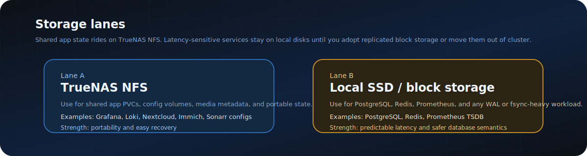
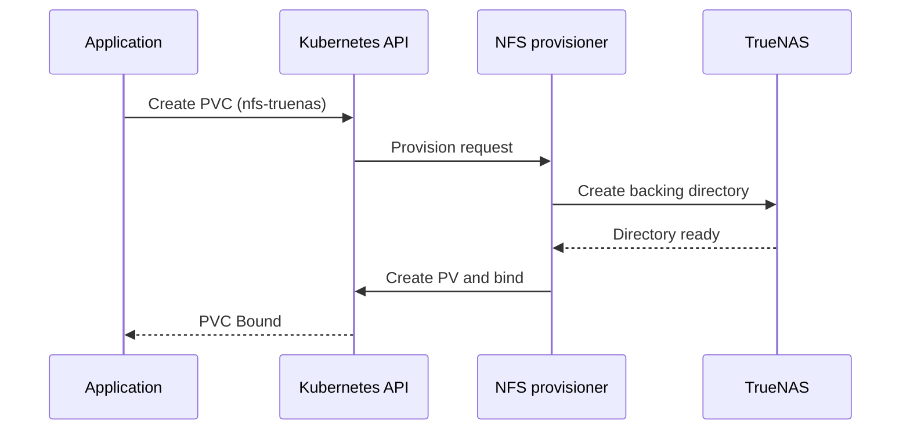

# 08 - Storage Architecture
## Persistent Storage via TrueNAS NFS and Local Disks

**Author:** Kagiso Tjeane
**Difficulty:** ******---- (6/10)
**Guide:** 08 of 13

> Storage is where infrastructure intent becomes painfully real.
>
> The wrong storage choice can make a clean platform feel unreliable:
>
> - apps restart and come back fine, but databases corrupt or stall
> - PVCs look portable, but latency-sensitive services become fragile
> - recovery is documented, yet the steady-state path is still unpleasant
>
> This guide explains the platform's storage model and the reasoning behind it:
>
> - NFS for shared and portable application state
> - local disks for database and TSDB workloads that do not behave well on NFS

---



---

## Table of Contents

1. [Why Storage Needs Two Lanes](#why-storage-needs-two-lanes)
2. [Current StorageClasses](#current-storageclasses)
3. [When to Use NFS](#when-to-use-nfs)
4. [Why Databases Stay Off NFS](#why-databases-stay-off-nfs)
5. [What the Platform Uses Today](#what-the-platform-uses-today)
6. [Recommended Next Steps for Better Data Resilience](#recommended-next-steps-for-better-data-resilience)
7. [NFS Provisioner Deployment](#nfs-provisioner-deployment)
8. [PVC Lifecycle](#pvc-lifecycle)
9. [Sizing and Verification](#sizing-and-verification)
10. [Exit Criteria](#exit-criteria)

---

## Why Storage Needs Two Lanes

Not all persistent workloads want the same kind of storage.

The platform deliberately separates them into two lanes:

| Lane | Storage type | Best for |
|---|---|---|
| Shared / portable lane | TrueNAS NFS via `nfs-truenas` | Application configs, media metadata, portable PVCs, general app state |
| Latency-sensitive lane | Node-local disk via `local-path` | PostgreSQL, Redis, Prometheus TSDB, WAL-heavy or fsync-heavy workloads |

This is the most important storage decision in the repo.

If you try to force everything onto NFS, you gain portability but lose the predictable write semantics databases expect. If you put everything on local disks, you gain performance but lose mobility and easy rebuilds for application PVCs.

The current design is a deliberate split, not an accident.

---

## Current StorageClasses

The cluster exposes two storage classes:

| StorageClass | Provisioner | Reclaim Policy | Binding Mode | Use case |
|---|---|---|---|---|
| `nfs-truenas` | `nfs-subdir-external-provisioner` | `Retain` | `Immediate` | Shared app PVCs and portable state |
| `local-path` | `rancher.io/local-path` | `Delete` | `WaitForFirstConsumer` | Local disks for databases and telemetry data |

`nfs-truenas` is the default StorageClass because most application PVCs benefit from portability more than they need ultra-low latency.

`local-path` exists because some workloads need the opposite tradeoff.

---

## When to Use NFS

Use `nfs-truenas` when the value is:

- a pod can move to another node without data locality becoming a problem
- shared or portable application state matters more than raw write performance
- the workload benefits from simpler recovery and centralised storage on TrueNAS

Good examples:

- Grafana dashboards and state
- Loki storage
- Nextcloud app state
- Immich config and supporting data
- Sonarr and Radarr config PVCs
- general application config volumes

### Why NFS works well here

The NFS provisioner gives you:

- automatic PVC creation
- clear directory layout on TrueNAS
- centralised backups and snapshots
- storage that survives individual node replacement

That fits the majority of app-level state in this homelab.

---

## Why Databases Stay Off NFS

This is the part that matters most for production judgement.

### PostgreSQL and Redis are not "just another PVC"

Databases are extremely sensitive to:

- write latency
- fsync behaviour
- lock semantics
- transient storage pauses

NFS can be acceptable for light or casual workloads, but it is a poor fit for:

- PostgreSQL WAL traffic
- Redis persistence and fsync-heavy moments
- Prometheus TSDB block compaction

In practice, the failure mode is ugly:

- the service is not obviously broken
- but latency spikes, stalls, or corruption risk increase
- and the operator ends up debugging storage behaviour instead of the application

### What `local-path` gives up

`local-path` is node-local, so it gives up easy portability.

If the node that owns the volume dies hard, the workload does not simply remount elsewhere. Recovery is more manual.

### Why it is still the right choice today

For this platform size, predictable database behaviour is more valuable than pretending those workloads are portable when they are not.

That is why:

- PostgreSQL uses `local-path`
- Redis uses `local-path`
- Prometheus uses `local-path`

This matches the ADRs and the live manifests.

---

## What the Platform Uses Today

### TrueNAS-backed NFS

The NFS provisioner points at:

```yaml
nfs:
  server: 10.0.10.80
  path: /mnt/core/k8s-volumes
```

Key storage class settings:

```yaml
storageClass:
  name: nfs-truenas
  reclaimPolicy: Retain
  volumeBindingMode: Immediate
  archiveOnDelete: true
```

`archiveOnDelete: true` means deleted PVC data is moved under an archive prefix instead of being destroyed immediately.

### Local-path workloads

The live repo currently places these on local disks:

| Workload | Reason |
|---|---|
| PostgreSQL | WAL-heavy relational database |
| Redis | latency-sensitive in-memory store with persistence |
| Prometheus TSDB | high write rate, lock-sensitive time-series store |

This is consistent with:

- [ADR-009](../adr/ADR-009-prometheus-local-storage.md)
- [ADR-011](../adr/ADR-011-central-databases.md)

---

## Recommended Next Steps for Better Data Resilience

If you want to improve data resilience beyond the current design, there are three realistic paths.

### Option 1 - Keep the current split

Use:

- NFS for most PVCs
- local-path for PostgreSQL, Redis, and Prometheus

This is the simplest operational model and still the right default for this repo.

### Option 2 - Move shared databases out of Kubernetes

Run PostgreSQL and Redis on a dedicated VM or host with:

- local SSD storage
- host-level backup strategy
- stable DNS or virtual IP

This is the cleanest next step if you want stronger database semantics without adding a distributed storage stack to Kubernetes itself.

### Option 3 - Adopt replicated block storage

Examples:

- Longhorn
- OpenEBS
- Ceph

This gives you portable block-style storage that behaves far better for databases than NFS, but it also adds significant operational weight.

For a homelab of this size, this only makes sense if:

- you explicitly want to learn and operate distributed storage, or
- you are willing to pay the complexity cost in exchange for better failover characteristics

### My recommendation for this repo

Stay with the current split for now:

1. `nfs-truenas` for shared application PVCs
2. `local-path` for PostgreSQL, Redis, and Prometheus
3. move databases to a dedicated VM later if you want a cleaner production posture without adopting Longhorn or Ceph

---

## NFS Provisioner Deployment

The provisioner is deployed by Flux from `platform/storage/nfs-provisioner/`.

Verify the HelmRelease:

```bash
flux get helmrelease -n storage
kubectl get pods -n storage
```

Check the StorageClasses:

```bash
kubectl get storageclass
```

Expected:

```text
NAME          PROVISIONER                    RECLAIM POLICY   VOLUME BINDING MODE
nfs-truenas   cluster.local/nfs-provisioner  Retain           Immediate
local-path    rancher.io/local-path          Delete           WaitForFirstConsumer
```

---

## PVC Lifecycle

### NFS-backed PVCs



### Local-path PVCs

The first node that satisfies scheduling for the pod becomes the home of the volume. After that, the PV carries node affinity and the workload remains attached to that node unless you rebuild or migrate it deliberately.

That is the portability tradeoff you accept for database-friendly behaviour.

---

## Sizing and Verification

### Starting sizes

| Workload | Recommended size | StorageClass |
|---|---|---|
| Grafana | 2Gi | `nfs-truenas` |
| Loki | 20Gi | `nfs-truenas` |
| Nextcloud | depends on usage | `nfs-truenas` |
| PostgreSQL | 8Gi to start | `local-path` |
| Redis | 1Gi to start | `local-path` |
| Prometheus | 20Gi | `local-path` |

These are starting points only. Grafana should tell you when reality differs from the estimate.

### Verification commands

```bash
kubectl get pvc -A
kubectl get pv
kubectl describe storageclass nfs-truenas
kubectl describe storageclass local-path
showmount -e 10.0.10.80
```

Questions these commands answer:

- are PVCs bound?
- which PVs are NFS-backed versus node-local?
- is the NFS export reachable from the cluster?

---

## Exit Criteria

This guide is complete when:

- the two-lane storage model is understood
- it is explicitly documented that databases and Prometheus remain off NFS
- the current manifests, ADRs, and guide text all tell the same story
- the next production-quality storage options are clear: dedicated DB host or replicated block storage

---

## Navigation

| | Guide |
|---|---|
| <- Previous | [07 - Namespaces & Cluster Identity](./07-Namespaces-Cluster-Identity.md) |
| Current | **08 - Storage Architecture** |
| -> Next | [09 - Monitoring & Observability](./09-Monitoring-Observability.md) |
