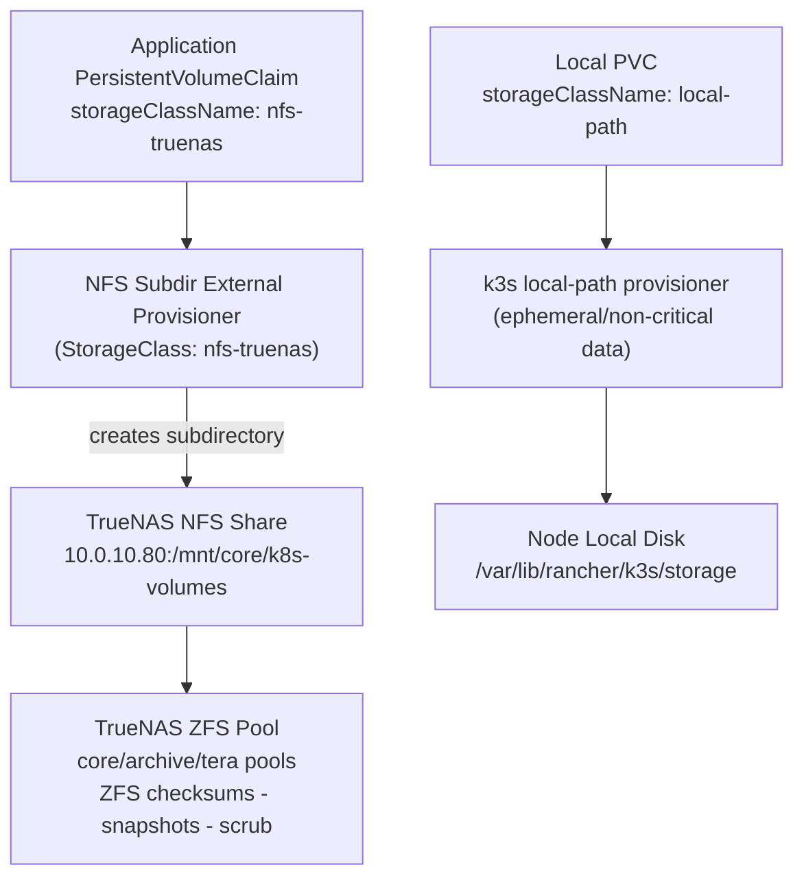
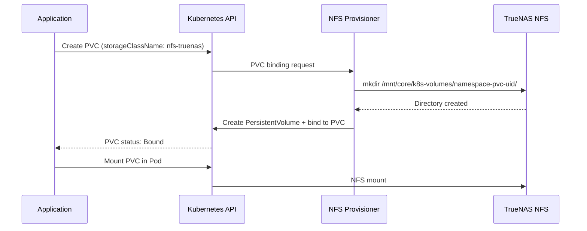

# 08 — Storage Architecture
## Persistent Storage via TrueNAS NFS

**Author:** Kagiso Tjeane
**Difficulty:** ⭐⭐⭐⭐⭐⭐☆☆☆☆ (6/10)
**Guide:** 08 of 13

> Kubernetes workloads that need persistent state — databases, monitoring time-series data, media libraries — require storage that outlives pods.
>
> This guide documents how the platform provisions persistent volumes using TrueNAS as the backing store via NFS.

---

# TrueNAS Pool Architecture

TrueNAS at `10.0.10.80` uses three ZFS pools with distinct purposes:

| Pool | Mount point | Purpose |
|---|---|---|
| `tera` | `/mnt/tera` | Bulk cold storage — large media files, archives |
| `core` | `/mnt/core` | Hot storage — Kubernetes PVCs, actively accessed by the cluster |
| `archive` | `/mnt/archive` | Backup storage — etcd snapshots, Velero data via MinIO |

The NFS provisioner uses `core/k8s-volumes`. Backup data lives in `archive/backups/k8s`.
Both datasets and their NFS exports are created in
[Guide 00.5 — Infrastructure Prerequisites](./00.5-Infrastructure-Prerequisites.md).

---

# Storage Design Principles

The platform storage architecture follows two rules:

**1 — Nodes are disposable. Data is not.**

All persistent data lives on **TrueNAS**, not on cluster nodes. A node can be wiped, replaced, or rebuilt without any data loss.

**2 — Storage is provisioned dynamically.**

Applications declare a `PersistentVolumeClaim`. The NFS StorageClass provisions a backing directory on TrueNAS automatically. No manual volume creation is required.

---

# Storage Architecture Overview



The provisioner runs inside the cluster. It watches for PVC creation and automatically creates a subdirectory on the NFS share for each new volume.

---

# TrueNAS NFS Share Setup

> The `core/k8s-volumes` dataset and its NFS export were created in
> [Guide 00.5 — Infrastructure Prerequisites](./00.5-Infrastructure-Prerequisites.md).
> Verify the share is active before deploying the provisioner.

**Required shares on TrueNAS (10.0.10.80):**

| Share path | Purpose |
|-----------|---------|
| `/mnt/core/k8s-volumes` | Kubernetes persistent volumes |
| `/mnt/archive/backups/k8s/etcd` | etcd snapshots |
| `/mnt/archive/backups/k8s/velero` | Velero backup data |

**NFS export settings for each share:**

- Maproot User: `root`
- Maproot Group: `wheel`
- Allowed hosts/networks: `10.0.10.0/24` (cluster node and Docker host subnet)
- Enable: `NFSv4`
- Disable: `NFSv3` (if possible, for better locking semantics)

> **Note on allowed networks:** The `/24` subnet covers the k3s cluster nodes (`10.0.10.11-13`), the Docker host (`10.0.10.20`), and the RPi (`10.0.10.10`). All of these systems mount or access TrueNAS NFS shares.

---

# StorageClass Hierarchy

The platform defines two StorageClasses.

| StorageClass | Provisioner | Reclaim Policy | Use Case |
|-------------|-------------|----------------|----------|
| `nfs-truenas` | nfs-subdir-external-provisioner | Retain | stateful apps, databases |
| `local-path` | rancher.io/local-path (k3s built-in) | Delete | ephemeral scratch space, monitoring TSDB |

**Retain** means the backing directory on TrueNAS survives PVC deletion. An operator must manually clean up old directories. This is the safe default for production data.

**Delete** means the local directory is removed when the PVC is deleted. Appropriate for non-critical data that is managed by application-level retention (e.g., Prometheus TSDB, which has its own retention configuration).

---

# NFS Provisioner Deployment

The provisioner is deployed through Flux. The HelmRelease is in `platform/storage/nfs-provisioner/`.

Key values:

```yaml
nfs:
  server: 10.0.10.80
  path: /mnt/core/k8s-volumes

storageClass:
  name: nfs-truenas
  reclaimPolicy: Retain
  volumeBindingMode: Immediate
  archiveOnDelete: true    # moves data to archived/ dir instead of deleting
```

`archiveOnDelete: true` means that even if a PVC is deleted, the data is moved to an `archived/` subdirectory on TrueNAS rather than being destroyed. This provides an additional safety net.

---

# Creating a PVC

Applications request storage by creating a PersistentVolumeClaim.

Example — Grafana data volume:

```yaml
apiVersion: v1
kind: PersistentVolumeClaim
metadata:
  name: grafana-data
  namespace: monitoring
spec:
  accessModes:
    - ReadWriteOnce
  storageClassName: nfs-truenas
  resources:
    requests:
      storage: 5Gi
```

On creation:

1. The NFS provisioner creates `/mnt/core/k8s-volumes/monitoring-grafana-data-pvc-<uid>/` on TrueNAS.
2. A `PersistentVolume` is automatically created and bound to the PVC.
3. The pod mounts the PVC as a volume.

---

# PVC Lifecycle



---

# PVC Naming Convention

PVC names follow a consistent pattern:

```
<application>-<component>
```

Examples:

```
grafana-data
prometheus-data
loki-data
sonarr-config
immich-data
n8n-data
```

This makes it straightforward to identify the TrueNAS directory that corresponds to a given PVC.

---

# Verifying Storage

Check that the NFS share is reachable from cluster nodes:

```bash
# On any cluster node
showmount -e 10.0.10.80
```

Expected output includes:

```
/mnt/core/k8s-volumes    10.0.10.0/24
```

Check that the StorageClass exists:

```bash
kubectl get storageclass
```

Expected:

```
NAME          PROVISIONER                   RECLAIM POLICY   VOLUME BINDING MODE
nfs-truenas   cluster.local/nfs-provisioner Retain           Immediate
local-path    rancher.io/local-path         Delete           WaitForFirstConsumer
```

Check that a PVC is bound:

```bash
kubectl get pvc -A
```

All PVCs should show `STATUS: Bound`.

---

# Volume Sizing Guidance

| Workload | Recommended size | Notes |
|----------|-----------------|-------|
| Grafana | 2Gi | dashboards, plugins |
| Prometheus | 20Gi | time-series retention (15 days default) |
| Loki | 20Gi | log retention |
| Velero | n/a | Velero writes directly to NFS share |
| Sonarr / Radarr | 1Gi | config and database only; media is a hostPath or separate NFS mount |
| Immich | 10Gi+ | config + ML models; media library on dedicated NFS share |

These are starting points. Monitor actual usage via Grafana and expand as needed.

---

# Expanding a Volume

NFS volumes support online expansion without pod restart.

**Step 1 — Edit the PVC:**

```bash
kubectl edit pvc grafana-data -n monitoring
```

Change `storage: 5Gi` to `storage: 10Gi`.

**Step 2 — Verify expansion:**

```bash
kubectl get pvc grafana-data -n monitoring
```

Status should show `Resizing` then `Bound` with the new capacity.

NFS does not have a block device to resize — the directory on TrueNAS is not size-limited. The PVC capacity is advisory and tracked by Kubernetes, but data will not be truncated when it reaches the declared size.

> For strict quota enforcement, configure NFS quotas on TrueNAS per dataset.

---

# Storage and Backup Integration

The NFS provisioner creates directories under `/mnt/core/k8s-volumes/`. Velero backs up PVC data by mounting volumes and copying files.

For the etcd snapshot backup, the control-plane node mounts `/mnt/archive/backups/k8s/etcd/` separately — see [Guide 10 — Backups & Disaster Recovery](./10-Backups-Disaster-Recovery.md) for the snapshot script and mount setup.

The ZFS pool on TrueNAS provides:

- snapshot capability at the dataset level (instant, space-efficient)
- replication to an offsite pool (if configured)
- scrub scheduling for data integrity

Recommend configuring TrueNAS periodic ZFS snapshots as an additional layer of protection:

```
Snapshot schedule: daily
Retention: 7 days
Dataset: core/k8s-volumes
```

---

# Exit Criteria

Storage is considered operational when:

- TrueNAS NFS shares configured and accessible from cluster subnet
- NFS provisioner deployed and running via Flux
- `nfs-truenas` StorageClass present and set as default (or explicitly referenced in PVCs)
- test PVC creates successfully and shows `Bound`
- backing directory visible on TrueNAS at `/mnt/core/k8s-volumes/`
- Grafana dashboard shows PVC usage metrics

---

# Further Reading

- [Architecture: Storage](../architecture/storage.md) — detailed storage design reference
- [Runbook: Backup Restoration](../runbooks/backup-restoration.md) — Velero restore procedures
- [Guide 10: Backups & Disaster Recovery](./10-Backups-Disaster-Recovery.md) — backup strategy overview

---

## Navigation

| | Guide |
|---|---|
| ← Previous | [07 — Namespaces & Cluster Identity](./07-Namespaces-Cluster-Identity.md) |
| Current | **08 — Storage Architecture** |
| → Next | [09 — Monitoring & Observability](./09-Monitoring-Observability.md) |
