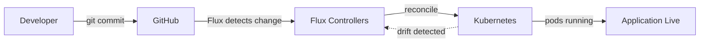
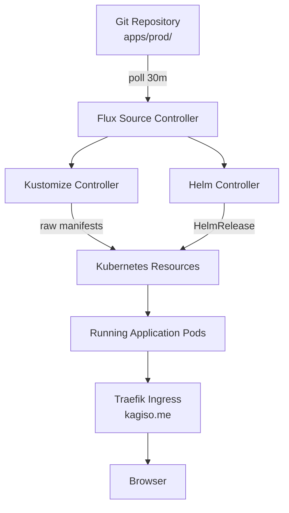
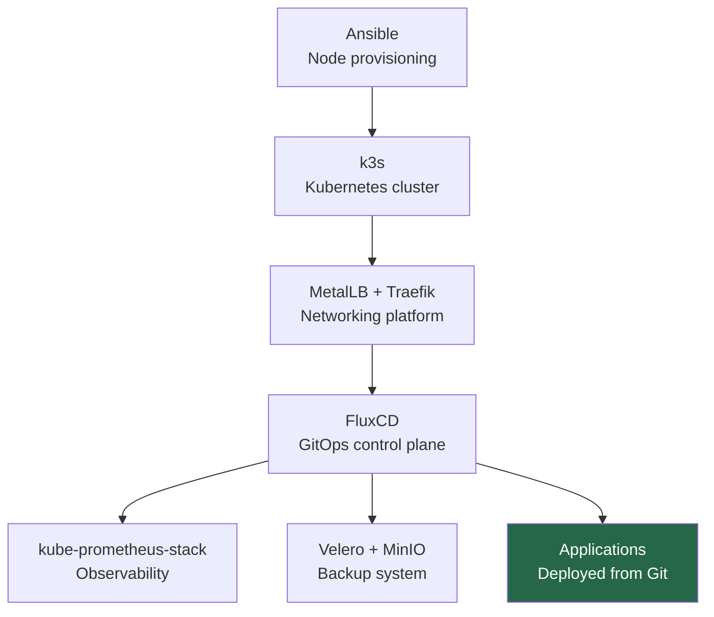

# 09 — Applications via GitOps
## Deploying Workloads the Platform Engineering Way

**Author:** Kagiso Tjeane
**Difficulty:** ⭐⭐⭐⭐⭐⭐⭐⭐☆☆ (8/10)
**Guide:** 09 of 14

> The final step in building the platform is enabling **application delivery**.
>
> Up to this point we have built the foundations:
>
> • hardened nodes
> • Kubernetes cluster
> • networking platform
> • GitOps control plane
> • namespaces and scheduling rules
> • monitoring and observability
> • backup and disaster recovery
>
> The cluster is now **a platform**.
>
> This chapter explains how applications are deployed **safely, reproducibly, and declaratively** using Flux.

---

# The GitOps Application Model

In traditional Kubernetes environments applications are deployed manually.

Example:

```
kubectl apply -f deployment.yaml
```

While simple, this creates problems over time:

• configuration drift
• undocumented changes
• inconsistent environments
• difficult rollbacks

GitOps solves these problems by making **Git the single source of truth**.



The cluster continuously synchronizes itself with the repository.

---

# Application Delivery Architecture

Application deployment follows this pipeline:



Flux watches the repository and applies any changes automatically.

---

# Repository Layout for Applications

Applications live inside the **apps layer** of the repository.

Example:

```
platform-infra
└── clusters
    └── prod
        ├── infrastructure
        ├── platform
        └── apps
            ├── grafana
            ├── jellyfin
            └── sonarr
```

Each application typically contains:

```
deployment.yaml
service.yaml
ingress.yaml
kustomization.yaml
```

Or alternatively a **HelmRelease**.

---

# Helm vs Raw Manifests

Applications can be deployed in two ways.

## Raw Kubernetes Manifests

Example:

```
Deployment
Service
Ingress
```

Advantages:

• simple
• transparent

Disadvantages:

• more manual configuration

---

## Helm Charts

Helm packages applications into reusable templates.

Flux integrates directly with Helm through the **Helm Controller**.

Example resource:

```
HelmRelease
```

Advantages:

• versioned packages
• simplified upgrades
• community-maintained charts

For most applications Helm is the recommended approach.

---

# Example: Deploying Grafana with HelmRelease

Create a file:

```
grafana-helmrelease.yaml
```

Example:

```yaml
apiVersion: helm.toolkit.fluxcd.io/v2
kind: HelmRelease
metadata:
  name: grafana
  namespace: monitoring
spec:
  interval: 10m
  chart:
    spec:
      chart: grafana
      version: "6.x"
      sourceRef:
        kind: HelmRepository
        name: grafana
        namespace: flux-system
```

Once committed to Git, Flux deploys the chart automatically.

---

# Exposing Applications Through Traefik

Applications must be reachable through the ingress controller.

Example IngressRoute:

```yaml
apiVersion: traefik.io/v1alpha1
kind: IngressRoute
metadata:
  name: grafana
  namespace: monitoring
spec:
  entryPoints:
    - websecure
  routes:
  - match: Host(`grafana.kagiso.me`)
    kind: Rule
    services:
    - name: grafana
      port: 80
```

Traffic flow:

```
Browser
   │
   ▼
grafana.kagiso.me
   │
   ▼
DNS wildcard
   │
   ▼
Traefik
   │
   ▼
Grafana service
   │
   ▼
Grafana pod
```

---

# TLS with cert-manager and Traefik

TLS certificates are issued automatically by **cert-manager** using a single wildcard
certificate (`*.kagiso.me`) stored in the `ingress` namespace as `wildcard-kagiso-me-tls`.
Traefik's `TLSStore` is configured to use this as the default certificate for all
`[websecure]` entry points.

**No per-service Certificate resource is needed.** Applications use TLS by adding `tls: {}`
to their IngressRoute — Traefik serves the wildcard cert automatically:

```yaml
spec:
  entryPoints: [websecure]
  routes:
    - match: Host(`myapp.kagiso.me`)
      kind: Rule
      services:
        - name: myapp
          port: 8080
  tls: {}    # ← uses wildcard-kagiso-me-tls from Traefik default TLSStore
```

Certificate lifecycle (one-time, managed by cert-manager):

```
cert-manager requests *.kagiso.me from Let's Encrypt
      │
      ▼
DNS-01 challenge: cert-manager writes TXT record to Cloudflare
      │
      ▼
Let's Encrypt validates record (~30–120 seconds)
      │
      ▼
wildcard-kagiso-me-tls Secret created in ingress namespace
      │
      ▼
Traefik TLSStore serves it to all [websecure] IngressRoutes
```

cert-manager renews the wildcard cert automatically before expiration (typically 60 days before).

---

# Safe Application Deployment Workflow

GitOps introduces a controlled deployment workflow.

Example process:

```
1. modify application manifest
2. commit change
3. push to Git
4. Flux reconciles cluster
5. application updated
```

This ensures every change is:

• versioned
• reviewable
• reproducible

---

# Rollbacks

If a deployment fails, rollback is trivial.

Example:

```
git revert <commit>
git push
```

Flux will restore the previous working state automatically.

This dramatically reduces operational risk.

---

# Observing Application Health

Application health can be observed through:

```
kubectl get pods
```

or through the monitoring stack.

Example Grafana panels:

• request latency
• HTTP error rate
• pod restart count

This provides operational visibility into the application layer.

---

# Scaling Applications

Applications can scale horizontally using replicas.

Example:

```yaml
spec:
  replicas: 3
```

The Kubernetes scheduler distributes replicas across nodes.

```
Pod 1 → jaime
Pod 2 → tyrion
Pod 3 → jaime
```

This increases resilience and throughput.

---

# Failure Scenarios

GitOps simplifies recovery from failures.

Example scenario:

```
Application accidentally deleted
```

Flux detects drift:

```
Application missing from cluster
but still defined in Git
```

Flux automatically restores the workload.

---

# Platform Delivery Pipeline

The full platform lifecycle now looks like this:



The platform is now fully automated.

---

# Exit Criteria

Application delivery is considered operational when:

✓ applications deployed through Git
✓ Flux reconciliation working
✓ ingress routing functional
✓ TLS certificates issuing correctly

At this point the platform is **fully operational**.

---

# End of Platform Guide

You now have a production-style Kubernetes platform with:

• infrastructure automation
• GitOps workflows
• observability
• backup and recovery
• secure ingress and TLS

This platform can safely host applications while remaining **maintainable and reproducible**.

---

## Navigation

| | Guide |
|---|---|
| ← Previous | [08 — Cluster Backups & Disaster Recovery](./08-Cluster-Backups.md) |
| Current | **09 — Applications via GitOps** |
| → Next | [10 — Platform Operations & Lifecycle](./10-Platform-Operations-Lifecycle.md) |
