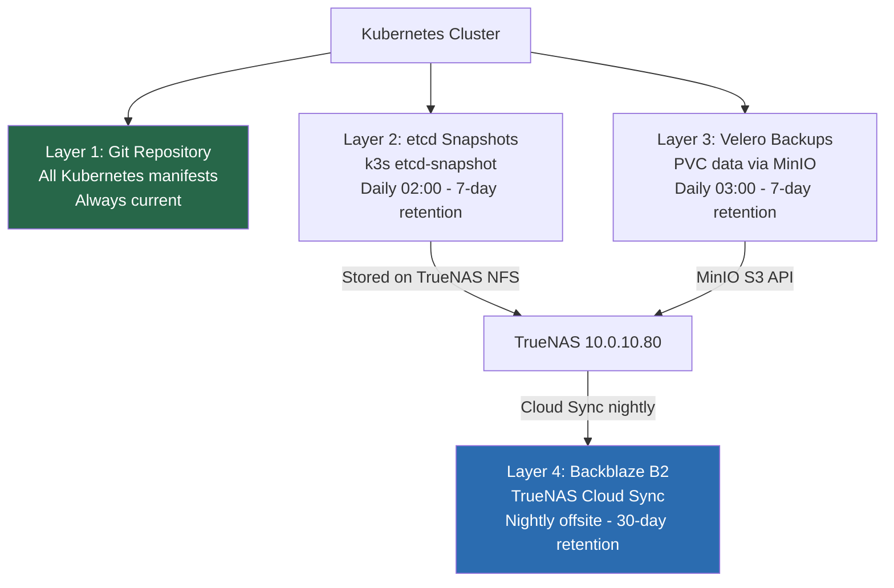
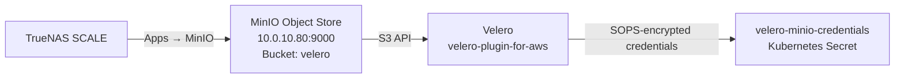

# 10 — Backups & Disaster Recovery
## Protecting the Platform from Data Loss

**Author:** Kagiso Tjeane
**Difficulty:** ⭐⭐⭐⭐⭐⭐⭐⭐☆☆ (8/10)
**Guide:** 10 of 13

> Kubernetes makes deploying systems easy.
>
> Recovering them after data loss is a different story.
>
> A resilient platform must assume that failures **will** occur:
>
> - disks fail
> - nodes die
> - configuration is deleted
> - upgrades go wrong
>
> This phase introduces a **complete backup strategy** for the platform.

The goal:

```
Any component of the cluster must be recoverable to a known-good state.
```

---

# Backup Strategy Overview

The platform protects four independent layers. Each layer uses a different mechanism.

```
Layer 1 → Kubernetes manifests     Git is the backup. Automatic and continuous.
Layer 2 → Cluster state (etcd)     k3s etcd-snapshot → TrueNAS NFS (daily 02:00, 7-day retention)
Layer 3 → Persistent volume data   Velero → MinIO on TrueNAS (daily 03:00, 7-day retention)
Layer 4 → Offsite copy             TrueNAS Cloud Sync → Backblaze B2 (nightly, 30-day retention)
```

These layers are independent. A disaster that destroys etcd can be recovered without touching volume data, and vice versa. Layer 4 protects against total TrueNAS loss (hardware failure, fire, theft).



Diagram:

```
Cluster
   │
   ├── Kubernetes Manifests (Git)
   │      └── GitHub ──────────────────────────────────────────────► Remote (always current)
   │
   ├── Cluster State (etcd)
   │      └── k3s etcd-snapshot ───────────► TrueNAS /archive/backups/k8s/etcd
   │                                                  │
   └── Persistent Volumes (PVCs)                      │
          └── Velero ──────────────────────► MinIO on TrueNAS (bucket: velero)
                                                       │
                                              TrueNAS Cloud Sync (nightly)
                                                       │
                                                       ▼
                                              Backblaze B2 (offsite)
```

---

# Layer 1 — GitOps Configuration

The first layer of protection is **Git itself**.

All Kubernetes manifests are stored in this repository. If the cluster is lost entirely, the platform can be rebuilt by:

```
1. reinstalling Kubernetes (Ansible)
2. bootstrapping Flux
3. Flux restoring all platform services and applications from Git
```

Configuration backups are therefore **automatic and continuous**. No additional tooling is required for this layer.

---

# Layer 2 — Cluster State (k3s etcd)

k3s uses an embedded etcd datastore. This database holds all Kubernetes objects:

- nodes
- secrets
- service definitions
- runtime state

Losing this database without a backup means losing the runtime state of the cluster. Unlike manifests in Git, this includes things like generated secrets, certificate private keys stored as Secrets, and dynamic state created by controllers.

> **Critical:** Do not use `tar` on `/var/lib/rancher/k3s/server/db` while k3s is running. This produces an inconsistent backup. Use `k3s etcd-snapshot` which creates a point-in-time consistent snapshot.

---

# NFS Mount — TrueNAS Backup Storage

> The `archive/backups/k8s` dataset and NFS export were created in
> [Guide 00.5 — Infrastructure Prerequisites](./00.5-Infrastructure-Prerequisites.md).
> Confirm the export is active before mounting.

All backup output goes to a TrueNAS NFS share. Mount this on the control-plane node.

Create the mount point:

```bash
sudo mkdir -p /mnt/backups
```

Add to `/etc/fstab`:

```
10.0.10.80:/mnt/archive/backups/k8s /mnt/backups nfs defaults,_netdev 0 0
```

Mount:

```bash
sudo mount -a
```

Verify:

```bash
df -h /mnt/backups
```

Create subdirectories:

```bash
sudo mkdir -p /mnt/backups/etcd
sudo mkdir -p /mnt/backups/velero
```

---

# k3s etcd Snapshot Backup Script

Create the script on the control-plane node (`tywin`). The script takes a consistent snapshot, enforces retention, and writes Prometheus textfile metrics inline — no separate metrics script is needed.

```bash
cat > /usr/local/bin/k3s-snapshot.sh << 'SCRIPT'
#!/bin/bash
# k3s-snapshot.sh — point-in-time etcd snapshot with Prometheus metrics.
# Run as root on the control-plane node (tywin).
# Do NOT use tar on /var/lib/rancher/k3s/server/db while k3s is running.

set -euo pipefail

BACKUP_DIR=/mnt/backups/etcd
DATE=$(date +%Y-%m-%d_%H%M%S)
SNAPSHOT_NAME="k3s-snapshot-${DATE}.db"
RETENTION_DAYS=7
LOG_FILE=/var/log/k3s-snapshot.log
TEXTFILE_DIR=/var/lib/node_exporter/textfile_collector
TEXTFILE_METRIC="${TEXTFILE_DIR}/etcd_backup.prom"
JOB="etcd"

START_TIME=$(date +%s)

log() { echo "[$(date '+%Y-%m-%d %H:%M:%S')] $*" | tee -a "${LOG_FILE}"; }

write_metrics() {
  local status="$1" ts="$2" size="$3" duration="$4" failures="$5"
  mkdir -p "${TEXTFILE_DIR}"
  local tmp
  tmp=$(mktemp "${TEXTFILE_METRIC}.XXXXXX")
  cat > "${tmp}" <<METRICS
# HELP backup_job_status 1 = last run succeeded, 0 = failed.
# TYPE backup_job_status gauge
backup_job_status{job="${JOB}"} ${status}
# HELP backup_last_success_timestamp Unix timestamp of last successful backup.
# TYPE backup_last_success_timestamp gauge
backup_last_success_timestamp{job="${JOB}"} ${ts}
# HELP backup_size_bytes Size of last backup archive in bytes.
# TYPE backup_size_bytes gauge
backup_size_bytes{job="${JOB}"} ${size}
# HELP backup_duration_seconds Duration of last backup run in seconds.
# TYPE backup_duration_seconds gauge
backup_duration_seconds{job="${JOB}"} ${duration}
# HELP backup_failures_total Cumulative count of failed backup runs.
# TYPE backup_failures_total counter
backup_failures_total{job="${JOB}"} ${failures}
METRICS
  mv "${tmp}" "${TEXTFILE_METRIC}"
  chmod 644 "${TEXTFILE_METRIC}"
}

on_error() {
  local prev_ts prev_failures
  prev_ts=$(grep "backup_last_success_timestamp{job=\"${JOB}\"}" "${TEXTFILE_METRIC}" 2>/dev/null | awk '{print $NF}' || echo 0)
  prev_failures=$(grep "backup_failures_total{job=\"${JOB}\"}" "${TEXTFILE_METRIC}" 2>/dev/null | awk '{print $NF}' || echo 0)
  write_metrics 0 "${prev_ts}" 0 "$(( $(date +%s) - START_TIME ))" "$(( prev_failures + 1 ))"
  log "ERROR: Snapshot failed — failure count is now $(( prev_failures + 1 ))"
  exit 1
}
trap on_error ERR

if ! mountpoint -q /mnt/backups; then
  log "ERROR: /mnt/backups is not mounted. Aborting."
  exit 1
fi

mkdir -p "${BACKUP_DIR}"
log "Creating snapshot: ${SNAPSHOT_NAME}"

k3s etcd-snapshot save \
  --name "${SNAPSHOT_NAME}" \
  --dir "${BACKUP_DIR}"

find "${BACKUP_DIR}" -name "k3s-snapshot-*.db" -mtime +${RETENTION_DAYS} -delete

END_TIME=$(date +%s)
SNAPSHOT_SIZE=$(stat -c %s "${BACKUP_DIR}/${SNAPSHOT_NAME}")
PREV_FAILURES=$(grep "backup_failures_total{job=\"${JOB}\"}" "${TEXTFILE_METRIC}" 2>/dev/null | awk '{print $NF}' || echo 0)
write_metrics 1 "${END_TIME}" "${SNAPSHOT_SIZE}" "$(( END_TIME - START_TIME ))" "${PREV_FAILURES}"

log "Snapshot complete: ${SNAPSHOT_NAME} ($(du -sh ${BACKUP_DIR}/${SNAPSHOT_NAME} | cut -f1))"
SCRIPT

chmod +x /usr/local/bin/k3s-snapshot.sh
```

Schedule via cron (runs daily at 02:00):

```bash
echo "0 2 * * * root /usr/local/bin/k3s-snapshot.sh >> /var/log/k3s-snapshot.log 2>&1" \
  | sudo tee /etc/cron.d/k3s-snapshot
```

---

# Retention Policy

| Backup type | Retention |
|-------------|-----------|
| etcd daily snapshots | 7 days |
| Velero daily backups | 7 days |
| Velero weekly backups | 4 weeks |
| Velero monthly backups | 6 months |

Storage usage is bounded. For a small homelab cluster, etcd snapshots are typically 10–50 MB each.

---

# Docker Appdata Backup

The Docker host (`10.0.10.20`) is a bare-metal Intel NUC running Plex, SABnzbd, Sonarr, Radarr, and supporting services. Their configuration, databases, and metadata live in `/srv/docker/appdata`. This directory is not part of the Kubernetes cluster and is not covered by Velero — it needs its own backup.

The backup script lives at `docker/scripts/backup_docker.sh` in this repository.

## Step 1 — Verify the NFS destination exists

The Docker host mounts the same TrueNAS NFS share at `/mnt/archive/backups`. Confirm the `docker` subdirectory exists on TrueNAS:

```bash
# On TrueNAS (via SSH or shell)
ls /mnt/archive/backups/docker
```

If missing, create it:

```bash
mkdir -p /mnt/archive/backups/docker
```

## Step 2 — Deploy the script to the Docker host

```bash
# From your laptop, copy the script to the Docker host
scp docker/scripts/backup_docker.sh kagiso@10.0.10.20:/srv/docker/scripts/backup_docker.sh
ssh kagiso@10.0.10.20 "sudo chmod 700 /srv/docker/scripts/backup_docker.sh"
```

The script:
- Archives `/srv/docker/appdata` to `/mnt/archive/backups/docker/docker_appdata_<timestamp>.tar.gz`
- Excludes logs, cache, and Plex transcodes (large, expendable)
- Enforces a 7-day retention policy
- Writes all five Prometheus textfile metrics with `job="docker-appdata"` (see [Backup Monitoring](#backup-monitoring))

## Step 3 — Schedule via cron

```bash
echo "0 2 * * * root /srv/docker/scripts/backup_docker.sh" \
  | sudo tee /etc/cron.d/docker-backup
```

Verify:

```bash
sudo crontab -l
# or
cat /etc/cron.d/docker-backup
```

## Step 4 — Run a manual backup to verify

```bash
sudo /srv/docker/scripts/backup_docker.sh
```

Check the log and confirm the archive appeared on TrueNAS:

```bash
tail -20 /var/log/docker-backup.log
ls -lh /mnt/archive/backups/docker/
```

---

# Layer 3 — Persistent Volumes (Velero + MinIO on TrueNAS)

Persistent volumes hold application data that is not in Git:

- database contents
- media library metadata
- monitoring time-series data (Prometheus TSDB)

**Velero** provides Kubernetes-native backup and restore for both PVCs and the Kubernetes objects that reference them (Deployments, Services, etc.).

Velero writes backups to **MinIO**, an S3-compatible object store running on TrueNAS. MinIO runs outside the cluster deliberately — if the cluster fails, MinIO on TrueNAS is still available for recovery.

---

# Setting Up MinIO on TrueNAS (One-Time)

> **Why MinIO and not a direct NFS path?**
> Velero's AWS plugin speaks S3. TrueNAS NFS does not speak S3. MinIO bridges this gap by providing an S3-compatible API on top of TrueNAS storage. This also enables bucket-level access control and works with any S3-aware tool.



## Step 1 — Verify the Storage Datasets Exist

The `archive/backups/k8s` and `archive/backups/k8s/minio` datasets should already exist
from [Guide 00.5 — Infrastructure Prerequisites](./00.5-Infrastructure-Prerequisites.md).

Confirm on TrueNAS:

```bash
zfs list | grep backups/k8s
# Expected:
# archive/backups/k8s         ...  /mnt/archive/backups/k8s
# archive/backups/k8s/minio   ...  /mnt/archive/backups/k8s/minio
```

If the datasets are missing, create them now:

```bash
zfs create archive/backups/k8s
zfs create archive/backups/k8s/minio
```

## Step 2 — Deploy MinIO on TrueNAS

TrueNAS SCALE includes MinIO as a built-in application.

1. In the TrueNAS web UI, navigate to **Apps → Discover Apps**.
2. Search for **MinIO** and click **Install**.
3. Configure the application:

| Setting | Value |
|---------|-------|
| Application Name | `minio` |
| MinIO Configuration → Root User | `admin` (or your preferred username) |
| MinIO Configuration → Root Password | Generate a strong password — store in your password manager |
| Storage → MinIO Data Storage | Choose **Host Path** |
| Host Path | `/mnt/archive/backups/k8s/minio` |
| Port | `9000` (API), `9001` (Console) |
| Network → Host Network | Enable (simpler networking, recommended for homelab) |

4. Click **Install** and wait for the application to start.
5. Access the MinIO Console at `http://10.0.10.80:9001` and log in with the credentials you set.

## Step 3 — Create the Velero Bucket

Once MinIO is running, create a dedicated bucket for Velero.

1. In the MinIO Console (`http://10.0.10.80:9001`), navigate to **Buckets → Create Bucket**.
2. Bucket Name: `velero`
3. Leave all other settings at defaults.
4. Click **Create Bucket**.

## Step 4 — Create an Access Key for Velero

Velero needs its own access credentials — do not use the root credentials.

1. In the MinIO Console, navigate to **Access Keys → Create Access Key**.
2. Click **Create** (MinIO will generate a key pair).
3. Copy both values immediately — the secret key is only shown once.

| Credential | Where to store |
|-----------|---------------|
| Access Key ID | Copy now — goes into Kubernetes Secret |
| Secret Access Key | Copy now — goes into Kubernetes Secret, then save in password manager |

## Step 5 — Store the Credentials in the Cluster

The access credentials are stored as a SOPS-encrypted Kubernetes Secret. The template is at `platform/backup/velero/minio-credentials.yaml`.

Edit and encrypt it:

```bash
sops platform/backup/velero/minio-credentials.yaml
```

Replace the placeholder values:

```
[default]
aws_access_key_id=<paste Access Key ID from Step 4>
aws_secret_access_key=<paste Secret Access Key from Step 4>
```

Save and exit. SOPS will encrypt the file. Commit it to Git.

## Step 6 — Verify MinIO is Reachable from the Cluster

From any cluster node, test connectivity to MinIO:

```bash
curl -I http://10.0.10.80:9000/minio/health/live
```

Expected response: `HTTP/1.1 200 OK`

If this fails, check:
- MinIO application is running in TrueNAS Apps
- Host network is enabled (or port 9000 is accessible)
- TrueNAS firewall allows connections from the node subnet (10.0.10.0/24)

## Step 7 — Flux Deploys Velero and Connects to MinIO

Once the credentials Secret is encrypted and committed, Flux reconciles the Velero HelmRelease. Velero reads the credentials Secret and establishes a connection to MinIO.

Verify the BackupStorageLocation is ready:

```bash
velero backup-location get
```

Expected:

```
NAME            PROVIDER   BUCKET/PREFIX   PHASE       LAST VALIDATED
truenas-minio   aws        velero          Available   <timestamp>
```

If the phase is `Unavailable`, check:

```bash
velero backup-location get truenas-minio -o yaml
# Look at status.message for the error
```

Common causes: wrong endpoint URL, wrong credentials, bucket does not exist, MinIO not reachable.

---

# Velero Backup Schedule

Velero schedules are defined as `Schedule` resources in Git and reconciled by Flux.

Example — daily full cluster backup:

```yaml
apiVersion: velero.io/v1
kind: Schedule
metadata:
  name: daily-cluster-backup
  namespace: velero
spec:
  schedule: "0 3 * * *"     # 03:00 daily, after etcd snapshot
  template:
    includedNamespaces:
    - "*"
    storageLocation: truenas-minio
    ttl: 168h               # 7 days
    snapshotVolumes: false  # NFS volumes do not support CSI snapshots; use file-based backup
```

---

# Backup Monitoring

Each backup script writes five Prometheus textfile metrics directly on completion. No separate metrics script or polling cron job is needed.

| Metric | Description |
|--------|-------------|
| `backup_job_status{job="..."}` | `1` = last run succeeded, `0` = failed |
| `backup_last_success_timestamp{job="..."}` | Unix timestamp of last successful run |
| `backup_size_bytes{job="..."}` | Size of last archive in bytes |
| `backup_duration_seconds{job="..."}` | Duration of last run in seconds |
| `backup_failures_total{job="..."}` | Cumulative failure count (never reset on success) |

Job labels in use: `etcd`, `docker-appdata`, `varys-keys`.

Metrics are written to `/var/lib/node_exporter/textfile_collector/` and scraped by node-exporter on each host. Alert rules are defined in `docker/config/prometheus/alerts/backups.yml` — they fire generically across all jobs, so adding a new backup target requires no new alert rules.

The **Backup Overview** dashboard (provisioned automatically in Grafana under the Backups folder) shows all jobs in a single view: status, age, sizes, duration trends, and failure counts.

---

# Verifying Backup Health

Confirm etcd snapshots exist and are recent:

```bash
ls -lh /mnt/backups/etcd/
```

Expected output:

```
k3s-snapshot-2026-03-14_020001.db   42M
k3s-snapshot-2026-03-13_020001.db   41M
...
```

Confirm cron is scheduled:

```bash
cat /etc/cron.d/k3s-snapshot
```

Check Velero backup status:

```bash
velero backup get
velero schedule get
```

---

# Restoration Procedures

See **[runbooks/backup-restoration.md](../runbooks/backup-restoration.md)** for the complete, step-by-step tested restoration procedure.

Summary:

```
etcd restore:
  1. Stop k3s on control-plane
  2. k3s server --cluster-reset --cluster-reset-restore-path=<snapshot>
  3. Start k3s
  4. Verify node readiness
  5. Restart the remaining server nodes

Velero restore:
  1. velero backup get                                        # list available backups + their status
  2. velero restore create --from-backup <backup-name>       # use a Completed backup
  3. velero restore get                                       # monitor restore progress
  4. Verify PVC data integrity
```

> **Important:** The restoration runbook must be tested against a non-production cluster before it can be considered valid. An untested backup procedure is not a backup procedure.

---

# Disaster Recovery Scenario — Control Plane Disk Failure

```
1. Replace disk / reinstall OS on tywin
2. Mount TrueNAS NFS share: sudo mount -a
3. Run Ansible: ansible-playbook ansible/playbooks/security/*.yml
4. Run Ansible: ansible-playbook ansible/playbooks/lifecycle/install-cluster.yml
5. Restore etcd: k3s server --cluster-reset --cluster-reset-restore-path=<snapshot>
6. Start k3s: systemctl start k3s
7. Verify: kubectl get nodes
8. Bootstrap Flux + wait for platform:
   cd ~/homelab-infrastructure/ansible
   ansible-playbook -i inventory/homelab.yml playbooks/lifecycle/install-platform.yml
9. Flux reconciles platform services from Git automatically
10. Velero restores PVC data: velero restore create --from-backup <latest>
```

Target recovery time: **90–120 minutes** from disk replacement to all workloads running (see [cluster-rebuild runbook](../operations/runbooks/cluster-rebuild.md) for the detailed timeline).

---

# Exit Criteria

Backups are considered operational when:

- NFS share mounted and accessible at `/mnt/backups` on tywin
- etcd snapshot script installed at `/usr/local/bin/k3s-snapshot.sh` and scheduled via `/etc/cron.d/k3s-snapshot`
- snapshots appearing in `/mnt/backups/etcd/` daily
- Docker backup script deployed to `10.0.10.20` and scheduled via cron
- Docker appdata archives appearing in `/mnt/archive/backups/docker/` daily
- Velero deployed and backup schedules reconciled by Flux
- `backup_job_status{job="etcd"} 1` and `backup_job_status{job="docker-appdata"} 1` visible in Prometheus
- Backup Overview dashboard showing all jobs green in Grafana
- backup age alert firing correctly in a test scenario
- restoration runbook tested successfully

The platform is now **recoverable after catastrophic failure**.

---

# Next Guide

**[11 — Platform Upgrade Controller](./11-Platform-Upgrade-Controller.md)**

The next guide covers how the platform upgrade controller manages k3s version upgrades across the cluster.

---

## Navigation

| | Guide |
|---|---|
| ← Previous | [09 — Monitoring & Observability](./09-Monitoring-Observability.md) |
| Current | **10 — Backups & Disaster Recovery** |
| → Next | [11 — Platform Upgrade Controller](./11-Platform-Upgrade-Controller.md) |
