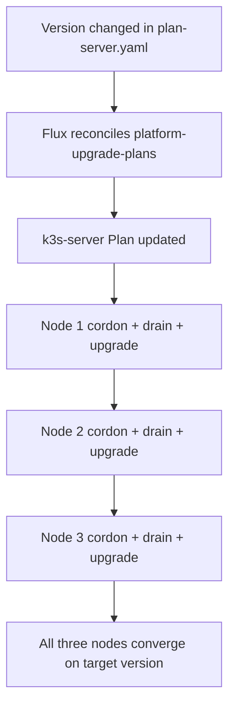

# 11 - Platform Upgrade Controller
## Automated k3s Upgrades via system-upgrade-controller

**Author:** Kagiso Tjeane
**Difficulty:** ******---- (6/10)
**Guide:** 11 of 13

> This guide covers the Rancher system-upgrade-controller used to roll k3s upgrades across the cluster.
>
> The current topology matters here:
>
> **all three nodes are k3s servers and schedulable workers.**
>
> That means the upgrade strategy is no longer "server plan first, worker plan second." Instead, the cluster now uses **one server plan targeting all three server nodes sequentially**.

---

## Table of Contents

1. [What the Controller Does](#what-the-controller-does)
2. [Why the Upgrade Model Changed](#why-the-upgrade-model-changed)
3. [Live File Layout](#live-file-layout)
4. [Controller Deployment](#controller-deployment)
5. [The Upgrade Plan](#the-upgrade-plan)
6. [How a Rolling Upgrade Proceeds](#how-a-rolling-upgrade-proceeds)
7. [Relationship to Ansible](#relationship-to-ansible)
8. [How to Trigger an Upgrade](#how-to-trigger-an-upgrade)
9. [How to Monitor and Verify](#how-to-monitor-and-verify)
10. [Rollback and Recovery](#rollback-and-recovery)
11. [Troubleshooting](#troubleshooting)
12. [Exit Criteria](#exit-criteria)

---

## What the Controller Does

k3s is a host binary, not a normal in-cluster application. That means it cannot be upgraded with a Helm chart or a plain Kubernetes manifest.

The system-upgrade-controller solves that by:

- watching `Plan` resources
- detecting nodes that are behind the target version
- cordoning and draining nodes
- running privileged upgrade jobs on those nodes
- bringing them back one at a time

In other words, it turns node upgrades into a declarative Git-driven workflow.

---

## Why the Upgrade Model Changed

Older versions of the docs assumed:

- one control-plane node
- two worker nodes
- one Plan for the server
- one Plan for the agents

That is no longer true.

The current cluster is a 3-node HA control-plane with embedded etcd, and **every node is a k3s server**:

| Node | IP | Role |
|---|---|---|
| `tywin` | `10.0.10.11` | server + workload node |
| `tyrion` | `10.0.10.12` | server + workload node |
| `jaime` | `10.0.10.13` | server + workload node |

Because all three nodes carry the control-plane label, one server plan is enough. The only thing that matters is that upgrades happen **one node at a time** so etcd quorum is preserved.

---

## Live File Layout

```text
platform/upgrade/
|-- controller.yaml
|-- kustomization.yaml
|-- rbac.yaml
`-- upgrade-plans/
    |-- kustomization.yaml
    `-- plan-server.yaml
```

Flux splits this into two Kustomizations:

| Flux Kustomization | Path | Purpose |
|---|---|---|
| `platform-upgrade` | `./platform/upgrade` | namespace, RBAC, controller deployment |
| `platform-upgrade-plans` | `./platform/upgrade/upgrade-plans` | Plan resources |

The split exists because the CRD-backed resources should only be applied after the controller and CRDs exist.

---

## Controller Deployment

The controller runs in the `system-upgrade` namespace and is deployed from `platform/upgrade/controller.yaml`.

Important characteristics:

- single replica
- scheduled onto a server node
- privileged jobs enabled
- job deadline and retry limits explicitly configured

The controller deployment still includes a control-plane toleration:

```yaml
tolerations:
  - key: node-role.kubernetes.io/control-plane
    operator: Exists
    effect: NoSchedule
```

That is safe to keep, but in the current cluster it is mainly compatibility rather than necessity because the nodes are not intentionally tainted out of workload scheduling.

---

## The Upgrade Plan

The live upgrade plan is `platform/upgrade/upgrade-plans/plan-server.yaml`.

```yaml
apiVersion: upgrade.cattle.io/v1
kind: Plan
metadata:
  name: k3s-server
  namespace: system-upgrade
spec:
  version: v1.31.4+k3s1
  nodeSelector:
    matchExpressions:
      - key: node-role.kubernetes.io/control-plane
        operator: Exists
  serviceAccountName: system-upgrade
  cordon: true
  drain:
    force: true
    skipWaitForDeleteTimeout: 60
  upgrade:
    image: rancher/k3s-upgrade
```

### What this means

| Field | Meaning |
|---|---|
| `spec.version` | target k3s version, pinned explicitly in Git |
| `nodeSelector` | targets all three server nodes |
| `cordon: true` | stop new scheduling before each node upgrade |
| `drain` | evict workloads before restarting the node |
| `upgrade.image` | official Rancher image that performs the host-level binary replacement |

### Why one plan is enough

All three nodes match `node-role.kubernetes.io/control-plane`.

The controller processes the matching nodes one at a time. That gives you:

- sequential upgrades
- preserved etcd quorum
- a simpler mental model
- no risk of server/agent plan drift in the docs

---

## How a Rolling Upgrade Proceeds



At any point during the rollout:

- one node may be unavailable
- two nodes still maintain etcd quorum
- the API remains reachable through kube-vip at `10.0.10.100`

That is the entire point of the HA redesign.

---

## Relationship to Ansible

Both tools still matter, but they solve different problems.

| Scenario | Preferred tool | Why |
|---|---|---|
| routine k3s upgrades | system-upgrade-controller | Git-driven, auditable, repeatable |
| fresh cluster installation | Ansible | cluster does not exist yet |
| break-glass recovery when the controller is unavailable | Ansible | external control path via SSH |
| node rebuild or replacement | Ansible | reprovisioning, not just version bump |

One important improvement is already in place:

> the Ansible bootstrap now pins the same k3s version family used by the upgrade plan.

That removes a major source of rebuild drift.

---

## How to Trigger an Upgrade

### 1. Check the current version

```bash
kubectl get nodes -o wide
```

Expected shape:

```text
NAME     STATUS   ROLES                  VERSION        INTERNAL-IP
tywin    Ready    control-plane,master   v1.31.4+k3s1   10.0.10.11
tyrion   Ready    control-plane,master   v1.31.4+k3s1   10.0.10.12
jaime    Ready    control-plane,master   v1.31.4+k3s1   10.0.10.13
```

### 2. Take an etcd snapshot first

```bash
/usr/local/bin/k3s-snapshot.sh
```

Never upgrade the control plane without a recent snapshot.

### 3. Edit the target version

Update:

```text
platform/upgrade/upgrade-plans/plan-server.yaml
```

Example:

```yaml
spec:
  version: v1.32.1+k3s1
```

### 4. Open the PR

```bash
git checkout -b upgrade/k3s-v1.32.1
git add platform/upgrade/upgrade-plans/plan-server.yaml
git commit -m "chore: upgrade k3s to v1.32.1+k3s1"
git push origin upgrade/k3s-v1.32.1
```

After merge, Flux reconciles the plan and the controller starts the rollout.

---

## How to Monitor and Verify

### Watch the Plan

```bash
kubectl get plans -n system-upgrade
```

### Watch upgrade jobs

```bash
kubectl get jobs -n system-upgrade --watch
```

Typical sequence:

```text
apply-k3s-server-on-tywin-xxxxx    1/1
apply-k3s-server-on-tyrion-xxxxx   1/1
apply-k3s-server-on-jaime-xxxxx    1/1
```

### Watch node status

```bash
kubectl get nodes --watch
```

You should see one node cordoned and upgraded at a time, then returned to `Ready`.

### Post-upgrade verification

```bash
kubectl get nodes -o wide
kubectl get pods -A | grep -Ev "Running|Completed|Succeeded"
flux get kustomizations
flux get helmreleases -A
```

The cluster is healthy when:

- all nodes report the same version
- no node is left in `SchedulingDisabled`
- Flux controllers and platform services are healthy

---

## Rollback and Recovery

### Git revert

If the cluster is still reachable but the new version is bad:

```bash
git revert <upgrade-commit>
git push origin main
flux reconcile kustomization platform-upgrade-plans --with-source
```

### Rebuild a node with Ansible

If a node gets stuck badly enough that the in-cluster controller cannot recover it:

```bash
ansible-playbook ansible/playbooks/lifecycle/install-cluster.yml --limit <node-name>
```

### Restore etcd if required

If control-plane state is damaged, use the etcd restore workflow from [Guide 10 - Backups & Disaster Recovery](./10-Backups-Disaster-Recovery.md).

---

## Troubleshooting

| Symptom | Likely cause | What to check |
|---|---|---|
| Plan does not react after merge | Flux has not reconciled yet | `flux reconcile kustomization platform-upgrade-plans --with-source` |
| Upgrade job never starts | controller unhealthy or selector mismatch | `kubectl get pods -n system-upgrade` and controller logs |
| Node stays `SchedulingDisabled` | job failed after cordon | inspect job logs and uncordon manually if appropriate |
| Node returns `NotReady` | k3s failed to restart | `journalctl -u k3s -n 100` on the node |
| Version skew remains | one node failed mid-rollout | watch jobs, inspect failing node, do not assume the plan completed |

Useful commands:

```bash
kubectl logs -n system-upgrade deployment/system-upgrade-controller
kubectl get jobs -n system-upgrade
kubectl get pods -n system-upgrade
```

---

## Exit Criteria

This guide is complete when:

- it is explicitly clear that all three nodes are upgraded by one server plan
- no documentation still depends on a separate worker or agent upgrade path
- k3s version changes are documented as a PR against `plan-server.yaml`
- the relationship between Flux, the upgrade controller, and Ansible is clear

---

## Navigation

| | Guide |
|---|---|
| <- Previous | [10 - Backups & Disaster Recovery](./10-Backups-Disaster-Recovery.md) |
| Current | **11 - Platform Upgrade Controller** |
| -> Next | [12 - Applications via GitOps](./12-Applications-GitOps.md) |
