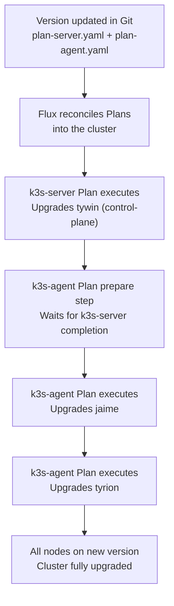

# 11 — Platform Upgrade Controller
## Automated k3s Upgrades via system-upgrade-controller

**Author:** Kagiso Tjeane
**Difficulty:** ⭐⭐⭐⭐⭐⭐☆☆☆☆ (6/10)
**Guide:** 11 of 13

> This guide covers `platform-upgrade` and `platform-upgrade-plans` — two Flux kustomizations that deploy the system-upgrade-controller and its upgrade Plan resources. `platform-upgrade` depends on `platform-networking` (Flux must be able to pull the controller image). `platform-upgrade-plans` depends on `platform-upgrade` (the CRDs must exist before Plans can be created).

---

# What Is the System Upgrade Controller?

The [system-upgrade-controller](https://github.com/rancher/system-upgrade-controller) is a Kubernetes controller built by Rancher that automates node-level upgrades. It watches for `Plan` custom resources in the cluster and, when it detects a version change, orchestrates a rolling upgrade across the targeted nodes.

In this platform, the controller manages **k3s binary upgrades** — the Kubernetes distribution itself. Without it, upgrading k3s across all nodes would require SSH access to each machine, manual drain/cordon operations, and careful sequencing to avoid downtime. The controller replaces that manual workflow with a declarative, Git-driven process.

## Why It Exists

| Problem | Solution |
|---------|----------|
| k3s runs as a host binary, not a container — it cannot be upgraded via Helm or kubectl | system-upgrade-controller runs privileged Jobs that replace the k3s binary on each node |
| Upgrading the control-plane and workers must happen in a specific order | Separate Plan resources with a `prepare` dependency enforce sequencing |
| Manual SSH upgrades are error-prone and do not fit a GitOps workflow | Plan version changes are committed to Git and reconciled by Flux |
| Nodes must be cordoned/drained before upgrade to protect running workloads | The controller handles cordon, drain, upgrade, and uncordon automatically |

---

# Architecture

## Deployed Components

The platform deploys the system-upgrade-controller through two Flux kustomizations defined in `clusters/prod/infrastructure.yaml`:

| Flux Kustomization | Path | What It Deploys | Depends On |
|---------------------|------|-----------------|------------|
| `platform-upgrade` | `./platform/upgrade` | Namespace, RBAC, Deployment | `platform-networking` |
| `platform-upgrade-plans` | `./platform/upgrade/upgrade-plans` | Plan CRDs (server + agent) | `platform-upgrade` |

The split exists for the same reason other platform components are split: the controller must be running and its CRDs must be registered before Plan resources can be applied. If both were in a single kustomization, Flux's server-side dry-run would fail because the `upgrade.cattle.io/v1` API would not yet exist.

## File Layout

```
platform/upgrade/
├── kustomization.yaml              # includes rbac.yaml + controller.yaml
├── rbac.yaml                       # ServiceAccount, ClusterRole, ClusterRoleBinding
├── controller.yaml                 # Namespace + Deployment
└── upgrade-plans/
    ├── kustomization.yaml          # includes plan-server.yaml + plan-agent.yaml
    ├── plan-server.yaml            # Plan targeting control-plane nodes
    └── plan-agent.yaml             # Plan targeting worker nodes
```

## Controller Deployment

The controller runs as a single-replica Deployment in the `system-upgrade` namespace. It is pinned to the control-plane node via a node affinity rule and tolerates the `NoSchedule` taint so it can run on `tywin`:

```yaml
affinity:
  nodeAffinity:
    requiredDuringSchedulingIgnoredDuringExecution:
      nodeSelectorTerms:
        - matchExpressions:
            - key: node-role.kubernetes.io/control-plane
              operator: Exists
tolerations:
  - key: node-role.kubernetes.io/control-plane
    operator: Exists
    effect: NoSchedule
```

**Controller image:** `rancher/system-upgrade-controller:v0.14.2`

Key environment variables:

| Variable | Value | Purpose |
|----------|-------|---------|
| `SYSTEM_UPGRADE_CONTROLLER_DEBUG` | `false` | Set to `true` for verbose logging during troubleshooting |
| `SYSTEM_UPGRADE_CONTROLLER_THREADS` | `2` | Number of worker threads processing Plans |
| `SYSTEM_UPGRADE_JOB_ACTIVE_DEADLINE_SECONDS` | `900` | Maximum time (15 min) an upgrade Job can run before being killed |
| `SYSTEM_UPGRADE_JOB_BACKOFF_LIMIT` | `99` | Number of retries if an upgrade Job fails on a node |
| `SYSTEM_UPGRADE_JOB_IMAGE_PULL_POLICY` | `Always` | Ensures the latest upgrade image is pulled each time |
| `SYSTEM_UPGRADE_JOB_KUBECTL_IMAGE` | `rancher/kubectl:v1.31.2` | kubectl image used for drain/cordon operations |
| `SYSTEM_UPGRADE_JOB_PRIVILEGED` | `true` | Upgrade Jobs run as privileged containers (required to replace the k3s binary on the host) |

## RBAC

The controller's ServiceAccount (`system-upgrade` in namespace `system-upgrade`) is bound to a ClusterRole with the following permissions:

| API Group | Resources | Verbs | Purpose |
|-----------|-----------|-------|---------|
| `upgrade.cattle.io` | `plans`, `plans/status` | full CRUD | Read and update Plan CRDs |
| (core) | `nodes` | get, list, watch, update, patch | Read node labels/taints, cordon/uncordon |
| `batch` | `jobs`, `jobs/status` | full CRUD | Create upgrade Jobs per node |
| `apps` | `daemonsets` | full CRUD | Manage drain helper DaemonSets |
| (core) | `secrets` | get, list, watch | Read the k3s server token |
| (core) | `pods` | get, list, watch, delete | Manage pods created by upgrade Jobs |
| `policy` | `poddisruptionbudgets` | get, list, watch | Respect PDBs during drain |

---

# How Upgrades Work

## The Upgrade Lifecycle

When you change the `spec.version` in a Plan resource and Flux applies it, the controller executes the following sequence for each matching node:

```
1. Detect version mismatch     Plan.spec.version != node's current k3s version
2. Cordon the node              kubectl cordon <node>  — prevents new pod scheduling
3. Drain the node (if configured)  kubectl drain <node>  — evicts running pods
4. Run upgrade Job              Privileged container replaces k3s binary on the host
5. Node restarts k3s            The new binary takes over; kubelet re-registers
6. Uncordon the node            Node returns to the scheduling pool
7. Move to next node            Controller processes the next matching node
```

The controller creates a Kubernetes **Job** for each node being upgraded. The Job runs a container from the `rancher/k3s-upgrade` image, which:

- Downloads the target k3s version
- Replaces the k3s binary at `/usr/local/bin/k3s`
- Restarts the k3s systemd service

Because the container runs privileged with the host filesystem mounted, it can modify host-level binaries directly.

---

# The k3s Upgrade Strategy

The platform uses **two separate Plan resources** to enforce upgrade ordering: the control-plane node is always upgraded before any worker node.

## Plan: k3s-server (Control-Plane)

**File:** `platform/upgrade/upgrade-plans/plan-server.yaml`

```yaml
apiVersion: upgrade.cattle.io/v1
kind: Plan
metadata:
  name: k3s-server
  namespace: system-upgrade
spec:
  version: v1.31.4+k3s1
  nodeSelector:
    matchExpressions:
      - key: node-role.kubernetes.io/control-plane
        operator: Exists
  serviceAccountName: system-upgrade
  cordon: true
  upgrade:
    image: rancher/k3s-upgrade
```

This Plan targets the control-plane node (`tywin`) by selecting nodes with the `node-role.kubernetes.io/control-plane` label. Key behaviors:

- **Version:** Pinned to `v1.31.4+k3s1` (explicit version, not a channel)
- **Cordon:** `true` — the node is cordoned before upgrade to prevent new pod scheduling
- **Drain:** Not configured on the server Plan — the control-plane node is cordoned but not drained, since draining the only control-plane node would remove critical system pods
- **Upgrade image:** `rancher/k3s-upgrade` — the official k3s upgrade container

## Plan: k3s-agent (Workers)

**File:** `platform/upgrade/upgrade-plans/plan-agent.yaml`

```yaml
apiVersion: upgrade.cattle.io/v1
kind: Plan
metadata:
  name: k3s-agent
  namespace: system-upgrade
spec:
  version: v1.31.4+k3s1
  nodeSelector:
    matchExpressions:
      - key: node-role.kubernetes.io/control-plane
        operator: DoesNotExist
  serviceAccountName: system-upgrade
  prepare:
    image: rancher/k3s-upgrade
    args:
      - prepare
      - k3s-server
  cordon: true
  drain:
    force: true
    skipWaitForDeleteTimeout: 60
  upgrade:
    image: rancher/k3s-upgrade
```

This Plan targets worker nodes (`jaime`, `tyrion`) — any node that does **not** have the control-plane label. Key behaviors:

- **Version:** Pinned to `v1.31.4+k3s1` — must always match the server Plan
- **Prepare step:** Before upgrading any worker, the controller runs a prepare container that waits for the `k3s-server` Plan to complete. This ensures the control-plane is fully upgraded before any worker begins
- **Cordon:** `true` — the worker is cordoned before upgrade
- **Drain:** Configured with `force: true` and `skipWaitForDeleteTimeout: 60` — pods are forcefully evicted, and the controller will not wait longer than 60 seconds for pods managed by a deleted controller to terminate
- **Upgrade image:** `rancher/k3s-upgrade`

## Upgrade Sequence

The combination of these two Plans produces the following deterministic upgrade order:



**Order:** tywin (control-plane) --> jaime --> tyrion

Worker nodes are upgraded one at a time because the agent Plan's default concurrency is 1 (no explicit `concurrency` field means the controller defaults to upgrading one node at a time).

---

# Plan Configuration

## Version Pinning vs. Channel Tracking

The Plans in this repository use **explicit version pinning**:

```yaml
spec:
  version: v1.31.4+k3s1
```

This means upgrades only occur when you deliberately change the version string and push to Git. The controller does not auto-upgrade.

An alternative approach is **channel tracking**, where the controller periodically polls a k3s release channel and upgrades when a new version appears:

```yaml
spec:
  channel: https://update.k3s.io/v1-release/channels/stable
```

The server Plan includes a comment showing this channel URL for reference, but it is **commented out** in favor of the pinned version. Version pinning is the correct choice for this platform because:

1. Upgrades should be deliberate and reviewed, not automatic
2. The version is tracked in Git, providing a full audit trail
3. Both Plans must specify the same version — automatic channel tracking could cause version skew if one Plan updates before the other

## Key Plan Fields

| Field | Server Plan | Agent Plan | Purpose |
|-------|-------------|------------|---------|
| `spec.version` | `v1.31.4+k3s1` | `v1.31.4+k3s1` | Target k3s version (must match) |
| `spec.nodeSelector` | `control-plane: Exists` | `control-plane: DoesNotExist` | Which nodes this Plan targets |
| `spec.cordon` | `true` | `true` | Cordon the node before upgrading |
| `spec.drain` | (not set) | `force: true` | Drain pods before upgrading (agent only) |
| `spec.prepare` | (not set) | `prepare k3s-server` | Wait for server Plan to finish first |
| `spec.upgrade.image` | `rancher/k3s-upgrade` | `rancher/k3s-upgrade` | Container that performs the binary replacement |
| `spec.serviceAccountName` | `system-upgrade` | `system-upgrade` | RBAC identity for the upgrade Jobs |

---

# Relationship to the Ansible Manual Upgrade Method

The repository provides **two** methods for upgrading k3s. They are not interchangeable — each serves a different scenario.

## When to Use Each Method

| Scenario | Method | Why |
|----------|--------|-----|
| Routine version upgrade (patch or minor) | **system-upgrade-controller** (this guide) | GitOps-native, automated, repeatable, auditable via Git history |
| Cluster rebuild from scratch | **Ansible** (`install-cluster.yml`) | The controller cannot upgrade nodes that do not exist yet |
| system-upgrade-controller is broken or unreachable | **Ansible** (`install-cluster.yml --limit <node>`) | Fallback when the controller itself is down |
| Emergency rollback on a single node | **Ansible** (SSH + manual k3s reinstall) | Faster than waiting for the controller to process a version revert |
| Initial cluster installation | **Ansible** | The controller cannot run before the cluster exists |

## How They Differ

| Aspect | system-upgrade-controller | Ansible |
|--------|---------------------------|---------|
| Trigger | Git commit (version change in Plan YAML) | Manual `ansible-playbook` command |
| Execution | Runs inside the cluster as privileged Jobs | Runs from the automation host (Raspberry Pi) via SSH |
| Version selection | Explicit `spec.version` in Plan manifest | Whatever version the `get.k3s.io` install script downloads (latest stable, unless `INSTALL_K3S_VERSION` is set) |
| Sequencing | Automatic: server first, then agents (via `prepare` step) | Manual: operator must run playbooks with `--limit` in the correct order |
| Drain/cordon | Automatic | Not included in the playbook — must be done manually |
| Audit trail | Git commit history | Ansible logs only |

> **Important:** The Ansible install playbook (`ansible/playbooks/lifecycle/install-cluster.yml`) does not pin a k3s version. It runs `curl -sfL https://get.k3s.io | sh -` without setting `INSTALL_K3S_VERSION`, which installs the latest stable release. If you use Ansible for an upgrade, verify the installed version matches what the controller's Plans expect to avoid version skew.

---

# Staging vs. Production

## Production Cluster

The production cluster (`clusters/prod/infrastructure.yaml`) includes both Flux kustomizations:

- `platform-upgrade` — deploys the controller
- `platform-upgrade-plans` — deploys the Plan resources

Upgrades in production follow the full GitOps workflow described in this guide.

## Staging Cluster

The staging cluster (`clusters/staging/infrastructure.yaml`) does **not** include `platform-upgrade` or `platform-upgrade-plans`. The system-upgrade-controller is not deployed in staging.

This means staging cluster k3s upgrades must be performed manually via Ansible or direct SSH. In a single-environment homelab this is acceptable — the production cluster is the only long-lived environment, and staging is used primarily for testing application and platform service changes, not k3s version changes.

## Recommended Upgrade Workflow

For k3s version upgrades where staging validation is desired:

```
1. Test the new k3s version on a local VM or the staging cluster (manual install)
2. Review k3s release notes for breaking changes
3. Take an etcd snapshot on the production cluster
4. Update spec.version in both Plan files
5. Commit and push to main
6. Monitor the rolling upgrade in production
7. Verify all nodes and workloads
```

---

# How to Trigger an Upgrade

## Step 1 — Check the Current Cluster Version

```bash
kubectl get nodes -o wide
```

Expected output:

```
NAME     STATUS   ROLES                  VERSION        INTERNAL-IP   OS-IMAGE
tywin    Ready    control-plane,master   v1.31.4+k3s1   10.0.10.11    Ubuntu 24.04 LTS
jaime    Ready    <none>                 v1.31.4+k3s1   10.0.10.12    Ubuntu 24.04 LTS
tyrion   Ready    <none>                 v1.31.4+k3s1   10.0.10.13    Ubuntu 24.04 LTS
```

## Step 2 — Identify the Target Version

Check the latest k3s release:

```bash
curl -s https://api.github.com/repos/k3s-io/k3s/releases/latest \
  | grep '"tag_name"'
```

Review the [k3s release notes](https://github.com/k3s-io/k3s/releases) for any breaking changes or required migration steps.

## Step 3 — Take an etcd Snapshot

**Always take a snapshot before upgrading.** This is the only way to recover if the upgrade corrupts the cluster state.

```bash
# On tywin (the control-plane node):
/usr/local/bin/k3s-snapshot.sh
```

## Step 4 — Update the Plan Manifests

Edit both Plan files to set the new version. The version **must match** in both files.

In `platform/upgrade/upgrade-plans/plan-server.yaml`:

```yaml
spec:
  version: v1.32.1+k3s1    # <-- new version
```

In `platform/upgrade/upgrade-plans/plan-agent.yaml`:

```yaml
spec:
  version: v1.32.1+k3s1    # <-- must match plan-server.yaml
```

## Step 5 — Commit and Push

```bash
git add platform/upgrade/upgrade-plans/plan-server.yaml \
        platform/upgrade/upgrade-plans/plan-agent.yaml
git commit -m "chore: upgrade k3s to v1.32.1+k3s1"
git push origin main
```

## Step 6 — Force Flux Reconciliation (Optional)

Flux polls the Git repository every hour (`interval: 1h` in the kustomization). To apply the upgrade immediately:

```bash
flux reconcile kustomization platform-upgrade-plans --with-source
```

---

# How to Monitor Upgrade Progress

## Watch the Plan Status

```bash
kubectl get plans -n system-upgrade
```

Expected output during an upgrade:

```
NAME         LATEST
k3s-server   v1.32.1+k3s1
k3s-agent    v1.32.1+k3s1
```

## Watch Upgrade Jobs

The controller creates one Job per node. Watch them appear and complete:

```bash
kubectl get jobs -n system-upgrade --watch
```

Typical progression:

```
NAME                              COMPLETIONS   DURATION   AGE
apply-k3s-server-on-tywin-xxxxx   0/1           0s         0s
apply-k3s-server-on-tywin-xxxxx   1/1           180s       3m
apply-k3s-agent-on-jaime-xxxxx    0/1           0s         0s
apply-k3s-agent-on-jaime-xxxxx    1/1           150s       2m30s
apply-k3s-agent-on-tyrion-xxxxx   0/1           0s         0s
apply-k3s-agent-on-tyrion-xxxxx   1/1           150s       2m30s
```

## Watch Upgrade Pods

```bash
kubectl get pods -n system-upgrade --watch
```

Each upgrade Job creates a pod that runs through `Pending` --> `Running` --> `Completed`.

## Watch Node Status

```bash
kubectl get nodes --watch
```

During upgrade, each node will briefly show `SchedulingDisabled` (cordoned), then return to `Ready` after the k3s binary is replaced and the service restarts.

## Check Controller Logs

If an upgrade is not progressing, inspect the controller logs:

```bash
kubectl logs -n system-upgrade deployment/system-upgrade-controller -f
```

For more verbose output, set the debug environment variable to `true` in `platform/upgrade/controller.yaml` and let Flux reconcile:

```yaml
- name: SYSTEM_UPGRADE_CONTROLLER_DEBUG
  value: "true"
```

## Expected Timeline

| Phase | Duration |
|-------|----------|
| Flux reconciliation (if forced) | 1-2 min |
| tywin (control-plane) upgrade | 3-5 min |
| jaime (worker) upgrade | 3-5 min |
| tyrion (worker) upgrade | 3-5 min |
| **Total** | **~15-25 min** |

---

# Rollback Procedures

## Option A — Revert the Version in Git

If the new version causes issues but all nodes are still reachable:

```bash
# Revert the version bump commit
git revert HEAD
git push origin main

# Force Flux to apply the revert immediately
flux reconcile kustomization platform-upgrade-plans --with-source
```

The controller will detect that the Plan version has changed back to the previous value and execute another rolling upgrade — this time "downgrading" each node to the prior k3s version using the same cordon-drain-upgrade-uncordon sequence.

## Option B — Manual k3s Reinstall on a Specific Node

If one node is stuck and the controller cannot recover it:

```bash
# SSH to the affected node (example: jaime at 10.0.10.12)
ssh kagiso@10.0.10.12

# For a worker node:
sudo systemctl stop k3s-agent
sudo /usr/local/bin/k3s-agent-uninstall.sh

# For the control-plane node (tywin):
sudo systemctl stop k3s
sudo /usr/local/bin/k3s-uninstall.sh
```

Then reinstall from the automation host:

```bash
ansible-playbook ansible/playbooks/lifecycle/install-cluster.yml --limit <node-name>
```

After reinstall, verify the node rejoined the cluster and update the Plan version in Git to match the version that is actually running.

## Option C — Restore from etcd Snapshot

If the control-plane is corrupted beyond recovery:

```bash
# On tywin:
sudo systemctl stop k3s
sudo k3s server --cluster-reset \
  --cluster-reset-restore-path=/mnt/archive/backups/k8s/etcd/<snapshot-file>
sudo systemctl start k3s
```

This restores the cluster state to the point when the snapshot was taken. See [Guide 10 — Backups & Disaster Recovery](./10-Backups-Disaster-Recovery.md) for the full etcd restore procedure.

---

# Verification Steps

After any upgrade completes, run through this checklist to confirm the cluster is healthy.

## 1. All Nodes Running the Expected Version

```bash
kubectl get nodes -o wide
```

All three nodes should show the same version in the `VERSION` column.

## 2. No Nodes Stuck in SchedulingDisabled

```bash
kubectl get nodes
```

All nodes should show `Ready` without `SchedulingDisabled`. If a node is still cordoned after upgrade:

```bash
kubectl uncordon <node-name>
```

## 3. No Pods in Error State

```bash
kubectl get pods -A | grep -Ev 'Running|Completed|Succeeded'
```

This should return no output (or only column headers). If pods are stuck, investigate with:

```bash
kubectl describe pod <pod-name> -n <namespace>
kubectl logs <pod-name> -n <namespace>
```

## 4. Flux Reconciliation Healthy

```bash
flux get kustomizations
flux get helmreleases -A
```

All entries should show `True` in the `READY` column.

## 5. Plan Objects Reflect the Current Version

```bash
kubectl get plans -n system-upgrade
```

Both Plans should show the new version and no pending upgrades.

## 6. Upgrade Jobs Completed Successfully

```bash
kubectl get jobs -n system-upgrade
```

All upgrade Jobs should show `1/1` completions. Failed or incomplete Jobs indicate a problem.

## 7. System Upgrade Controller Running

```bash
kubectl get pods -n system-upgrade
```

The `system-upgrade-controller` pod should be in `Running` state.

## 8. Application Health

Verify that workloads are serving traffic correctly:

```bash
# Check that Traefik is routing traffic
curl -s -o /dev/null -w "%{http_code}" https://status.kagiso.me

# Check Flux application kustomizations
flux get kustomizations -A | grep apps
```

---

# Troubleshooting

| Symptom | Cause | Resolution |
|---------|-------|------------|
| Plan objects not updating after `git push` | Flux has not reconciled yet | `flux reconcile kustomization platform-upgrade-plans --with-source` |
| Upgrade Job stays `Pending` for >5 minutes | Controller may not be running, or node selector mismatch | Check controller logs: `kubectl logs -n system-upgrade deployment/system-upgrade-controller` |
| Node stuck in `SchedulingDisabled` | Upgrade Job failed or is still running | Check the Job pod logs: `kubectl logs -n system-upgrade <job-pod-name>` |
| Node shows `NotReady` after upgrade | k3s service failed to start with the new binary | SSH to the node: `journalctl -u k3s -n 50` (control-plane) or `journalctl -u k3s-agent -n 50` (worker) |
| Version skew between nodes | One Plan was updated but not the other, or a Job failed | Ensure both Plan files specify the same version; check for failed Jobs |
| Control-plane upgrade fails | API server issue with new version | Immediately revert the Plan version in Git; check `journalctl -u k3s -n 50` on tywin |
| Agent Plan never starts | Prepare step is waiting for server Plan | Verify `k3s-server` Plan completed: `kubectl get plans -n system-upgrade` |
| `SYSTEM_UPGRADE_JOB_ACTIVE_DEADLINE_SECONDS` exceeded | Upgrade took longer than 900 seconds (15 min) | Check node resources and network connectivity; the Job will be retried up to 99 times (`BACKOFF_LIMIT`) |
| Controller pod is `CrashLoopBackOff` | RBAC misconfiguration or image pull failure | `kubectl describe pod -n system-upgrade <controller-pod>` and check events |

---

# Summary

The system-upgrade-controller transforms k3s upgrades from a manual, SSH-based operation into a GitOps-native workflow. Changing a version string in two YAML files and pushing to Git triggers a fully automated, correctly sequenced rolling upgrade across the entire cluster.

The controller handles cordon, drain, binary replacement, and uncordon for each node. The server Plan upgrades the control-plane first; the agent Plan waits for the server Plan to complete before touching any worker. Version pinning ensures upgrades are deliberate and auditable.

For routine upgrades, this is the preferred method. Ansible remains available as a fallback for cluster rebuilds, emergency recovery, and situations where the controller itself is unavailable.

**Related resources:**

- Runbook: `docs/operations/runbooks/k3s-upgrade.md`
- Platform Operations: [Guide 13 — Platform Operations & Lifecycle Management](./13-Platform-Operations-Lifecycle.md)
- Backup & Recovery: [Guide 10 — Backups & Disaster Recovery](./10-Backups-Disaster-Recovery.md)

---

## Navigation

| | Guide |
|---|---|
| ← Previous | [10 — Backups & Disaster Recovery](./10-Backups-Disaster-Recovery.md) |
| Current | **11 — Platform Upgrade Controller** |
| → Next | [12 — Applications via GitOps](./12-Applications-GitOps.md) |
