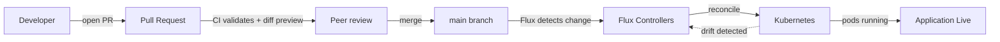
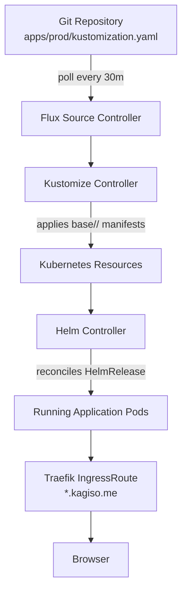
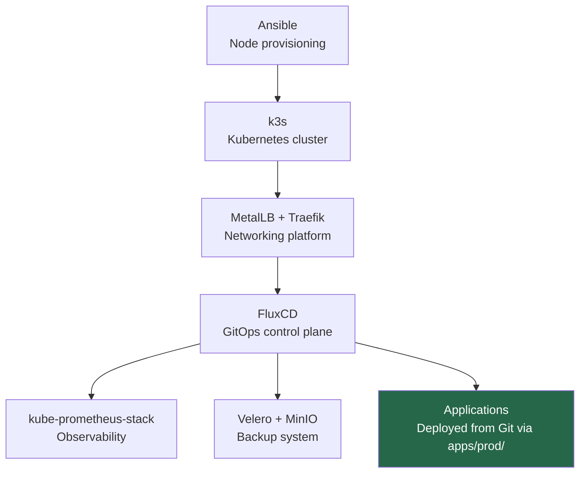

# 12 — Applications via GitOps
## Deploying Workloads the Platform Engineering Way

**Author:** Kagiso Tjeane
**Difficulty:** ⭐⭐⭐⭐⭐⭐⭐⭐☆☆ (8/10)
**Guide:** 12 of 13

> The final step in building the platform is enabling **application delivery**.
>
> Up to this point we have built the foundations:
>
> - hardened nodes
> - Kubernetes cluster
> - networking platform
> - GitOps control plane
> - namespaces and scheduling rules
> - monitoring and observability
> - backup and disaster recovery
>
> The cluster is now **a platform**.
>
> This chapter explains how applications are deployed **safely, reproducibly, and declaratively** using Flux — and how to add new applications to the platform.

---

# The GitOps Application Model

In traditional Kubernetes environments applications are deployed manually:

```bash
kubectl apply -f deployment.yaml
```

While simple, this creates problems over time:

- configuration drift
- undocumented changes
- no peer review before deployment
- difficult rollbacks

GitOps solves these problems by making **Git the single source of truth**. Every change to an application — new deployment, config update, image bump — goes through a pull request. Flux watches the `main` branch and applies changes to the cluster automatically after merge.



The cluster continuously synchronizes itself with the repository. If someone deletes a resource manually with `kubectl delete`, Flux recreates it on the next reconciliation cycle. Git is always authoritative.

---

# Repository Layout for Applications

Applications live inside the `apps/` directory at the root of the repository. The structure separates reusable base definitions from the production-specific list of what to deploy:

```
apps/
├── base/
│   ├── grafana/          # IngressRoute for Grafana (deployed by kube-prometheus-stack)
│   ├── nextcloud/        # HelmRelease, HelmRepository, IngressRoute, SOPS Secret
│   ├── immich/           # HelmRelease, HelmRepository, IngressRoute, PVC, SOPS Secret
│   └── n8n/              # HelmRelease, HelmRepository, IngressRoute, SOPS Secret
└── prod/
    └── kustomization.yaml   ← lists every app to deploy to the production cluster
```

`apps/base/<app>/` contains all Kubernetes manifests for an application. Each directory has its own `kustomization.yaml` that lists its resources.

`apps/prod/kustomization.yaml` is the single file that controls which applications are active. It references each app's base directory:

```yaml
# apps/prod/kustomization.yaml
apiVersion: kustomize.config.k8s.io/v1beta1
kind: Kustomization
resources:
  - ../base/grafana
  - ../base/nextcloud
  - ../base/immich
  - ../base/n8n
```

Flux reconciles `apps/prod/` as a single kustomization named `apps`. To deploy a new application, you add its base directory to this file. To remove an application from the cluster, you remove it from this file and merge the change.

---

# How Flux Delivers Applications

Flux watches the repository via a `GitRepository` source and a `Kustomization` that points at `apps/prod/`:



Most applications are delivered as **HelmReleases** — Flux instructs the Helm Controller to install or upgrade a chart when the HelmRelease resource changes. A few applications (like Grafana's IngressRoute) are raw manifests applied directly by the Kustomize Controller.

---

# Helm vs. Raw Manifests

## Raw Kubernetes Manifests

Appropriate when:

- The application is simple and community charts add more complexity than they remove
- You need precise control over every resource
- No Helm chart exists for the application

A raw manifest app directory looks like:

```
apps/base/myapp/
├── kustomization.yaml
├── namespace.yaml
├── deployment.yaml
├── service.yaml
└── ingressroute.yaml
```

## HelmRelease (Recommended for Most Apps)

Helm packages applications into versioned, community-maintained charts. Flux's Helm Controller manages the full install/upgrade/rollback lifecycle through a `HelmRelease` custom resource.

A HelmRelease app directory looks like:

```
apps/base/myapp/
├── kustomization.yaml
├── helmrepository.yaml   # tells Flux where to find the chart
├── helmrelease.yaml      # declares chart version + values
├── ingressroute.yaml
└── secret.yaml           # SOPS-encrypted secrets (if needed)
```

Advantages:

- Versioned, upgradeable packages with a single field change
- Community-maintained charts with tested defaults
- Remediation built-in: Flux retries failed installs and rolls back failed upgrades automatically

---

# HelmRelease Structure

Every HelmRelease in this repository follows the same pattern. Here is the Nextcloud HelmRelease annotated:

```yaml
apiVersion: helm.toolkit.fluxcd.io/v2
kind: HelmRelease
metadata:
  name: nextcloud
  namespace: apps
spec:
  interval: 30m              # how often Flux checks the chart for updates
  chart:
    spec:
      chart: nextcloud
      version: ">=4.0.0"     # semver constraint — picks the latest matching release
      sourceRef:
        kind: HelmRepository
        name: nextcloud        # must match a HelmRepository resource in flux-system
        namespace: flux-system
      interval: 24h           # how often Flux polls the Helm registry for new chart versions
  timeout: 15m                # max time for install/upgrade before Flux declares failure
  install:
    remediation:
      retries: 3              # retry failed installs up to 3 times before giving up
  upgrade:
    cleanupOnFail: true       # delete failed upgrade resources before retrying
    remediation:
      strategy: rollback      # on upgrade failure, roll back to the previous release
      retries: 3

  # Inject secrets as Helm values — keeps credentials out of this file.
  # Each valuesFrom entry reads one key from a Kubernetes Secret and passes
  # it as a dot-notation Helm value path.
  valuesFrom:
    - kind: Secret
      name: nextcloud-secret
      valuesKey: admin-password
      targetPath: nextcloud.password

  values:
    nextcloud:
      host: cloud.kagiso.me
    ingress:
      enabled: false          # always false — Traefik IngressRoute is used instead
```

Key conventions:

- **`version: ">=4.0.0"`** — semver constraint, not a pinned version. Flux picks the latest chart version matching the constraint whenever the chart is refreshed (every 24h per `interval`). Pin to an exact version (`version: "4.6.1"`) if you need to prevent automatic minor/patch upgrades.
- **`ingress.enabled: false`** — all applications disable the chart's built-in Ingress. Traefik `IngressRoute` resources are used instead, giving consistent TLS handling via the wildcard cert.
- **`valuesFrom`** — secrets are never inlined in `values`. They are injected via `valuesFrom` references to SOPS-encrypted `Secret` resources.

---

# IngressRoute Pattern

Every application that serves HTTP traffic gets a `Traefik IngressRoute` resource. The pattern is identical across all apps:

```yaml
apiVersion: traefik.io/v1alpha1
kind: IngressRoute
metadata:
  name: myapp
  namespace: apps
spec:
  entryPoints:
    - websecure            # HTTPS only (port 443)
  routes:
    - match: Host(`myapp.kagiso.me`)
      kind: Rule
      services:
        - name: myapp      # must match the Kubernetes Service name
          port: 8080       # the Service port
  tls: {}                  # uses wildcard-kagiso-me-tls from Traefik default TLSStore
```

The `tls: {}` field is all that is required. Traefik's `TLSStore` is configured to serve the `*.kagiso.me` wildcard certificate automatically on all `websecure` IngressRoutes. No per-application `Certificate` resource is needed.

Traffic flow from browser to pod:

```
Browser (HTTPS)
      │
      ▼
DNS: myapp.kagiso.me → 10.0.10.110 (MetalLB VIP)
      │
      ▼
Traefik (websecure entrypoint, wildcard TLS)
      │
      ▼
Kubernetes Service (myapp.apps.svc.cluster.local)
      │
      ▼
Application Pod
```

---

# TLS — Wildcard Certificate

TLS certificates are issued automatically by **cert-manager** using a single wildcard certificate (`*.kagiso.me`) stored in the `ingress` namespace as `wildcard-kagiso-me-tls`. Traefik's `TLSStore` is configured to use this as the default certificate for all `websecure` entry points.

**No per-service Certificate resource is needed.** Applications use TLS by adding `tls: {}` to their IngressRoute — Traefik serves the wildcard cert automatically.

Certificate lifecycle (one-time, managed by cert-manager):

```
cert-manager requests *.kagiso.me from Let's Encrypt
      │
      ▼
DNS-01 challenge: cert-manager writes TXT record to Cloudflare
      │
      ▼
Let's Encrypt validates record (~30–120 seconds)
      │
      ▼
wildcard-kagiso-me-tls Secret created in ingress namespace
      │
      ▼
Traefik TLSStore serves it to all [websecure] IngressRoutes
```

cert-manager renews the wildcard cert automatically before expiration (typically 60 days before the cert expires).

---

# SOPS Secrets Pattern

Applications that need credentials (database passwords, API keys, OIDC client secrets) use **SOPS-encrypted Kubernetes Secrets**. The encrypted file is committed to Git. Flux decrypts it at apply time using the cluster's age key.

Example: `apps/base/nextcloud/secret.yaml` (as it appears in Git — encrypted):

```yaml
apiVersion: v1
kind: Secret
metadata:
  name: nextcloud-secret
  namespace: apps
type: Opaque
stringData:
  admin-password: ENC[AES256_GCM,data:...,type:str]
  postgresql-password: ENC[AES256_GCM,data:...,type:str]
  redis-password: ENC[AES256_GCM,data:...,type:str]
  smtp-password: ENC[AES256_GCM,data:...,type:str]
  oidc-client-id: ENC[AES256_GCM,data:...,type:str]
  oidc-client-secret: ENC[AES256_GCM,data:...,type:str]
sops:
  age:
    - recipient: age12c5gj3na6wvwxsmqav9f0x8cg6cycpaas036uy9vyr7jq4uyduhstcvlqe
      enc: |
        -----BEGIN AGE ENCRYPTED FILE-----
        ...
        -----END AGE ENCRYPTED FILE-----
```

To create or update a secret:

```bash
# Encrypt a new secret file
sops --encrypt --age <recipient-public-key> \
  apps/base/myapp/secret.yaml > apps/base/myapp/secret.yaml.enc
mv apps/base/myapp/secret.yaml.enc apps/base/myapp/secret.yaml

# Edit an existing encrypted secret
sops apps/base/myapp/secret.yaml
```

The HelmRelease then injects specific keys from the Secret as Helm values using `valuesFrom`, or they are mounted as environment variables via `extraEnv` / `secretKeyRef` references.

---

# The Nextcloud occ Init Job

Nextcloud requires a one-time post-deploy step to enable the `oidc_login` app. Without it, the OIDC configuration in `z-oidc.config.php` is loaded but the login button never appears.

The `oidc_login` app is enabled by running `occ app:enable oidc_login` inside the Nextcloud container. This is implemented as a **Kubernetes Job** that runs once after the HelmRelease is deployed.

## Why a Job (Not a Hook)

Helm post-install hooks require the chart to support them. The upstream Nextcloud chart does not include a hook for running arbitrary `occ` commands. A separate Kubernetes Job managed by Flux gives the same result without modifying the chart.

## What the Job Does

```yaml
apiVersion: batch/v1
kind: Job
metadata:
  name: nextcloud-enable-oidc
  namespace: apps
  annotations:
    # Flux applies this Job once. To re-run it, delete the completed Job
    # and let Flux reconcile: kubectl delete job nextcloud-enable-oidc -n apps
spec:
  template:
    spec:
      restartPolicy: OnFailure
      containers:
        - name: occ
          image: nextcloud:latest   # must match the deployed Nextcloud image tag
          command:
            - php
            - /var/www/html/occ
            - app:enable
            - oidc_login
          volumeMounts:
            - name: nextcloud-data
              mountPath: /var/www/html
      volumes:
        - name: nextcloud-data
          persistentVolumeClaim:
            claimName: nextcloud-nextcloud-data   # chart-generated PVC name
```

## Running the Job

The Job is included in `apps/base/nextcloud/kustomization.yaml` and is applied by Flux as part of the Nextcloud kustomization. It runs automatically after the first deploy.

If the `oidc_login` app is already enabled, the `occ app:enable` command is idempotent — it exits successfully without error.

To manually trigger the Job (for example, after a cluster rebuild):

```bash
# Delete the completed Job to allow Flux to recreate it
kubectl delete job nextcloud-enable-oidc -n apps

# Force Flux to reconcile the apps kustomization
flux reconcile kustomization apps --with-source
```

## Verifying the App Is Enabled

```bash
kubectl exec -n apps deploy/nextcloud-nextcloud -- \
  php /var/www/html/occ app:list | grep oidc_login
```

Expected output:

```
  - oidc_login: 5.x.x
```

If it appears under the `Enabled` section, OIDC login is active.

---

# Deployed Applications

## Grafana

**Directory:** `apps/base/grafana/`

Grafana is deployed by the `kube-prometheus-stack` HelmRelease (under `platform/`). The `apps/base/grafana/` directory contains only a `Traefik IngressRoute` — it routes traffic to the Service that the platform stack already created.

| Resource | File |
|----------|------|
| IngressRoute | `ingressroute.yaml` |

URL: `https://grafana.kagiso.me`

## Nextcloud

**Directory:** `apps/base/nextcloud/`

Self-hosted file sync and collaboration platform. Deployed via the upstream `nextcloud/nextcloud` Helm chart. Uses the shared central PostgreSQL instance (`postgresql.databases.svc.cluster.local`) and shared Redis (`redis-master.databases.svc.cluster.local`, dbindex 1).

| Resource | File |
|----------|------|
| HelmRepository | `helmrepository.yaml` |
| HelmRelease | `helmrelease.yaml` |
| IngressRoute | `ingressroute.yaml` |
| SOPS Secret | `secret.yaml` |

URL: `https://cloud.kagiso.me`

Notable configuration:

- OIDC login via Authentik (`oidc_login` app, requires the occ init Job described above)
- Reverse-proxy config for Traefik (`overwriteprotocol: https`, trusted proxies: `10.42.0.0/16`)
- NFS persistence via `storageClass: nfs-truenas`

## Immich

**Directory:** `apps/base/immich/`

Self-hosted photo and video management. Deployed via the `immich-app/immich` Helm chart. Uses the shared PostgreSQL instance (dbname `immich`) and shared Redis (dbindex 2).

| Resource | File |
|----------|------|
| HelmRepository | `helmrepository.yaml` |
| HelmRelease | `helmrelease.yaml` |
| IngressRoute | `ingressroute.yaml` |
| PVC | `pvc.yaml` |
| SOPS Secret | `secret.yaml` |

URL: `https://photos.kagiso.me`

Notable configuration:

- Machine learning enabled (CPU-only, face recognition and CLIP smart search)
- Photo library stored on NFS (`immich-library-pvc`, bound to `storageClass: nfs-truenas`)
- Bundled Valkey (Redis-compatible) disabled in favor of shared Redis

## n8n

**Directory:** `apps/base/n8n/`

Workflow automation platform. Deployed via the `community-charts/n8n` Helm chart. Uses the shared PostgreSQL instance (dbname `n8n`) and shared Redis (dbindex 3). Runs in queue mode with a dedicated worker.

| Resource | File |
|----------|------|
| HelmRepository | `helmrepository.yaml` |
| HelmRelease | `helmrelease.yaml` |
| IngressRoute | `ingressroute.yaml` |
| SOPS Secret | `secret.yaml` |

URL: `https://n8n.kagiso.me`

Notable configuration:

- Encryption key managed via SOPS secret — **never change this after first deploy**, as it invalidates all stored credentials
- Queue mode enabled (`worker.mode: queue`) — main process and worker run as separate pods
- Workflow data persisted to NFS (`storageClass: nfs-truenas`)

---

# How to Add a New Application

Adding a new application to the platform is a four-step process that goes through the standard PR workflow.

## Step 1 — Create the App Directory Under `apps/base/`

```bash
mkdir apps/base/myapp
```

At minimum, create:

```
apps/base/myapp/
├── kustomization.yaml     # required — lists all resources in this directory
├── helmrepository.yaml    # if deploying via Helm
├── helmrelease.yaml       # if deploying via Helm
├── ingressroute.yaml      # if the app serves HTTP traffic
└── secret.yaml            # SOPS-encrypted, if the app needs credentials
```

### kustomization.yaml

```yaml
apiVersion: kustomize.config.k8s.io/v1beta1
kind: Kustomization
resources:
  - helmrepository.yaml
  - helmrelease.yaml
  - ingressroute.yaml
  - secret.yaml            # include only if it exists
```

### helmrepository.yaml

```yaml
apiVersion: source.toolkit.fluxcd.io/v1
kind: HelmRepository
metadata:
  name: myapp-repo
  namespace: flux-system
spec:
  interval: 24h
  url: https://charts.example.com
```

### helmrelease.yaml

```yaml
apiVersion: helm.toolkit.fluxcd.io/v2
kind: HelmRelease
metadata:
  name: myapp
  namespace: apps
spec:
  interval: 30m
  chart:
    spec:
      chart: myapp
      version: ">=1.0.0"
      sourceRef:
        kind: HelmRepository
        name: myapp-repo
        namespace: flux-system
      interval: 24h
  timeout: 10m
  install:
    remediation:
      retries: 3
  upgrade:
    cleanupOnFail: true
    remediation:
      strategy: rollback
      retries: 3
  values:
    ingress:
      enabled: false    # always disable built-in ingress
    # ... app-specific values
```

### ingressroute.yaml

```yaml
apiVersion: traefik.io/v1alpha1
kind: IngressRoute
metadata:
  name: myapp
  namespace: apps
spec:
  entryPoints:
    - websecure
  routes:
    - match: Host(`myapp.kagiso.me`)
      kind: Rule
      services:
        - name: myapp
          port: 8080
  tls: {}
```

### secret.yaml (if credentials are needed)

Create the plaintext secret, then encrypt it with SOPS before committing:

```bash
# Create the plaintext file (never commit this)
cat > /tmp/secret.yaml <<EOF
apiVersion: v1
kind: Secret
metadata:
  name: myapp-secret
  namespace: apps
type: Opaque
stringData:
  api-key: supersecret
EOF

# Encrypt it into the repo
sops --encrypt --age age12c5gj3na6wvwxsmqav9f0x8cg6cycpaas036uy9vyr7jq4uyduhstcvlqe \
  /tmp/secret.yaml > apps/base/myapp/secret.yaml
```

## Step 2 — Add the App to `apps/prod/kustomization.yaml`

```yaml
# apps/prod/kustomization.yaml
apiVersion: kustomize.config.k8s.io/v1beta1
kind: Kustomization
resources:
  - ../base/grafana
  - ../base/nextcloud
  - ../base/immich
  - ../base/n8n
  - ../base/myapp    # <-- add this line
```

## Step 3 — Open a Pull Request

```bash
git checkout -b feat/add-myapp
git add apps/base/myapp/ apps/prod/kustomization.yaml
git commit -m "feat(apps): add myapp"
git push origin feat/add-myapp
```

Open a pull request against `main`. The CI pipeline runs automatically:

1. **kubeconform** validates all YAML files against Kubernetes schemas
2. **kustomize build** confirms the overlay renders without errors
3. **flux-local diff** posts a comment showing exactly what resources will be created in the cluster

Review the diff comment to confirm the resources look correct before merging.

## Step 4 — Merge and Verify

After the PR is approved and merged to `main`, Flux reconciles the `apps` kustomization and applies the new resources. Monitor the deployment:

```bash
# Watch Flux apply the new app kustomization
flux get kustomization apps --watch

# Watch the HelmRelease install
flux get helmrelease myapp -n apps --watch

# Watch pods come up
kubectl get pods -n apps --watch
```

A successful deployment shows the HelmRelease `READY: True` and all pods in `Running` state.

If the deployment fails, Flux applies the configured remediation strategy (`rollback` on upgrade failure, `retries: 3` on install failure). Check the HelmRelease status for the error:

```bash
kubectl describe helmrelease myapp -n apps
flux logs --follow --level=error
```

---

# Rollbacks

Because every change goes through Git, rollback is a `git revert`:

```bash
# Revert the last commit (the app deployment)
git revert HEAD
git push origin main
```

Flux detects the revert, reconciles the cluster back to the previous state, and the HelmRelease downgrades or removes the application. No manual `helm rollback` or `kubectl delete` commands are needed.

For a faster rollback without waiting for Flux's poll interval:

```bash
git revert HEAD
git push origin main
flux reconcile kustomization apps --with-source
```

---

# Observing Application Health

## Flux Status

```bash
# Check the top-level apps kustomization
flux get kustomization apps

# Check a specific app's HelmRelease
flux get helmrelease nextcloud -n apps
flux get helmrelease immich -n apps
```

## Pod Health

```bash
# All pods in the apps namespace
kubectl get pods -n apps

# Describe a pod for scheduling/probe failures
kubectl describe pod <pod-name> -n apps

# Logs from a running pod
kubectl logs <pod-name> -n apps

# Logs from a crashed pod
kubectl logs <pod-name> -n apps --previous
```

## Grafana Dashboards

The kube-prometheus-stack scrapes all namespaces by default. Application pods that expose a `/metrics` endpoint will be scraped automatically if a `ServiceMonitor` is included in the HelmRelease values (for example, `metrics.serviceMonitor.enabled: true` in the Nextcloud chart).

Available dashboards relevant to applications:

- **Kubernetes / Pods** — CPU, memory, restart count per pod
- **Kubernetes / Persistent Volumes** — PVC usage and status
- **Nginx/Nextcloud Exporter** — if the app exports custom metrics

---

# Platform Delivery Pipeline

The full platform lifecycle now looks like this:



The platform is fully automated from node provisioning through application delivery.

---

# Exit Criteria

Application delivery is considered operational when:

- All applications in `apps/prod/kustomization.yaml` have `HelmRelease READY: True`
- All pods in the `apps` namespace are `Running`
- Traefik is routing traffic to each application
- TLS certificates are valid (Traefik serves the wildcard cert)
- Grafana dashboards show healthy metrics for deployed applications
- The Nextcloud `oidc_login` app is enabled (for the first deploy)

At this point the platform is **fully operational**.

---

## Navigation

| | Guide |
|---|---|
| ← Previous | [11 — Platform Upgrade Controller](./11-Platform-Upgrade-Controller.md) |
| Current | **12 — Applications via GitOps** |
| → Next | [13 — Platform Operations & Lifecycle](./13-Platform-Operations-Lifecycle.md) |
