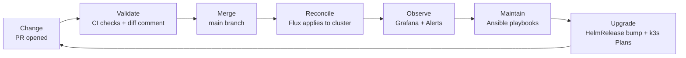
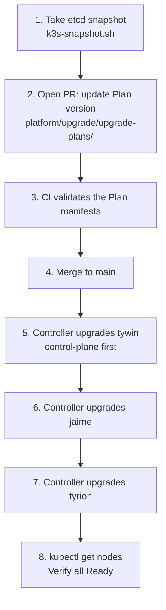

# 13 — Platform Operations & Lifecycle Management
## Running the Platform Day-to-Day

**Author:** Kagiso Tjeane
**Difficulty:** ⭐⭐⭐⭐⭐⭐⭐⭐☆☆ (8/10)
**Guide:** 13 of 13

> Building a Kubernetes platform is only half the work.
> Operating it reliably over time is where real platform engineering begins.
>
> This chapter documents day-to-day operational lifecycle management:
>
> - making changes safely through the PR workflow
> - cluster upgrades
> - node maintenance
> - platform component upgrades
> - incident response
> - routine operational checks

This guide aligns with the **Ansible playbooks present in the repository**, ensuring that routine operations remain repeatable and automated.

---

# The Platform Lifecycle

Once the platform is live, it enters a continuous operational cycle.



The goal is to keep the cluster:

- stable
- secure
- up to date
- fully observable

---

# Operational Responsibilities

| Layer | Responsibility | Primary Tool |
|-------|---------------|--------------|
| Infrastructure | node reboots, OS patching | Ansible |
| Kubernetes | k3s version upgrades | system-upgrade-controller (via Git PR) |
| Platform services | Traefik, cert-manager, monitoring upgrades | Flux (HelmRelease version bump via PR) |
| Applications | deployment and scaling | Flux (Git PR → merge → reconcile) |
| Backups | daily etcd snapshots, Velero schedules | cron + Velero |
| Secrets | key rotation, re-encryption | SOPS + age |

---

# Making a Change

All changes to the cluster go through the same workflow. There are no special paths for "emergency" pushes directly to `main` — direct pushes bypass CI validation and the diff preview, increasing the risk of deploying broken manifests.

## The Standard Workflow

```
1. Create a feature branch
2. Make changes to the appropriate YAML files
3. Push the branch and open a PR against main
4. CI runs automatically:
   - kubeconform validates all manifests against Kubernetes schemas
   - kustomize build confirms the overlay renders without errors
   - flux-local diff posts a comment showing what resources will change in the cluster
5. Review the diff comment — verify the changes look exactly as expected
6. Merge the PR
7. Flux detects the new commit on main and reconciles the cluster (within the poll interval, or immediately if forced)
8. Post-merge: verify Flux kustomizations are Ready and pods are healthy
```

## Step-by-Step

```bash
# 1. Create a branch
git checkout -b feat/upgrade-traefik

# 2. Make the change
# (edit platform/networking/traefik/helmrelease.yaml, apps/prod/kustomization.yaml, etc.)

# 3. Commit and push
git add -p
git commit -m "chore: upgrade Traefik to 28.0.0"
git push origin feat/upgrade-traefik

# 4. Open a PR on GitHub and wait for CI checks to pass
# 5. Review the flux-local diff comment on the PR
# 6. Merge the PR

# 7. (Optional) Force Flux to reconcile immediately after merge
flux reconcile source git flux-system -n flux-system
flux reconcile kustomization platform-networking --with-source

# 8. Verify
flux get kustomizations
kubectl get pods -n ingress
```

## Forcing Flux Reconciliation

By default, Flux polls the Git source every hour. After merging a PR, you can force an immediate reconciliation:

```bash
# Force the source controller to pull from Git
flux reconcile source git flux-system -n flux-system

# Then reconcile a specific kustomization
flux reconcile kustomization apps --with-source
flux reconcile kustomization platform-networking --with-source
```

---

# Routine Operational Checks

Run these checks periodically (recommended: daily, via Grafana or cron).

```bash
# Cluster node health
kubectl get nodes

# Non-running pods across all namespaces
kubectl get pods -A | grep -Ev 'Running|Completed'

# Flux reconciliation status
flux get kustomizations
flux get helmreleases -A

# Recent cluster events (last 30)
kubectl get events -A --sort-by='.lastTimestamp' | tail -30

# Backup health
ls -lht /mnt/backups/etcd/ | head -5
velero backup get | head -10
```

All of these checks are visible in Grafana when the monitoring stack is healthy.

---

# Node Maintenance with Ansible

The repository contains Ansible playbooks for all node operations.

```
ansible/playbooks/maintenance/
├── reboot-nodes.yml
└── upgrade-nodes.yml
```

Always run maintenance playbooks from the automation host (`bran`, 10.0.10.10) with the kubeconfig present.

---

# Rebooting Nodes Safely

**Never reboot a node without draining it first.** Draining ensures running pods migrate before the node goes offline.

The reboot playbook handles the full sequence:

```bash
ansible-playbook ansible/playbooks/maintenance/reboot-nodes.yml
```

What the playbook does:

```
1. cordon node          (prevents new pod scheduling)
2. drain workloads      (evicts running pods gracefully)
3. reboot node
4. wait for node Ready  (polls until kubelet re-registers)
5. uncordon node        (returns node to scheduling pool)
```

To reboot a single node:

```bash
ansible-playbook ansible/playbooks/maintenance/reboot-nodes.yml --limit jaime
```

Verify after:

```bash
kubectl get nodes
```

---

# OS Package Upgrades

OS packages must be kept current for security. Run:

```bash
ansible-playbook ansible/playbooks/maintenance/upgrade-nodes.yml
```

Always upgrade **one node at a time** in this cluster. This prevents all workers from being unavailable simultaneously.

For worker nodes this is low-risk. The control-plane node (`tywin`) requires more care — ensure all workers are healthy before upgrading it.

---

# Upgrading k3s

k3s upgrades require care. With an embedded etcd datastore, the control-plane node is the most critical.

## Recommended Approach: System Upgrade Controller

The preferred method is the **k3s System Upgrade Controller**, which performs rolling upgrades via Kubernetes `Plan` resources. This is deployed through Flux under `platform/upgrade/`. See [Guide 11 — Platform Upgrade Controller](./11-Platform-Upgrade-Controller.md) for full detail.



Trigger an upgrade by opening a PR that sets the new version in both Plan files:

```yaml
# platform/upgrade/upgrade-plans/plan-server.yaml
spec:
  version: v1.32.1+k3s1

# platform/upgrade/upgrade-plans/plan-agent.yaml
spec:
  version: v1.32.1+k3s1   # must match plan-server.yaml exactly
```

Commit the change to a branch, open the PR, merge after CI passes. Flux reconciles the Plans. The controller upgrades the control-plane first, then workers sequentially.

## Manual Upgrade (if system-upgrade-controller is unavailable)

```bash
# Step 1 — upgrade control-plane
ansible-playbook ansible/playbooks/lifecycle/install-cluster.yml --limit tywin

# Step 2 — verify control-plane is healthy
kubectl get nodes
kubectl get pods -A | grep -v Running | grep -v Completed

# Step 3 — upgrade workers one at a time
ansible-playbook ansible/playbooks/lifecycle/install-cluster.yml --limit jaime
kubectl wait --for=condition=Ready node/jaime --timeout=120s

ansible-playbook ansible/playbooks/lifecycle/install-cluster.yml --limit tyrion
kubectl wait --for=condition=Ready node/tyrion --timeout=120s
```

**Always take an etcd snapshot before any k3s upgrade:**

```bash
/usr/local/bin/k3s-snapshot.sh
```

---

# Upgrading Platform Components via GitOps

All platform components managed by Flux (Traefik, cert-manager, Prometheus, Loki, Velero) are upgraded by changing their chart version in a PR.

Example: upgrading Traefik from `27.0.2` to `28.0.0`:

```yaml
# platform/networking/traefik/helmrelease.yaml
spec:
  chart:
    spec:
      chart: traefik
      version: "28.0.0"   # changed from 27.0.2
```

```bash
git checkout -b chore/upgrade-traefik-28
git add platform/networking/traefik/helmrelease.yaml
git commit -m "chore: upgrade Traefik to 28.0.0"
git push origin chore/upgrade-traefik-28
```

Open a PR. CI validates the manifest. The flux-local diff comment shows the HelmRelease change. After review, merge to `main`. Flux reconciles the upgrade.

Monitor progress:

```bash
flux get helmreleases -A --watch
```

Rollback if needed:

```bash
git revert HEAD
git push origin main
flux reconcile kustomization platform-networking --with-source
```

---

# Scaling the Cluster

To add a worker node:

```
1. Provision new machine with Ubuntu Server
2. Update ansible/inventory/homelab.yml to add the new node
3. Run node preparation playbooks:
   ansible-playbook ansible/playbooks/security/disable-swap.yml --limit new-node
   ansible-playbook ansible/playbooks/security/firewall.yml --limit new-node
   ansible-playbook ansible/playbooks/security/ssh-hardening.yml --limit new-node
   ansible-playbook ansible/playbooks/security/time-sync.yml --limit new-node
   ansible-playbook ansible/playbooks/security/fail2ban.yml --limit new-node
4. Join the node:
   ansible-playbook ansible/playbooks/lifecycle/install-cluster.yml --limit new-node
5. Verify:
   kubectl get nodes
```

The scheduler automatically begins placing workloads on the new node.

---

# Incident Response — Structured Triage

When something breaks, structured triage finds the root cause faster than guessing.

## Step 1 — Establish cluster health baseline (30 seconds)

```bash
kubectl get nodes
kubectl get pods -A | grep -Ev 'Running|Completed'
flux get kustomizations
```

Interpretation:

- Node shows `NotReady` → check kubelet on the node: `ssh kagiso@<node-ip>` then `journalctl -u k3s -f`
- Flux reports `False` reconciliation → check the commit history and Flux logs
- Pods in `CrashLoopBackOff` → proceed to Step 3

## Step 2 — Scope the impact

```bash
kubectl get events -A --sort-by='.lastTimestamp' | tail -30
```

Events are often the fastest path to root cause. Look for `Failed`, `OOMKilled`, `BackOff`, or `Unhealthy` reasons.

## Step 3 — Inspect affected workloads

```bash
# Scheduling failures, OOMKilled, image pull errors
kubectl describe pod <pod-name> -n <namespace>

# Logs from the current container instance
kubectl logs <pod-name> -n <namespace>

# Logs from the previous (crashed) container instance
kubectl logs <pod-name> -n <namespace> --previous
```

## Step 4 — Check infrastructure components

```bash
kubectl get pods -n flux-system          # GitOps controllers
kubectl get pods -n ingress              # Traefik
kubectl get pods -n monitoring           # Prometheus / Grafana / Loki
kubectl get pods -n cert-manager         # Certificate controller
kubectl get pods -n metallb-system       # Load balancer
kubectl get pods -n velero               # Backup controller
```

If the monitoring stack is healthy, **Grafana dashboards are your first stop** — the alert that fired points directly at the affected component.

## Step 5 — Check Flux reconciliation errors

```bash
flux get all -A
flux logs --follow --level=error
```

---

# Common Operational Incidents

> Runbooks at `docs/operations/runbooks/` are living documents — use the first-check
> commands below until they are written. See
> [Guide 09 — Monitoring & Observability](./09-Monitoring-Observability.md#13-alert-response-runbooks)
> for additional inline guidance per alert type.

| Incident | First Check |
|----------|-------------|
| Pod in CrashLoopBackOff | `kubectl logs -n <ns> <pod> --previous` |
| Node shows NotReady | `kubectl describe node <node>` + `journalctl -u k3s` on the node |
| Certificate expired / pending | `kubectl describe certificate -n ingress` + `kubectl get challenges -A` |
| Disk pressure on node | `df -h` on the node + `kubectl get pvc -A` |
| High memory / CPU | Grafana Node Exporter dashboard — identify the process |
| Backup too old | `ls -lht /mnt/backups/etcd/ \| head -5` |
| Flux reconciliation failing | `flux logs --level=error` — check SOPS key and Git repo state |
| HelmRelease stuck in upgrade | `kubectl describe helmrelease <name> -n <namespace>` — look for error in status |
| CI failing on a PR | Check the Actions tab — kubeconform errors show the exact invalid line |

---

# Disaster Recovery Workflow

If the cluster must be rebuilt entirely, follow this sequence.

## Prerequisites — verify before starting

| Item | Location | How to verify |
|------|----------|---------------|
| Ansible Vault password | `~/.vault_pass` on `bran` | `ansible-vault view ansible/vars/vault.yml` |
| Flux SSH deploy key | in `ansible/vars/vault.yml` | `ansible-vault view ansible/vars/vault.yml \| grep flux_github_ssh_private_key` |
| Cloudflare API token | in `ansible/vars/vault.yml` | `ansible-vault view ansible/vars/vault.yml \| grep cloudflare` |
| etcd snapshot | TrueNAS NFS at `/mnt/backups/etcd/` | `ls -lht /mnt/backups/etcd/` |
| age key (SOPS) | `~/age.key` on `bran` | `ls -la ~/age.key` |

If the Flux SSH key is missing from vault, see [Guide 04 — Flux GitOps](./04-Flux-GitOps.md#saving-the-deploy-key-to-vault).

## Rebuild Steps

```
1. Reinstall OS on affected nodes (if hardware failure)
2. Run Ansible security + preparation playbooks
3. Run Ansible install-cluster.yml   → fresh k3s cluster
4. Restore etcd from snapshot (only if control-plane data must be recovered)
5. Run Ansible install-platform.yml  → bootstraps Flux from vault + Git
6. Flux reconciles all platform services from Git automatically
7. Velero restores PVC data (application state)
8. Verify all services
```

## Commands

```bash
# On bran (10.0.10.10), from ~/homelab-infrastructure/ansible

# Step 3 — reinstall k3s
ansible-playbook -i inventory/homelab.yml \
  playbooks/lifecycle/install-cluster.yml

# Step 5 — bootstrap Flux (reads SSH key from vault, applies gotk manifests, waits for Ready)
ansible-playbook -i inventory/homelab.yml \
  playbooks/lifecycle/install-platform.yml

# Step 7 — restore application data
velero restore create --from-backup <latest-backup-name>

# Step 8 — verify
flux get kustomizations
flux get helmreleases -A
kubectl get pods -A | grep -Ev 'Running|Completed'
```

> **No manual `flux bootstrap` or `helm install` commands are needed.** The deploy key is in
> vault, the platform manifests are in Git, and `install-platform.yml` wires them together.

Target: full platform operational **within 90–120 minutes** of starting the rebuild.

---

# Operational Checklist (Weekly)

```
□ kubectl get nodes — all Ready
□ kubectl get pods -A — no unexpected non-Running pods
□ flux get kustomizations — all Ready
□ flux get helmreleases -A — all Ready
□ ls /mnt/backups/etcd/ — snapshots present within last 24h
□ velero backup get — last backup Completed
□ Grafana — no active alerts
□ Grafana — node disk usage < 70%
□ Grafana — certificate expiry > 30 days for all certs
```

---

# Exit Criteria

Platform operations are considered stable when:

- maintenance playbooks run successfully without manual intervention
- k3s version upgrades complete via system-upgrade-controller
- platform component upgrades occur through GitOps PR → merge → Flux reconcile
- incident response triage produces root cause within 10 minutes
- monitoring confirms system health continuously

---

This is the final guide in the series. The platform is now **fully operational and maintainable**.

---

## Navigation

| | Guide |
|---|---|
| ← Previous | [12 — Applications via GitOps](./12-Applications-GitOps.md) |
| Current | **13 — Platform Operations & Lifecycle** |
| → Next | *End of series — platform fully deployed* |
