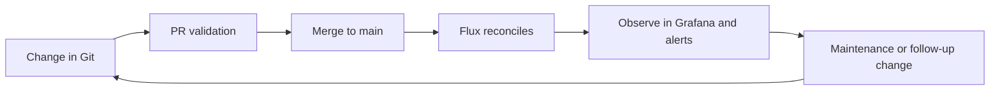

# 13 - Platform Operations & Lifecycle Management
## Running the Platform Day to Day

**Author:** Kagiso Tjeane
**Difficulty:** ********-- (8/10)
**Guide:** 13 of 13

> Building the platform is the first half of the job.
>
> Operating it well is the real test.
>
> This guide documents the day-two workflow:
>
> - how change moves from Git to cluster
> - how to do maintenance safely
> - how to upgrade k3s and platform services
> - how to respond to incidents without improvising

---

## Table of Contents

1. [The Operating Loop](#the-operating-loop)
2. [Core Responsibilities](#core-responsibilities)
3. [Making Changes Safely](#making-changes-safely)
4. [Routine Checks](#routine-checks)
5. [Node Maintenance](#node-maintenance)
6. [k3s Upgrades](#k3s-upgrades)
7. [Platform and App Upgrades](#platform-and-app-upgrades)
8. [Adding or Replacing a Cluster Node](#adding-or-replacing-a-cluster-node)
9. [Incident Response](#incident-response)
10. [Disaster Recovery Flow](#disaster-recovery-flow)
11. [Weekly Checklist](#weekly-checklist)
12. [Exit Criteria](#exit-criteria)

---

## The Operating Loop



The operational principle of this repo is simple:

> Git is the only normal path into production.

Manual `kubectl` changes are debugging tools, not the operating model.

---

## Core Responsibilities

| Layer | Responsibility | Primary tool |
|---|---|---|
| Host OS | patches, reboots, SSH, firewall | Ansible |
| Kubernetes version | rolling k3s upgrades | system-upgrade-controller via Git |
| Platform services | HelmRelease and manifest changes | Flux via PR |
| Applications | app onboarding, updates, rollback | Flux via PR |
| Backups | etcd snapshots, Velero, host backups | cron, Velero, TrueNAS |
| Secrets | rotation and re-encryption | SOPS + age |

---

## Making Changes Safely

### The normal workflow

```text
1. Create a branch
2. Change the repo
3. Open a PR
4. Let CI validate manifests and render Flux entrypoints
5. Review the diff
6. Merge
7. Verify Flux and workloads
```

Typical flow:

```bash
git checkout -b chore/upgrade-traefik
git add -p
git commit -m "chore: upgrade Traefik"
git push origin chore/upgrade-traefik
```

### What validation should prove

Before merge, the repository should prove three things:

- manifests are schema-valid
- Flux entrypoints render correctly
- deprecated APIs are not being introduced

After merge, the health workflow should prove:

- Flux reconciled successfully
- cluster kustomizations are healthy
- Traefik still responds

That is the production safety net.

---

## Routine Checks

Run these checks regularly from `varys`:

```bash
kubectl get nodes
kubectl get pods -A | grep -Ev "Running|Completed|Succeeded"
flux get kustomizations
flux get helmreleases -A
kubectl get events -A --sort-by='.lastTimestamp' | tail -30
velero backup get
```

These answer the daily operator questions:

- are nodes healthy?
- is anything crash-looping?
- is Flux stuck?
- are backups recent?

---

## Node Maintenance

Always treat maintenance as a controlled operation, not an SSH habit.

### Reboots

Use the maintenance playbook:

```bash
ansible-playbook ansible/playbooks/maintenance/reboot-nodes.yml
```

For a single node:

```bash
ansible-playbook ansible/playbooks/maintenance/reboot-nodes.yml --limit jaime
```

The goal is always:

1. cordon
2. drain
3. reboot
4. wait for `Ready`
5. uncordon

### OS package updates

```bash
ansible-playbook ansible/playbooks/maintenance/upgrade-nodes.yml
```

Because all three nodes are both servers and workers, update them **one at a time**. Never assume there is a dedicated worker pool protecting you.

---

## k3s Upgrades

The preferred path is the upgrade controller described in [Guide 11](./11-Platform-Upgrade-Controller.md).

### Current model

- one `Plan`
- three matching server nodes
- rolling one node at a time
- kube-vip keeps the API stable at `10.0.10.100`

### Normal upgrade path

1. take an etcd snapshot
2. update `platform/upgrade/upgrade-plans/plan-server.yaml`
3. open a PR
4. merge after CI passes
5. watch the rollout complete node by node

Example:

```yaml
spec:
  version: v1.32.1+k3s1
```

### Break-glass fallback

If the controller is unavailable, fall back to Ansible:

```bash
ansible-playbook ansible/playbooks/lifecycle/install-cluster.yml --limit tywin
ansible-playbook ansible/playbooks/lifecycle/install-cluster.yml --limit tyrion
ansible-playbook ansible/playbooks/lifecycle/install-cluster.yml --limit jaime
```

Do that one node at a time, verifying health in between.

---

## Platform and App Upgrades

Platform services and applications are upgraded through Git the same way:

- bump chart version
- change values
- merge
- let Flux reconcile

Example:

```bash
git checkout -b chore/upgrade-platform
git add platform/networking/traefik/helmrelease.yaml
git commit -m "chore: upgrade Traefik"
git push origin chore/upgrade-platform
```

Post-merge checks:

```bash
flux get helmreleases -A
kubectl get pods -A
```

If the release is bad:

```bash
git revert <commit>
git push origin main
flux reconcile kustomization platform-networking --with-source
```

---

## Adding or Replacing a Cluster Node

This is where the updated topology matters most.

You are not adding a "worker." You are adding another **k3s server that is also a workload node**.

### High-level process

1. provision the host
2. add it to `ansible/inventory/homelab.yml`
3. run the security and preparation playbooks
4. run `install-cluster.yml` for that node
5. verify it joins behind the VIP

Commands:

```bash
ansible-playbook ansible/playbooks/security/disable-swap.yml --limit <node>
ansible-playbook ansible/playbooks/security/firewall.yml --limit <node>
ansible-playbook ansible/playbooks/security/ssh-hardening.yml --limit <node>
ansible-playbook ansible/playbooks/security/time-sync.yml --limit <node>
ansible-playbook ansible/playbooks/security/fail2ban.yml --limit <node>
ansible-playbook ansible/playbooks/lifecycle/install-cluster.yml --limit <node>
```

Verification:

```bash
kubectl get nodes -o wide
```

If this is a replacement rather than a net-new node, cleanly remove the old node record and follow the dedicated node replacement runbook if persistent local-path data is involved.

---

## Incident Response

When something fails, work the problem in layers.

### 1. Establish the baseline

```bash
kubectl get nodes
kubectl get pods -A | grep -Ev "Running|Completed|Succeeded"
flux get kustomizations
```

### 2. Scope impact

```bash
kubectl get events -A --sort-by='.lastTimestamp' | tail -30
```

### 3. Inspect the affected workload

```bash
kubectl describe pod <pod> -n <namespace>
kubectl logs <pod> -n <namespace>
kubectl logs <pod> -n <namespace> --previous
```

### 4. Check infrastructure layers

```bash
kubectl get pods -n flux-system
kubectl get pods -n ingress
kubectl get pods -n monitoring
kubectl get pods -n cert-manager
kubectl get pods -n metallb-system
kubectl get pods -n velero
```

### 5. Use Grafana and alerts as the fast path

The dashboard is often faster than shelling around blindly. Start with the alert, correlate with logs, then decide whether the problem is:

- application-specific
- platform-specific
- node-specific
- storage-specific

---

## Disaster Recovery Flow

If the cluster must be rebuilt, the order matters:

```text
1. Restore host access and Ansible control from varys
2. Rebuild cluster nodes
3. Reinstall k3s with install-cluster.yml
4. Restore etcd if required
5. Re-run install-platform.yml
6. Let Flux reconstruct the platform
7. Restore PVC data with Velero if needed
8. Verify services
```

Key commands:

```bash
ansible-playbook -i ansible/inventory/homelab.yml ansible/playbooks/lifecycle/install-cluster.yml
ansible-playbook -i ansible/inventory/homelab.yml ansible/playbooks/lifecycle/install-platform.yml
velero restore create --from-backup <backup-name>
```

This is the production rebuild story:

- infrastructure from Ansible
- desired state from Git
- data from snapshots and backups

---

## Weekly Checklist

```text
[] kubectl get nodes -> all Ready
[] kubectl get pods -A -> no unexpected failures
[] flux get kustomizations -> all Ready
[] flux get helmreleases -A -> all Ready
[] etcd snapshots present and recent
[] Velero backups recent and Completed
[] Grafana -> no ignored active alerts
[] disk, memory, and certificate health within thresholds
```

---

## Exit Criteria

Platform operations are in good shape when:

- every normal change flows through PR -> merge -> Flux
- host maintenance is run from playbooks, not memory
- k3s upgrades use the single-plan rolling model
- the docs clearly state that all three nodes are both server and worker nodes
- incident response starts from observability and verification, not guesswork

---

## Navigation

| | Guide |
|---|---|
| <- Previous | [12 - Applications via GitOps](./12-Applications-GitOps.md) |
| Current | **13 - Platform Operations & Lifecycle** |
| -> Next | *End of series - platform fully deployed* |
