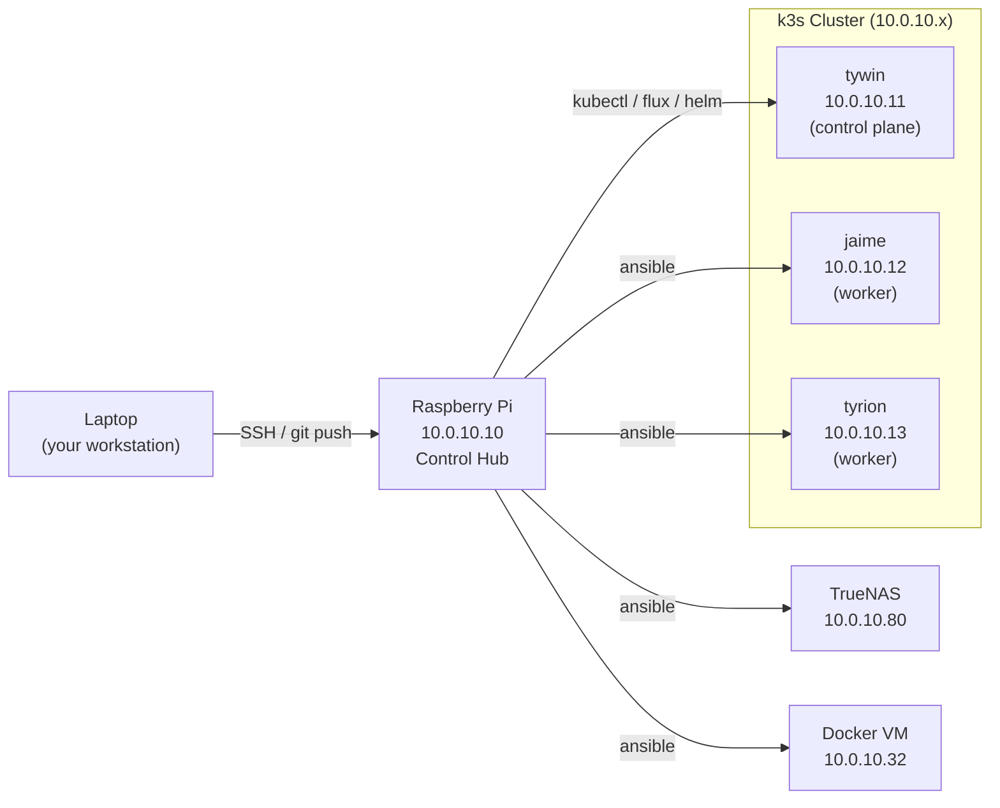

# Raspberry Pi Setup Guide

**Author:** Kagiso Tjeane
**Difficulty:** ⭐⭐⭐☆☆☆☆☆☆☆ (3/10)
**Guide:** 01 of 03

**Role:** Homelab control hub — runs kubectl, flux, ansible, and all management tooling.
**Access:** SSH from your laptop. All other homelab nodes are accessed from here.

---

## Architecture Overview

The RPi sits between your laptop and every other node in the homelab. It is the single point from which all cluster management, secret handling, and automation is driven.



---

## Hardware

| Item | Value |
|------|-------|
| Model | Raspberry Pi 4 Model B |
| RAM | 4GB (minimum) |
| Storage | 32GB+ SD card or USB SSD (preferred for reliability) |
| OS | Raspberry Pi OS Lite 64-bit (Debian Bookworm) |
| IP | 10.0.10.10 (static — set in router DHCP reservation) |

---

## Step 1 — Flash OS

Use [Raspberry Pi Imager](https://www.raspberrypi.com/software/):

1. Choose OS: **Raspberry Pi OS Lite (64-bit)**
2. In advanced settings (gear icon):
   - Set hostname: `rpi`
   - Enable SSH with public key authentication
   - Paste your laptop's public key (`~/.ssh/id_ed25519.pub`)
   - Set username: `pi`
   - Configure WiFi (optional — Ethernet preferred)
3. Flash to SD card / USB SSD

---

## Step 2 — First Boot and Network

1. Insert storage, power on
2. Assign a static IP in your router's DHCP reservation for the RPi's MAC address
3. Verify SSH access:

```bash
ssh pi@10.0.10.10
```

---

## Step 3 — Run Ansible Bootstrap

From your laptop (with Ansible installed locally), or from any machine that can reach the RPi:

```bash
cd raspberry-pi/ansible
ansible-playbook -i inventory/hosts.yml playbooks/setup.yml
```

This installs and configures:

- kubectl, helm, flux, k9s, sops, age, velero, ansible
- SSH hardening (password auth disabled, root login disabled)
- `.bashrc` aliases and shell completions

---

## Step 4 — Configure Kubeconfig

After the k3s cluster is running (see [Guide 02](../../docs/guides/02-Kubernetes-Installation.md)):

```bash
# On the control plane node (tywin), get the config
cat /etc/rancher/k3s/k3s.yaml

# On the RPi, create the config pointing to the actual API server
mkdir -p ~/.kube
# Paste the k3s.yaml content and change 127.0.0.1 to 10.0.10.11
nano ~/.kube/config
chmod 600 ~/.kube/config

# Verify
kubectl get nodes
```

---

## Step 5 — Configure SOPS Age Key

The age private key is required to encrypt/decrypt secrets. After generating the key (see [Guide 11](../../docs/guides/11-Secrets-Management.md)):

```bash
# Store the private key on the RPi
mkdir -p ~/.config/sops/age
cp age.key ~/.config/sops/age/keys.txt
chmod 600 ~/.config/sops/age/keys.txt

# Set the environment variable (add to .bashrc)
echo 'export SOPS_AGE_KEY_FILE=~/.config/sops/age/keys.txt' >> ~/.bashrc
source ~/.bashrc

# Test decryption
sops --decrypt platform/observability/kube-prometheus-stack/grafana-admin-secret.yaml
```

---

## Ongoing Operations

All day-to-day cluster management is done from the RPi:

```bash
# Check cluster health
kubectl get nodes
flux get all

# View logs
k9s

# Encrypt a new secret before committing
sops --encrypt --in-place path/to/secret.yaml

# Run Ansible against k3s nodes
cd ansible
ansible-playbook -i inventory/homelab.yml playbooks/maintenance/reboot-nodes.yml

# Update CLI tools to latest configured versions
cd raspberry-pi/ansible
ansible-playbook -i inventory/hosts.yml playbooks/tools.yml
```

---

## Troubleshooting

**kubectl: connection refused**
- Check that k3s is running on tywin: `ssh kagiso@10.0.10.11 systemctl status k3s`
- Verify the API server IP in `~/.kube/config` is `10.0.10.11`, not `127.0.0.1`

**Flux reconciliation stuck**
- Check the sops-age Secret is present: `kubectl get secret sops-age -n flux-system`
- Check Flux controller logs: `flux logs --all-namespaces`

**SSH to RPi times out**
- Check the static IP reservation in your router
- Verify the RPi is powered on and the SD card is healthy

---

## Navigation

| | |
|---|---|
| **Current** | 01 — Setup |
| **Next** | [02 — Optional Services](02_services.md) |
