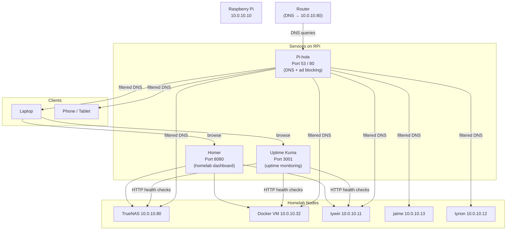

# Raspberry Pi — Optional Services

**Author:** Kagiso Tjeane
**Difficulty:** ⭐⭐⭐⭐☆☆☆☆☆☆ (4/10)
**Guide:** 02 of 03

---

## Principle

The RPi's primary function is as a **control hub** — not a general-purpose server. Every service added here competes for the same limited CPU and RAM that Ansible, kubectl, and Flux need to operate smoothly.

Before adding a service, apply this test:

> Does this service provide genuine homelab-wide value, and is it lightweight enough that it won't impair the RPi's control-plane role?

If the answer is yes to both, it belongs here. If not, it belongs on the Docker VM (`10.0.10.32`) or the k3s cluster.

---

## Service Topology



---

## Active Services (Recommended)

### 1. Pi-hole — Network-wide DNS Ad Blocking

**Why it belongs here:** Pi-hole is the single service most worth running on the RPi. It is extremely lightweight (< 50 MB RAM at idle), runs the DNS resolver for the entire homelab, and provides genuine value to every device on the network. Running DNS on the RPi rather than the Docker host avoids a dependency on a heavier machine being available.

| Property | Value |
|----------|-------|
| Port | 53 (DNS), 80 (web UI) |
| RAM footprint | ~50 MB |
| CPU footprint | Negligible |
| Data volume | `pihole_data` (persistent DNS blocklists and config) |

**Deploy:**

```bash
mkdir -p ~/docker/pihole
cd ~/docker/pihole
```

`docker-compose.yml`:

```yaml
services:
  pihole:
    image: pihole/pihole:latest
    container_name: pihole
    restart: unless-stopped
    network_mode: host          # required for DNS on port 53
    environment:
      TZ: Africa/Johannesburg
      WEBPASSWORD: "${PIHOLE_PASSWORD}"   # set in .env
      DNSMASQ_LISTENING: all
      PIHOLE_DNS_1: 1.1.1.1
      PIHOLE_DNS_2: 8.8.8.8
    volumes:
      - pihole_data:/etc/pihole
      - dnsmasq_data:/etc/dnsmasq.d
    cap_add:
      - NET_ADMIN

volumes:
  pihole_data:
  dnsmasq_data:
```

```bash
# Create .env
echo "PIHOLE_PASSWORD=changeme" > .env
chmod 600 .env

docker compose up -d
```

**Router configuration:** Set your router's primary DNS server to `10.0.10.10`. Leave the secondary DNS as your ISP's server or `1.1.1.1` as a fallback in case the RPi is unreachable.

**Verify:**

```bash
# Confirm DNS is resolving through Pi-hole
dig google.com @10.0.10.80

# Check the web UI
open http://10.0.10.80/admin
```

---

### 2. Uptime Kuma — Uptime Monitoring Dashboard

**Why it belongs here:** A monitoring service should run on a separate node from the things it monitors. The RPi is ideal — it does not run Grafana, Jellyfin, or any other homelab service, so it will still be reachable when a monitored service goes down. Uptime Kuma is lightweight and provides HTTP/TCP/DNS health checks with alerting (Telegram, email, Discord, etc.).

| Property | Value |
|----------|-------|
| Port | 3001 (web UI) |
| RAM footprint | ~100 MB |
| CPU footprint | Minimal |
| Data volume | `kuma_data` |

**Deploy:**

```bash
mkdir -p ~/docker/uptime-kuma
cd ~/docker/uptime-kuma
```

`docker-compose.yml`:

```yaml
services:
  uptime-kuma:
    image: louislam/uptime-kuma:latest
    container_name: uptime-kuma
    restart: unless-stopped
    ports:
      - "3001:3001"
    volumes:
      - kuma_data:/app/data

volumes:
  kuma_data:
```

```bash
docker compose up -d
```

**Access the UI:** `http://10.0.10.10:3001` — create an admin account on first launch.

**Services to monitor (add these monitors in the UI):**

| Name | Type | URL / Host |
|------|------|------------|
| TrueNAS UI | HTTP(s) | `http://10.0.10.80` |
| Docker VM | TCP Port | `10.0.10.32:22` |
| k3s API | TCP Port | `10.0.10.100:6443` |
| tywin SSH | TCP Port | `10.0.10.11:22` |
| jaime SSH | TCP Port | `10.0.10.13:22` |
| tyrion SSH | TCP Port | `10.0.10.12:22` |
| Grafana | HTTP(s) | Grafana ingress URL |
| Jellyfin | HTTP(s) | Jellyfin ingress URL |
| NPM (Nginx Proxy Manager) | HTTP(s) | NPM ingress URL |
| Pi-hole Admin | HTTP(s) | `http://10.0.10.10/admin` |
| Homer | HTTP(s) | `http://10.0.10.10:8080` |

---

### 3. Homer — Homelab Dashboard

**Why it belongs here:** A dashboard linking to all homelab services is useful and genuinely lightweight (it is a static web app — effectively zero runtime cost). Homer serves a single-page HTML file. Running it on the RPi means it is available even when the Docker host or cluster is undergoing maintenance.

| Property | Value |
|----------|-------|
| Port | 8080 (web UI) |
| RAM footprint | ~10 MB |
| CPU footprint | Negligible |
| Data volume | `homer_data` (config YAML) |

**Deploy:**

```bash
mkdir -p ~/docker/homer
cd ~/docker/homer
```

`docker-compose.yml`:

```yaml
services:
  homer:
    image: b4bz/homer:latest
    container_name: homer
    restart: unless-stopped
    ports:
      - "8080:8080"
    volumes:
      - homer_data:/www/assets
    environment:
      UID: 1000
      GID: 1000

volumes:
  homer_data:
```

```bash
docker compose up -d
```

**Basic config** — edit `homer_data/config.yml` (or mount it directly):

```yaml
title: "Homelab"
subtitle: "Kagiso's Homelab"
logo: "logo.png"

header: true
footer: false

services:
  - name: "Infrastructure"
    icon: "fas fa-network-wired"
    items:
      - name: "TrueNAS"
        logo: "https://www.truenas.com/favicon.ico"
        subtitle: "NAS / Storage"
        url: "http://10.0.10.80"
      - name: "Pi-hole"
        logo: "https://pi-hole.net/favicon.ico"
        subtitle: "DNS / Ad blocking"
        url: "http://10.0.10.10/admin"
      - name: "Uptime Kuma"
        subtitle: "Uptime monitoring"
        url: "http://10.0.10.10:3001"

  - name: "Cluster"
    icon: "fas fa-dharmachakra"
    items:
      - name: "Grafana"
        subtitle: "Metrics & dashboards"
        url: "https://grafana.your-domain.com"
      - name: "Alertmanager"
        subtitle: "Prometheus alerts"
        url: "https://alertmanager.your-domain.com"

  - name: "Media & Apps"
    icon: "fas fa-film"
    items:
      - name: "Jellyfin"
        subtitle: "Media server"
        url: "https://jellyfin.your-domain.com"
      - name: "Nginx Proxy Manager"
        subtitle: "Reverse proxy"
        url: "https://npm.your-domain.com"
```

**Access:** `http://10.0.10.10:8080`

---

## Optional Services

### 4. Tailscale — Secure Remote Access

**Why it belongs here:** Tailscale provides encrypted remote access to the homelab without requiring any open ports in your router's firewall. Installed as a system package (not Docker), it survives reboots reliably and integrates cleanly with the RPi's existing SSH setup.

**When to install:** If you need to access the homelab from outside your home network (e.g., SSH to the RPi from a coffee shop).

**Install:**

```bash
curl -fsSL https://tailscale.com/install.sh | sh
sudo tailscale up --advertise-exit-node
```

After authenticating in the Tailscale admin console, the RPi is reachable via its Tailscale IP from any device on your tailnet — without opening any firewall ports.

**Note:** If you install Tailscale, update Pi-hole's DNS override to also accept queries from the Tailscale subnet (`100.64.0.0/10`) so that DNS-based ad blocking applies when you are accessing the homelab remotely.

---

## Not Recommended

The following are explicitly out of scope for the RPi:

| Service | Reason |
|---------|--------|
| Databases (Postgres, MySQL) | High disk I/O wears SD cards; belongs on Docker host or TrueNAS |
| Media servers (Plex, Jellyfin) | CPU/RAM intensive; belongs on Docker host |
| Gitea / GitLab | Heavy; GitHub already covers this |
| Prometheus / Grafana stack | Already runs in k3s cluster |
| Any service requiring >512 MB RAM | Leaves insufficient headroom for control-plane tools |

---

## Resource Budget

With the recommended services deployed, expect the following usage on a Raspberry Pi 4 (4 GB RAM):

| Component | RAM (approx.) |
|-----------|---------------|
| OS + system | ~300 MB |
| Pi-hole | ~50 MB |
| Uptime Kuma | ~100 MB |
| Homer | ~10 MB |
| kubectl / flux / ansible (peak) | ~300 MB |
| **Total** | **~760 MB** |

This leaves substantial headroom on a 4 GB model. Do not add services that push usage above 2 GB, as that reduces headroom for Ansible playbook runs and kubectl operations.

---

## Navigation

| | |
|---|---|
| **Previous** | [01 — Setup](01_setup.md) |
| **Current** | 02 — Optional Services |
| **Next** | [03 — Backup Strategy](03_backup.md) |

