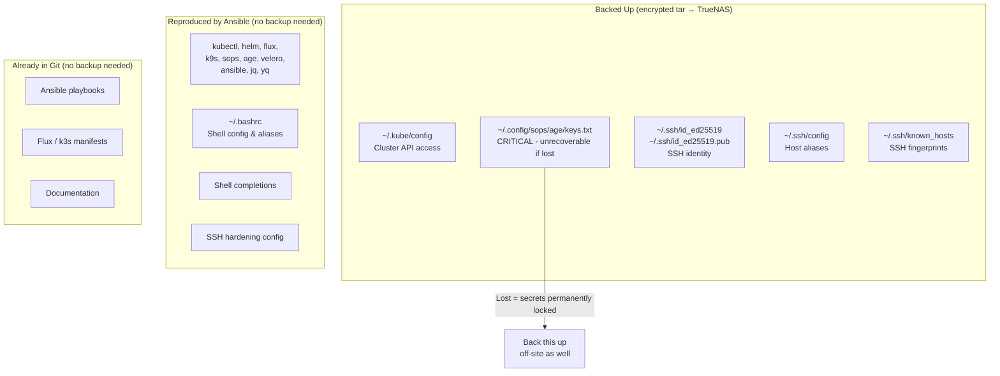

# Raspberry Pi — Backup Strategy

**Author:** Kagiso Tjeane
**Difficulty:** ⭐⭐⭐☆☆☆☆☆☆☆ (3/10)
**Guide:** 03 of 03

---

## Philosophy

The RPi is a **stateless control node**. Unlike the k3s cluster or Docker host, it holds almost no unique state. Every tool installed on it was put there by Ansible from this repository. Every config file was either written by Ansible or lives in Git. If the SD card dies today, the procedure to recover is:

1. Flash a new SD card (5 minutes)
2. Run `ansible-playbook setup.yml` (10 minutes)
3. Restore one small tar archive (2 minutes)

This is what makes the RPi backup strategy so simple — you are not backing up a system, you are backing up a handful of **key material** that cannot be regenerated.

---

## What Needs Backing Up vs What Does Not



### What IS backed up

| File | Why |
|------|-----|
| `~/.kube/config` | Required to reach the k3s API server after a rebuild |
| `~/.config/sops/age/keys.txt` | **Critical.** The age private key is the only way to decrypt SOPS-encrypted secrets in this repo. If it is lost, every encrypted secret must be re-encrypted with a new key — a significant recovery operation |
| `~/.ssh/id_ed25519` | The private key used to SSH into every homelab node. Losing it means re-distributing a new public key to all nodes via console access |
| `~/.ssh/id_ed25519.pub` | Paired public key — included for completeness |
| `~/.ssh/config` | Host aliases (`ssh tywin` instead of `ssh kagiso@10.0.10.11`). Convenient to restore |
| `~/.ssh/known_hosts` | Avoids re-confirming fingerprints for all nodes after a rebuild. Nice to have |

### What is NOT backed up

| Item | Reason |
|------|--------|
| Installed tools (kubectl, flux, helm, k9s, etc.) | Reinstalled by `ansible-playbook setup.yml` in ~10 minutes |
| `~/.bashrc` | Written by Ansible |
| Shell completions | Written by Ansible |
| SSH server hardening (`/etc/ssh/sshd_config.d/`) | Applied by Ansible |
| Git repositories | Stored on GitHub |
| Docker compose files | Stored in this repo |

---

## Backup Approach

Backups are a **simple encrypted tar** written to TrueNAS NFS storage.

| Property | Value |
|----------|-------|
| Destination | TrueNAS NFS share at `10.0.10.80:/mnt/pool/backups/rpi` |
| Encryption | GPG symmetric encryption (AES-256) using a passphrase stored in Bitwarden |
| Schedule | Daily at 01:00 (cron) |
| Retention | 30 days (RPi backups are tiny — generous retention is essentially free) |
| Typical archive size | < 50 KB |

The NFS share is mounted read-write only during the backup window (the script mounts it, writes the backup, then unmounts it). This minimises the window during which the NFS share is accessible.

---

## Backup Script

The script lives at `~/scripts/backup_rpi.sh`.

```bash
#!/usr/bin/env bash
# backup_rpi.sh — Raspberry Pi key material backup to TrueNAS NFS
# Author: Kagiso Tjeane
# Schedule: daily at 01:00 via cron

set -euo pipefail

# --- Configuration -----------------------------------------------------------
NFS_SERVER="10.0.10.80"
NFS_SHARE="/mnt/pool/backups/rpi"
MOUNT_POINT="/mnt/backup_rpi"
RETENTION_DAYS=30
TIMESTAMP=$(date +"%Y%m%d_%H%M%S")
ARCHIVE_NAME="rpi_backup_${TIMESTAMP}.tar.gz.gpg"
LOG_FILE="/var/log/rpi_backup.log"
# Passphrase must be stored in a file readable only by root/pi
# e.g. echo "your-passphrase" | sudo tee /root/.rpi_backup_passphrase
# sudo chmod 600 /root/.rpi_backup_passphrase
PASSPHRASE_FILE="/root/.rpi_backup_passphrase"

# --- Logging helper ----------------------------------------------------------
log() {
    echo "[$(date '+%Y-%m-%d %H:%M:%S')] $*" | tee -a "${LOG_FILE}"
}

# --- Pre-flight checks -------------------------------------------------------
if [[ ! -f "${PASSPHRASE_FILE}" ]]; then
    log "ERROR: Passphrase file not found at ${PASSPHRASE_FILE}. Aborting."
    exit 1
fi

# --- Mount NFS share ---------------------------------------------------------
log "Mounting NFS share ${NFS_SERVER}:${NFS_SHARE} → ${MOUNT_POINT}"
mkdir -p "${MOUNT_POINT}"
if mountpoint -q "${MOUNT_POINT}"; then
    log "NFS share already mounted — proceeding."
else
    mount -t nfs "${NFS_SERVER}:${NFS_SHARE}" "${MOUNT_POINT}" \
        -o rw,noatime,vers=4
fi

# --- Create encrypted archive ------------------------------------------------
log "Creating encrypted archive: ${ARCHIVE_NAME}"
tar --create \
    --gzip \
    --file=- \
    --ignore-failed-read \
    -C "${HOME}" \
        .kube/config \
        .config/sops/age/keys.txt \
        .ssh/id_ed25519 \
        .ssh/id_ed25519.pub \
        .ssh/config \
        .ssh/known_hosts \
    2>/dev/null \
| gpg \
    --batch \
    --symmetric \
    --cipher-algo AES256 \
    --compress-algo none \
    --passphrase-file "${PASSPHRASE_FILE}" \
    --output "${MOUNT_POINT}/${ARCHIVE_NAME}"

log "Archive written: ${MOUNT_POINT}/${ARCHIVE_NAME}"

# --- Enforce retention -------------------------------------------------------
log "Enforcing ${RETENTION_DAYS}-day retention policy"
find "${MOUNT_POINT}" \
    -maxdepth 1 \
    -name "rpi_backup_*.tar.gz.gpg" \
    -mtime "+${RETENTION_DAYS}" \
    -delete \
    -print | while read -r deleted; do
        log "Deleted old backup: ${deleted}"
    done

# --- Unmount NFS share -------------------------------------------------------
log "Unmounting NFS share"
umount "${MOUNT_POINT}"

log "Backup complete: ${ARCHIVE_NAME}"
```

**Initial setup:**

```bash
# Create the script
mkdir -p ~/scripts
nano ~/scripts/backup_rpi.sh
chmod 700 ~/scripts/backup_rpi.sh

# Store the GPG passphrase (as root, since cron runs as root for mount access)
sudo bash -c 'echo "your-strong-passphrase-here" > /root/.rpi_backup_passphrase'
sudo chmod 600 /root/.rpi_backup_passphrase

# Create the NFS mount point
sudo mkdir -p /mnt/backup_rpi

# Run a manual backup to verify everything works
sudo ~/scripts/backup_rpi.sh
```

---

## Cron Schedule

The backup runs daily at 01:00. Add to root's crontab (since the script needs `mount` permissions):

```bash
sudo crontab -e
```

Add the following line:

```
# Raspberry Pi key material backup — daily at 01:00
0 1 * * * /home/pi/scripts/backup_rpi.sh >> /var/log/rpi_backup.log 2>&1
```

Verify the cron entry is registered:

```bash
sudo crontab -l
```

---

## Manual Backup

Run before any risky operation (SD card replacement, OS upgrade, Ansible refactor, etc.):

```bash
sudo ~/scripts/backup_rpi.sh
```

---

## Restoration Procedure

### Prerequisites

- A replacement Raspberry Pi 4 (or a new SD card for the same unit)
- The GPG passphrase (stored in Bitwarden)
- Access to TrueNAS at `10.0.10.80`
- A laptop with Ansible installed

### Step 1 — Flash and configure the new RPi

Follow [Guide 01 — Setup](01_setup.md) through Step 2 (flash OS, configure static IP, verify SSH access).

### Step 2 — Run Ansible bootstrap

From your laptop:

```bash
cd raspberry-pi/ansible
ansible-playbook -i inventory/hosts.yml playbooks/setup.yml
```

This restores all installed tools, shell config, and SSH hardening. At this point the RPi is fully operational as a control hub — it just lacks the key material.

### Step 3 — Retrieve the latest backup from TrueNAS

```bash
# SSH to the RPi
ssh pi@10.0.10.10

# Mount the NFS share temporarily
sudo mkdir -p /mnt/backup_rpi
sudo mount -t nfs 10.0.10.80:/mnt/pool/backups/rpi /mnt/backup_rpi -o ro,vers=4

# List available backups
ls -lht /mnt/backup_rpi/rpi_backup_*.tar.gz.gpg | head -5

# Copy the latest backup locally
cp /mnt/backup_rpi/rpi_backup_YYYYMMDD_HHMMSS.tar.gz.gpg ~/
sudo umount /mnt/backup_rpi
```

### Step 4 — Decrypt and restore

```bash
# Decrypt the archive (enter the GPG passphrase from Bitwarden when prompted)
gpg --batch \
    --decrypt \
    --output rpi_backup.tar.gz \
    ~/rpi_backup_YYYYMMDD_HHMMSS.tar.gz.gpg

# Preview contents before extracting
tar -tzvf rpi_backup.tar.gz

# Extract to home directory (files restore to their original relative paths)
tar -xzvf rpi_backup.tar.gz -C ~/

# Restore permissions
chmod 600 ~/.kube/config
chmod 600 ~/.config/sops/age/keys.txt
chmod 600 ~/.ssh/id_ed25519
chmod 644 ~/.ssh/id_ed25519.pub
chmod 644 ~/.ssh/known_hosts
chmod 600 ~/.ssh/config

# Clean up
rm ~/rpi_backup.tar.gz ~/rpi_backup_*.tar.gz.gpg
```

### Step 5 — Verify

```bash
# Cluster access
kubectl get nodes

# Secret decryption
sops --decrypt platform/observability/kube-prometheus-stack/grafana-admin-secret.yaml

# SSH to a node
ssh tywin
```

---

## Exit Criteria

The RPi backup strategy is complete and operational when all of the following are true:

- [ ] `~/scripts/backup_rpi.sh` exists and is executable (`chmod 700`)
- [ ] `/root/.rpi_backup_passphrase` exists with mode `600` and contains the correct passphrase
- [ ] GPG passphrase is stored in Bitwarden under a clearly labelled entry
- [ ] A manual backup has been run successfully and the archive is visible on TrueNAS at `10.0.10.80:/mnt/pool/backups/rpi`
- [ ] The archive decrypts successfully with the passphrase from Bitwarden
- [ ] Cron entry is present in `sudo crontab -l` and scheduled for `0 1 * * *`
- [ ] `/var/log/rpi_backup.log` exists and shows a successful run

---

## Navigation

| | |
|---|---|
| **Previous** | [02 — Optional Services](02_services.md) |
| **Current** | 03 — Backup Strategy |
| | *End of series* |
