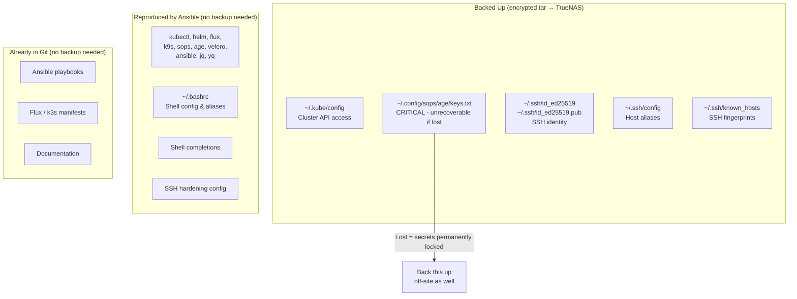

# Raspberry Pi — Backup Strategy

**Author:** Kagiso Tjeane
**Difficulty:** ⭐⭐⭐☆☆☆☆☆☆☆ (3/10)
**Guide:** 03 of 03

---

## Philosophy

The RPi is a **stateless control node**. Unlike the k3s cluster or Docker host, it holds almost no unique state. Every tool installed on it was put there by Ansible from this repository. Every config file was either written by Ansible or lives in Git. If the SD card dies today, the procedure to recover is:

1. Flash a new SD card (5 minutes)
2. Run `ansible-playbook setup.yml` (10 minutes)
3. Restore one small tar archive (2 minutes)

This is what makes the RPi backup strategy so simple — you are not backing up a system, you are backing up a handful of **key material** that cannot be regenerated.

---

## What Needs Backing Up vs What Does Not



### What IS backed up

| File | Why |
|------|-----|
| `~/.kube/config` | Required to reach the k3s API server after a rebuild |
| `~/.config/sops/age/keys.txt` | **Critical.** The age private key is the only way to decrypt SOPS-encrypted secrets in this repo. If it is lost, every encrypted secret must be re-encrypted with a new key — a significant recovery operation |
| `~/.ssh/id_ed25519` | The private key used to SSH into every homelab node. Losing it means re-distributing a new public key to all nodes via console access |
| `~/.ssh/id_ed25519.pub` | Paired public key — included for completeness |
| `~/.ssh/config` | Host aliases (`ssh tywin` instead of `ssh kagiso@10.0.10.11`). Convenient to restore |
| `~/.ssh/known_hosts` | Avoids re-confirming fingerprints for all nodes after a rebuild. Nice to have |

### What is NOT backed up

| Item | Reason |
|------|--------|
| Installed tools (kubectl, flux, helm, k9s, etc.) | Reinstalled by `ansible-playbook setup.yml` in ~10 minutes |
| `~/.bashrc` | Written by Ansible |
| Shell completions | Written by Ansible |
| SSH server hardening (`/etc/ssh/sshd_config.d/`) | Applied by Ansible |
| Git repositories | Stored on GitHub |

---

## Backup Approach

Backups are a **simple encrypted tar** written to TrueNAS NFS storage.

| Property | Value |
|----------|-------|
| Destination | TrueNAS NFS share at `10.0.10.80:/mnt/archive/backups/rpi` |
| Encryption | GPG symmetric encryption (AES-256) using a passphrase stored in Bitwarden |
| Schedule | Daily at 01:00 (cron) |
| Retention | 30 days (RPi backups are tiny — generous retention is essentially free) |
| Typical archive size | < 50 KB |

The NFS share is mounted read-write only during the backup window (the script mounts it, writes the backup, then unmounts it). This minimises the window during which the NFS share is accessible.

### TrueNAS NFS prerequisite

The backup script runs as root (required for `mount`). TrueNAS NFS shares squash root by default. The share must have **Maproot User = root** set, otherwise GPG will get `Permission denied` when writing the archive.

> TrueNAS UI → **Shares → Unix (NFS) Shares** → edit `/mnt/archive/backups/rpi` → Advanced Options → **Maproot User: root** → Save

---

## Backup Script

The script lives at `~/scripts/backup_rpi.sh` on the RPi. The source is at `raspberry-pi/scripts/backup_rpi.sh` in this repository.

```bash
#!/usr/bin/env bash
# backup_rpi.sh — Raspberry Pi key material backup to TrueNAS NFS

set -euo pipefail

NFS_SERVER="10.0.10.80"
NFS_SHARE="/mnt/archive/backups/rpi"
MOUNT_POINT="/mnt/backup_rpi"
RETENTION_DAYS=30
TIMESTAMP=$(date +"%Y-%m-%d_%H%M%S")
ARCHIVE_NAME="rpi_backup_${TIMESTAMP}.tar.gz.gpg"
LOG_FILE="/var/log/rpi-backup.log"
PASSPHRASE_FILE="/root/.rpi_backup_passphrase"
TEXTFILE_DIR="/var/lib/node_exporter/textfile_collector"
TEXTFILE_METRIC="${TEXTFILE_DIR}/rpi_backup.prom"
JOB="rpi-keys"

START_TIME=$(date +%s)

log() { echo "[$(date '+%Y-%m-%d %H:%M:%S')] $*" | tee -a "${LOG_FILE}"; }

write_metrics() {
  local status="$1" ts="$2" size="$3" duration="$4" failures="$5"
  mkdir -p "${TEXTFILE_DIR}"
  local tmp
  tmp=$(mktemp "${TEXTFILE_METRIC}.XXXXXX")
  cat > "${tmp}" <<METRICS
# HELP backup_job_status 1 = last run succeeded, 0 = failed.
# TYPE backup_job_status gauge
backup_job_status{job="${JOB}"} ${status}
# HELP backup_last_success_timestamp Unix timestamp of last successful backup.
# TYPE backup_last_success_timestamp gauge
backup_last_success_timestamp{job="${JOB}"} ${ts}
# HELP backup_size_bytes Size of last backup archive in bytes.
# TYPE backup_size_bytes gauge
backup_size_bytes{job="${JOB}"} ${size}
# HELP backup_duration_seconds Duration of last backup run in seconds.
# TYPE backup_duration_seconds gauge
backup_duration_seconds{job="${JOB}"} ${duration}
# HELP backup_failures_total Cumulative count of failed backup runs.
# TYPE backup_failures_total counter
backup_failures_total{job="${JOB}"} ${failures}
METRICS
  mv "${tmp}" "${TEXTFILE_METRIC}"
  chmod 644 "${TEXTFILE_METRIC}"
}

on_error() {
  local prev_ts prev_failures duration
  prev_ts=$(grep "backup_last_success_timestamp{job=\"${JOB}\"}" "${TEXTFILE_METRIC}" 2>/dev/null | awk '{print $NF}' || echo 0)
  prev_failures=$(grep "backup_failures_total{job=\"${JOB}\"}" "${TEXTFILE_METRIC}" 2>/dev/null | awk '{print $NF}' || echo 0)
  duration=$(( $(date +%s) - START_TIME ))
  write_metrics 0 "${prev_ts}" 0 "${duration}" "$(( prev_failures + 1 ))"
  exit 1
}
trap on_error ERR

log "=== RPi backup starting ==="

[[ ! -f "${PASSPHRASE_FILE}" ]] && { log "ERROR: ${PASSPHRASE_FILE} not found"; exit 1; }
command -v gpg &>/dev/null    || { log "ERROR: gpg not installed"; exit 1; }

mkdir -p "${MOUNT_POINT}"
mountpoint -q "${MOUNT_POINT}" || mount -t nfs "${NFS_SERVER}:${NFS_SHARE}" "${MOUNT_POINT}" -o rw,noatime,vers=4

log "Creating encrypted archive: ${ARCHIVE_NAME}"
tar --create --gzip --file=- --ignore-failed-read \
    -C "${HOME}" \
    .kube/config .config/sops/age/keys.txt \
    .ssh/id_ed25519 .ssh/id_ed25519.pub .ssh/config .ssh/known_hosts \
    2>>"${LOG_FILE}" \
| gpg --batch --symmetric --cipher-algo AES256 --compress-algo none \
    --passphrase-file "${PASSPHRASE_FILE}" \
    --output "${MOUNT_POINT}/${ARCHIVE_NAME}"

ARCHIVE_BYTES=$(stat -c %s "${MOUNT_POINT}/${ARCHIVE_NAME}")
log "Archive written: ${MOUNT_POINT}/${ARCHIVE_NAME} ($(du -sh "${MOUNT_POINT}/${ARCHIVE_NAME}" | cut -f1))"

DELETED=$(find "${MOUNT_POINT}" -name "rpi_backup_*.tar.gz.gpg" -mtime +${RETENTION_DAYS} -print -delete 2>>"${LOG_FILE}" | wc -l)
[ "${DELETED}" -gt 0 ] && log "Pruned ${DELETED} archive(s)"

umount "${MOUNT_POINT}"

SUCCESS_TS=$(date +%s)
PREV_FAILURES=$(grep "backup_failures_total{job=\"${JOB}\"}" "${TEXTFILE_METRIC}" 2>/dev/null | awk '{print $NF}' || echo 0)
write_metrics 1 "${SUCCESS_TS}" "${ARCHIVE_BYTES}" "$(( SUCCESS_TS - START_TIME ))" "${PREV_FAILURES}"

log "=== RPi backup complete ==="
```

**Initial setup:**

```bash
# Copy the script from the repo
mkdir -p ~/scripts
cp raspberry-pi/scripts/backup_rpi.sh ~/scripts/backup_rpi.sh
chmod 700 ~/scripts/backup_rpi.sh

# Store the GPG passphrase (as root — cron runs as root for mount access)
sudo bash -c 'echo "your-strong-passphrase-here" > /root/.rpi_backup_passphrase'
sudo chmod 600 /root/.rpi_backup_passphrase

# Create the NFS mount point
sudo mkdir -p /mnt/backup_rpi

# Create the textfile collector directory (if not already present from node-exporter setup)
sudo mkdir -p /var/lib/node_exporter/textfile_collector

# Run a manual backup to verify everything works
# -E preserves HOME so tar resolves files under /home/kagiso, not /root
sudo -E ~/scripts/backup_rpi.sh
```

---

## Cron Schedule

The backup runs daily at 01:00. Add to root's crontab (the script needs `mount` permissions):

```bash
sudo crontab -e
```

Add:

```
# Raspberry Pi key material backup — daily at 01:00
# HOME must be set explicitly — root's crontab does not inherit the user's HOME
0 1 * * * HOME=/home/kagiso /home/kagiso/scripts/backup_rpi.sh >> /var/log/rpi-backup.log 2>&1
```

Verify:

```bash
sudo crontab -l
```

---

## Manual Backup

Run before any risky operation (SD card replacement, OS upgrade, Ansible refactor, etc.):

```bash
sudo -E ~/scripts/backup_rpi.sh
```

---

## Monitoring

The script writes five Prometheus textfile metrics to `/var/lib/node_exporter/textfile_collector/rpi_backup.prom`, scraped by node-exporter and forwarded to Prometheus:

| Metric | Description |
|--------|-------------|
| `backup_job_status{job="rpi-keys"}` | `1` = last run succeeded, `0` = failed |
| `backup_last_success_timestamp{job="rpi-keys"}` | Unix timestamp of last successful run |
| `backup_size_bytes{job="rpi-keys"}` | Size of last archive in bytes |
| `backup_duration_seconds{job="rpi-keys"}` | Duration of last run in seconds |
| `backup_failures_total{job="rpi-keys"}` | Cumulative count of failures (not reset on success) |

Alerts are defined in `docker/config/prometheus/alerts/backups.yml`:

- **RpiBackupStale** — fires if backup > 48 hours old (warning)
- **RpiBackupMetricsMissing** — fires if metrics disappear from Prometheus (warning)
- **BackupJobFailed** — fires immediately if `backup_job_status == 0` (critical)

The **Backup Overview** dashboard in Grafana shows all jobs in a single view.

Verify metrics are present after the first run:

```bash
cat /var/lib/node_exporter/textfile_collector/rpi_backup.prom
```

---

## Restoration Procedure

### Prerequisites

- A replacement Raspberry Pi 4 (or a new SD card for the same unit)
- The GPG passphrase (stored in Bitwarden)
- Access to TrueNAS at `10.0.10.80`
- A laptop with Ansible installed

### Step 1 — Flash and configure the new RPi

Follow [Guide 01 — Setup](01_setup.md) through Step 2 (flash OS, configure static IP, verify SSH access).

### Step 2 — Run Ansible bootstrap

From your laptop:

```bash
cd raspberry-pi/ansible
ansible-playbook -i inventory/hosts.yml playbooks/setup.yml
```

This restores all installed tools, shell config, and SSH hardening. At this point the RPi is fully operational as a control hub — it just lacks the key material.

### Step 3 — Retrieve the latest backup from TrueNAS

```bash
# SSH to the RPi
ssh pi@10.0.10.10

# Mount the NFS share temporarily (read-only)
sudo mkdir -p /mnt/backup_rpi
sudo mount -t nfs 10.0.10.80:/mnt/archive/backups/rpi /mnt/backup_rpi -o ro,vers=4

# List available backups (most recent first)
ls -lht /mnt/backup_rpi/rpi_backup_*.tar.gz.gpg | head -5

# Copy the latest backup locally
cp /mnt/backup_rpi/rpi_backup_YYYY-MM-DD_HHMMSS.tar.gz.gpg ~/
sudo umount /mnt/backup_rpi
```

### Step 4 — Decrypt and restore

```bash
# Decrypt the archive (enter the GPG passphrase from Bitwarden when prompted)
gpg --batch \
    --decrypt \
    --output rpi_backup.tar.gz \
    ~/rpi_backup_YYYY-MM-DD_HHMMSS.tar.gz.gpg

# Preview contents before extracting
tar -tzvf rpi_backup.tar.gz

# Extract to home directory (files restore to their original relative paths)
tar -xzvf rpi_backup.tar.gz -C ~/

# Restore permissions
chmod 600 ~/.kube/config
chmod 600 ~/.config/sops/age/keys.txt
chmod 600 ~/.ssh/id_ed25519
chmod 644 ~/.ssh/id_ed25519.pub
chmod 644 ~/.ssh/known_hosts
chmod 600 ~/.ssh/config

# Clean up
rm ~/rpi_backup.tar.gz ~/rpi_backup_*.tar.gz.gpg
```

### Step 5 — Verify

```bash
# Cluster access
kubectl get nodes

# Secret decryption
sops --decrypt platform/observability/kube-prometheus-stack/grafana-admin-secret.yaml

# SSH to a node
ssh tywin
```

---

## Exit Criteria

The RPi backup strategy is complete and operational when all of the following are true:

- [ ] `~/scripts/backup_rpi.sh` exists and is executable (`chmod 700`)
- [ ] `/root/.rpi_backup_passphrase` exists with mode `600` and contains the correct passphrase
- [ ] GPG passphrase is stored in Bitwarden under a clearly labelled entry
- [ ] `/var/lib/node_exporter/textfile_collector/` exists and is readable by node-exporter
- [ ] A manual backup has been run successfully and the archive is visible on TrueNAS at `10.0.10.80:/mnt/archive/backups/rpi`
- [ ] The archive decrypts successfully with the passphrase from Bitwarden
- [ ] Cron entry is present in `sudo crontab -l` and scheduled for `0 1 * * *`
- [ ] `/var/log/rpi-backup.log` shows a successful run
- [ ] `backup_job_status{job="rpi-keys"} 1` visible in Prometheus or the Backup Overview dashboard

---

## Navigation

| | |
|---|---|
| **Previous** | [02 — Optional Services](02_services.md) |
| **Current** | 03 — Backup Strategy |
| | *End of series* |
